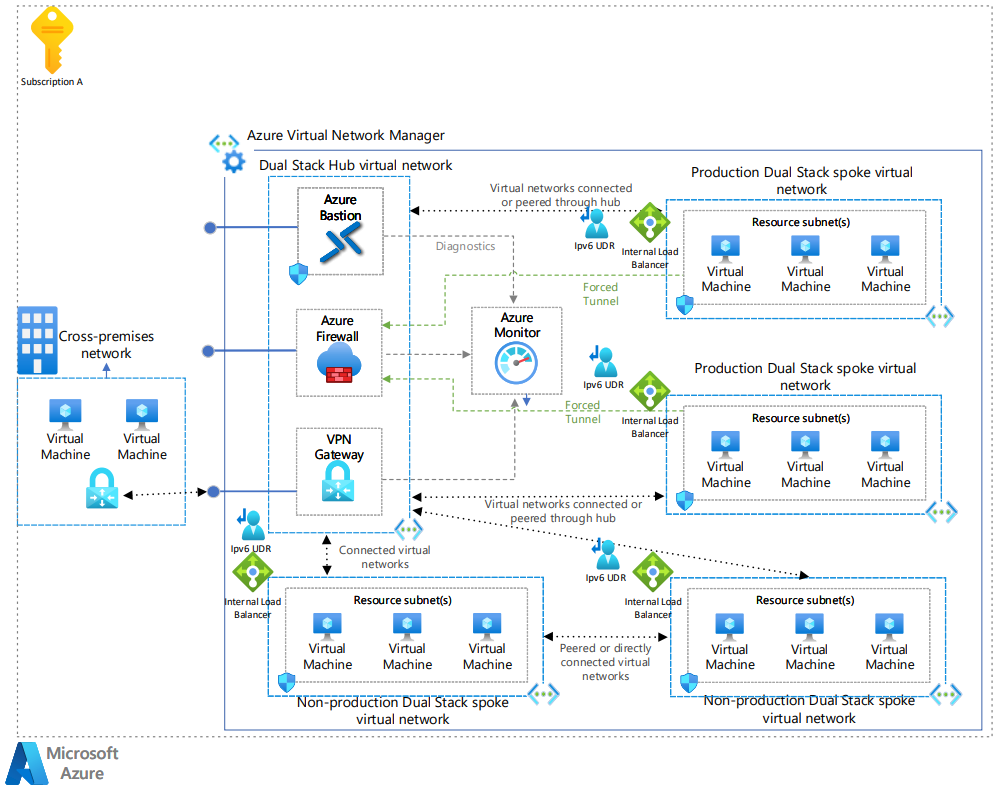

This guide shows you how to transition an IPv4 hub and spoke network topology to IPv6. It uses the [Hub and spoke network topology](/azure/architecture/reference-architectures/hybrid-networking/hub-spoke) as the starting point and walks you through the steps required to support IPv6. The hub virtual network acts as a central point of connectivity to spoke virtual networks. The spoke virtual networks connect with the hub and isolate application resources. For more information, see [Transitioning to IPv6](/azure/architecture/networking/guide/ipv6/ipv6-ip-planning).

## Architecture

*Download a [Visio file](https://arch-center.azureedge.net/hub-spoke-network-topology-architecture.vsdx) of this architecture.*

### Workflow

1. **Public internet and cross-premises network:**
    - Users or services can access Azure resources via the public internet.
    - The cross-premises network has on-premises virtual machines that connect securely to the Azure network through a VPN Gateway.

1. **Azure Virtual Network Manager:**
    - Azure Virtual Network Manager is the management layer that oversees the entire network infrastructure within Azure. It handles the routing, policies, and the overall health of the virtual network.

1. **Hub virtual network:**
    - The hub is the central point of the network topology and is configured to support both IPv4 and IPv6 (hence "Dual Stack").
    - Azure Bastion provides secure and seamless RDP/SSH connectivity to your virtual machines directly in the Azure portal over TLS.
    - Azure Firewall inspects and filters traffic between the hub and the public internet.
    - ExpressRoute connects the cross-premises network to the hub.
    - VPN Gateway also connects the cross-premises network to the hub and is used for redundancy.
    - The services in the hub virtual network send logs and metrics (diagnostics) to Azure Monitor for monitoring.

1. **Spoke virtual networks:**
    - There are four spokes connected to the hub. Each spoke is a dual stack network, supporting both IPv4 and IPv6.
    - IPv6 user defined routes (UDR) define custom routes for IPv6 traffic from the spoke.
    - The spoke virtual networks are connected using [peering connections](/azure/virtual-network/virtual-network-peering-overview) or [connected groups](/azure/virtual-network-manager/concept-connectivity-configuration). Peering connections and connected groups are nontransitive, low-latency connections between virtual networks. Peered or connected virtual networks can exchange traffic over the Azure backbone.
    - All outbound traffic from the spoke virtual networks flows through the hub, using a configuration in Azure Firewall called [forced tunneling](/azure/firewall/forced-tunneling).
    - Within each spoke, there are three subnets indicated as resource subnets, each hosting a virtual machine.
    - Each virtual machine is connected to an internal load balancer that is configured to support IPv4 and IPv6 address ranges. The load balancer distributes incoming network traffic across the virtual machines.

### Components

- [Azure Virtual Network](/azure/virtual-network/virtual-networks-overview) is the fundamental building block for private networks in Azure. Virtual Network enables many Azure resources, such as Azure VMs, to securely communicate with each other, cross-premises networks, and the internet.

- [Virtual network interface](/azure/virtual-network/virtual-network-network-interface) are required for virtual machine communication. Virtual machines and other resources can be set up to have multiple network interfaces. Multiple network interfaces are what allows you to create dual stack (IPv4 and IPv6) configurations.

- [Public IP Address](/azure/virtual-network/ip-services/public-ip-addresses) is used for inbound IPv4 and IPv6 connectivity to Azure resources.

- [Azure Virtual Network Manager](/azure/virtual-network-manager/overview) creates and manages [network groups](/azure/virtual-network-manager/concept-network-groups) and their connections.

- [Azure Firewall](/azure/firewall/overview) is a managed, cloud-based network security service that protects your Azure Virtual Network resources. An Azure Firewall managed firewall instance exists in its own subnet.

- [Azure VPN Gateway](/azure/vpn-gateway/vpn-gateway-about-vpngateways) or [Azure ExpressRoute](/azure/expressroute/expressroute-introduction). A virtual network gateway enables a virtual network to connect to a virtual private network (VPN) device or Azure ExpressRoute circuit. The gateway provides cross-premises network connectivity.

- [Azure Load Balancer](/azure/load-balancer/load-balancer-overview) allows you to share traffic between multiple machines that have the same purpose. In this scenario, the load balancers distribute traffic between multiple subnets that support IPv6.

- [Route Table](/azure/virtual-network/manage-route-table) in Azure is a set of user-defined routes that allow for custom path definitions for network traffic.

- [Azure Virtual Machines](/azure/virtual-machines/overview) is an infrastructure-as-a-service computing solution that supports IPv6.

- [Azure Bastion](/azure/bastion/bastion-overview) is a fully managed Platform-as-a-Service (PaaS) offering provided and maintained by Microsoft. Its design provides secure and seamless Remote Desktop Protocol (RDP) and Secure Shell Protocol (SSH) access to virtual machines (VMs) without any exposure through public IP addresses.

- [Azure Monitor](/azure/azure-monitor/overview) is a comprehensive monitoring solution for collecting, analyzing, and responding to monitoring data from your cloud and on-premises environments. You can use Azure Monitor to maximize the availability and performance of your applications and services.

## Transition the hub virtual network to IPv6

Transitioning a hub virtual network to support IPv6 means updating the network infrastructure to accommodate IPv6 address ranges, enabling the central, controlling part of the network to handle IPv6 traffic. It ensures that the central hub can efficiently route and manage traffic between various network segments (spokes) using IPv6. To start using IPv6 in the hub virtual network, you need make the following configurations.

**Add IPv6 address space to the virtual network and subnets.** You need to add an IPv6 address ranges to the hub virtual network first and then its subnets. Use /56 block for the virtual network and /64 for each subnet. See the following table for an example setup.

| Virtual network address range | Subnet address ranges |
| --- | --- |
| Hub virtual network: `2001:db8:1234:0000::/56` | Azure Bastion subnet: `2001:db8:1234:0000::/64` Azure Firewall subnet: `2001:db8:1234:0001::/64`  VPN gateway subnet: `2001:db8:1234:0002::/64` ExpressRoute subnet: `2001:db8:1234:0003::/64` |

Remember, these IPv6 addresses are just examples. You should replace `2001:db8:1234::` with your organization's IPv6 address block. Ensure that you carefully plan and document your IPv6 address allocations to avoid overlaps and ensure efficient utilization of the address space.

You can use the [Azure portal](/azure/virtual-network/ip-services/add-dual-stack-ipv6-vm-portal#add-ipv6-to-virtual-network), [PowerShell](/azure/virtual-network/ip-services/add-dual-stack-ipv6-vm-powershell#add-ipv6-to-virtual-network), or [Azure CLI](/azure/virtual-network/ip-services/add-dual-stack-ipv6-vm-cli#add-ipv6-to-virtual-network) to add the IPv6 address space.

**Configure User Defined Routes (UDRs).** UDRs are the routes that you manually set up to override Azure's default system routes. User Defined Routes (UDRs) in Azure are essential for controlling the flow of network traffic in a virtual network. UDRs can be used to direct traffic from one subnet to specific appliances, gateways, or targets within Azure or to on-premises networks. When you add IPv6 support to the hub virtual network, you need to make the following configurations:

- *Add IPv6 routes*: If the route table is already in place, you add new routes that specify the IPv6 address prefixes to the table.
- *Modify existing routes*: If the routes already exist for IPv4, you might need to modify them to ensure that they also apply to IPv6 traffic or create separate IPv6-specific routes.
- *Associate route table with subnets*: After defining your routes, you associate the route table with the relevant subnets within your virtual network. This association determines which subnets use the routes you defined.

Remember that you don’t necessarily need to add a route for every single resource, but rather for each subnet. Each subnet can have multiple resources, and they all follow the rules defined in the route table associated with their subnet. For more information, see [UDR overview](/azure/virtual-network/virtual-networks-udr-overview).

For the Hub Virtual Network, we have four subnets: Azure Bastion, Azure Firewall, VPN Gateway, and ExpressRoute. Here are example UDRs for each subnet:

| Subnet         | Description        | IPv6 Address Range           | Route Name     | Destination       | Next Hop                           |
| -------------- | ------------------ | ---------------------------- | -------------- | ----------------- | ---------------------------------- |
| Azure Bastion  | Route to Firewall  | `2001:db8:1234:0000::/64`    | Internet Route | `::/0`            | `2001:db8:1234:0001::/64` (Azure Firewall) |
| Azure Firewall | Default Route      | `2001:db8:1234:0001::/64`    | Internet Route | `::/0`            | Internet Gateway                  |
| VPN Gateway    | On-premises Route  | `2001:db8:1234:0002::/64`    | On-premises Route  | `2001:db8:abcd::/56` | VPN Gateway                       |
| ExpressRoute   | On-premises Route  | `2001:db8:1234:0003::/64`    | On-premises Route  | `2001:db8:efgh::/56` | ExpressRoute                      |

These UDRs are just sample. You must align UDRs with your organizational network policies and the architecture of your Azure deployment.

**Modify ExpressRoute circuit (if applicable).** To have Azure ExpressRoute support IPv6, you need to:

- *Enable IPv6 private peering*: Enable IPv6 private peering on your ExpressRoute circuit to allow the routing of IPv6 traffic between your on-premises network and the hub virtual network.
- *Allocate IPv6 address space*: Provide IPv6 subnets for your primary and secondary ExpressRoute links.
- *Update route tables*: Ensure IPv6 traffic is directed appropriately through the ExpressRoute circuit.

These changes extend IPv6 connectivity to your Azure services through the ExpressRoute circuit. It enables dual-stack capabilities where both IPv4 and IPv6 traffic can be routed simultaneously if configured. You can use the [Azure portal](/azure/expressroute/expressroute-howto-add-ipv6-portal), [PowerShell](/azure/expressroute/expressroute-howto-add-ipv6-powershell), or [Azure CLI](/azure/expressroute/expressroute-howto-add-ipv6-cli) to modify ExpressRoute.

## Transition the spoke virtual networks to IPv6

Transitioning the spoke virtual networks to support IPv6 involves adding IPv6 capabilities to these peripheral networks, which are connected to the central hub. It allows each spoke network to communicate using the more advanced IPv6 protocol. It provides uniformity across the network. To start using IPv6 in the spoke virtual networks, you need make the following configurations.

**Add IPv6 address space to the virtual network and subnets.** As in the hub virtual network, you need to add IPv6 address ranges to all the spoke virtual networks and then their subnets. Use /56 block for the virtual network and /64 for each subnet. See the following table for an example setup.

| Virtual network address range | Subnet address ranges |
| ----------------------------- | --------------------- |
| Spoke virtual network 1: `2001:db8:1234:0100::/56` | Subnet 1: `2001:db8:1234:0100::/64` Subnet 2: `2001:db8:1234:0101::/64` Subnet 3: `2001:db8:1234:0102::/64` |
| Spoke virtual network 2: `2001:db8:1234:0200::/56` | Subnet 1: `2001:db8:1234:0200::/64` Subnet 2: `2001:db8:1234:0201::/64` Subnet 3: `2001:db8:1234:0202::/64` |
| Spoke virtual network 3: `2001:db8:1234:0300::/56` | Subnet 1: `2001:db8:1234:0300::/64` Subnet 2: `2001:db8:1234:0301::/64` Subnet 3: `2001:db8:1234:0302::/64` |
| Spoke virtual network 4: `2001:db8:1234:0400::/56` | Subnet 1: `2001:db8:1234:0400::/64` Subnet 2: `2001:db8:1234:0401::/64` Subnet 3: `2001:db8:1234:0402::/64` |

This table provides a clear overview of the IPv6 address ranges for each spoke virtual network and its subnets. Remember to adjust the IPv6 addresses according to your organization's specific allocation and needs.

**Modify spoke resources**: The spoke virtual networks contain virtual machines and an internal load balancer. The internal load balancer allows you to route IPv4 and IPv6 traffic to your virtual machines. Here's how to modify each resource in the spoke subnets:

- *Virtual machines:* To add IPv6 support to virtual machines, you need create and associate an IPv6 network interface to each virtual machine. For more information, see [Add IPv6 configuration to virtual machine](/azure/virtual-network/ip-services/add-dual-stack-ipv6-vm-portal#add-ipv6-configuration-to-virtual-machine).
- *Internal load balancer:* If you don't have an internal load balancer in your spoke virtual networks, you should create a dual-stack internal load balancer. For more information, see, [Create dual-stack internal load balancer](/azure/load-balancer/ipv6-dual-stack-standard-internal-load-balancer-powershell). If you already have an internal load balancer, you can use [PowerShell](/azure/load-balancer/ipv6-add-to-existing-vnet-powershell) or [Azure CLI](/azure/load-balancer/ipv6-add-to-existing-vnet-cli) to add IPv6 support to an internal load balancer.

**Configure User Defined Routes.** Follow the same process as the hub virtual network. You need to make the following configurations:

- *Add IPv6 routes*: If the route table is already in place, you add new routes that specify the IPv6 address prefixes to the table.
- *Modify existing routes*: If the routes already exist for IPv4, you might need to modify them to ensure that they also apply to IPv6 traffic or create separate IPv6-specific routes.
- *Associate route table with subnets*: After defining your routes, you associate the route table with the relevant subnets within your virtual network. This association determines which subnets use the routes you defined.

Here are example UDRs for each subnet in one spoke virtual network:

| Subnet   | Description           | IPv6 Address Range           | Route Name         | Destination       | Next Hop                           |
| -------- | --------------------- | ---------------------------- | ------------------ | ----------------- | ---------------------------------- |
| Subnet 1 | Route to Firewall     | `2001:db8:1234:0100::/64`    | Internet Route     | `::/0`            | `2001:db8:1234:0001::/64` (Azure Firewall) |
| Subnet 2 | Route to VPN Gateway  | `2001:db8:1234:0101::/64`    | VPN Route          | `2001:db8:abcd::/64` | `2001:db8:1234:0002::/64` (VPN Gateway) |
| Subnet 3 | Route to ExpressRoute | `2001:db8:1234:0102::/64`    | ExpressRoute Route | `2001:db8:5678::/64` | `2001:db8:1234:0003::/64` (ExpressRoute) |

These UDRs are just samples. You must align these UDRs with your organizational network policies and the architecture of your Azure deployment.

## Related resources

Learn more about IPv6:

- [Transitioning to IPv6](/azure/architecture/networking/guide/ipv6/ipv6-ip-planning)
- [Create a VM with IPv6 Dual Stack](/azure/virtual-network/ip-services/create-vm-dual-stack-ipv6-portal)
- [Managing IP Address ranges](/azure/virtual-network/manage-virtual-network#add-or-remove-an-address-range)
- [Cloud Adoption Framework plan for ip addressing](/azure/cloud-adoption-framework/ready/azure-best-practices/plan-for-ip-addressing#ipv6-considerations)
- [Azure Virtual Networking IPv6](/azure/virtual-network/ip-services/ipv6-overview)
- [ExpressRoute Support for IPv6](/azure/expressroute/expressroute-howto-add-ipv6-portal)
- [Azure DNS IPv6 support](/azure/dns/dns-reverse-dns-overview)
- [Azure Load Balancer IPv6 Support](/azure/load-balancer/load-balancer-ipv6-overview)
- [Add IPv6 support for private peering using the Azure portal](/azure/expressroute/expressroute-howto-add-ipv6-portal)

Learn more about virtual network architecture:

- [Choose between virtual network peering and VPN gateways](/azure/architecture/reference-architectures/hybrid-networking/vnet-peering)
- [Firewall and Application Gateway for virtual networks](/azure/architecture/example-scenario/gateway/firewall-application-gateway)
- [Virtual network integrated serverless microservices](/azure/architecture/example-scenario/integrated-multiservices/virtual-network-integration)
- [Deploy AD DS in an Azure virtual network](/azure/architecture/reference-architectures/identity/adds-extend-domain)

## Contributors

*Microsoft maintains this article. The following contributors wrote it.*

Principal author:

- [Werner Rall](https://www.linkedin.com/in/werner-rall) | Senior Cloud Solutions Architect Engineer

Other contributors:

- [Brandon Stephenson](https://www.linkedin.com/in/brandon-stephenson-3340219b) | Senior Customer Engineer
- Sherri Babylon | Senior Technical Program Manager
- [Dawn Bedard](https://www.linkedin.com/in/dawnbedard) | Principal Technical Program Manager

*To see nonpublic LinkedIn profiles, sign in to LinkedIn.*
