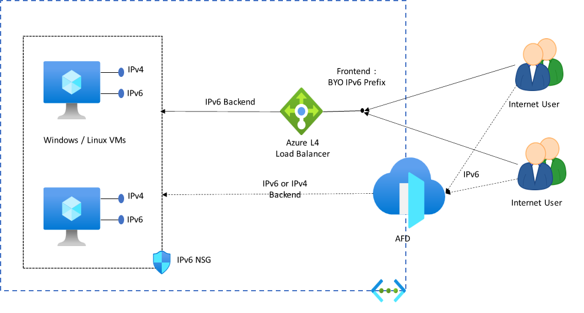

IPv6 is a Microsoft Promise. A Microsoft Promise is a commitment we, Microsoft, make to our customers about behaviors and capabilities they should expect from our cloud(s). A Promise represents the top-level commitment which reflects key capability development across the platform.

## Azure Approach to IPv6

Azure will use a Dual Stack  during Phase 1 and move towards an Ipv6-Only model as platform services mature.

## Private Connectivity

Private Connectivity to our on-premise can be achieved by following the below example.

### Connectivity Components
- Dual stack (IPv4/IPv6) Virtual Network – BYOIP
- E2E IPv6 streams to on-premises via ExpressRoute

### Security Components
- L4 Network ACL – IPv6 NSGs
- Route Tables – IPv6 UDRs to secure traffic via NVAs

## Internet Connectivity

Public/Internet Connectivity can be achieved by following the below example.

### Connectivity Components
- Public IPv6 Network Interfaces
- Public IPv6 BYOIP Prefix
- IPv6 Load Balancers (Public and Internal)
- Egress connectivity – IPv6 SNAT

## Ipv6 Generally Available and Ready

The below services are generally available for use with Ipv6 in Azure:

- [Virtual Machines](https://azure.microsoft.com/services/virtual-machines)
- [Virtual Machine Scale Set (VMSS)](https://azure.microsoft.com/products/virtual-machine-scale-sets/)
- [Kubernetes Service](https://azure.microsoft.com/products/kubernetes-service/)
- [Azure Service Fabric](https://azure.microsoft.com/products/service-fabric/)
- [Azure Data Explorer (Kusto)](https://azure.microsoft.com/products/data-explorer/)
- [App Service Static Web Apps](https://azure.microsoft.com/products/app-service/static/)
- [Azure Media Services](https://azure.microsoft.com/products/media-services/)
- [Virtual Network](https://azure.microsoft.com/services/virtual-network)
- [Azure Load Balancer](https://azure.microsoft.com/solutions/load-balancing-with-azure/)
- [ExpressRoute](https://azure.microsoft.com/products/expressroute/)
- [Azure DNS Public Zones](https://azure.microsoft.com/products/dns/)
- [Azure Front Door](https://azure.microsoft.com/products/frontdoor/)

## Contributors

*This article is maintained by Microsoft. It was originally written by the following contributors.*

Principal author:

- [Werner Rall](https://www.linkedin.com/in/werner-rall/) | Senior Cloud Solutions Architect Engineer

*To see non-public LinkedIn profiles, sign in to LinkedIn.*

## Next steps

- Learn more about [Create a VM with IPv6 Dual Stack](https://learn.microsoft.com/azure/virtual-network/ip-services/create-vm-dual-stack-ipv6-portal)
- Learn more about [managing IP Address ranges](/azure/virtual-network/manage-virtual-network#add-or-remove-an-address-range) on Virtual Networks.

## Related resources

Read more about IPv6:

- [Azure Public IPv6 offerings are free](https://azure.microsoft.com/updates/azure-public-ipv6-offerings-are-free-as-of-july-31)
- [Azure Virtual Networking IPv6](https://learn.microsoft.com/azure/virtual-network/ip-services/ipv6-overview)
- [ExpressRoute Support for IPv6](https://docs.microsoft.com/azure/expressroute/expressroute-howto-add-ipv6-portal)
- [Azure DNS IPv6 support](https://learn.microsoft.com/azure/dns/dns-reverse-dns-overview)
- [Azure Load Balancer IPv6 Support](https://learn.microsoft.com/azure/load-balancer/load-balancer-ipv6-overview)

Read more about virtual network architecture:

- [Choose between virtual network peering and VPN gateways](/azure/architecture/reference-architectures/hybrid-networking/vnet-peering)
- [Firewall and Application Gateway for virtual networks](/azure/architecture/example-scenario/gateway/firewall-application-gateway)
- [Virtual network integrated serverless microservices](/azure/architecture/example-scenario/integrated-multiservices/virtual-network-integration)
- [Deploy AD DS in an Azure virtual network](/azure/architecture/reference-architectures/identity/adds-extend-domain)
