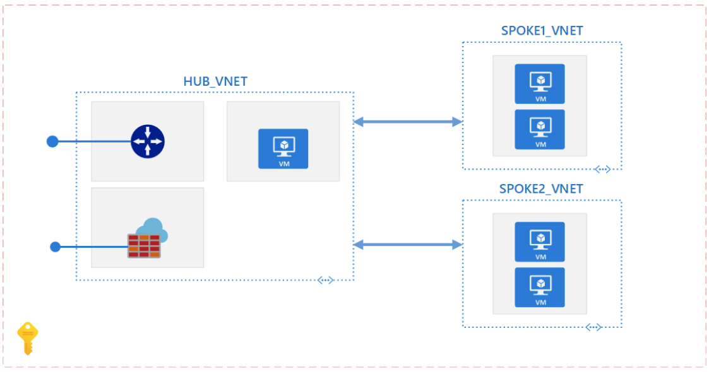
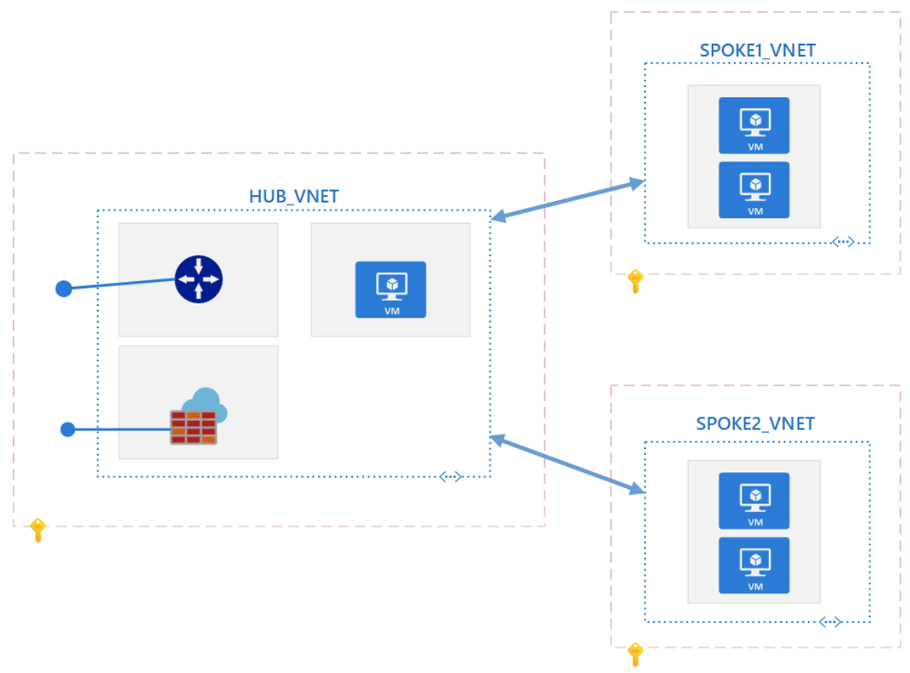

<!-- cSpell:ignore randycampbell CIDR endregion -->

# Add IP address spaces to peered virtual networks

Many organizations deploy a virtual networking architecture that follows the [hub-spoke](../../reference-architectures/hybrid-networking/hub-spoke.yml) model. At some point, the hub virtual network might require additional IP address spaces. However, address ranges can't be added or deleted from a virtual network's address space once it's peered with another virtual network. To add or remove address ranges, delete the peering, add or remove the address ranges, then re-create the peering manually. The scripts described in this article can make that process easier.

> [!NOTE]
> This article has not yet been updated to reflect Azure networking's support for peering resync. Azure virtual networks support adding and removing address space without the need to remove and restablish peerings; instead each remote peering needs a sync operation performed after the network space has changed. The sync can be performed using the [Sync-AzVirtualNetworkPeering](/powershell/module/az.network/sync-azvirtualnetworkpeering) PowerShell command or from the Azure Portal.

## Single subscription

A single subscription use case, both hub and all spoke virtual networks are in the same subscription.



## Multiple subscriptions

Another use case can be where the hub virtual network is in one subscription and all other spoke virtual networks are in different subscriptions. The subscriptions all share a single Azure Active Directory tenant.



## Considerations

- Running the script will result in outage or disconnections between the hub and spoke virtual networks. Execute it during an approved maintenance window.
- Run `Get-Module -ListAvailable Az` to find the installed version. The script requires the Azure PowerShell module version 1.0.0 or later. If you need to upgrade, see [Install Azure PowerShell module](/powershell/azure/install-az-ps).
- If not already connected, run `Connect-AzAccount` to create a connection with Azure.
- Consider assigning accounts, used for virtual network peering, to the [Network Contributor](/azure/role-based-access-control/built-in-roles?toc=%2fazure%2fvirtual-network%2ftoc.json#network-contributor) role or a [custom role](/azure/role-based-access-control/custom-roles) containing the necessary actions found under [virtual network peering permissions](/azure/virtual-network/virtual-network-manage-peering#permissions).
- Assign accounts used to add IP address spaces, to the [Network Contributor](/azure/role-based-access-control/built-in-roles?toc=%2fazure%2fvirtual-network%2ftoc.json#network-contributor) role or a [custom role](/azure/role-based-access-control/custom-roles) containing the necessary actions found under [virtual network permissions](/azure/virtual-network/manage-virtual-network#permissions).
- The IP address space that you want to add to the hub virtual network must not overlap with any of the IP address spaces of the spoke virtual networks that you intend to peer with the hub virtual network.

## Add the IP address range

The script automatically removes all Virtual Network peerings from the hub Virtual Network, adds an IP address range prefix to the hub Virtual Network based on input parameters, adds the Virtual Network peerings back to the hub Virtual Network, and reconnects the hub Virtual Network peerings to the existing spoke Virtual Network peerings. The script applies to single and multiple subscription hub-spoke topologies.

```powershell
param (
    # Address Prefix range (CIDR Notation, e.g., 10.0.0.0/24 or 2607:f000:0000:00::/64)
    [Parameter(Mandatory = $true)]
    [String[]]
    $IPAddressRange,

    # Hub VNet Subscription Name
    [Parameter(Mandatory = $true)]
    [String]
    $HubVNetSubscriptionName,

    # Hub VNet Resource Group Name
    [Parameter(Mandatory = $true)]
    [String]
    $HubVNetRGName,

    # Hub VNet Name
    [Parameter(Mandatory = $true)]
    [String]
    $HubVNetName
)

#Set context to Hub VNet Subscription
Get-AzSubscription -SubscriptionName $HubVNetSubscriptionName | Set-AzContext
#end

#Get All Hub VNet Peerings and Hub VNet Object
$hubPeerings = Get-AzVirtualNetworkPeering -ResourceGroupName $HubVNetRGName -VirtualNetworkName $HubVNetName
$hubVNet = Get-AzVirtualNetwork -Name $HubVNetName -ResourceGroupName $HubVNetRGName
#end

#Remove All Hub VNet Peerings
Remove-AzVirtualNetworkPeering -VirtualNetworkName $HubVNetName -ResourceGroupName $HubVNetRGName -name $hubPeerings.Name -Force
#end

#Add IP address range to the hub vnet
$hubVNet.AddressSpace.AddressPrefixes.Add($IPAddressRange)
#end

#Apply configuration stored in $hubVnet
Set-AzVirtualNetwork -VirtualNetwork $hubVNet
#end

foreach ($vNetPeering in $hubPeerings)
{
    # Get remote vnet name
    $vNetFullId = $vNetPeering.RemoteVirtualNetwork.Id
    $vNetName = $vNetFullId.Substring($vNetFullId.LastIndexOf('/') + 1)

    # Pull remote vNet object
    $vNetObj = Get-AzVirtualNetwork -Name $vNetName

    # Get the peering from the remote vnet object
    $peeringName = $vNetObj.VirtualNetworkPeerings.Where({$_.RemoteVirtualNetwork.Id -like "*$($hubVNet.Name)"}).Name
    $peering = Get-AzVirtualNetworkPeering -ResourceGroupName $vNetObj.ResourceGroupName -VirtualNetworkName $vNetName -Name $peeringName

    # Reset to initiated state
    Set-AzVirtualNetworkPeering -VirtualNetworkPeering $peering

    # Re-create peering on hub
    Add-AzVirtualNetworkPeering -Name $vNetPeering.Name -VirtualNetwork $HubVNet -RemoteVirtualNetworkId $vNetFullId -AllowGatewayTransit
}

```

## Pricing

There is a nominal charge for ingress and egress traffic that utilizes a virtual network peering. There is no change to existing pricing when adding an additional IP address space to an Azure Virtual Network. For more information, see the [pricing page](https://azure.microsoft.com/pricing/details/virtual-network).

## Next steps

- Learn more about [managing Virtual Network peerings](/azure/virtual-network/virtual-network-manage-peering).
- Learn more about [managing IP Address ranges](/azure/virtual-network/manage-virtual-network#add-or-remove-an-address-range) on Virtual Networks.
