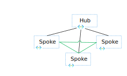
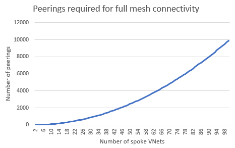
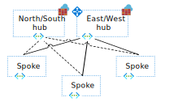

The most common networking design patterns in Azure involve creating hub-and-spoke virtual network topologies in one or multiple Azure regions, optionally connected to on-premises networks via Azure ExpressRoute or site-to-site virtual private network (VPN) tunnels over the public internet.

Most design guides focus on application traffic to those virtual networks from users either in internal, on-premises networks or from the internet (what the industry typically designates *north-south traffic*, because it's often represented by vertical lines in network diagrams). This article focuses on various patterns that are available for *east-west traffic*. That is, communication flows among workloads deployed in Azure virtual networks, either within one region or in different regions.

Making sure that your network design satisfies requirements for east-west traffic is critical to providing performance, scalability, and resiliency to your applications that run in Azure.

## Potential use cases 

Spoke-to-spoke traffic can be important in several scenarios:

- Different tiers of a single application are in separate virtual networks. For example, perimeter network servers (also known as *DMZ servers*) in a perimeter virtual network communicate with application services in an internal virtual network.
- Application workloads in different environments (Development, Staging, Production) must replicate data among each other.
- Different applications or microservices need to communicate with each other.
- Databases need to replicate data across regions to guarantee business continuity in the case of a disaster.
- Users are inside Azure virtual networks. For example, they use Azure Virtual Desktop.

## Patterns and topologies for inter-spoke communication

There are two main topologies that you can use in Azure designs that cross multiple virtual networks: [traditional hub and spoke][hubnspoke] and [Azure Virtual WAN][vwan]. In a Virtual WAN environment, Microsoft manages the hub virtual network and everything inside it. In a traditional hub-and-spoke environment, you manage the hub virtual network. 

Virtual WAN and hub-and-spoke topologies are both examples of architectures in which the workloads run in spoke virtual networks and connectivity to on-premises is centralized in a hub virtual network. So many of the concepts explained in this article apply to both hub-and-spoke and Virtual WAN designs.

There are two main patterns for connecting spoke virtual networks to each other:

- **Spokes directly connected to each other.** Virtual network peerings or VPN tunnels are created between the spoke virtual networks to provide direct connectivity without traversing the hub virtual network.
- **Spokes communicate over a network appliance.** Each spoke virtual network has a peering to Virtual WAN or to a hub virtual network. An appliance routes traffic from spoke to spoke. The appliance can be managed by Microsoft (as with Virtual WAN) or by you.

### Pattern 1: Spokes directly connected to each other

Direct connections between spokes typically offer better throughput, latency, and scalability than connections that go through a network virtual appliance (NVA) across a hub. Sending traffic through NVAs can add latency to the traffic if the NVAs are in a different availability zone and at least two virtual network peerings need to be crossed when traffic is sent over the hub. There are several options for connecting two spoke virtual networks to each other directly: virtual network peering, Azure Virtual Network Manager, and VPN tunnels.

- [**Virtual network peering.**][vnet_peering] The advantages of direct virtual network peerings over spokes are: 
  - Lower cost, because fewer virtual network peering hops are required.
  - Better performance, because traffic doesn't need to traverse any network appliance that introduces latency or potential bottlenecks. 
  
  Other scenarios include cross-tenant connectivity. However, you might need to  inspect traffic between spoke virtual networks, which might require sending traffic through centralized networking devices in the hub virtual network.

- [**Azure Virtual Network Manager.**][avnm_hns] In addition to the advantages that virtual network peering offers, Azure Virtual Network Manager provides a management service that enables you to manage virtual network environments and creates connectivity at scale. By using Azure Virtual Network Manager, you can create three types of topologies across subscriptions, for both existing and new virtual networks:
  - Hub and spoke with spokes that aren't connected to each other.
  - Hub and spoke with spokes that are directly connected to each other, without any hop in the middle.
  - A meshed group of virtual networks that are interconnected.
  
    :::image type="content" source="media/virtual-network-manager-connectivity-options.svg" alt-text="Network diagram that shows the topologies that are supported by Azure Virtual Network Manager." lightbox="media/virtual-network-manager-connectivity-options.svg" border="false":::
    
    *Download [all Visio diagrams](https://arch-center.azureedge.net/spoke-to-spoke-source-diagrams.vsdx) in this article.*
  
    When you create a hub-and-spoke topology with Azure Virtual Network Manager in which spokes are connected to each other, direct connectivity between spoke virtual networks in the same [network group][avnm_network_group] are automatically created bi-directionally. By using Azure Virtual Network Manager, you can statically or dynamically make spoke virtual networks members of a specific network group, which automatically creates the connectivity for any virtual network.
  
    You can create multiple network groups to isolate clusters of spoke virtual networks from direct connectivity. Each network group provides the same region and multi-region support for spoke-to-spoke connectivity. Be sure to stay below the maximum limits for Azure Virtual Network Manager that are described in the [Azure Virtual Network Manager FAQ][avnm_limits].

- **VPN tunnels connecting virtual networks.** You can configure VPN services to directly connect spoke virtual networks by using Microsoft [VPN gateways][vnet_to_vnet] or third-party VPN NVAs. The advantage of this option is that spoke virtual networks connect across commercial and sovereign clouds within the same cloud provider or connectivity cross-cloud providers. Also, if there are software-defined wide area network (SD-WAN) NVAs in each spoke virtual network, this configuration can facilitate using the third-party provider's control plane and feature set to manage virtual network connectivity. 

   This option can also help you meet compliance requirements for the encryption of traffic across virtual networks in a single Azure datacenter that aren't already provided by [MACsec encryption][macsec]. But this option comes with its own set of challenges because of the bandwidth limits of IPsec tunnels (1.25 Gbps per tunnel) and the design constraints of having virtual network gateways in both hub and spoke virtual networks: If the spoke virtual network has a virtual network gateway, it can't be connected to Virtual WAN or use a hub's virtual network gateway to connect to on-premises networks.

#### Pattern 1: Single region

Regardless of the technology that you use to connect spoke virtual networks to each other, the network topologies would look like this for a single region:

#### Pattern 1: Multiple regions

Designs that connect all spoke virtual networks to each other can also be extended to multiple regions. In this topology, Azure Virtual Network Manager is even more critical, to reduce the administrative overhead of maintaining the required large number of connections.

:::image type="content" source="media/spoke-to-spoke-through-peerings-2-hubs-full-mesh.svg" alt-text="Network diagram that shows a two-region hub-and-spoke design with spokes in the same region connected via virtual network peerings." lightbox="media/spoke-to-spoke-through-peerings-2-hubs-full-mesh.svg" border="false":::

> [!NOTE]
> When you connect spoke virtual networks directly, either in one region or in multiple regions, consider doing so for spoke virtual networks in the same environment. For example, connect one spoke Development virtual network with another spoke Development virtual network. But avoid connecting a spoke Development virtual network with a spoke Production virtual network.

When you directly connect spoke virtual networks to each other in a fully meshed topology, you need to consider the potentially high number of virtual network peerings required. The following diagram illustrates this problem. In this scenario, Azure Virtual Network Manager is strongly recommended so that you can automatically create virtual network connections.

### Pattern 2: Spokes communicating over a network appliance

Instead of connecting spoke virtual networks directly to each other, you can use network appliances to forward traffic between spokes. Network appliances provide additional network services like deep packet inspection and traffic segmentation or monitoring, but they can introduce latency and performance bottlenecks if they're not properly sized. These appliances are typically located in a hub virtual network that the spokes connect to. There are multiple options for using a network appliance to forward traffic between spokes:

- **Virtual WAN hub router.** Fully managed by Microsoft, Virtual WAN contains a virtual router that attracts traffic from spokes and routes it to either another virtual network that's connected to Virtual WAN or to on-premises networks via ExpressRoute or site-to-site or point-to-site VPN tunnels. The Virtual WAN router scales up and down automatically, so you only need to make sure that the traffic volume between spokes stays within the [Virtual WAN limits][vwan_limits].

- **Azure Firewall.** [Azure Firewall][azfw] is a network appliance that's managed by Microsoft and can be deployed in hub virtual networks that you manage or in Virtual WAN hubs. It can forward IP packets, and it can also inspect them and apply traffic segmentation rules that are defined in policies. It provides autoscaling up to the [Azure Firewall limits][azfw_limits] so that it doesn't become a bottleneck. Note that Azure Firewall provides out-of-the-box multi-region capabilities only when used with Virtual WAN. Without Virtual WAN, you need to implement user-defined routes to achieve cross-regional spoke-to-spoke communication.

- **Third-party network virtual appliances.** If you prefer to use a network virtual appliance from a Microsoft partner to perform routing and network segmentation, you can deploy network virtual appliances in either a hub-and-spoke or a Virtual WAN topology. For more information, see [Deploy highly available NVAs][nva_ha] or [NVAs in a Virtual WAN hub][vwan_nva]. You need to be sure that the network virtual appliance supports the bandwidth that the inter-spoke communications generate.

- **Azure VPN Gateway.** You can use an Azure VPN gateway as a next hop type of user-defined route, but Microsoft doesn't recommend using VPN virtual network gateways to route spoke-to-spoke traffic. They're designed for encrypting traffic to on-premises sites or VPN users. For example, there's no guarantee of the bandwidth between spokes that a VPN gateway can route.

- **ExpressRoute.** In certain configurations, an ExpressRoute gateway can advertise routes that attract spoke-to-spoke communication, sending traffic to the Microsoft edge router, where it's routed to the destination spoke. Microsoft strongly discourages this scenario because it introduces latency by sending traffic to the Microsoft backbone edge and back. On top of that, Microsoft does not recommend this approach, due to the single point of failure and the large blast radius. This scenario also presents multiple problems caused by putting extra pressure on the ExpressRoute infrastructure (the gateway and physical routers). This additional pressure can cause packet drops.

In hub-and-spoke network designs that have centralized NVAs, the appliance is typically placed in the hub. Virtual network peerings between hub-and-spoke virtual networks need to be created manually or automatically with Azure Virtual Network Manager:

- **Manual virtual network peerings.** This approach is sufficient when you have a low number of spoke virtual networks, but it creates management overhead at scale.
- **[Azure Virtual Network Manager.][avnm_hns]** As noted earlier, Azure Virtual Network Manager provides features to manage virtual network environments and peerings at scale. Peering configurations between hub-and-spoke virtual networks are automatically configured bi-directionally for network groups. 
 
  Azure Virtual Network Manager provides the ability to statically or dynamically add spoke virtual network memberships to a specific [network group][avnm_network_group], which automatically creates the peering connection for new members. Spoke virtual networks in network groups can [use the hub VPN or ExpressRoute gateways for connectivity][avnm_hub_as_gw]. Be sure to stay below the maximum [limits for Azure Virtual Network Manager][avnm_limits].

#### Pattern 2: Single region

The following diagram shows a single-region hub-and-spoke topology that sends traffic between spokes through an Azure firewall that's deployed in the hub virtual network. Traffic is forwarded to the centralized appliance in the hub via user-defined routes that are applied to the spoke subnets.

In certain circumstances, it might be beneficial to separate the network virtual appliances that handle spoke-to-spoke and internet traffic for scalability. You can accomplish this separation by: 
- Tuning the route tables in the spokes to send private addresses (those that have a route for RFC 1918 prefixes) to an NVA that's responsible for Azure-to-Azure and Azure-to-on-premises traffic (also called *east-west traffic*).
- Tuning internet traffic (which has a 0.0.0.0/0 route) to a second NVA. This NVA is responsible for Azure-to-internet traffic (also referred to as *north-south traffic*).

The following diagram shows this configuration:

> [!NOTE]
> The Azure firewall requires that only one Azure Firewall resource can be deployed in a virtual network. Therefore, a separate hub virtual network is required for additional Azure Firewall resources. For NVA scenarios, you can use a single hub virtual network for additional NVA deployments.

#### Pattern 2: Multiple regions

You can extend the same configuration to multiple regions. For example, in a hub-and-spoke design that uses Azure Firewall, you should apply additional route tables to the Azure Firewall subnets in each hub for the spokes in the remote region. This configuration ensures that inter-region traffic can be forwarded between the Azure firewalls in each hub virtual network. Inter-regional traffic between spoke virtual networks then traverses both Azure firewalls. For more information, see [Azure Firewall to route a multi hub and spoke topology][azfw_multi_hub_and_spoke]:

:::image type="content" source="media/spoke-to-spoke-via-nva-2-hubs.svg" alt-text="Network diagram that shows a two-region hub-and-spoke design via NVAs in the hubs." lightbox="media/spoke-to-spoke-via-nva-2-hubs.svg" border="false":::

The design variation with separate Azure firewalls or network virtual appliances for north-south and east-west traffic is also possible in a multi-region hub-and-spoke topology:

:::image type="content" source="media/spoke-to-spoke-via-nva-2-hubs-north-south.svg" alt-text="Network diagram that shows a two-region hub-and-spoke design with separated east-west and north-south firewalls in each region." lightbox="media/spoke-to-spoke-via-nva-2-hubs-north-south.svg" border="false":::

> [!NOTE]
> The Azure firewall requires that only one Azure Firewall resource can be deployed in a virtual network. Therefore, a separate hub virtual network is required for additional Azure Firewall resources. For NVA scenarios, you can use a single hub virtual network for additional NVA deployments.

Virtual WAN creates a similar topology and takes over the routing complexity. It does so both in the hubs (which Microsoft manages) and in the spokes (where routes can be injected and don't need to be manually defined in route tables). So the network administrator only needs to connect the spoke virtual networks to a Virtual WAN hub and doesn't need to worry about forwarding traffic between regions.

:::image type="content" source="media/spoke-to-spoke-through-virtual-wan.svg" alt-text="Network diagram that shows a Virtual WAN design with spokes connected via Virtual WAN." lightbox="media/spoke-to-spoke-through-virtual-wan.svg" border="false":::

### Hybrid patterns

Many situations require a hybrid approach that combines the two patterns described previously. In this approach, traffic between certain spokes needs to go over direct connections, but the rest of the spokes communicate through a central network appliance. For example, in a Virtual WAN environment, you can directly connect two specific spokes that have high bandwidth and low latency requirements. Another scenario involves spoke virtual networks that are part of a single environment. For example, you might allow a spoke Development virtual network to connect directly to another spoke Development virtual network, but force Development and Production workloads to communicate through the central appliance.

:::image type="content" source="media/spoke-to-spoke-through-selective-peerings-2-hubs.svg" alt-text="Network diagram that shows a two-region hub-and-spoke design, with some spokes connected via virtual network peerings." lightbox="media/spoke-to-spoke-through-selective-peerings-2-hubs.svg" border="false":::

Another common pattern involves connecting spokes in one region via direct virtual network peerings or Azure Virtual Network Manager [connected groups][avnm_connected_group], but allowing inter-regional traffic to cross NVAs. The main motivation for this model is typically to reduce the number of virtual network peerings in the architecture. However, compared to the first model (direct connectivity between spokes), one disadvantage introduced in this model is more virtual network peering hops for cross-region traffic. These hops increase costs because of the multiple virtual network peerings that are crossed. Another disadvantage is the extra load to the hub NVAs to front all cross-regional traffic.  

:::image type="content" source="media/spoke-to-spoke-through-peerings-2-hubs.svg" alt-text="Network diagram that shows a two-region hub-and-spoke design. Spokes in a single region are connected via virtual network peerings." lightbox="media/spoke-to-spoke-through-peerings-2-hubs.svg" border="false":::

The same designs are applicable for Virtual WAN. However, one consideration is that direct connectivity between spoke virtual networks need to be configured manually directly between the virtual networks and not through the Virtual WAN resource. Azure Virtual Network Manager doesn't currently support architectures that are based on Virtual WAN. For example:

:::image type="content" source="media/spoke-to-spoke-through-peerings-virtual-wan.svg" alt-text="Network diagram that shows a Virtual WAN design with spokes connected via Virtual WAN and some virtual network peerings." lightbox="media/spoke-to-spoke-through-peerings-virtual-wan.svg" border="false":::

> [!NOTE]
> For hybrid approaches, it's important to understand that direct connectivity via virtual network peering propagates system routes for its connecting virtual networks that are often more specific than custom routes configured via route tables. Therefore, the virtual network peering path is preferred over custom routes that follow the [longest prefix-match route selection][udr_route_selection]. 
>
> However, in less common scenarios, if there's both a system route and a custom user-defined route with the same address prefix, the user-defined route takes precedence over system routes (automatically created by virtual network peering). This behavior results in spoke-to-spoke virtual network traffic traversing through the hub virtual network, even if there's a direct connection through peering.

## Contributors

*This article is maintained by Microsoft. It was originally written by the following contributors.*

Principal authors: 

* [Jay Li](https://www.linkedin.com/in/jiayangl) | Senior Program Manager
* [Jose Moreno](https://www.linkedin.com/in/erjosito) | Principal Customer Engineer
* [Alejandra Palacios](https://www.linkedin.com/in/alejandrampalacios) | Senior Azure Infrastructure Customer Engineer

Other contributors:

* [Mick Alberts](https://www.linkedin.com/in/mick-alberts-a24a1414) | Technical Writer
* [Mohamed Hassan](https://www.linkedin.com/in/mohnader) | Principal PM Manager
* [Andrea Michael](https://www.linkedin.com/in/amichael98) | Program Manager
* [Yasukuni Morishima](https://www.linkedin.com/in/yasukuni-morishima-621aa9141) | Customer Engineer II
* [Jithin PP](https://www.linkedin.com/in/jithin-pp-0456a621) | Customer Engineer

*To see non-public LinkedIn profiles, sign in to LinkedIn.*

## Next steps

- [Cloud Adoption Framework: Landing zone network topology and connectivity][caf_network-topology-and-connectivity]
- [Virtual network peering][vnet_peering]
- [Azure Virtual Network Manager][avnm]
- [Virtual WAN][vwan]
- [Azure Firewall][azfw]
- [Secure network connectivity on Azure](/training/modules/secure-network-connectivity-azure)
- [Introduction to Azure Virtual Networks](/training/modules/introduction-to-azure-virtual-networks)

## Related resources
- [Hub-spoke network topology in Azure](../reference-architectures/hybrid-networking/hub-spoke.yml)
- [Hub-spoke network topology with Azure Virtual WAN](hub-spoke-vwan-architecture.yml)
- [Traditional Azure networking topology](/azure/cloud-adoption-framework/ready/azure-best-practices/traditional-azure-networking-topology)

[vwan]: /azure/virtual-wan/virtual-wan-about
[vwan_limits]: /azure/azure-resource-manager/management/azure-subscription-service-limits#virtual-wan-limits
[vwan_nva]: /azure/virtual-wan/about-nva-hub
[hubnspoke]: /azure/architecture/reference-architectures/hybrid-networking/hub-spoke
[ars]: /azure/route-server/overview
[avnm]: /azure/virtual-network-manager/overview
[avnm_limits]: /azure/virtual-network-manager/faq#limits
[avnm_hns]: /azure/virtual-network-manager/concept-connectivity-configuration#hub-and-spoke-topology
[avnm_hub_as_gw]: /azure/virtual-network-manager/concept-connectivity-configuration#use-hub-as-a-gateway
[avnm_connected_group]: /azure/virtual-network-manager/concept-connectivity-configuration#connectedgroup
[avnm_network_group]: /azure/virtual-network-manager/concept-network-groups
[azfw]: /azure/firewall/overview
[azfw_limits]: /azure/azure-resource-manager/management/azure-subscription-service-limits#azure-firewall-limits
[azfw_multi_hub_and_spoke]: /azure/firewall/firewall-multi-hub-spoke
[nva_ha]: ../reference-architectures/dmz/nva-ha.yml
[vm_flows]: /azure/virtual-network/virtual-machine-network-throughput#flow-limits-and-active-connections-recommendations
[vnet_to_vnet]: /azure/vpn-gateway/vpn-gateway-howto-vnet-vnet-resource-manager-portal
[vnet_peering]: /azure/virtual-network/virtual-network-peering-overview
[macsec]: /azure/virtual-network/virtual-networks-faq#is-vnet-peering-traffic-encrypted
[udr_route_selection]: /azure/virtual-network/virtual-networks-udr-overview#how-azure-selects-a-route
[caf_network-topology-and-connectivity]: /azure/cloud-adoption-framework/ready/landing-zone/design-area/network-topology-and-connectivity
