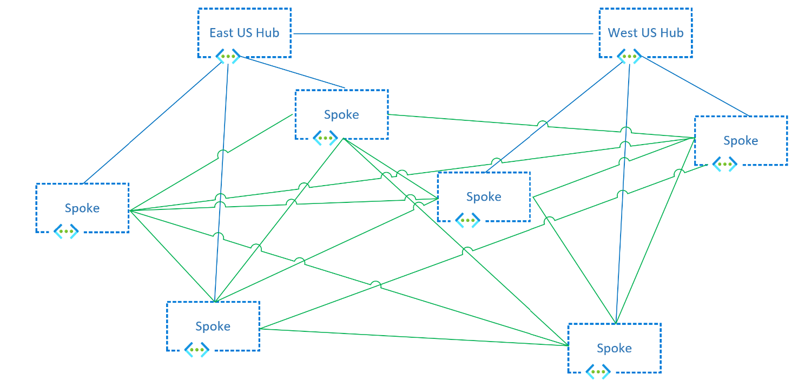
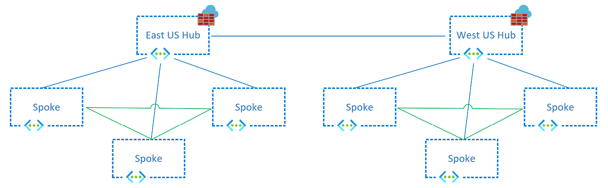
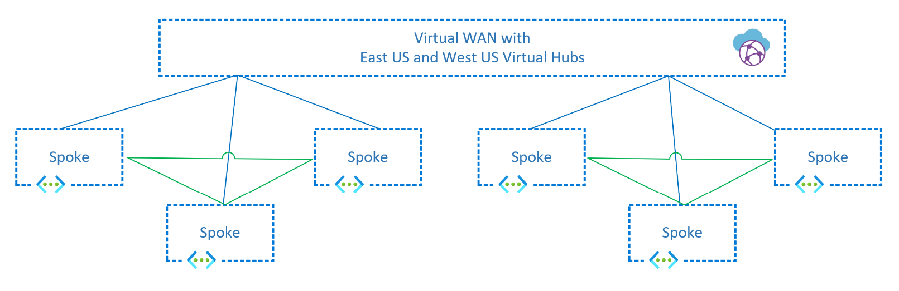

The most common networking design patterns in Azure involve creating hub-and-spoke virtual network topologies in one or multiple Azure regions, optionally connected to on-premises networks via Azure ExpressRoute or site-to-site VPN tunnels over the public Internet. 

Most design guides focus on application traffic to those virtual networks from users either in internal, on-premises networks or from the internet (what the industry typically designates *North-South traffic*, because it's often represented by vertical lines in network diagrams). This guide focuses on various patterns that are available for East-West traffic, that is, communication flows among workloads deployed in Azure virtual networks, either within one region or in different regions.

Spoke-to-spoke traffic can be important in several scenarios:

- Different tiers of a single application are in separate virtual networks. For example, perimeter network servers (also known as DMZ servers) in a perimeter virtual network communicating with application services in an internal virtual network.
- Application workloads in different environments (development, staging, production) must replicate data among each other.
- Different applications or microservices need to communicate with each other.
- Databases need to replicate data across regions to guarantee business continuity in the case of a disaster.
- Users are located inside of Azure virtual networks. For example, if they use Azure Virtual Desktop.

Making sure that your network design satisfies requirements for East-West traffic is critical to providing performance, scalability, and resiliency to your applications that run in Azure.

## Patterns and topologies for inter-spoke communication

There are two main topologies that you can use in Azure designs that cross multiple virtual networks: [traditional hub and spoke][hubnspoke] and [Azure Virtual WAN][vwan]. In a Virtual WAN environment, the hub virtual network and everything inside it is managed by Microsoft. In a traditional hub-and-spoke environment, the hub virtual network is managed by you. 

Virtual WAN and hub-and-spoke topologies are both examples of architectures in which the workloads run in spoke virtual networks and connectivity to on-premises is centralized in a hub virtual network. So many of the concepts explained in this article apply to both hub-and-spoke and Virtual WAN designs.

There are two main patterns for connecting spoke virtual networks to each other:

- **Spokes directly connected to each other.** Virtual network peerings or VPN tunnels are created between the spoke virtual networks to provide direct connectivity without traversing the hub virtual network.
- **Spokes communicate over a network appliance.** Each spoke virtual network has a peering to Virtual WAN or to a hub virtual network. An appliance routes traffic from spoke to spoke. The appliance can be managed by Microsoft (as with Virtual WAN) or by you.

### Pattern 1: Spokes directly connected to each other

Direct connections between spokes typically offer better throughput, latency, and scalability than connections that go through a network virtual appliance (NVA) across a hub. Sending traffic through NVAs can add latency to the traffic if the NVAs are in a different availability zone and at least two virtual network peerings need to be crossed when traffic is sent over the hub. There are multiple options for connecting two spoke virtual networks to each other directly:

- [Virtual network peering.][vnet_peering] The advantages of direct virtual network peerings over spokes are: 
  - Lower cost, because fewer virtual network peering hops are required.
  - Better performance, because traffic doesn't need to traverse any network appliance that introduces latency or potential bottlenecks. 
  
  Other scenarios include cross-tenant connectivity. However, you might need to  inspect traffic between spoke virtual networks, which might require sending traffic through centralized networking devices in the hub virtual network.

- [Azure Virtual Network Manager.][avnm_hns] In addition to the advantages virtual network peering offers, Azure Virtual Network Manager extends virtual network connectivity with a management service that enables you to manage virtual network environments and creates connectivity at scale. By using Azure Virtual Network Manager, you can create three types of topologies across subscriptions, for both existing and new virtual networks:
  - Hub and spoke with spokes that aren't connected to each other.
  - Hub and spoke with spokes that are directly connected to each other, without any hop in the middle.
  - A meshed group of virtual networks that are interconnected.
  
    :::image type="content" source="media/virtual-network-manager-connectivity-options.png" alt-text="[Network diagram that shows the topologies that are supported by Azure Virtual Network Manager.":::

  When you create a hub-and-spoke topology with Azure Virtual Network Manager in which spokes are connected to each other, direct connectivity between spoke virtual networks in the same [network group][avnm_network_group] are automatically created bi-directionally. With Azure Virtual Network Manager, you can statically or dynamically make spoke virtual networks members of a specific network group, which automatically creates the connectivity for any virtual network.
  
  You can create multiple network groups to isolate clusters of spoke virtual networks from direct connectivity. Each network group provides the same region and multiregion support for spoke-to-spoke connectivity. Currently, Azure Virtual Network Manager doesn't provide connectivity across tenants. Be sure to stay below the maximum limits for Azure Virtual Network Manager that are described in the [Azure Virtual Network Manager FAQ][avnm_limits].

- VNet-to-VNet VPN Tunnels. VPN services can be configured to directly connect spoke VNets using first party [VPN gateways][vnet_to_vnet] or third party VPN NVAs. The advantage of this option is spoke VNets connectivity cross commercial and sovereign clouds within the same cloud provider or connectivity cross cloud providers. Additionally, in the presence of SDWAN NVAs in each spoke VNet, this can facilitate using third party provider's control plane and feature set to manage virtual network connectivity. Another advantage is to meet compliance requirements for encryption of traffic cross virtual networks in the same Azure datacenter which is not already provided by [MACsec encryption][macsec]. However, this option comes with its own set of challenges due to the bandwidth limits of IPsec tunnels (1.25 Gbps per tunnel) and the design constraints of having virtual network gateways both in hub and spoke VNets: if the spoke VNet has a Virtual Network Gateway, it cannot be connected to Virtual WAN, or leverage a hub's Virtual Network Gateway to connect to on-premises networks.

#### Single region

Regardless of the technology used to interconnect spoke VNets to each other, the network topologies would look as follows for a single region:

#### Multiple regions

Designs interconnecting all spoke VNets to each other can also be extended to multiple regions. In this topology, Azure Virtual Network Manager is even more critical to reduce the administrative overhead of maintaining the large number of connections:

> [!NOTE]
> When connecting spoke vnets directly, either in the same region or different regions, consider doing this for spoke VNets in the same environment. For example, connect a spoke Development vnet with another spoke Development vnet; but avoid connecting a spoke Development vnet with another spoke Production vnet. 

An important consideration when connecting directly spoke VNets to each other in a fully meshed topology is the potentially high number of VNet peerings required, as the following chart shows. In that case, Azure Virtual Network Manager is strongly recommended to create VNet connectivity automatically.

### Pattern 2: Spokes communicating over a network appliance

As opposed to interconnecting spoke VNets directly to each other, network appliances can be used to forward traffic between spokes. Network appliances provide additional network services such as deep packet inspection, traffic segmentation or monitoring, although they can introduce additional latency and performance bottlenecks if not properly sized. These appliances would be typically located in a hub VNet where the spokes are connected to. There are multiple options that can be chosen as a network appliance to forward traffic between spokes:

- **Virtual WAN Hub router**: fully managed by Microsoft, Virtual WAN contains a virtual router that will attract traffic from the spokes, and route it either to another VNet connected to Virtual WAN or to on-premises networks via ExpressRoute, Site-to-Site or Point-to-Site VPN tunnels. This Virtual WAN router scales up and down automatically, so customers only need to make sure that the traffic volume between spokes stays within the [Virtual WAN Limits][vwan_limits].

- **Azure Firewall**: [Azure Firewall][azfw] is a network appliance managed by Microsoft that can be deployed in customer-managed hub VNets or in Virtual WAN Hubs. Not only can it forward IP packets, but also inspect them and apply traffic segmentation rules defined in policies. It provides autoscaling up to the [Azure Firewall Limits][azfw_limits] so that it does not become a chokepoint in the design. Note that Azure Firewall only provides out-of-the-box multi-region capabilities when used with Virtual WAN, otherwise you need to implement User Defined Routes to achieve cross-regional spoke-to-spoke communication.

- **Third Party Network Virtual Appliances**: if you prefer to use other Network Virtual Appliance from Microsoft partners to perform routing and network segmentation, you can certainly deploy Network Virtual Appliances either in a Hub and Spoke or in a Virtual WAN topology, see [Deploy highly available NVAs][nva_ha] and [NVAs in Virtual WAN Hub][vwan_nva]. You need to be sure that the Network Virtual Appliance is going to support the bandwidth that the inter-spoke communications will generate.

- **VPN Gateway**: while you can use an Azure VPN Gateway as next hop type of an user-defined route, Microsoft does not recommend leveraging VPN Virtual Network Gateways to route spoke-to-spoke traffic, since they are designed for encrypting traffic to on-premises sites or VPN users. For example, there is no guarantee of the bandwidth between spokes that a VPN gateway can route.

- **ExpressRoute**: in certain configurations an ExpressRoute gateway can advertise routes that attracts spoke-to-spoke communication, sending this traffic to the Microsoft Edge Router where it will be routed to the destination spoke. This scenario is strongly discouraged by Microsoft not only because of the additional latency introduced by sending the traffic to the Microsoft backbone edge and back, but also because this setup presents multiple problems due to the fact that this traffic puts extra pressure on the ExpressRoute infrastructure (gateway and physical routers) which can cause packet drops.

In hub and spoke network designs with centralized NVAs, the appliance will typically be placed in the hub, and VNet peerings between hub and spoke VNets need to be created either manually or automatically with Azure Virtual Network Manager:

- Manual VNet peerings: This approach is good enough when there is a low number of spoke VNets, but it creates a management overhead at scale.
- [Azure Virtual Network Manager][avnm_hns]: as described earlier, Azure Virtual Network Manager enhances VNet management through features to manage virtual network environments and peerings at scale. Peering configurations between hub and spokes VNets are automatically configured bi-directionally for network groups. Azure Virtual Network Manager brings the ability to statically or dynamically add spoke VNets membership to a specific [network group][avnm_network_group], thus automatically creating the peering connection for any new member. Spoke VNets in network groups have the option to [use the hub VPN or ExpressRoute gateways for connectivity][avnm_hub_as_gw]. Azure Virtual Network Manager does not support cross tenant VNet connectivity. Please make sure to stay below the maximum limits of Azure Virtual Network Manager described in the [Azure Virtual Network Manager FAQ][avnm_limits].

#### Single region

The following diagram shows a single region hub and spoke topology that sends traffic between spokes through an Azure Firewall deployed in the hub VNet. Traffic is forwarded to the centralized appliance in the hub through User Defined Routes applied to the spoke subnets:

In certain circumstances, it might be desirable to split the Network Virtual Appliances handling the spoke-to-spoke and the Internet traffic for scalability reasons. By tuning the route tables in the spokes to send private addresses (with a route for RFC 1918 prefixes) to an NVA responsible for Azure-to-Azure and Azure-to-on-premises traffic (also called East-West traffic), and Internet traffic (with a 0.0.0.0/0 route) to a second NVA, responsible for the Azure-to-Internet traffic (also referred to as North-South), as the following diagram shows:

> [!NOTE]
> The Azure Firewall requires that single Azure Firewall resource be deployed in a VNet. Therefore, a separate hub VNet is required for additional Azure Firewall resources. For NVA scenarios, a single hub vnet can be used for additional NVA deployments.

#### Multiple regions

The same concept can be extended to multiple regions. For example, in a hub and spoke design with Azure Firewall additional route tables should be applied to the Azure Firewall subnets in each hub for the spokes in the remote region, so that inter-region traffic can be forwarded between the Azure Firewalls in each hub VNet. Inter-regional traffic between spoke VNets will then traverse both Azure Firewalls:

The design variation with separate Azure Firewalls or Network Virtual Appliances for North-South and East-West traffic is also possible in a multi-region hub and spoke topology:

> [!NOTE]
> The Azure Firewall requires that single Azure Firewall resource be deployed in a VNet. Therefore, a separate hub VNet is required for additional Azure Firewall resources. For NVA scenarios, a single hub vnet can be used for additional NVA deployments.

Virtual WAN creates a similar topology and takes over the routing complexity both in hubs (managed by Microsoft) and in the spokes (where routes can be injected and don't need to be manually defined in route tables), so that the network administrator only needs to connect the spoke VNets to an Azure Virtual WAN hub without having to worry about how to forward traffic between regions:

### Hybrid patterns

Many situations will require a hybrid approach combining both patterns described above, where traffic between certain spokes need to go over direct connections, and the rest of the spokes will communicate through a central network appliance. For example, in a Virtual WAN environment you could directly connect to each other two specific spokes with particularly high bandwidth and low latency requirements. Another scenario would be if the spoke VNets are part of the same environment: For example, allowing a spoke Development VNet to connect directly to another spoke Development VNet, but forcing Development and Production workloads communicate through the central appliance.

Another common pattern is interconnecting spokes in one region through direct VNet peerings or Azure Virtual Network Manager [connected groups][avnm_connected_group], but leaving inter-regional traffic to cross NVAs. The main motivation for this model is typically to reduce the number of VNet peerings in the architecture. However, compared to the first model (direct connectivity between spokes), disadvantages introduced in this model include more VNet peering hops for cross-region traffic, which add on costs due to the multiple VNet peerings it traverses, as well as the additional load to the hub NVAs to front all cross-regional traffic.  

The same designs are applicable for Virtual WAN as well. However, a consideration is that direct connectivity between spoke VNets will need to be configured manually directly between the VNets and not through the Virtual WAN resource. At the time of this article, Azure Virtual Network Manager does not support Virtual WAN based architectures. For example:

> [!NOTE]
> For Hybrid approaches it is important to understand that direct connectivity through VNet peering propagates system routes for its connecting VNets which are often more specific than custom routes configured through route tables. Therefore, the VNet peering path will be preferred over custom routes following the [longest prefix match route selection][udr_route_selection]. However, in less common scenarios, if there's both a system route and a custom user-defined route with the same address prefix, the user-defined route will take precedence over system routes (auto-created by VNet peering). Thus resulting in spoke to spoke vnet traffic traversing through the hub VNet, even if there's a direct connection through peering.

## Next steps

Learn more:
- [Cloud Adoption Framework: Landing Zone Network Topology and Connectivity][caf_network-topology-and-connectivity]
- [VNet Peerings][vnet_peering]
- [Azure Virtual Network Manager][avnm]
- [Virtual WAN][vwan]
- [Azure Firewall][azfw]

[vwan]: /azure/virtual-wan/virtual-wan-about
[vwan_limits]: /azure/azure-resource-manager/management/azure-subscription-service-limits#virtual-wan-limits
[vwan_nva]: /azure/virtual-wan/about-nva-hub
[hubnspoke]: /azure/architecture/reference-architectures/hybrid-networking/hub-spoke
[ars]: /azure/route-server/overview
[avnm]: /azure/virtual-network-manager/overview
[avnm_limits]: /azure/virtual-network-manager/faq#limits
[avnm_hns]: /azure/virtual-network-manager/concept-connectivity-configuration#hub-and-spoke-topology
[avnm_hub_as_gw]: /azure/virtual-network-manager/concept-connectivity-configuration#use-hub-as-a-gateway
[avnm_connected_group]: /azure/virtual-network-manager/concept-connectivity-configuration#connectedgroup
[avnm_network_group]: /azure/virtual-network-manager/concept-network-groups
[azfw]: /azure/firewall/overview
[azfw_limits]: /azure/azure-resource-manager/management/azure-subscription-service-limits#azure-firewall-limits
[nva_ha]: /azure/architecture/reference-architectures/dmz/nva-ha
[vm_flows]: /azure/virtual-network/virtual-machine-network-throughput#flow-limits-and-active-connections-recommendations
[vnet_to_vnet]: /azure/vpn-gateway/vpn-gateway-howto-vnet-vnet-resource-manager-portal
[vnet_peering]: /azure/virtual-network/virtual-network-peering-overview
[macsec]: /azure/virtual-network/virtual-networks-faq#is-vnet-peering-traffic-encrypted
[udr_route_selection]: /azure/virtual-network/virtual-networks-udr-overview#how-azure-selects-a-route
[caf_network-topology-and-connectivity]: /azure/cloud-adoption-framework/ready/landing-zone/design-area/network-topology-and-connectivity
