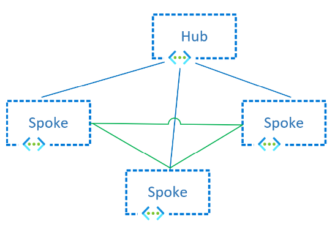
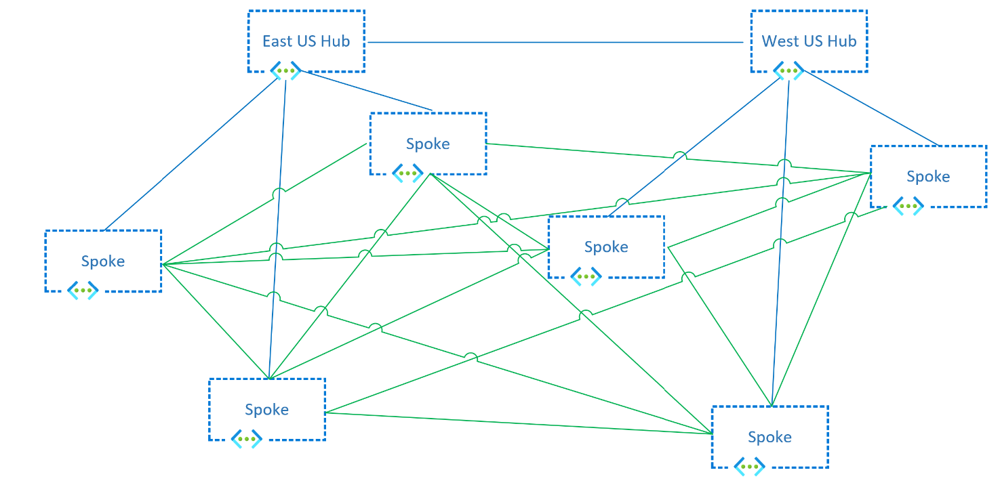
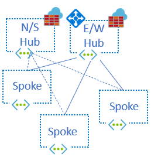
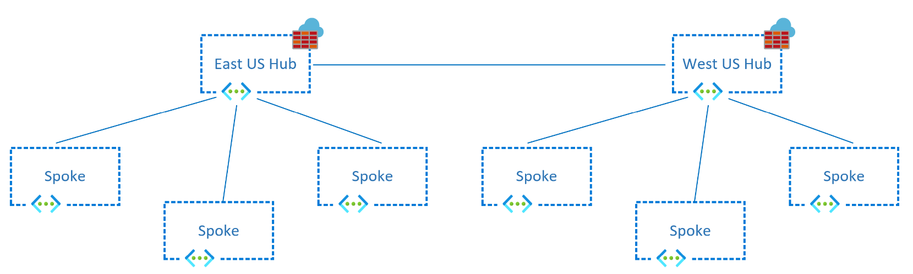
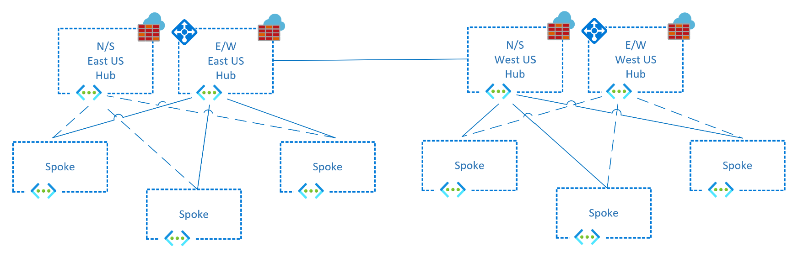
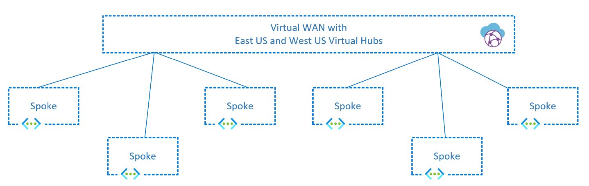
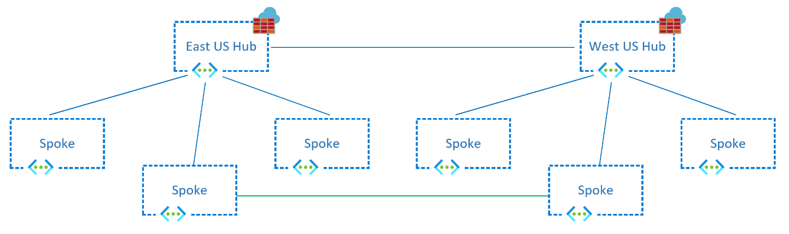
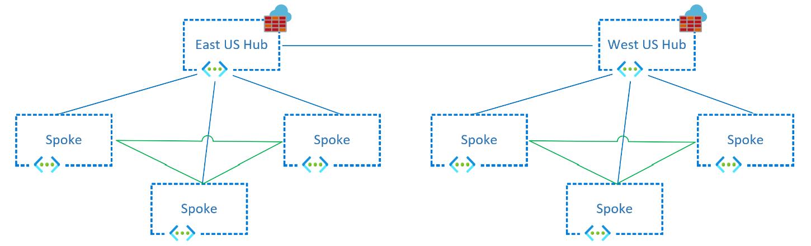
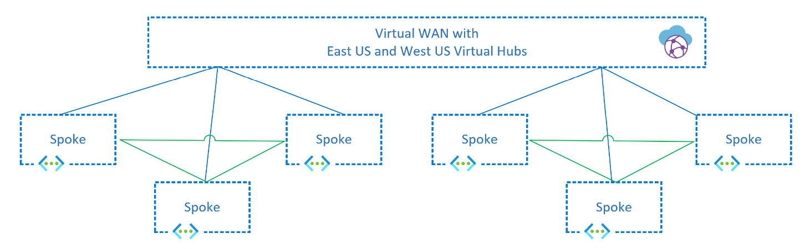

The most common networking design patterns in Azure involve creating hub and spoke VNet topologies in one or multiple Azure regions, optionally connected to on-premises networks via Azure ExpressRoute or site-to-site VPN tunnels over the public Internet. Most design guides focus on application traffic from users either in internal, on-premises networks or from the Internet to those VNets (what the industry typically designates as North-South traffic, since this is often represented by vertical lines in network diagrams). This guide will focus on different patterns that are available for East-West traffic, that is, communication flows between workloads deployed in Azure VNets, either in the same or in different regions.

There are many scenarios why spoke-to-spoke traffic is important:

- Different tiers of the same application might be in separate VNets, for example DMZ servers in a DMZ VNet talking to application services in an internal VNet.
- Different applications or microservices might need to talk to each other.
- Databases might have to replicate data across regions to guarantee Business Continuity in the case of a disaster event.
- Users could actually be located inside of Azure VNets, for example if using Azure Virtual Desktop.

Making sure that your network design satisfies requirements for East-West traffic is critical to provide performance, scalability and resiliency to your applications running in Azure.

# Different patterns and topologies for inter-spoke communication

There are two main topologies that can be used in Azure multi-VNet designs: traditional [hub and spoke][hubnspoke], and [Virtual WAN][vwan]. The main difference across both design options is that in Virtual WAN the hub VNet and everything inside is managed by Microsoft, while in a traditional hub and spoke environment the hub VNet is managed by the Azure customer. That being said, both Virtual WAN and hub and spoke topologies are examples of hub and spoke architectures, where the workloads run in spoke VNets.

There are two ways of connecting spoke VNets to each other:

1. Over the hub VNet: each spoke VNet has a peering to the hub VNet. Via routing you can send traffic from the spoke to a virtual network appliance in the hub, which will provide network connectivity to other spoke in the same region and to other regions.
2. Directly to each other: additional VNet peerings or VPN tunnels can be created between the spoke VNets to provide direct connectivity without traversing the hub VNet.

# Direct connectivity between spokes

Direct connections between the spokes will typically offer better performance and scalability than sending traffic through a Network Virtual Appliance. There are multiple options that can be chosen to connect two spoke VNets to each other:

- [VNet Peering][vnet_peering]: The advantage of direct VNet peerings over the spokes are a lower cost, since fewer VNet peering hops are required, and better performance, because traffic do not need to traverse any network appliance that introduce additional latency or potential bottlenecks. Other scenarios include cross tenant connectivity. However, customers might have requirements around inspecting traffic between spoke VNets that might demand sending traffic through centralized networking devices in the hub VNet.

- [Virtual Network Manager (AVNM)][avnm_hns]: In addition to the advantages VNet peering offers, AVNM extends the VNet peering feature to include a management service which allows to manage virtual network environments and peerings at scale. Peering configurations between spokes VNets, in the same network group, are automatically configured bi-directionally. AVNM brings the ability to statically or dynamically add spoke VNets membership to a specific network group, thus automatically creating the peering connection for any new member. Multiple network groups can be created to isolate clusters of spoke VNets from direct connectivity. Each network group provides same region and multi-region support for spoke to spoke connectivity. One disadvantage is that AVNM does not support cross tenant VNet connectivity.

- VNet-to-VNet VPN Tunnels: VPN services can be configured to directly connect spoke VNets using first party [VPN gateways][vnet_to_vnet] or third party VPN NVAs. The advantage of this option is spoke VNets connectivity cross commercial and sovereign clouds within the same cloud provider or connectivity cross cloud providers. Additionally, in the presence of SDWAN NVAs in each spoke VNet, this can facilitate using third party provider's control plane and feature set to manage virtual network connectivity. Another advantage is to meet compliance requirements for encryption of traffic cross virtual networks in the same Azure datacenter which is not already provided by [MACsec encryption][macsec].

Regardless of the technology used to interconnect spoke VNets to each other, the network topology would look like this:

If there are many spoke networks in the topology, the number of required interconnections grows with the factorial of the number of spokes, as the following chart shows. Azure Virtual Network Manager offers the most efficient way of managing these direct connections at scale.

## Multiple regions

This concept can also be extended to multiple regions. For example, for traditional hub and spoke topologies all spokes can be interconnected to each other. Here again, for a large number of spokes Azure Virtual Network Manager can reduce the administrative overhead of maintaining the large number of connections.

# Using centralized network appliances

This design choice essentially consists in sending traffic through a centralized network appliance (typically located in a hub VNet where the spokes are connected to), that provides additional network services such as deep packet inspection, traffic segmentation or logging. There are multiple options that can be chosen:

- Virtual WAN hub router: fully-managed by Microsoft, Virtual WAN contains a network appliance that will attract traffic from the spokes, and route it either to other Azure regions or to connections to onprem via ExpressRoute, Site-to-Site or Point-to-Site VPN tunnels. This hub router scales up and down automatically, so customers only need to consider the [Virtual WAN Limits][vwan_limits].
- Azure Firewall: [Azure Firewall][azfw] is a network appliance managed by Microsoft that not only can forward IP packets, but it can also inspect them and apply traffic segmentation policies that you configure. It autoscales too up to the [Azure Firewall Limits][azfw_limits], and it is available both in Virtual WAN and Hub and Spoke topologies. Note that Azure Firewall only provides out-of-the-box multi-region capabilities when used with Virtual WAN, otherwise you need to implement User Defined Routes to achieve cross-regional spoke-to-spoke communication.
- Network Virtual Appliances: if you prefer to use your own network devices to perform routing and network segmentation, you can certainly deploy Network Virtual Appliances either in a Hub and Spoke or in a Virtual WAN topology, see [Deploy highly available NVAs][nva_ha] and [NVAs in Virtual WAN Hub][vwan_nva]

Note that the VNet peerings between hub and spoke VNets can be created either manually or automatically with AVNM:

- Manual VNet peerings: good enough when there is a low number of spoke VNets, but it creates a management overhead at scale.
- [Virtual Network Manager (AVNM)][avnm_hns]: AVNM enhances VNet  management through features to manage virtual network environments and peerings at scale. Peering configurations between hub and spokes VNets are automatically configured bi-directionally for network groups. AVNM brings the ability to statically or dynamically add spoke VNets membership to a specific network group, thus automatically creating the peering connection for any new member. Spoke VNets in network groups have the option to [use the hub VPN or ExpressRoute gateways for connectivity][avnm_hub_as_gw]. A few disadvantage include that AVNM does not support cross tenant VNet connectivity and does not support using the Azure Firewall or other third party NVAs for spoke to spoke connnectivity.

The following diagram shows a basic hub and spoke topology that sends traffic between spokes through an Azure Firewall deployed in the hub VNet. Traffic is usually forwarded to the centralized appliance through User Defined Routes:

In certain circumstances, it might be desirable to split the Network Virtual Appliances handling the spoke-to-spoke and the Internet traffic. By tuning the route tables in the spokes to send private addresses (with a route for RFC 1918 prefixes) to an NVA responsible for Azure-to-Azure and Azure-to-on-premises traffic (also called East-West traffic), and Internet traffic (with a 0.0.0.0/0 route) to a second NVA, responsible for the Azure-to-Internet traffic (also referred to as North-South), as the following diagram shows:

## Multiple regions

The same concept can be extended to multiple regions. For example, in a hub and spoke design additional route tables should be configured in the Azure Firewall subnets in each hub pointing to the spokes in the remote region, so that inter-region traffic can be forwarded. Inter-regional traffic between spoke VNets will then traverse both Azure Firewalls:

The design with separate network virtual appliances for North-South and East-West traffic is also possible in a multi-region hub and spoke design:

Virtual WAN creates a similar topology and takes over the routing complexity, so that the network administrator only needs to connect the spoke VNets to an Azure Virtual WAN hub without having to worry about how to forward traffic between regions:

# Hybrid approaches

Most situations will require a hybrid approach, where traffic between certain spokes need to go over direct connections, and the rest of the spokes will communicate through a central network appliance. For example, if two specific spokes have particularly high bandwidth requirements because databases are synchronizing data, you could selectively create VNet peerings only between those two VNets:

Another common pattern is interconnecting spokes in one region through direct VNet peerings, but leaving inter-regional traffic to cross NVAs:

The same designs are applicable for Virtual WAN as well. For example:

[vwan]: /azure/virtual-wan/virtual-wan-about
[vwan_limits]: /azure/azure-resource-manager/management/azure-subscription-service-limits#virtual-wan-limits
[vwan_nva]: /azure/virtual-wan/about-nva-hub
[hubnspoke]: ../../reference-architectures/hybrid-networking/hub-spoke.yml
[ars]: /azure/route-server/overview
[avnm]: /azure/virtual-network-manager/overview
[azfw]: /azure/firewall/overview
[azfw_limits]: /azure/azure-resource-manager/management/azure-subscription-service-limits#azure-firewall-limits
[nva_ha]: /azure/architecture/reference-architectures/dmz/nva-ha
[vm_flows]: /azure/virtual-network/virtual-machine-network-throughput#flow-limits-and-active-connections-recommendations
[avnm_hns]: /azure/virtual-network-manager/concept-connectivity-configuration#hub-and-spoke-topology
[avnm_hub_as_gw]: /azure/virtual-network-manager/concept-connectivity-configuration#use-hub-as-a-gateway
[vnet_to_vnet]: /azure/vpn-gateway/vpn-gateway-howto-vnet-vnet-resource-manager-portal
[vnet_peering]: /azure/virtual-network/virtual-network-peering-overview
[macsec]: /azure/virtual-network/virtual-networks-faq#is-vnet-peering-traffic-encrypted
