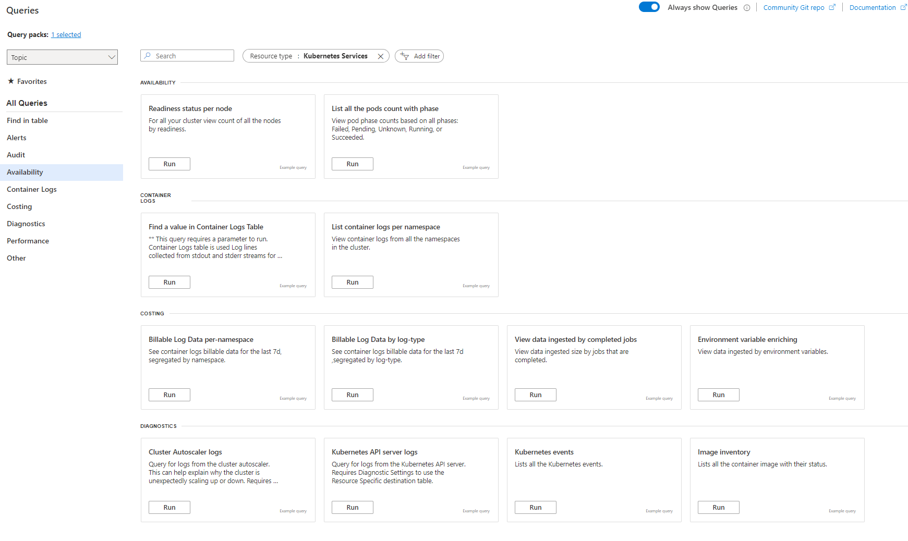

# Evaluate AKS cluster health

To begin your triaging practice, evaluate the overall health of the cluster and networking.

_This article is part of a series. Start with the [overview](aks-triage-practices.md)._

## Tools

To diagnose and solve problems in your Azure Kubernetes Service (AKS) cluster, you can use the following tools and features. Find these tools and features by selecting your AKS cluster resource in the Azure portal.

- **AKS diagnose and solve problems**: Select [Diagnose and solve problems](/azure/aks/aks-diagnostics). You can use this intelligent tool to help identify and resolve issues within your cluster, without extra cost.

- **Resource health**: Choose [Resource health](/azure/service-health/resource-health-overview). Use this tool to help diagnose and obtain support for service problems that might impact your Azure resources. This tool provides information about your resources' current and past health status.
- **Azure Advisor**: Select the **Overview** tab, and select the **Recommendations** section.

  Alternatively, you can select **Advisor recommendations** in the navigation panel. [Azure Advisor](/azure/advisor/advisor-overview) acts as a personalized cloud consultant, guiding you to follow best practices for optimizing your Azure deployments. Advisor can analyze your resource configuration and usage telemetry, and suggest solutions to enhance cost-effectiveness, performance, reliability, and security.
- **Log Analytics workspace**: Choose the **Monitoring** tab. Select **Logs** in the navigation panel to access the cluster logs and metrics that are stored in the [Log Analytics](/azure/azure-monitor/logs/log-analytics-overview) workspace. Use this feature to monitor and analyze your cluster's logs and metrics to provide insight and improve troubleshooting.

Use these tools and features so you can effectively diagnose and resolve issues, optimize your AKS cluster deployment, and monitor the health and performance of your Azure resources.

The [diagnose and solve problems](/azure/aks/aks-diagnostics) feature provides a comprehensive suite of tools to aid in the identification and resolution of various issues related to your cluster. Select the troubleshooting category that's the most relevant to your problem.

:::image type="content" source="images/aks-diagnostics.png" alt-text="Screenshot that shows the Diagnose and solve problems page." lightbox="images/aks-diagnostics.png" border="false":::

To check the cluster health, you might choose:

- **Cluster and control plane availability and performance**: Check if there are any service availability or throttling issues affecting the health of the cluster.
- **Connectivity issues**: Verify if there are errors with cluster DNS resolution or if the outbound communication route has connectivity issues.

Use the [resource health](/azure/service-health/resource-health-overview) feature to identify and get support for cluster issues and service problems that can impact your cluster's health. Add a resource alert so you can easily monitor the health of your cluster. The resource health feature provides a report on the current and past health of your cluster. There are four health statuses.

- **Available**: There are no events detected that affect the health of the cluster. If the cluster has recovered from unplanned downtime within the last 24 hours, there's a _recently resolved_ notification.

- **Unavailable**: The service detects an ongoing platform or nonplatform event that affects the health of the cluster.
- **Unknown**: The resource health feature hasn't received any information about the resource for over 10 minutes. This status usually appears when virtual machines are deallocated. This status isn't a definitive indication of the resource's state, but it can be a useful data point for troubleshooting.
- **Degraded**: Your cluster detects a loss in performance, but it's still available for use.

For more information, see [Azure resource health overview](/azure/service-health/resource-health-overview).

**Azure Advisor** offers actionable recommendations to help you optimize your AKS clusters for reliability, security, operational excellence, and performance efficiency. Select a recommendation for detailed documentation to optimize your cluster. You can proactively take steps to improve your cluster's performance and avoid potential issues.

For more information, see [Azure Advisor overview](/azure/advisor/advisor-overview).

[Log Analytics](/azure/azure-monitor/logs/log-analytics-overview) offers insights into the cluster's health. To access the [Log Analytics](/azure/aks/monitor-aks) workspace, navigate to your AKS cluster and select `Logs` under the `Monitoring` section in the left navigation panel.

In the `Logs` view, you can choose predefined queries in the following categories to analyze cluster health:

Here are some examples of built-in queries that you can use to query logs and metrics collected in the Log Analytics workspace:

- **Availability**
  - Readiness status per node: View the count of all nodes in the cluster by readiness status.
  - List all the pods count with phase: View the count of all pods by phase: phase: Failed, Pending, Unknown, Running, or Succeeded.
- **Containers**
  - Find a value in Container Logs Table: This query finds rows in the ContainerLogs table where LogEntry has a specified string parameter.
  - List container logs per namespace: View container logs from all namespaces in the cluster.
- **Diagnostics**
  - Cluster Autoscaler logs: Query for logs from the cluster autoscaler. This can help explain why the cluster unexpectedly scales up or down.
  - Kubernetes API server logs: Query for logs from the Kubernetes API server.
  - Image inventory: Lists all the container image with their status.
  - Prometheus disk read per second per node: View Prometheus disk read metrics from the default Kubernetes namespace as timechart.
  - Instances Avg CPU usage growth from last week: Shows the average CPU growth by instance in the last week by descending order.

## Contributors

*This article is maintained by Microsoft. It was originally written by the following contributors.*

Principal authors:

- [Paolo Salvatori](https://www.linkedin.com/in/paolo-salvatori) | Principal Customer Engineer
- [Francis Simy Nazareth](https://www.linkedin.com/in/francis-simy-nazereth-971440a) | Senior Technical Specialist

Other contributors:

- [Rong Zhang](https://www.linkedin.com/in/rong-zhang-7335561a) | Senior Product Manager

*To see non-public LinkedIn profiles, sign in to LinkedIn.*

## Related resources

> [!div class="nextstepaction"]
> [Examine the node and pod health](aks-triage-node-health.md)
