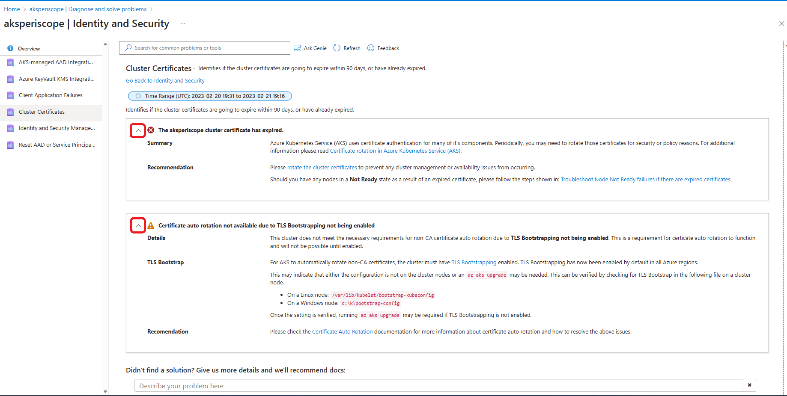

# Check the AKS cluster health

Start by checking the health of the overall cluster and networking.

_This article is part of a series. Read the introduction [here](aks-triage-practices.md)._

**Tools:**

**AKS Diagnostics**. In Azure portal, navigate to the AKS cluster resource. Select **Diagnose and solve problems**.

**Diagnostics** shows a list of tiles of issue categories. A short description and example are given on each tile, based on your issue, it can help target on which tile you can click to troubleshoot. For example, if you see your node is in **Not Ready** stage due to an expired certificate, you can click **Identity and Security** tile to run the diagnostics and it will show you information about the underlying issue.

This image indicates that an expired certificate may cause node not ready and how to resolove this issue. 

And when you click **View details**, the tile expands and presents to you what could be wrong with your cluster certificate. The arrows on the top left corner of each tile can be expanded to show more detailed recommendations of fixes. 

To learn more about this feature, see [Azure Kubernetes Service Diagnostics overview](/azure/aks/aks-diagnostics).

## Next steps

> [!div class="nextstepaction"]
> [Examine the node and pod health](aks-triage-node-health.md)
