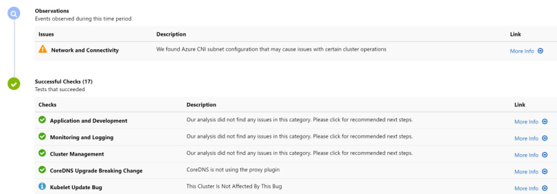
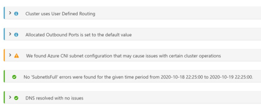

# Check the AKS cluster health

Start by checking the health of the overall cluster and networking.

_This article is part of a series. Read the introduction [here](aks-triage-practices.md)._

**Tools:**

**AKS Diagnostics**. In Azure portal, navigate to the AKS cluster resource. Select **Diagnose and solve problems**.

**Diagnostics** shows a list of results from various test runs. If there are any issues found, **More info** can show you information about the underlying issue.

This image indicates that network and connectivity issues are caused by Azure CNI subnet configuration.

To learn more about this feature, see [Azure Kubernetes Service Diagnostics overview](/azure/aks/concepts-diagnostics).

## Next steps

> [!div class="nextstepaction"]
> [Examine the node and pod health](aks-triage-node-health.md)
