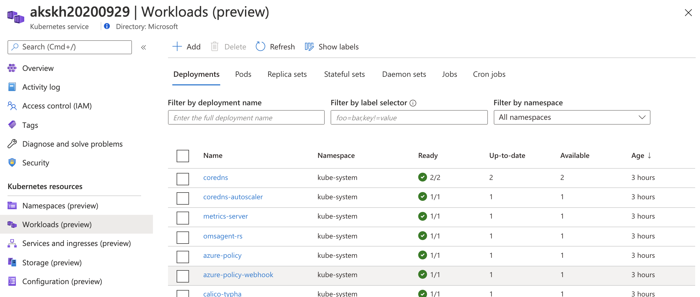
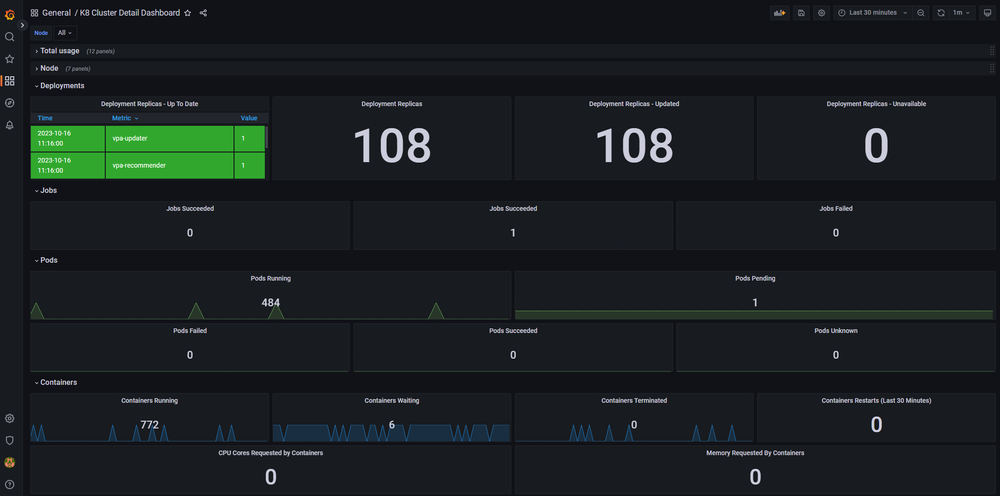

# Check the workload deployments

Check to see that all deployments and daemonSets are running. The **Ready** and the **Available** matches the expected count.

_This article is part of a series. Read the introduction [here](aks-triage-practices.md)._

**Tools:**

- **AKS - Workloads**. In Azure portal, navigate to the AKS cluster resource. Select **Workloads**.

- **Prometheus and Grafana Dashboard**. Deployment Status Dashboard. This image is from Grafana Community Chart 10856.

## Next steps

> [!div class="nextstepaction"]
> [Validate the admission controllers](aks-triage-controllers.md)
