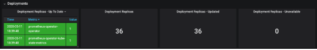

# Check the workload deployments

Monitoring the health and performance of your Kubernetes workloads is crucial to ensure they are running optimally. Azure Kubernetes Service (AKS) provides several tools and methods to check the health and performance of your deployments, daemonsets, and services. In this article, we will explore these tools and approaches.

_This article is part of a series. Read the introduction [here](aks-triage-practices.md)._

## Tools

It is important to know if all deployments and daemonSets are running. The following sections show you how to validate if the **Ready** and the **Available** matches the expected count using:
- The Azure Portal
- Azure Container Insights
- The Kubectl command line tool
- Prometheus and Grafana

### Azure Portal

In Azure portal, proceed as follows to check the health of workloads:

- Open the Azure portal and navigate to your AKS cluster.
- Choose `Workloads` under `Kubernetes resources` in the left navigation panel.
- Check that the number of replicas in a `Ready` state matches the number of desired replicas under the `Ready` column:
  - The first number indicates the number of replicas that are currently available and ready to serve traffic. These replicas have been successfully scheduled onto worker nodes, have completed their startup process, and have passed their readiness checks.
  - The second number indicates the desired number of replicas specified for the deployment. This is the number of replicas that the deployment aims to maintain. The Kubernetes deployment controller constantly monitors the state of the deployment and tries to ensure that the actual number of replicas matches the desired number.
- Click the `Replica sets`,`Stateful sets`, and  `Daemon sets` tabs and repeat the check.


- Choose `Services and ingresses` under `Kubernetes resources` in the left navigation panel.
- Ensure the status is `OK` for all the services.


- Choose `Storage` under `Kubernetes resources` in the left navigation panel.
- Ensure the status is `BOUND` for all the persistent volume claims and persistent volumes under the corresponding tabs.


### Azure Container Insights

[Container insights](/azure/azure-monitor/containers/container-insights-overview) is a feature of [Azure Monitor](/azure/azure-monitor/overview) that provides monitoring capabilities for container workloads deployed to Azure Kubernetes Servcie (AKS) or managed by [Azure Arc-enabled Kubernetes](/azure/azure-arc/kubernetes/overview). This feature gathers performance and health information by collecting memory and processor metrics from controllers, nodes, and containers. It also captures container logs for analysis. 

The collected data can be analyzed using various views and pre-built workbooks. These tools allow you to examine the performance and behavior of the different components within your cluster. With Container Insights, you can gain valuable insights into the overall state of your container workloads and make informed decisions to optimize their performance and troubleshoot any issues. 

You can Access Container insights in the Azure portal as follows:

- Open the Azure portal and navigate to your AKS cluster.
- Choose `Insights` under `Monitoring` in the left navigation panel.
- Select the `Controllers` tab in the right panel to see all the ReplicaSets, StatetefulSets, and DaemonSets in the AKS cluster.
- Expand a controller to see its replicas.
- Click a pod and select to see its metadata under the `Overview` tab, events under the `Live events` tab, and metrics under the `Live Metrics` tab.


- Expland an given pod to see its containers.


- Select a container to see its metadata and environment variables under the `Overview` tab.


- Select the `Live Logs` tab to see the container logs in real time.


- Likewise, click the `Live Events` tab to see the container events in real time. While you view events, you can also limit the results by using the `Filter`` pill found below the search bar. Depending on the resource you select, the pill lists a node, pod, namespace, or cluster to choose from.

### Kubectl command line tool

You can use the `kubectl` command line tool to communicate with a Kubernetes cluster's control plane, using the Kubernetes API, and check the status of your workloads.

#### Pods

You can run the following command to list all the pods running in all namespaces:

```console
kubectl get pod -A
```

The `READY` column provides important information about the readiness state of the pod's containers.

- The first number signifies the count of containers that are currently in a ready state. This means these containers have passed the readiness probes and are prepared to handle incoming traffic.
- The second number represents the total count of containers defined within the pod, regardless of their readiness state. It includes both containers that are ready and those that are still initializing or experiencing issues.

It is crucial to ensure that the first number (ready containers) matches the second number (total containers) for the pod. If they differ, it indicates that some containers may not be ready or that there might be issues preventing them from reaching the ready state.

#### Deployments, StatefulSets, DaemonSets, and StatefulSets 

Run the following command to retrieve the [Deployments](https://kubernetes.io/docs/concepts/workloads/controllers/deployment/) in all namespaces:

```console
kubectl get deploy -A
```

The numbers under the `READY` column in the result of the `kubectl get deployment` command indicate the current readiness state of the replicas in a deployment.

- The first number represents the number of replicas that are ready and available to serve traffic. These replicas have successfully started and passed their readiness checks.
- The second number represents the desired number of replicas specified in the deployment configuration. It is the target number of replicas the deployment aims to maintain.

It is important to ensure that the first number matches the second number, indicating that the desired number of replicas are running and ready. Any discrepancy between the two numbers may indicate scaling or readiness issues that need to be addressed. Repeat the same check for [StatefulSets](https://kubernetes.io/docs/concepts/workloads/controllers/statefulset/) by running the following command:

```console
kubectl get statefulset -A
```

Run the following command to get the [DaemonSets](https://kubernetes.io/docs/concepts/workloads/controllers/daemonset/) in all namespaces:

```console
kubectl get ds -A
```

This will provide you with information about the DaemonSets in your cluster. When examining the output, it is essential to ensure that the number of pods in the `READY`, `CURRENT`, and `DESIRED` states are the same. This means that the desired number of pods specified in the DaemonSet configuration is equal to the number of pods that are currently running and ready.

Similarly, it is also recommended to perform the same check for [ReplicaSets](https://kubernetes.io/docs/concepts/workloads/controllers/replicaset/). You can use the following command to list all the ReplicaSets in all namespaces. 

```console
kubectl get rs -A
```

By comparing these numbers, you can ensure that the intended number of pods or replicas are running as expected, and any discrepancies may indicate a need for further investigation or troubleshooting using the following commanda

- [kubectl describe](https://kubernetes.io/docs/reference/kubectl/cheatsheet/#interacting-with-running-pods): The `kubectl describe` command is used to provide detailed information about Kubernetes resources such as pods, deployments, services, and more. It gives you a comprehensive overview of the specified resource, including its current state, events, conditions, and related metadata. The information is retrieved from the Kubernetes API server and is useful for troubleshooting or understanding the status of a resource. For example, you can run `kubectl describe pod <pod-name>` to get detailed information about a specific pod, including its current state, events, labels, and containers associated with it. The output will show you information like pod status, events, volumes, conditions, and more.
- [kubectl logs](https://kubernetes.io/docs/reference/kubectl/cheatsheet/#interacting-with-running-pods): The `kubectl logs` command allows you to retrieve the logs generated by a specific container within a pod. It is helpful for debugging and troubleshooting purposes. You can view the logs in real-time or retrieve historical logs from a specific container. To view container logs, you can use the `command kubectl logs <pod-name> -c <container-name>` where `<pod-name>` is the name of the pod and `<container-name>` is the name of the container from which you want to fetch the logs. If there is only one container within the pod, you don't need to specify the container name. Additionally, you can use the `-f` flag with `kubectl logs` to follow the logs in real-time, similar to the `tail -f` Linux command.
- [kubectl events](https://kubernetes.io/docs/reference/kubectl/cheatsheet/#interacting-with-running-pods): The `kubectl events` command is useful for troubleshooting when a Deployment, DaemonSet, ReplicaSet, or Pod has not started or encountered issues during startup. It provides a chronological list of events associated with the specified resource, giving you insights into what might have caused the problem. To use `kubectl events`, you can run the command `kubectl events` followed by a specific resource name or use selectors to filter events based on labels, namespaces, or other criteria. For example, to retrieve events related to a specific pod, you can run `kubectl events --field-selector involvedObject.name=<pod-name> --field-selector involvedObject.kind=Pod`. Replace `<pod-name>` with the name of the pod you want to investigate. The output of the `kubectl events` command will display information such as the event type (Normal or Warning), event message, reason for the event, and the time stamp when the event occurred. This information can provide clues about what caused the failure or issue during startup. If you suspect that a specific resource like a Deployment, DaemonSet, or ReplicaSet is experiencing problems, you can filter events using selectors accordingly. For example, `kubectl events --field-selector involvedObject.name=<deployment-name> --field-selector involvedObject.kind=Deployment` will show events related to a specific deployment. By examining the events, you can gather important details about potential errors, failures, or other events that might have prevented the resource from starting properly. This can assist you in troubleshooting and resolving the issues affecting the deployment, DaemonSet, ReplicaSet, or pod.

### In-cluster monitoring with Prometheus and Grafana

If you deployed [Prometheus](https://prometheus.io/) and [Grafana](https://grafana.com/) in your Azure Kubernetes Service (AKS) cluster for monitoring and visualization, you can utilize the [K8 Cluster Detail Dashboard](https://grafana.com/grafana/dashboards/10856-k8-cluster/) to gain valuable insights. This dashboard leverages the Prometheus cluster metrics to present vital information such as CPU usage, memory utilization, network activity, file system usage, as well as detailed statistics for individual pods, containers, and systemd services. To ensure the health and performance of your deployments, jobs, pods, and containers, you can use the corresponding blades in the dashboard. The panels under the `Deployments` section show the number of replicas for each deployment, the total number of replicas, while the panels under the `Containers` section show a chart for running, pending, failed, and succeeded containers.



### Azure Monitor Managed Service for Prometheus and Azure Managed Grafana

If you have set up your Azure Kubernetes Service (AKS) cluster to collect Prometheus metrics to [Azure Monitor managed service for Prometheus](/azure/azure-monitor/essentials/prometheus-metrics-overview) and connected your [Azure Monitor Workspace](/azure/azure-monitor/essentials/azure-monitor-workspace-manage#link-a-grafana-workspace) to an [Azure Managed Grafana](/azure/managed-grafana/overview)  workspace, you can leverage pre-built dashboards to visualize and analyze Prometheus metrics.

These dashboards, which are available in a [GitHub repository](https://aka.ms/azureprometheus-mixins) and can be installed by following the [installation instructions](https://github.com/Azure/prometheus-collector/tree/main/mixins/kubernetes#how-to-use), provide a comprehensive view of your Kubernetes cluster's performance and health. They are provisioned in the specified Azure Grafana instance under the `Managed Prometheus` folder.

- `Kubernetes / Compute Resources / Cluster`
- `Kubernetes / Compute Resources / Namespace (Pods)`
- `Kubernetes / Compute Resources / Node (Pods)`
- `Kubernetes / Compute Resources / Pod`
- `Kubernetes / Compute Resources / Namespace (Workloads)`
- `Kubernetes / Compute Resources / Workload`
- `Kubernetes / Kubelet`
- `Node Exporter / USE Method / Node`
- `Node Exporter / Nodes`
- `Kubernetes / Compute Resources / Cluster (Windows)`
- `Kubernetes / Compute Resources / Namespace (Windows)`
- `Kubernetes / Compute Resources / Pod (Windows)`
- `Kubernetes / USE Method / Cluster (Windows)`
- `Kubernetes / USE Method / Node (Windows)`

These built-in dashboards are widely used in the open-source community for monitoring Kubernetes clusters with Prometheus and Grafana. They offer valuable insights into metrics such as resource utilization, pod health, network activity, and more. Additionally, you have the flexibility to create custom dashboards tailored to your specific monitoring needs. Overall, by utilizing these dashboards, you can effectively monitor and analyze Prometheus metrics in your AKS cluster, enabling you to optimize performance, troubleshoot issues, and ensure the smooth operation of your Kubernetes workloads.

To conveniently visualize the CPU usage, CPU quota, memory usage, and memory quota by pod in your Linux agent nodes, you can utilize the `Kubernetes / Compute Resources / Node (Pods)` dashboard, shown in the picture below. This dashboard effectively displays these metrics, allowing you to gain insights into resource utilization at the pod level.
  


The `Kubernetes / Compute Resources / Pod` Grafana dashboard provides comprehensive insights into the resource consumption and performance metrics of a selected cluster, namespace, and pod. This dashboard allows you to analyze crucial metrics related to CPU usage, CPU throttling, CPU quota, memory usage, memory quota, networking metrics, and storage metrics. 


The dashboard allows you to select an AKS cluster, namespace, and specific pod within the chosen namespace and provides the following panels:

- `CPU Usage`: This chart displays the CPU usage of the selected pod over time. It helps you understand the CPU consumption pattern and identify any potential spikes or abnormalities.
- `CPU Throttling`: This chart provides insights into CPU throttling, which occurs when a pod exceeds its CPU resource limits. Monitoring this metric helps you identify situations where the pod's performance is being restricted due to CPU throttling.
- `CPU Quota`: This chart showcases the allocated CPU quota for the selected pod. It allows you to observe if the pod is exceeding its assigned CPU quota and potentially requiring resource adjustments.
- `Memory Usage`: This chart presents the memory usage of the selected pod, allowing you to monitor the memory consumption pattern and identify any memory-related issues.
- `Memory Quota`: This chart displays the allocated memory quota for the pod. You can observe if the pod is exceeding its assigned memory quota, which may indicate a need for resource optimization.
- `Networking Metrics`: This section includes charts for received and transmitted bandwidth, as well as the rate of received and transmitted packets. These metrics help you monitor network usage and detect any potential networking bottlenecks or anomalies.
- `Storage Metrics`: This section provides information on storage-related metrics such as IOPS (Input/Output Operations Per Second) and throughput. Monitoring these metrics helps you gauge the performance and efficiency of the storage used by the pod.

By leveraging the `Kubernetes / Compute Resources / Pod` Grafana dashboard, you can gain valuable insights into the resource utilization, performance, and behavior of individual pods within your Kubernetes cluster. This allows you to optimize resource allocation, troubleshoot performance issues, and make informed decisions to ensure the smooth operation of your containerized workloads.

## Contributors

*This article is maintained by Microsoft. It was originally written by the following contributors.*

Principal author:

- [Paolo Salvatori](https://www.linkedin.com/in/paolo-salvatori) | Principal Customer Engineer

Other contributors:

- [Kevin Harris](https://www.linkedin.com/in/kevbhar) | Principal Solution Specialist
- [Francis Simy Nazareth](https://www.linkedin.com/in/francis-simy-nazereth-971440a) | Senior Technical Specialist

*To see non-public LinkedIn profiles, sign in to LinkedIn.*

## Related links

[Virtual machine disk limits](/azure/azure-resource-manager/management/azure-subscription-service-limits#virtual-machine-disk-limits)

[Relationship between Virtual Machine and Disk Performance](/azure/virtual-machines/linux/disk-performance-linux)

## Next steps

> [!div class="nextstepaction"]
> [Validate the admission controllers](aks-triage-controllers.md)
