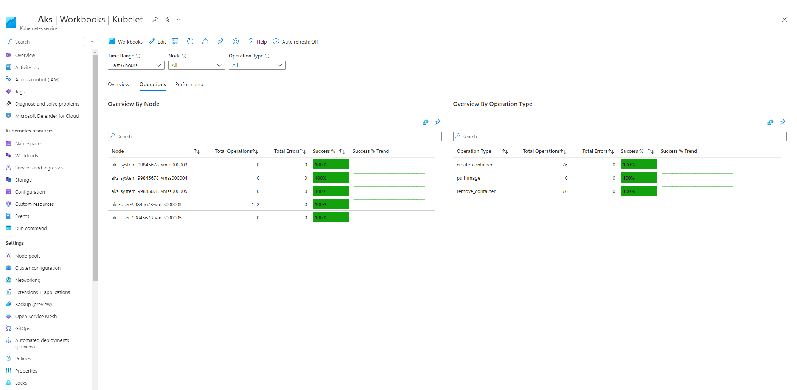
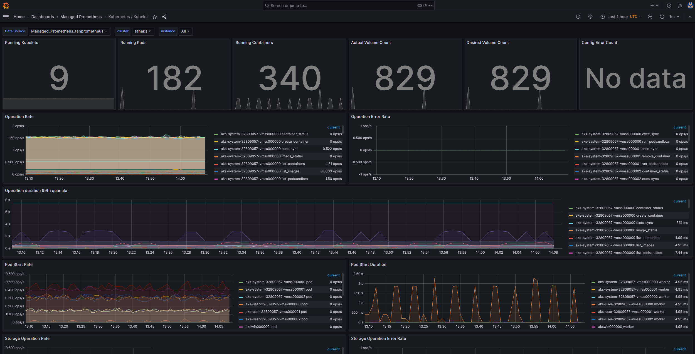
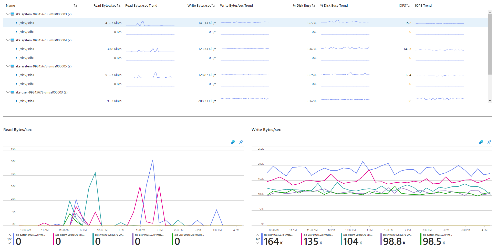
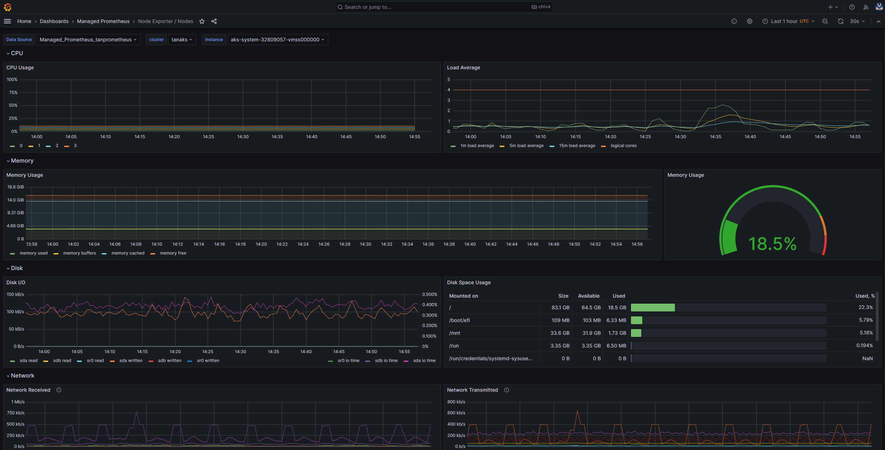

# Examine the node and pod health

If the cluster checks are clear, check the health of the AKS worker nodes. Determine the reason for the unhealthy node and resolve the issue.

_This article is part of a series. Read the introduction [here](aks-triage-practices.md)._

## 1 - Check the overall health of the worker nodes

Unhealthy nodes in an Azure Kubernetes Service (AKS) cluster can be attributed to various factors. One common reason is the breakdown of communication between the control plane and nodes, often caused by misconfigurations in routing and firewall rules. When you configure your AKS cluster for [user-defined routing](/azure/aks/egress-outboundtype#outbound-type-of-userdefinedrouting), it's your responsibility to configure egress paths via a network virtual applicance (NVA) or a firewall, such as the [Azure Firewall](/azure/aks/limit-egress-traffic#restrict-egress-traffic-using-azure-firewall). To address this issue, it is recommended to configure the firewall to allow the necessary ports and fully qualified domain names, following the [AKS egress traffic guidance](/azure/aks/limit-egress-traffic). Additionally, inadequate compute, memory, or storage resources may result in kubelet pressures. In such cases, scaling up the resources can resolve the problem effectively.

In a [private Azure Kubernetes Service (AKS) cluster](/azure/aks/private-clusters?tabs=azure-portal), communication issues between the control plane and nodes may arise due to DNS resolution problems. It is essential to verify if the Kubernetes API server DNS name resolves to the private IP of the API server. Incorrect configuration of a custom DNS server is a common cause of DNS resolution failures. If custom DNS servers are being used, ensure they are correctly specified as DNS servers on the virtual network where nodes are provisioned. Moreover, confirm that the AKS private API server can be resolved through the custom DNS server.

By addressing these potential issues related to control plane communication and DNS resolution, you can effectively tackle and resolve node health problems within your AKS cluster.

You can check node health in one of the following ways:

- **Azure Monitor - Containers health view:** To view the health of nodes, user pods, and system pods in your Azure Kubernetes Service (AKS) cluster, follow these steps in the Azure portal:
  - In the Azure portal, navigate to `Azure Monitor`.
  - From the `Azure Monitor` page, choose `Containers` under the `Insights` section in the left navigation panel.
  - In the right pane of the `Containers` page, select `Monitored clusters`. This will display a list of the AKS clusters that are being monitored.
  - Choose a specific AKS cluster from the list to view the health of the nodes, user pods, and system pods.


- **AKS - Nodes view:** To ensure that all nodes in your Azure Kubernetes Service (AKS) cluster are in the Ready state, follow these steps within the Azure portal:
  - Go to the Azure portal and navigate to your AKS cluster.
  - Choose `Node pools` under `Settings` in the left navigation panel.
  - In the right pane, select the `Nodes` tab.
  - Verify that all the nodes listed are in the `Ready` state.


- **In-cluster monitoring with Prometheus and Grafana:** If you deployed [Prometheus](https://prometheus.io/) and [Grafana](https://grafana.com/) in your Azure Kubernetes Service (AKS) cluster for monitoring and visualization, you can utilize the [K8 Cluster Detail Dashboard](https://grafana.com/grafana/dashboards/10856-k8-cluster/) to gain valuable insights. This dashboard leverages the Prometheus cluster metrics to present vital information such as CPU usage, memory utilization, network activity, file system usage, as well as detailed statistics for individual pods, containers, and systemd services. To ensure the health and performance of your cluster, the `Node Conditions` blade provides crucial metrics. It allows you to track nodes that may be experiencing issues such as being unschedulable, disk pressure, memory pressure, PID pressure, network problems, or running out of disk space. By monitoring these metrics, you can proactively identify and address any potential issues affecting the availability and performance of your AKS cluster.


- **Azure Monitor Managed Service for Prometheus and Azure Managed Grafana:** If you have set up your Azure Kubernetes Service (AKS) cluster to collect Prometheus metrics to [Azure Monitor managed service for Prometheus](/azure/azure-monitor/essentials/prometheus-metrics-overview) and connected your [Azure Monitor Workspace](/azure/azure-monitor/essentials/azure-monitor-workspace-manage#link-a-grafana-workspace) to an [Azure Managed Grafana](/azure/managed-grafana/overview)  workspace, you can leverage the following pre-built dashboards to visualize and analyze Prometheus metrics. These dashboards, which are available in a [GitHub repository](https://aka.ms/azureprometheus-mixins), provide a comprehensive view of your Kubernetes cluster's performance and health. They are provisioned in the specified Azure Grafana instance under the `Managed Prometheus` folder.

  - `Kubernetes / Compute Resources / Cluster`
  - `Kubernetes / Compute Resources / Namespace (Pods)`
  - `Kubernetes / Compute Resources / Node (Pods)`
  - `Kubernetes / Compute Resources / Pod`
  - `Kubernetes / Compute Resources / Namespace (Workloads)`
  - `Kubernetes / Compute Resources / Workload`
  - `Kubernetes / Kubelet`
  - `Node Exporter / USE Method / Node`
  - `Node Exporter / Nodes`
  - `Kubernetes / Compute Resources / Cluster (Windows)`
  - `Kubernetes / Compute Resources / Namespace (Windows)`
  - `Kubernetes / Compute Resources / Pod (Windows)`
  - `Kubernetes / USE Method / Cluster (Windows)`
  - `Kubernetes / USE Method / Node (Windows)`

  These built-in dashboards are widely used in the open-source community for monitoring Kubernetes clusters with Prometheus and Grafana. They offer valuable insights into metrics such as resource utilization, pod health, network activity, and more. Additionally, you have the flexibility to create custom dashboards tailored to your specific monitoring needs. Overall, by utilizing these dashboards, you can effectively monitor and analyze Prometheus metrics in your AKS cluster, enabling you to optimize performance, troubleshoot issues, and ensure the smooth operation of your Kubernetes workloads.

  To conveniently visualize the CPU usage, CPU quota, memory usage, and memory quota by pod in your Linux agent nodes, you can utilize the `Kubernetes / Compute Resources / Node (Pods)` dashboard, shown in the picture below. This dashboard effectively displays these metrics, allowing you to gain insights into resource utilization at the pod level.

  Furthermore, if your cluster includes Windows agent nodes, the `Kubernetes / USE Method / Node (Windows)` dashboard enables you to visualize the Prometheus metrics specifically collected from these Windows agent nodes. This dashboard provides a comprehensive view of resource consumption and performance on Windows nodes within your cluster.

  By leveraging these dedicated dashboards, you can easily monitor and analyze important metrics related to CPU, memory, and other resources in both Linux and Windows agent nodes. This visibility allows you to identify potential bottlenecks, optimize resource allocation, and ensure efficient operation across your AKS cluster.


## 2 - Verify the control plane and worker node connectivity

If worker nodes are healthy, you should examine the connectivity between the managed AKS control plane and the cluster worker nodes. Azure Kubernetes Service (AKS) utilizes a secure tunnel communication method to enable communication between the [Kubernetes API server](https://kubernetes.io/docs/concepts/overview/kubernetes-api/) and individual node [kubelets](https://kubernetes.io/docs/reference/command-line-tools-reference/kubelet/), even when they are on different virtual networks. This tunnel is protected using mTLS encryption. The primary tunnel employed by AKS is called [Konnectivity, which was formerly known as apiserver-network-proxy](https://kubernetes.io/docs/tasks/extend-kubernetes/setup-konnectivity/). It is important to ensure that all network rules and fully qualified domain names (FQDNs) comply with the required Azure network rules.

To verify the connectivity between the managed AKS control plane and the cluster worker nodes of an Azure Kubernetes Service (AKS) cluster, you can use the [kubectl](https://kubernetes.io/docs/reference/kubectl/) command-line tool.

To ensure that the konnectivity agent pods are running properly, execute the following command:

```console
kubectl get deploy konnectivity-agent -n kube-system
```

Make sure that the pods are in a ready state.

In case there is an issue with the connectivity between the control plane and worker nodes, follow these steps to establish the connectivity after ensuring that the required AKS egress traffic rules are allowed.

Restart the `konnectivity-agent` pods by executing the following command:

  ```console
  kubectl rollout restart deploy konnectivity-agent -n kube-system
   ```

If restarting the pods doesn't fix the connection, proceed to the next step. Check the logs for any anomalies. Use the following command to view the logs of the `konnectivity-agent` pods:

  ```console
  kubectl logs -l app=konnectivity-agent -n kube-system --tail=50
  ```
  
The logs should appear as follows:

  ```console
  I1012 12:27:43.521795       1 options.go:102] AgentCert set to "/certs/client.crt".
  I1012 12:27:43.521831       1 options.go:103] AgentKey set to "/certs/client.key".
  I1012 12:27:43.521834       1 options.go:104] CACert set to "/certs/ca.crt".
  I1012 12:27:43.521837       1 options.go:105] ProxyServerHost set to "sethaks-47983508.hcp.switzerlandnorth.azmk8s.io".
  I1012 12:27:43.521841       1 options.go:106] ProxyServerPort set to 443.
  I1012 12:27:43.521844       1 options.go:107] ALPNProtos set to [konnectivity].
  I1012 12:27:43.521851       1 options.go:108] HealthServerHost set to
  I1012 12:27:43.521948       1 options.go:109] HealthServerPort set to 8082.
  I1012 12:27:43.521956       1 options.go:110] AdminServerPort set to 8094.
  I1012 12:27:43.521959       1 options.go:111] EnableProfiling set to false.
  I1012 12:27:43.521962       1 options.go:112] EnableContentionProfiling set to false.
  I1012 12:27:43.521965       1 options.go:113] AgentID set to b7f3182c-995e-4364-aa0a-d569084244e4.
  I1012 12:27:43.521967       1 options.go:114] SyncInterval set to 1s.
  I1012 12:27:43.521972       1 options.go:115] ProbeInterval set to 1s.
  I1012 12:27:43.521980       1 options.go:116] SyncIntervalCap set to 10s.
  I1012 12:27:43.522020       1 options.go:117] Keepalive time set to 30s.
  I1012 12:27:43.522042       1 options.go:118] ServiceAccountTokenPath set to "".
  I1012 12:27:43.522059       1 options.go:119] AgentIdentifiers set to .
  I1012 12:27:43.522083       1 options.go:120] WarnOnChannelLimit set to false.
  I1012 12:27:43.522104       1 options.go:121] SyncForever set to false.
  I1012 12:27:43.567902       1 client.go:255] "Connect to" server="e9df3653-9bd4-4b09-b1a7-261f6104f5d0"
  ```

> [!NOTE]
> When an AKS cluster is set up with API Server VNET integration and either Azure CNI or Azure CNI with Dynamic Pod IP assignment, there is no need to deploy konnectivity agents. This is because the integrated API server pods can establish direct communication with the cluster worker nodes using private networking.
>
>However, when using API Server VNET integration with Azure CNI Overlay or Bring Your Own CNI (BYOCNI), konnectivity is deployed to facilitate communication between the API servers and pod IPs. Nonetheless, the communication between the API servers and the worker nodes remains direct.

You can also retrieve those logs by searching the container logs in the logging and monitoring service. This example searches [Azure Monitor container insights](/azure/azure-monitor/containers/container-insights-log-query) to check for **aks-link** connectivity errors.

```kusto
ContainerLogV2 
| where _ResourceId =~ "/subscriptions/YOUR_SUBSCRIPTION_ID/resourceGroups/RESOURCE_GROUP/providers/Microsoft.ContainerService/managedClusters/YOUR_CLUSTER_ID"
| where ContainerName has "aks-link"
| project LogSource,LogMessage, TimeGenerated, Computer, PodName, ContainerName, ContainerId
| order by TimeGenerated desc
| limit 200
```

Container logs for any failed pod in a specific namespace
```kusto
let KubePodInv = KubePodInventory
    | where TimeGenerated >= startTime and TimeGenerated < endTime
    | where _ResourceId =~ "clustereResourceID" //update with resource ID
    | where Namespace == "podNamespace" //update with target namespace
    | where PodStatus == "Failed"
    | extend ContainerId = ContainerID
    | summarize arg_max(TimeGenerated, *)  by  ContainerId, PodStatus, ContainerStatus
    | project ContainerId, PodStatus, ContainerStatus;

    KubePodInv
    | join
    (
        ContainerLogV2
    | where TimeGenerated >= startTime and TimeGenerated < endTime
    | where PodNamespace == "podNamespace" //update with target namespace
    ) on ContainerId
    | project TimeGenerated, PodName, PodStatus, ContainerName, ContainerId, ContainerStatus, LogMessage, LogSource
```
    
If you can't get the logs through the kubectl or queries, use [SSH into the node](/azure/aks/ssh). This example finds the **tunnelfront** pod after connecting to the node through SSH.

```bash
kubectl pods -n kube-system -o wide | grep tunnelfront
ssh azureuser@<agent node pod is on, output from step above>
docker ps | grep tunnelfront
docker logs …
nslookup <ssh-server_fqdn>
ssh -vv azureuser@<ssh-server_fqdn> -p 9000
docker exec -it <tunnelfront_container_id> /bin/bash -c "ping bing.com"
kubectl get pods -n kube-system -o wide | grep <agent_node_where_tunnelfront_is_running>
kubectl delete po <kube_proxy_pod> -n kube-system
```

## 3- Validate DNS resolution when restricting egress

DNS resolution is a crucial aspect of your AKS cluster, as it can affect control plane errors and container image pull failures. To ensure that DNS resolution to the [Kubernetes API server](https://kubernetes.io/docs/concepts/overview/kubernetes-api/) is functioning correctly, follow these steps:

1. Open a command shell to the container running in the pod to examine using the [kubectl exec](https://kubernetes.io/docs/tasks/debug/debug-application/get-shell-running-container/) the following command:

  ```console
  kubectl exec --stdin --tty your-pod --namespace your-namespace -- /bin/bash
  ```

2. Check if the [nslookup](https://linux.die.net/man/1/nslookup) or [dig](https://linux.die.net/man/1/dig) tools are installed in the container.
3. If the pod doesn't have any of these tools installed, start a utility pod in the same namespace as follows:

  ```console
  kubectl run -i --tty busybox --image=busybox --namespace your-namespace --rm=true -- sh
  ```

4. Retrieve the API server address from the overview page of your AKS cluster in the Azure portal or running the following command:

  ```azurecli-interactive
  az aks show --name SethAks --resource-group SethRG --query fqdn --output tsv
  ```

5. Try resolve the AKS API server as follows. For more information, see [Troubleshoot DNS resolution failures from inside the pod but not from the worker node](/troubleshoot/azure/azure-kubernetes/troubleshoot-dns-failure-from-pod-but-not-from-worker-node).

  ```console
  nslookup myaks-47983508.hcp.westeurope.azmk8s.io
  ```

6. Check the upstream DNS server from the pod to determine whether the DNS resolution is working correctly. For example, for Azure DNS, run the following nslookup command:

  ```console
  nslookup microsoft.com 168.63.129.16
  ```

7. If the previous steps do not provide any insights, connect to one of the worker nodes by following [these instructions](/azure/aks/node-access#create-an-interactive-shell-connection-to-a-linux-node) and attempt DNS resolution from the node. This step will help identify whether the issue is related to AKS or the networking configuration.
8. If DNS resolution is successful from the node but not from the pod, the problem could be related to Kubernetes DNS. Refer to this [article](/troubleshoot/azure/azure-kubernetes/troubleshoot-dns-failure-from-pod-but-not-from-worker-node) for steps to debug DNS resolution specifically from the pod.
9. If DNS resolution fails from the node as well, review the networking setup to ensure that the appropriate routing paths and ports are open to facilitate DNS resolution.

## 4 - Check for kubelet errors

Verify the condition of the kubelet process running on each worker node and ensure that it is not under any pressures. These pressures may pertain to CPU, memory, or storage. To verify the status of individual node kubelets, you can use the following tools:

- **AKS - Kubelet Workbook:** To ensure that agent node kubelets work properly, proceed as follows:
  - Go to the Azure portal and navigate to your AKS cluster.
  - Choose `Workbooks` under the `Monitoring` blade in the left navigation panel.
  - In the right pane, choose the `Kubelets` workbook.
  
  
  
  - Click the `Operations` tab and make sure that all the operations on all worker nodes completed successfully.

  

- **In-cluster monitoring with Prometheus and Grafana:** If you deployed [Prometheus](https://prometheus.io/) and [Grafana](https://grafana.com/) in your Azure Kubernetes Service (AKS) cluster for monitoring and visualization, you can utilize the [Kubernetes / Kubelet](https://grafana.com/grafana/dashboards/12123-kubernetes-kubelet/) dashboard to gain insights on the health and performance of individual node kubelets.


- **Azure Monitor Managed Service for Prometheus and Azure Managed Grafana:** If you have set up your Azure Kubernetes Service (AKS) cluster to collect Prometheus metrics to [Azure Monitor managed service for Prometheus](/azure/azure-monitor/essentials/prometheus-metrics-overview) and connected your [Azure Monitor Workspace](/azure/azure-monitor/essentials/azure-monitor-workspace-manage#link-a-grafana-workspace) to an [Azure Managed Grafana](/azure/managed-grafana/overview)  workspace, you can leverage the `Kubernetes / Kubelet` pre-built dashboard to visualize and analyze the Prometheus metrics of the worker node kubelets.



The pressure increases when kubelet restarts and causes some sporadic, unpredictable behavior. Make sure that the error count isn't continuously growing. An occasional error is acceptable but a constant growth indicates an underlying issue that needs to be investigated and resolved.

## 5 - Check node health using Node Problem Detector (NPD)

[Node Problem Detector (NPD)](<https://github.com/kubernetes/node-problem-detector>) is a Kubernetes component that is responsible for identifying and reporting node-related issues. It operates as a systemd service on every node within the cluster, gathering metrics and system information such as CPU usage, disk usage, and network connectivity. Whenever a problem is detected, NPD generates events and/or node conditions. In Azure Kubernetes Service (AKS), NPD is utilized to monitor and manage nodes in a Kubernetes cluster hosted on the Azure cloud platform. For further information on utilizing node problem detector with AKS, see [Node Problem Detector (NPD) in Azure Kubernetes Service (AKS) nodes](/azure/aks/node-problem-detector?source=recommendations).

## 6 - Check disk IOPS for throttling

To ensure that file operations (IOPS) are not being throttled and impacting services and worloads within your AKS cluster, you can utilize the following tools:

- **AKS - Node Disk IO Workbook:** To monitor the disk IO related metrics of the worker nodes in your AKS cluster, you can utilize the [Node Disk IO](/azure/azure-monitor/containers/container-insights-analyze#workbooks) workbook. Follow these steps to access the workbook:
  - Go to the Azure portal and navigate to your AKS cluster.
  - Choose `Workbooks` under the `Monitoring` blade in the left navigation panel.
  - In the right pane, choose the `Node Disk IO` workbook.
  
  
  
  - Scroll down the workbook to review the IO-related metrics.

  

- **In-cluster monitoring with Prometheus and Grafana:** If you deployed [Prometheus](https://prometheus.io/) and [Grafana](https://grafana.com/) in your Azure Kubernetes Service (AKS) cluster for monitoring and visualization, you can utilize the [USE Method / Node](https://grafana.com/grafana/dashboards/12136-use-method-node/?tab=reviews) dashboard to gain insights on the Disk IO on the cluster worker nodes.

   

- **Azure Monitor Managed Service for Prometheus and Azure Managed Grafana:** If you have set up your Azure Kubernetes Service (AKS) cluster to collect Prometheus metrics to [Azure Monitor managed service for Prometheus](/azure/azure-monitor/essentials/prometheus-metrics-overview) and connected your [Azure Monitor Workspace](/azure/azure-monitor/essentials/azure-monitor-workspace-manage#link-a-grafana-workspace) to an [Azure Managed Grafana](/azure/managed-grafana/overview)  workspace, you can leverage the `Node Exporter / Nodes` pre-built dashboard to visualize and analyze disk IO related metrics from the worker nodes.

  

Physical storage devices have inherent limitations in terms of bandwidth and the maximum number of file operations they can handle. Azure Disks, utilized to store the operating system running on AKS nodes, are subject to the same physical storage constraints.

Consider the concept of throughput, which is determined by multiplying the average input/output (IO) size by the input/output operations per second (IOPS). This calculation provides the throughput in megabytes per second (MB/s). It is important to recognize that larger IO sizes translate to lower IOPS due to the fixed throughput of the disk.

When a workload surpasses the maximum IOPS service limits assigned to Azure Disks, the cluster may become unresponsive and enter an IO Wait state. It is essential to understand that in Linux-based systems, nearly everything is treated as a file, encompassing network sockets, Container Networking Interface (CNI), Docker, and other services reliant on network I/O. Consequently, if the disk cannot be read, the failure will extend to all these files.

Several events and scenarios can trigger IOPS throttling, including:

- A substantial number of containers running on the nodes, as Docker I/O shares the operating system disk (OS disk).
- The presence of custom or third-party tools employed for security, monitoring, and logging, which may generate additional I/O operations on the OS disk.
- Node failover events and periodic jobs that intensify the workload or scale the number of pods. This increased load heightens the likelihood of throttling occurrences, potentially causing all nodes to transition to a `NotReady` state until the I/O operations conclude.

## Contributors

*This article is maintained by Microsoft. It was originally written by the following contributors.*

Principal authors:

- [Kevin Harris](https://www.linkedin.com/in/kevbhar) | Principal Solution Specialist
- [Paolo Salvatori](https://www.linkedin.com/in/paolo-salvatori) | Principal Customer Engineer
- [Francis Simy Nazareth](https://www.linkedin.com/in/francis-simy-nazereth-971440a) | Senior Technical Specialist

*To see non-public LinkedIn profiles, sign in to LinkedIn.*

## Related links

[Virtual machine disk limits](/azure/azure-resource-manager/management/azure-subscription-service-limits#virtual-machine-disk-limits)

[Relationship between Virtual Machine and Disk Performance](/azure/virtual-machines/linux/disk-performance-linux)

## Next steps

> [!div class="nextstepaction"]
> [Check the workload deployments](aks-triage-deployment.md)
