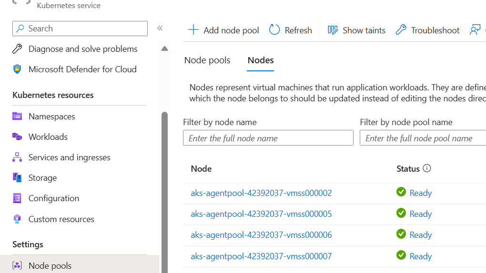
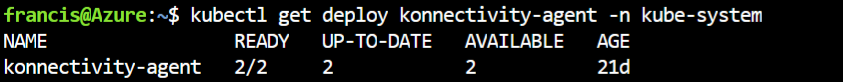
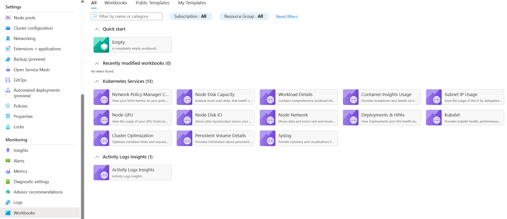
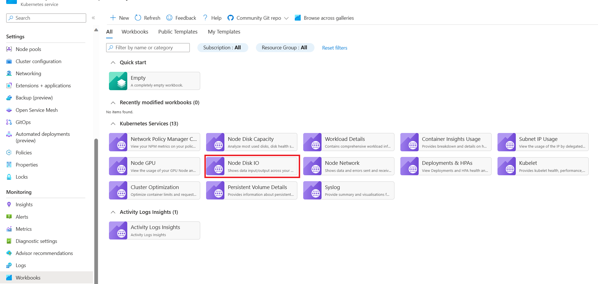

# Examine the node and pod health

If the cluster checks are clear, check the health of the AKS worker nodes. Determine the reason for the unhealthy node and resolve the issue.

_This article is part of a series. Read the introduction [here](aks-triage-practices.md)._

## 1- Check the overall health of the worker nodes

A node can be unhealthy because of various reasons. A common reason is when the control plane to node communication is broken as a result of misconfiguration of routing and firewall rules. As a fix, you can allow the necessary ports and fully qualified domain names through the firewall according to the [AKS egress traffic guidance](/azure/aks/limit-egress-traffic). Another reason can be kubelet pressures. In that case, add more compute, memory, or storage resources.

In private clusters, control plane communication may be broken due to DNS resolution issues as well. You can check if the Kubernetes API server DNS name resolves to the private IP of the API server. One common cause of DNS resolution failure is misconfiguration of custom DNS server. Please check if the custom DNS servers are specified on the VNET where nodes are provisioned, and if custom DNS server is used, please ensure that AKS private API server resolves through the custom DNS server. 

**Tools:**

You can check node health in one of these ways:

- **AKS - Nodes view:** In Azure portal, open navigate to the cluster. Select **Nodepools** under **Settings**. View **Nodes** on the right pane.
  


- **Prometheus and Grafana Dashboard**. Open the **Node Conditions** dashboard.


- **Azure Monitor - Containers health view**. In Azure portal, open Azure Monitor. Select **Containers**.  On the right pane, select **Monitored clusters**. Select the cluster to view the health of the nodes, user pods, and system pods.

    


## 2- Verify the control plane and worker node connectivity

If worker nodes are healthy, examine the connectivity between the managed AKS control plane and the worker nodes. The connectivity pod in Azure Kubernetes Service is **konnectivity-agent**. Older versions of the cluster may use **tunnelfront** or **aks-link** instead of **konnectivity-agent**. 

**Tools:**

- `kubectl`
- Azure Monitor container insights



If control plane and worker node connectivity is not working, establish connectivity after checking that the appropriate AKS egress traffic rules have been allowed. Please check [/azure-kubernetes/tunnel-connectivity-issues](tunnel connectivity issues) for common issues.  Here are the steps:

1. Restart **konnectivity-agent**.

   ```bash
   kubectl rollout restart deploy konnectivity-agent -n kube-system
   ```

   If restarting the pods doesn't fix the connection, continue to the next step.

2. Check the logs and look for abnormalities. This output shows logs for a working connection.

   ```bash
   kubectl logs -l app=konnectivity-agent -n kube-system --tail=50
   ```

   

You can also retrieve those logs by searching the container logs in the logging and monitoring service. Please see [Azure container insights log search](/azure/azure-monitor/insights/container-insights-log-search) for details.

## 3- Validate DNS resolution when restricting egress

DNS resolution is a critical component of your cluster. If DNS resolution isn't working, then control plane errors or container image pull failures may occur.

**Tools:**

- `nslookup`
- `dig`

Follow these steps to make sure that DNS resolution to the Kubernetes API server is working.

1. Exec into the pod to examine and use `nslookup` or `dig` if those tools are installed on the pod.
2. If the pod doesn't have those tools, start a utility pod in the same namespace and retry with the tools to resolve the AKS API server. An example of utility pod  is provided [in this article](/azure-kubernetes/troubleshoot-dns-failure-from-pod-but-not-from-worker-node).
3. If those steps don't show insights, [/aks/node-access#create-an-interactive-shell-connection-to-a-linux-node](connect to one of the nodes) and try resolution from there. This step will help determine if the issue is related to AKS related or networking configuration.
4. If DNS resolves from the node but not from the pod, the issue may be related to Kubernetes DNS. [This article](/azure-kubernetes/troubleshoot-dns-failure-from-pod-but-not-from-worker-node) provides steps to debug DNS resolution from the pod. 
5. If DNS doesn't resolve from the node, then check the networking setup to make sure that the appropriate routing paths and ports are open.

## 4- Check for kubelet errors

Check the kubelet process running on each worker node and make sure it's not experiencing any pressures. Those pressures can be related to CPU, memory, or storage.

**Tools:**

- **AKS - Kubelet Workbook**


- **Prometheus and Grafana Dashboard:** Kubelet Dashboard
  


The pressure increases when kubelet restarts and causes some sporadic, unpredictable behavior. Make sure that the error count isn't continuously growing. An occasional error is acceptable but a constant growth indicates an underlying issue that needs to be investigated and resolved.

## 5- Check disk IOPS for throttling

Check to see that file operations (IOPS) are not getting throttled and impacting services in the cluster.

**Tools:**

- **[Azure Monitor container insights Disk IO Workbook](/azure/azure-monitor/insights/container-insights-analyze#workbooks)**

    

- **Prometheus and Grafana Dashboard:** Node Disk Dashboard
  
    

Physical storage devices have limitations, bandwidth, and total number of file operations. Azure Disks are used to store the OS running on the AKS nodes. They are subject to the same physical storage limitations.

Another way is to look at the throughput. IOPSs is measured with the average IO size * IOPS as the throughput in MB/s. Large IO sizes will lead to lower IOPS because the throughput of a disk doesn't change.

When a workload exceeds Azure Disks' service limits on Max IOPS, the cluster becomes unresponsive and blocked in IO Wait. Everything on Linux is a file. This includes network sockets, CNI, Docker, and other services that use network I/O. All of those files will fail if they're unable to read the disk.

The events that can trigger IOPS throttle include:

- High volume of containers running on the nodes. Docker IO is shared on the OS disk.
- Custom or third-party tools used for security, monitoring, logging that are running on the OS disk.
- Node failover events, and periodic jobs. As the load increases or the pods are scaled, this throttling occurs more frequently until all nodes go to **NotReady** state while the IO completes.

## Related links

[Virtual machine disk limits](/azure/azure-resource-manager/management/azure-subscription-service-limits#virtual-machine-disk-limits)

[Relationship between Virtual Machine and Disk Performance](/azure/virtual-machines/linux/disk-performance-linux)

## Next steps

> [!div class="nextstepaction"]
> [Check the workload deployments](aks-triage-deployment.md)
