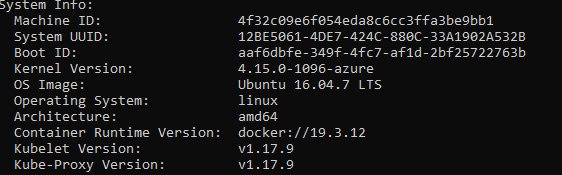
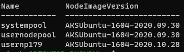
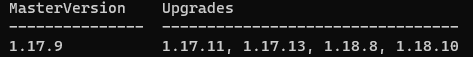
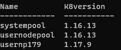

# Best practices for Patching and Upgrading Clusters

This section will talk about AKS patching and upgrading practices, and who is responsible for what (shared responsibility). This includes the worker nodes along with Kubernetes versions.

## Considerations
 | Scenario                  | Customer Initiated? | K8S Upgraded? | OS Kernel Upgraded?    | Node Image Upgraded? | Available Today (12/08)?  | Notes                                                                                                                                                                                              |
|---------------------------|---------------------|---------------|------------------------|----------------------|--------------------------|----------------------------------------------------------------------------------------------------------------------------------------------------------------------------------------------------|
| Security patching         | No                  | No            | Yes, following reboot  | No                   | Yes                      | https://help.ubuntu.com/community/AutomaticSecurityUpdates                                                                                                                                         |
|                           |                     |               |                        |                      |                          | https://docs.microsoft.com/azure/aks/node-updates-kured                                                                                                                                      |
| Cluster create            | Yes                 | Maybe         | Maybe                  | Maybe                | Yes                      | The node image will be upgraded relative to an existing cluster if a new release is available.                                                                                                     |
|                           |                     |               |                        |                      |                          | The OS kernel will be upgraded if an updated node image is released and it uses an updated kernel.                                                                                                 |
| Control plane k8s upgrade | Yes                 | Yes           | No                     | No                   | Yes                      | Upgrading the k8s version on the control plane only does not upgrade the OS kernel or node image.                                                                                                  |
| Node pool k8s upgrade     | Yes                 | Yes           | Maybe                  | Maybe                | Yes                      | The node image will be upgraded if a new release is available.                                                                                                                                     |
|                           |                     |               |                        |                      |                          | The OS kernel will be upgraded if an updated node image is released and it uses an updated kernel.                                                                                                 |
| Node pool scale up        | Yes                 | No            | No                     | No                   | Yes                      | Node scale up uses the model associated with the VMSS when it was created.  The OS kernel will get upgraded once security patches are applied the node is rebooted.                                |
| Node image upgrade        | Yes                 | No            | Maybe                  | Yes                  | Yes                       | The OS kernel will be upgraded if an updated node image is released and it uses an updated kernel.  The agent pool get upgrade profile API can be used to determine the latest node image version.                                                                                                                                                                                                                                                          
| Node image auto upgrade   | No                  | No            | Maybe                  | Yes                  | No                       | The OS kernel will be upgraded if an updated node image is released and it uses an updated kernel.                                                                                                 |
|                           |                     |               |                        |                      |                          | Planned - https://github.com/Azure/AKS/issues/1486                                                                                                                                                 |
| Cluster auto upgrade      | No                  | Yes           | No                     | No                   | No                       | In Progress - https://github.com/Azure/AKS/issues/1303                                                                                                                                             |


## Patching AKS worker nodes
* Security patches are applied daily and they are retrieved directly from Ubuntu.
    * https://help.ubuntu.com/community/AutomaticSecurityUpdates. 
    * To protect your clusters, security updates are automatically applied to Linux nodes in AKS, see [process node OS updates](https://docs.microsoft.com/azure/aks/node-updates-kured). These updates include OS security fixes or kernel updates. Some of these updates require a node reboot to complete the process. AKS doesn't automatically reboot these Linux nodes to complete the update process.
    * Check for the "/var/run/reboot-required" flag on your worker node to see if a reboot is needed.
    * The [kured](https://docs.microsoft.com/azure/aks/node-updates-kured) daemon set will do this for you automatically.
* Use “kubectl describe node …” to check the OS kernel version and the OS image version.

    
* It’s possible that a security patch will install a later version of the kernel than would be seen if a new cluster is created.
* The process to keep Windows Server nodes up to date is a little different. Windows Server nodes don't receive daily updates. Instead, you perform an AKS upgrade that deploys new nodes with the latest base Window Server image and patches. For AKS clusters that use Windows Server nodes, see [Upgrade a node pool in AKS](https://docs.microsoft.com/azure/aks/use-multiple-node-pools#upgrade-a-node-pool).
* Consider patching your AKS worker nodes if you want all the OS updates applied immediately as they are released and depending on the release cycle of node image upgrades is not an option.


## Node Image Upgrades

 * An updated node image will contain up to date security patches, but may also contain other updates, such as newer versions of the components listed in the [release notes](https://github.com/Azure/AKS/releases). 
 * These updates have all relevant and validated security updates, feature updates or both.
 * Using the node image upgrade method will provide a way to ensure that all of your AKS nodes have the very latest components installed on them.
 * Considering checking and applying node image upgrades weekly.

* GET latest available Node Image version
    * ```
       az aks nodepool get-upgrades --nodepool-name nodepoolname -g cluster-resource-group --cluster-name aks-cluster-name -o table
      ```
    * 
* Check the current NodeImage versions of the nodepool(s) in your cluster
    * ```
      az aks nodepool list --query "[].{Name:name,NodeImageVersion:nodeImageVersion}" -g rg-cluster --cluster-name aks-cluster-name -o table
    
    * 
* Upgrade Nodepools to the latest node image version
    * [Upgrade all nodes in node pools](https://docs.microsoft.com/azure/aks/node-image-upgrade#upgrade-all-nodes-in-all-node-pools)
    * [Upgrade a specific node pool](https://docs.microsoft.com/azure/aks/node-image-upgrade#upgrade-a-specific-node-pool)
    * [Upgrade node pool using Github Actions](https://docs.microsoft.com/azure/aks/node-upgrade-github-actions)


## Create continuous cluster upgrade process
Information about new AKS versions and releases are published to the [AKS Github release notes page](https://github.com/Azure/AKS/releases). You can also subscribe to the [Github RSS Feed](https://github.com/Azure/AKS/releases.atom). The release notes page has information about the latest AKS features, behavioral changes, Bug fixes and Component Updates.

To proactively receive updates about AKS upgrades, we recommend using the following methods:

* Check when an upgrade is required for your cluster
    * Get list of available target upgrade versions for your AKS Control Plane Upgrades
        * ` az aks get-upgrades --resource-group myResourceGroup --name myAKSCluster --output table `
        
    * Determine the target version for the control plane from the above results.
    * Then check the kubernetes versions of the nodes in your nodepools and determine if the cluster's node pools need to be upgraded too
        * `az aks nodepool list --query "[].{Name:name,k8version:orchestratorVersion}" -g rg-cluster --cluster-name aks-cluster-name -o table`
        


* Once a new version becomes available, you should ideally plan an upgrade across all environments before the version becomes the default. This approach provides more control and predictability when needed, and plan upgrades with minimal disruption to existing workloads.
* Upgrade the AKS  control plane first to the target version
   * Issuing the az aks upgrade command with the --control-plane-only flag upgrades only the cluster control plane. 
   * None of the associated node pools in the cluster are changed.
   * [Validation rules for cluster upgrades](https://docs.microsoft.com/azure/aks/use-multiple-node-pools#validation-rules-for-upgrades)
   * ```
        az aks upgrade \
        --resource-group myResourceGroup \  
        --name myAKSCluster \ 
        --control-plane-only \  
        --kubernetes-version KUBERNETES_VERSION \  
        --no-wait
     ```
* Upgrade the nodepools to the target version
    ```
    az aks nodepool upgrade \
    --resource-group myResourceGroup \
    --cluster-name myAKSCluster \
    --name mynodepool \
    --kubernetes-version KUBERNETES_VERSION \
    --no-wait
    ```

## Minimize disruption to existing workloads during an upgrade
* Plan and schedule maintenance windows.
* [Plan your tolerance for disruption.](https://kubernetes.io/docs/tasks/run-application/configure-pdb/)
* [Use surge upgrades to control nodepool upgrades.](https://docs.microsoft.com/azure/aks/upgrade-cluster#customize-node-surge-upgrade)

## Next Steps

[AKS Roadmap](https://aka.ms/aks/roadmap)  
[AKS Product Documentation](/azure/aks)