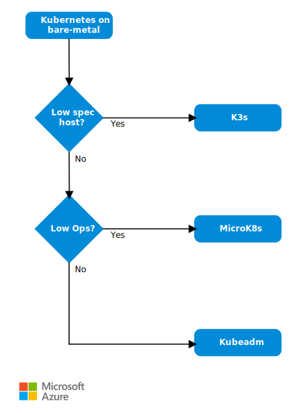

If you're looking to run Kubernetes at the edge and notice that managed
solutions aren't quite meeting your requirements, you may be [exploring bare-metal as an option](./choose-kubernetes-edge-compute-option.md). This document helps you find the best available option for your use case when configuring Kubernetes clusters at the edge.

> [!NOTE]
> This article is not an exhaustive comparison; rather, it presents potential paths for making decisions based on major qualifiers between common options.

## Decision tree for bare-metal Kubernetes at the edge

Reference the following tree when deciding between the options presented below for bare-metal Kubernetes at the edge.

*Download a [Visio file](https://arch-center.azureedge.net/choose-bare-metal-kubernetes.vsdx) of this flowchart*

-   [MicroK8s](https://microk8s.io/docs): Conformant "Low Ops" Kubernetes by Canonical

-   [K3s](https://k3s.io): Certified Kubernetes distribution built for IoT and edge computing

-   [kubeadm](https://kubernetes.io/docs/reference/setup-tools/kubeadm): Kubernetes tool for creating ground-up Kubernetes clusters; good for standard compute (Linux/Windows)

> [!NOTE]
> *Low Ops* refers to the decreased cost of operations when some operational tasks are abstracted or made easier, like auto updates or simplified upgrades.

## MicroK8s by Canonical

MicroK8s is delivered as a single **snap** package that can be easily installed on Linux machines with snap support. Alternative installs are available for Windows, macOS, and raspberry PI/ARM. When installed, MicroK8s creates a single-node cluster, which can be managed with the MicroK8s tooling. It's packaged with its own kubectl, and certain add-ons may be enabled (for example, helm, dns, ingress, metallb, and [more](https://microk8s.io/docs/addons#heading--list)). Multinode, Windows nodes, and high-availability (HA) scenarios are also supported.

### Considerations:

-   There are various resource requirements depending on where you want to run MicroK8s. Reference the [product docs](https://microk8s.io/docs) for minimum resource requirements. For example:

    -   Ubuntu: 4-GB RAM, 20-GB disk space

    -   Windows: 4-GB RAM, 40-GB disk space

-   Windows workloads are only supported for MicroK8s clusters with Calico CNI.

-   Each node on a MicroK8s multinode cluster requires its own environment to work in, whether that is a separate VM or container on a single machine or a different machine on the same network.

-   Difficulties may crop up when running MicroK8s on some ARM hardware. Reference the [docs](https://microk8s.io/docs/install-alternatives#heading--arm) for potential remedies.

## K3s by Rancher

K3s is a lightweight distribution of Kubernetes. K3s is deployed as a single binary and comes with embedded tools such as kubectl and ctr, similar to MicroK8s.

### Considerations:

-   The binary is less than 100 MB, but there are still minimum resource requirements depending on your scenario. Reference the [docs](https://rancher.com/docs/k3s/latest/en/installation/installation-requirements/resource-profiling/) for minimum resource requirements.

-   SQLite3 is the default storage system, though [other options](https://rancher.com/docs/k3s/latest/en/installation/datastore/) are supported.

-   Windows nodes aren't currently supported for K3s.

-   HA can be achieved with either an [external database](https://rancher.com/docs/k3s/latest/en/installation/ha/) or an [embedded database](https://rancher.com/docs/k3s/latest/en/installation/ha-embedded/). K3s has added full support for embedded etcd as of release v1.19.5+k3s1.

## kubeadm

Kubeadm is a plain vanilla installation of Kubernetes from the ground up.

### Considerations:

-   Requires 2 GiB (gibibytes) or more of RAM per machine.

-   Requires at least 2 CPUs on control-plane node.

-   The control-plane node must be a machine running a deb/rpm-compatible Linux OS.

-   [The Kubernetes version and version skew support policy](https://kubernetes.io/docs/setup/release/version-skew-policy/#supported-versions) applies to _kubeadm_ and to Kubernetes overall. Check that policy to learn about what versions of Kubernetes and kubeadm are supported.

## Management/Automation

When it comes to automation and management of the provisioning of bare-metal clusters, there are a couple of options to explore: Ansible and Metal3.

[Ansible](https://docs.ansible.com) provides an easy way to manage remote resources and therefore is a prime candidate to manage and join remote nodes to a Kubernetes cluster. All you need is the Ansible binary, running on a Linux machine, and SSH on remote machines. This method provides a flexible mechanism to run arbitrary scripts on target machines, which means you could use Ansible with any of the tools mentioned above.

[Metal3](https://metal3.io/documentation.html) takes a different approach to solve this problem by utilizing similar concepts to [Cluster API](https://cluster-api.sigs.k8s.io). You'll need to instantiate an ephemeral cluster to provision and manage bare-metal clusters using native Kubernetes objects. At the time of writing, Metal3 uses kubeadm and therefore doesn't support lightweight Kubernetes distributions.

For management beyond cluster provisioning, consider learning about [Azure Arc](/azure/azure-arc)–enabled clusters to manage your clusters in Azure.

## Next steps

For more information, see the following articles:

-   [Reference implementation](https://github.com/Azure-Samples/k8s-on-windows-host)

-   [What is Azure IoT Edge](/azure/iot-edge/about-iot-edge)

-   [Introduction to Kubernetes on Azure](/training/paths/intro-to-kubernetes-on-azure/)

-   [Kubernetes on your Azure Stack Edge Pro GPU device](/azure/databox-online/azure-stack-edge-gpu-kubernetes-overview)

## Related resources

-   [Choosing a Kubernetes at the edge compute option](./choose-kubernetes-edge-compute-option.md)

-   [Baseline architecture for an Azure Kubernetes Service (AKS) cluster](/azure/architecture/reference-architectures/containers/aks/baseline-aks)

-   [Microservices architecture on Azure Kubernetes Service (AKS)](../../reference-architectures/containers/aks-microservices/aks-microservices.yml)

-   [AI at the edge with Azure Stack Hub](../../solution-ideas/articles/ai-at-the-edge.yml)

-   [Building a CI/CD pipeline for microservices on Kubernetes](../../microservices/ci-cd-kubernetes.yml)
