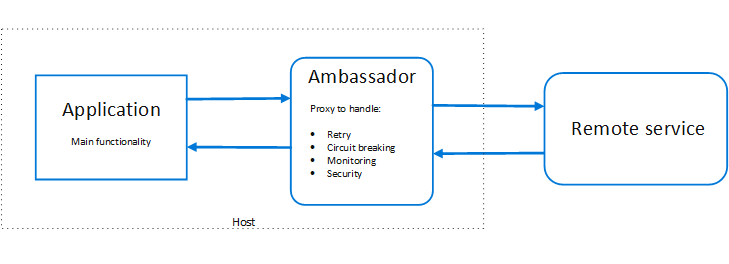
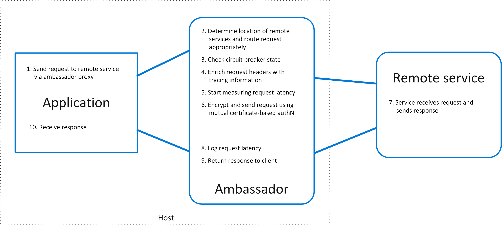

# Ambassador pattern

Create helper services that send network requests on behalf of a consumer service or application. An ambassador service can be thought of as an out-of-process proxy that is co-located with the client.

This pattern can be useful for offloading common client connectivity tasks such as monitoring, logging, routing, security (such as TLS), and [resiliency patterns][resiliency-patterns] in a language agnostic way. It is often used with legacy applications, or other applications that are difficult to modify, in order to extend their networking capabilities. It can also enable a specialized team to implement those features.

## Context and problem

Resilient cloud-based applications require features such as [circuit breaking](./circuit-breaker.md), routing, metering and monitoring, and the ability to make network-related configuration updates. It may be difficult or impossible to update legacy applications or existing code libraries to add these features, because the code is no longer maintained or can't be easily modified by the development team.

Network calls may also require substantial configuration for connection, authentication, and authorization. If these calls are used across multiple applications, built using multiple languages and frameworks, the calls must be configured for each of these instances. In addition, network and security functionality may need to be managed by a central team within your organization. With a large code base, it can be risky for that team to update application code they aren't familiar with.

## Solution

Put client frameworks and libraries into an external process that acts as a proxy between your application and external services. Deploy the proxy on the same host environment as your application to allow control over routing, resiliency, security features, and to avoid any host-related access restrictions. You can also use the ambassador pattern to standardize and extend instrumentation. The proxy can monitor performance metrics such as latency or resource usage, and this monitoring happens in the same host environment as the application.

Features that are offloaded to the ambassador can be managed independently of the application. You can update and modify the ambassador without disturbing the application's legacy functionality. It also allows for separate, specialized teams to implement and maintain security, networking, or authentication features that have been moved to the ambassador.

Ambassador services can be deployed as a [sidecar](./sidecar.md) to accompany the lifecycle of a consuming application or service. Alternatively, if an ambassador is shared by multiple separate processes on a common host, it can be deployed as a daemon or Windows service. If the consuming service is containerized, the ambassador should be created as a separate container on the same host, with the appropriate links configured for communication.

## Issues and considerations

- The proxy adds some latency overhead. Consider whether a client library, invoked directly by the application, is a better approach.
- Consider the possible impact of including generalized features in the proxy. For example, the ambassador could handle retries, but that might not be safe unless all operations are idempotent.
- Consider a mechanism to allow the client to pass some context to the proxy, as well as back to the client. For example, include HTTP request headers to opt out of retry or specify the maximum number of times to retry.
- Consider how you will package and deploy the proxy.
- Consider whether to use a single shared instance for all clients or an instance for each client.

## When to use this pattern

Use this pattern when you:

- Need to build a common set of client connectivity features for multiple languages or frameworks.
- Need to offload cross-cutting client connectivity concerns to infrastructure developers or other more specialized teams.
- Need to support cloud or cluster connectivity requirements in a legacy application or an application that is difficult to modify.

This pattern may not be suitable:

- When network request latency is critical. A proxy will introduce some overhead, although minimal, and in some cases this may affect the application.
- When client connectivity features are consumed by a single language. In that case, a better option might be a client library that is distributed to the development teams as a package.
- When connectivity features cannot be generalized and require deeper integration with the client application.

## Example

The following diagram shows an application making a request to a remote service via an ambassador proxy. The ambassador provides routing, circuit breaking, and logging. It calls the remote service and then returns the response to the client application:

## Related guidance

- [Sidecar pattern](./sidecar.md)

<!-- links -->

[resiliency-patterns]: ./category/resiliency.md
