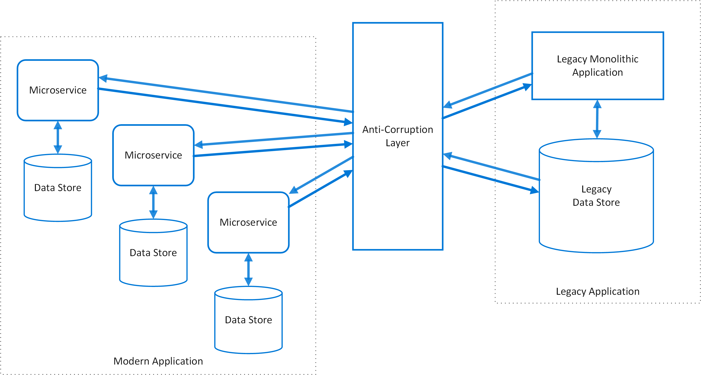

# Anti-Corruption Layer

Use an Anti-Corruption Layer pattern to ensure the design and structure of new apps and services are not limited by legacy resources they may still depend on. This pattern implements a façade or adapter layer in between legacy systems and modern systems where features and capabilities are being migrated to. This façade or layer translates requests between modern systems and legacy application using methods appropriate to each. 

## Context and Problem

Most applications rely on other systems for some data or functionality. For example, when migrating an application from a legacy to modern system, there may be existing legacy resources that are still needed by the modern application. New features need to support making requests to a legacy system, while also maintaining their ability to call resources within a modern system. This is especially true of gradual migrations, where different features of a larger application are moved to a modern system over time.

Legacy systems commonly suffer quality issues such as convoluted data schema or obsolete API. Features and technologies used in legacy systems can vary widely from more modern systems, and the new system may need to continue to support outdated Infrastructure, protocols, data models, API support, or any number of other features that don't make sense for a modern system to support.

Maintaining access between new and legacy systems can force the new system to adhere to at least some of the legacy system's APIs or other semantics. When these legacy features have quality issues, supporting them "corrupts" what might otherwise be a cleanly designed modern application. 

## Solution

Isolate the legacy and modern systems by placing an Anti-Corruption layer between them. This layer will act to translate communications between the two systems, allowing the legacy application to remain unchanged while the modern application can avoid compromising its design and technological approach in order to use legacy resources.

 

Communication between the modern applications and the anti-corruption layer will always be using the modern data model or architecture. Calls to the legacy application made from the anti-corruption layer are all consistent with the legacy data model or methods. The layer contains all of the logic necessary to translate between the two systems.

## Issues and Considerations

- Implementing an anti-corruption layer may add latency to calls made between the legacy and modern applications
- Note that adding an anti-corruption layer adds an additional service/application that needs to be managed and maintained.
- Consider how your anti-corruption layer will scale.
- Will you potentially need more than one anti-corruption layer? Decomposition of functionality into multiple services using different technologies or languages, or other partitioning requirements may make separate anti-corruption layers desirable.
- How will the anti-corruption layer be managed in relation with your other applications or services. How will it be integrated into your monitoring, release, and configuration processes?
- Make sure transaction and data consistency are maintained and capable of being monitored.
- Does the anti-corruption need to handle all communication between legacy and modern systems, or does it only need to translate for a subset of features? 
- Is the anti-corruption layer meant to be permanent, or is it meant to be retired once all legacy functionality Is migrated?
- Will the anti-corruption layer be implemented as a library/component, or as an independent service?

## When to Use this Pattern

Use this pattern when:

- When a migration is planned to happen over multiple stages, but integration between new and legacy systems needs to be maintained.
- When new and legacy system have different semantics, but still need to communicate.

This pattern may not be suitable:

- When there’s no significant differences in semantics between new and legacy systems. 

## Related guidance

- Strangler

