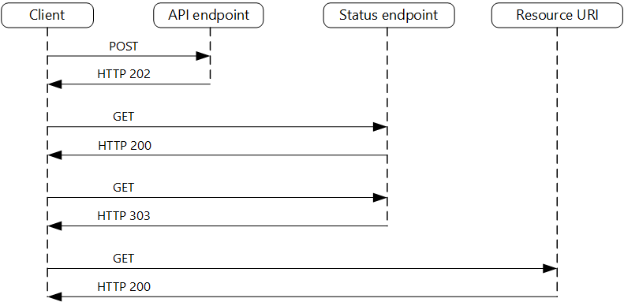

Decouple backend processing from a frontend host, where backend processing needs to be asynchronous, but the frontend still needs a clear response.

## Context and problem

In modern application development, it's normal for client applications &mdash; often code running in a web-client (browser) &mdash; to depend on remote APIs to provide business logic and compose functionality. These APIs may be directly related to the application or may be shared services provided by a third party. Commonly these API calls take place over the HTTP(S) protocol and follow REST semantics.

In most cases, APIs for a client application are designed to respond quickly, on the order of 100 ms or less. Many factors can affect the response latency, including:

- An application's hosting stack.
- Security components.
- The relative geographic location of the caller and the backend.
- Network infrastructure.
- Current load.
- The size of the request payload.
- Processing queue length.
- The time for the backend to process the request.

Any of these factors can add latency to the response. Some can be mitigated by scaling out the backend. Others, such as network infrastructure, are largely out of the control of the application developer. Most APIs can respond quickly enough for responses to arrive back over the same connection. Application code can make a synchronous API call in a non-blocking way, giving the appearance of asynchronous processing, which is recommended for I/O-bound operations.

In some scenarios, however, the work done by backend may be long-running, on the order of seconds, or might be a background process that is executed in minutes or even hours. In that case, it isn't feasible to wait for the work to complete before responding to the request. This situation is a potential problem for any synchronous request-reply pattern.

Some architectures solve this problem by using a message broker to separate the request and response stages. This separation is often achieved by use of the [Queue-Based Load Leveling pattern](./queue-based-load-leveling.yml). This separation can allow the client process and the backend API to scale independently. But this separation also brings additional complexity when the client requires success notification, as this step needs to become asynchronous.

Many of the same considerations discussed for client applications also apply for server-to-server REST API calls in distributed systems &mdash; for example, in a microservices architecture.

## Solution

One solution to this problem is to use HTTP polling. Polling is useful to client-side code, as it can be hard to provide call-back endpoints or use long running connections. Even when callbacks are possible, the extra libraries and services that are required can sometimes add too much extra complexity.

- The client application makes a synchronous call to the API, triggering a long-running operation on the backend.

- The API responds synchronously as quickly as possible. It returns an HTTP 202 (Accepted) status code, acknowledging that the request has been received for processing.

    > [!NOTE]
    > The API should validate both the request and the action to be performed before starting the long running process. If the request is invalid, reply immediately with an error code such as HTTP 400 (Bad Request).

- The response holds a location reference pointing to an endpoint that the client can poll to check for the result of the long running operation.

- The API offloads processing to another component, such as a message queue.

- For every successful call to the status endpoint, it returns HTTP 200. While the work is still pending, the status endpoint returns a resource that indicates the work is still in progress. Once the work is complete, the status endpoint can either return a resource that indicates completion, or redirect to another resource URL. For example, if the asynchronous operation creates a new resource, the status endpoint would redirect to the URL for that resource.

The following diagram shows a typical flow:



1. The client sends a request and receives an HTTP 202 (Accepted) response.
2. The client sends an HTTP GET request to the status endpoint. The work is still pending, so this call returns HTTP 200.
3. At some point, the work is complete and the status endpoint returns 302 (Found) redirecting to the resource.
4. The client fetches the resource at the specified URL.

## Issues and considerations

- There are a number of possible ways to implement this pattern over HTTP and not all upstream services have the same semantics. For example, most services won't return an HTTP 202 response back from a GET method when a remote process hasn't finished. Following pure REST semantics, they should return HTTP 404 (Not Found). This response makes sense when you consider the result of the call isn't present yet.

- An HTTP 202 response should indicate the location and frequency that the client should poll for the response. It should have the following additional headers:

    | Header | Description | Notes |
    | --- | --- | --- |
    | Location| A URL the client should poll for a response status. | This URL could be a SAS token with the [Valet Key Pattern](./valet-key.yml) being appropriate if this location needs access control. The valet key pattern is also valid when response polling needs offloading to another backend |
    | Retry-After | An estimate of when processing will complete | This header is designed to prevent polling clients from overwhelming the back-end with retries. |

- You may need to use a processing proxy or facade to manipulate the response headers or payload depending on the underlying services used.

- If the status endpoint redirects on completion, either [HTTP 302](https://tools.ietf.org/html/rfc7231#section-6.4.3) or [HTTP 303](https://tools.ietf.org/html/rfc7231#section-6.4.4) are appropriate return codes, depending on the exact semantics you support.

- Upon successful processing, the resource specified by the Location header should return an appropriate HTTP response code such as 200 (OK), 201 (Created), or 204 (No Content).

- If an error occurs during processing, persist the error at the resource URL described in the Location header and ideally return an appropriate response code to the client from that resource (4xx code).

- Not all solutions will implement this pattern in the same way and some services will include additional or alternate headers. For example, Azure Resource Manager uses a modified variant of this pattern. For more information, see [Azure Resource Manager Async Operations](/azure/azure-resource-manager/resource-manager-async-operations).

- Legacy clients might not support this pattern. In that case, you might need to place a facade over the asynchronous API to hide the asynchronous processing from the original client. For example, Azure Logic Apps supports this pattern natively can be used as an integration layer between an asynchronous API and a client that makes synchronous calls. See [Perform long-running tasks with the webhook action pattern](/azure/logic-apps/logic-apps-create-api-app#perform-long-running-tasks-with-the-webhook-action-pattern).

- In some scenarios, you might want to provide a way for clients to cancel a long-running request. In that case, the backend service must support some form of cancellation instruction.

## When to use this pattern

Use this pattern for:

- Client-side code, such as browser applications, where it's difficult to provide call-back endpoints, or the use of long-running connections adds too much additional complexity.

- Service calls where only the HTTP protocol is available and the return service can't fire callbacks because of firewall restrictions on the client-side.

- Service calls that need to be integrated with legacy architectures that don't support modern callback technologies such as WebSockets or webhooks.

This pattern might not be suitable when:

- You can use a service built for asynchronous notifications instead, such as Azure Event Grid.
- Responses must stream in real time to the client.
- The client needs to collect many results, and received latency of those results is important. Consider a service bus pattern instead.
- You can use server-side persistent network connections such as WebSockets or SignalR. These services can be used to notify the caller of the result.
- The network design allows you to open up ports to receive asynchronous callbacks or webhooks.

## Example

The following code shows excerpts from an application that uses Azure Functions to implement this pattern. There are three functions in the solution:

- The asynchronous API endpoint.
- The status endpoint.
- A backend function that takes queued work items and executes them.


 This sample is available on [GitHub](https://github.com/mspnp/cloud-design-patterns/tree/master/async-request-reply).

### AsyncProcessingWorkAcceptor function

The `AsyncProcessingWorkAcceptor` function implements an endpoint that accepts work from a client application and puts it on a queue for processing.

- The function generates a request ID and adds it as metadata to the queue message.
- The HTTP response includes a location header pointing to a status endpoint. The request ID is part of the URL path.

```csharp
public static class AsyncProcessingWorkAcceptor
{
    [FunctionName("AsyncProcessingWorkAcceptor")]
    public static async Task<IActionResult> Run(
        [HttpTrigger(AuthorizationLevel.Anonymous, "post", Route = null)] CustomerPOCO customer,
        [ServiceBus("outqueue", Connection = "ServiceBusConnectionAppSetting")] IAsyncCollector<ServiceBusMessage> OutMessages,
        ILogger log)
    {
        if (String.IsNullOrEmpty(customer.id) || string.IsNullOrEmpty(customer.customername))
        {
            return new BadRequestResult();
        }

        string reqid = Guid.NewGuid().ToString();

        string rqs = $"http://{Environment.GetEnvironmentVariable("WEBSITE_HOSTNAME")}/api/RequestStatus/{reqid}";

        var messagePayload = JsonConvert.SerializeObject(customer);
        var message = new ServiceBusMessage(messagePayload);
        message.ApplicationProperties.Add("RequestGUID", reqid);
        message.ApplicationProperties.Add("RequestSubmittedAt", DateTime.Now);
        message.ApplicationProperties.Add("RequestStatusURL", rqs);

        await OutMessages.AddAsync(message);

        return new AcceptedResult(rqs, $"Request Accepted for Processing{Environment.NewLine}ProxyStatus: {rqs}");
    }
}
```

### AsyncProcessingBackgroundWorker function

The `AsyncProcessingBackgroundWorker` function picks up the operation from the queue, does some work based on the message payload, and writes the result to a storage account.

```csharp
public static class AsyncProcessingBackgroundWorker
{
    [FunctionName("AsyncProcessingBackgroundWorker")]
    public static async Task RunAsync(
        [ServiceBusTrigger("outqueue", Connection = "ServiceBusConnectionAppSetting")] BinaryData customer,
        IDictionary<string, object> applicationProperties,
        [Blob("data", FileAccess.ReadWrite, Connection = "StorageConnectionAppSetting")] BlobContainerClient inputContainer,
        ILogger log)
    {
        // Perform an actual action against the blob data source for the async readers to be able to check against.
        // This is where your actual service worker processing will be performed

        var id = applicationProperties["RequestGUID"] as string;

        BlobClient blob = inputContainer.GetBlobClient($"{id}.blobdata");

        // Now write the results to blob storage.
        await blob.UploadAsync(customer);
    }
}
```

### AsyncOperationStatusChecker function

The `AsyncOperationStatusChecker` function implements the status endpoint. This function first checks whether the request was completed

- If the request was completed, the function either returns a valet-key to the response, or redirects the call immediately to the valet-key URL.
- If the request is still pending, then we should return a [200 code, including the current state](/azure/architecture/best-practices/api-design#asynchronous-operations).

```csharp
public static class AsyncOperationStatusChecker
{
    [FunctionName("AsyncOperationStatusChecker")]
    public static async Task<IActionResult> Run(
        [HttpTrigger(AuthorizationLevel.Anonymous, "get", Route = "RequestStatus/{thisGUID}")] HttpRequest req,
        [Blob("data/{thisGuid}.blobdata", FileAccess.Read, Connection = "StorageConnectionAppSetting")] BlockBlobClient inputBlob, string thisGUID,
        ILogger log)
    {

        OnCompleteEnum OnComplete = Enum.Parse<OnCompleteEnum>(req.Query["OnComplete"].FirstOrDefault() ?? "Redirect");
        OnPendingEnum OnPending = Enum.Parse<OnPendingEnum>(req.Query["OnPending"].FirstOrDefault() ?? "OK");

        log.LogInformation($"C# HTTP trigger function processed a request for status on {thisGUID} - OnComplete {OnComplete} - OnPending {OnPending}");

        // Check to see if the blob is present
        if (await inputBlob.ExistsAsync())
        {
            // If it's present, depending on the value of the optional "OnComplete" parameter choose what to do.
            return await OnCompleted(OnComplete, inputBlob, thisGUID);
        }
        else
        {
            // If it's NOT present, then we need to back off. Depending on the value of the optional "OnPending" parameter, choose what to do.
            string rqs = $"http://{Environment.GetEnvironmentVariable("WEBSITE_HOSTNAME")}/api/RequestStatus/{thisGUID}";

            switch (OnPending)
            {
                case OnPendingEnum.OK:
                    {
                        // Return an HTTP 200 status code.
                        return new OkObjectResult(new { status = "In progress", Location = rqs });
                    }

                case OnPendingEnum.Synchronous:
                    {
                        // Back off and retry. Time out if the backoff period hits one minute.
                        int backoff = 250;

                        while (!await inputBlob.ExistsAsync() && backoff < 64000)
                        {
                            log.LogInformation($"Synchronous mode {thisGUID}.blob - retrying in {backoff} ms");
                            backoff = backoff * 2;
                            await Task.Delay(backoff);
                        }

                        if (await inputBlob.ExistsAsync())
                        {
                            log.LogInformation($"Synchronous Redirect mode {thisGUID}.blob - completed after {backoff} ms");
                            return await OnCompleted(OnComplete, inputBlob, thisGUID);
                        }
                        else
                        {
                            log.LogInformation($"Synchronous mode {thisGUID}.blob - NOT FOUND after timeout {backoff} ms");
                            return new NotFoundResult();
                        }
                    }

                default:
                    {
                        throw new InvalidOperationException($"Unexpected value: {OnPending}");
                    }
            }
        }
    }

    private static async Task<IActionResult> OnCompleted(OnCompleteEnum OnComplete, BlockBlobClient inputBlob, string thisGUID)
    {
        switch (OnComplete)
        {
            case OnCompleteEnum.Redirect:
                {
                    // Redirect to the SAS URI to blob storage

                    return new RedirectResult(inputBlob.GenerateSASURI());
                }

            case OnCompleteEnum.Stream:
                {
                    // Download the file and return it directly to the caller.
                    // For larger files, use a stream to minimize RAM usage.
                    return new OkObjectResult(await inputBlob.DownloadContentAsync());
                }

            default:
                {
                    throw new InvalidOperationException($"Unexpected value: {OnComplete}");
                }
        }
    }
}

public enum OnCompleteEnum
{

    Redirect,
    Stream
}

public enum OnPendingEnum
{

    OK,
    Synchronous
}
```

## Next steps

The following information may be relevant when implementing this pattern:

- [Azure Logic Apps - Perform long-running tasks with the polling action pattern](/azure/logic-apps/logic-apps-create-api-app#perform-long-running-tasks-with-the-polling-action-pattern).
- For general best practices when designing a web API, see [Web API design](../best-practices/api-design.md).

## Related resources

- [Backends for Frontends pattern](./backends-for-frontends.yml)
