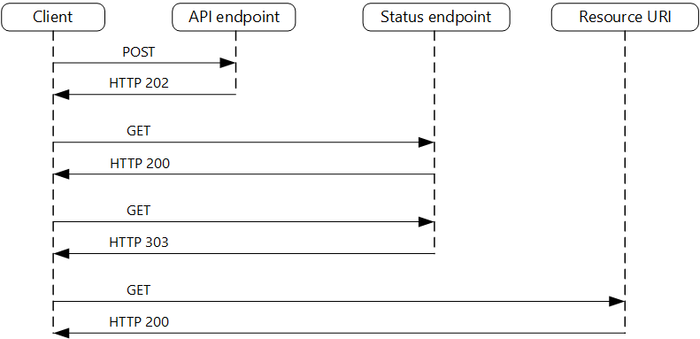
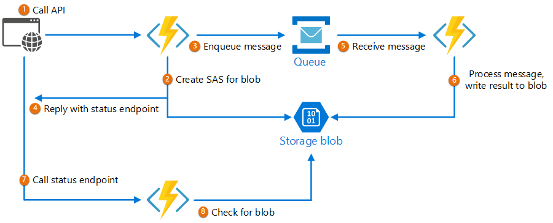

Decouple backend processing from a frontend host, where backend processing needs to be asynchronous, but the frontend still needs a clear response.

## Context and problem

In modern application development, it's normal for client applications &mdash; often code running in a web client (browser) &mdash; to depend on remote APIs to provide business logic and compose functionality. These APIs might be directly related to the application or might be shared services provided by a third party. Commonly these API calls take place over the HTTP(S) protocol and follow REST semantics.

In most cases, APIs for a client application are designed to respond quickly, on the order of 100 ms or less. Many factors can affect the response latency, including:

- An application's hosting stack.
- Security components.
- The relative geographic location of the caller and the backend.
- Network infrastructure.
- Current load.
- The size of the request payload.
- Processing queue length.
- The time for the backend to process the request.

Any of these factors can add latency to the response. Some can be mitigated by scaling out the backend. Others, such as network infrastructure, are largely out of the control of the application developer. Most APIs can respond quickly enough for responses to arrive back over the same connection. Application code can make a synchronous API call in a non-blocking way, giving the appearance of asynchronous processing, which is recommended for I/O-bound operations.

In some scenarios, however, the work done by the backend might be long-running, on the order of seconds, or might be a background process that is executed in minutes or even hours. In that case, it isn't feasible to wait for the work to complete before responding to the request. This situation is a potential problem for any synchronous request-reply pattern.

Some architectures solve this problem by using a message broker to separate the request and response stages. This separation often uses the [Queue-Based Load Leveling pattern](./queue-based-load-leveling.yml). This separation can allow the client process and the backend API to scale independently. But this separation also brings additional complexity when the client requires success notification, as this step needs to become asynchronous.

Many of the same considerations discussed for client applications also apply for server-to-server REST API calls in distributed systems &mdash; for example, in a microservices architecture.

## Solution

One solution to this problem is to use HTTP polling. Polling is useful to client-side code, as it can be hard to provide callback endpoints or use long running connections. Even when callbacks are possible, the extra libraries and services that are required can sometimes add too much extra complexity.

- The client application makes a synchronous call to the API, triggering a long-running operation on the backend.

- The API responds synchronously as quickly as possible. It returns an HTTP 202 (Accepted) status code, acknowledging that the request has been received for processing.

  > [!NOTE]
  > The API should validate both the request and the action to be performed before starting the long running process. If the request is invalid, reply immediately with an error code such as HTTP 400 (Bad Request).

- The response holds a location reference pointing to an endpoint that the client can poll to check for the result of the long running operation.

- The API offloads processing to another component, such as a message queue.

- For every successful call to the status endpoint, it returns HTTP 200. While the work is still pending, the status endpoint returns a resource that indicates the work is still in progress. The status response body should include enough information for the client to understand the current state of the operation.

  Once the work is complete, the status endpoint can either return a resource that indicates completion, or redirect to another resource URL. For example, if the asynchronous operation creates a new resource, the status endpoint would redirect to the URL for that resource.

The following diagram shows a typical flow:



1. The client sends a request and receives an HTTP 202 (Accepted) response.
2. The client sends an HTTP GET request to the status endpoint. The work is still pending, so this call returns HTTP 200.
3. At some point, the work is complete and the status endpoint returns 303 (See Other) redirecting to the resource.
4. The client fetches the resource at the specified URL.

## Issues and considerations

- There are multiple ways to implement this pattern over HTTP and not all upstream services have the same semantics. For example, some implementations don't use a separate status endpoint. Instead, the client polls the target resource URL directly and receives HTTP 404 (Not Found) until the resource is created. This response makes sense because the resource genuinely doesn't exist yet. However, this approach can be ambiguous if 404 is also returned for invalid request IDs. A dedicated status endpoint that returns HTTP 200 with a status body, as described in this pattern, avoids that ambiguity.

- An HTTP 202 response should indicate the location and frequency that the client should poll for the response. It should have the following additional headers:

  | Header | Description | Notes |
  | :----- | :---------- | :---- |
  | `Location` | A URL the client should poll for a response status. | This URL could be a SAS token with the [Valet Key Pattern](./valet-key.yml) being appropriate if this location needs access control. The valet key pattern is also valid when response polling needs offloading to another backend. |
  | `Retry-After` | An estimate of when processing will complete | This header is designed to prevent polling clients from overwhelming the back-end with retries. |

  Consider expected client behavior when designing this response. While a client under your control can be coded to respect these response values explicitly, clients that are not authored by you or use a no-code or low-code approach (such as Azure Logic Apps) are free to have their own HTTP 202 handling logic.

- Consider including the following fields in the status endpoint response:

  | Field | Description | Notes |
  | :---- | :---------- | :---- |
  | `status` | The current state of the operation, such as *Pending*, *Running*, *Succeeded*, *Failed*, or *Cancelled*. | Use a consistent, documented set of terminal and non-terminal values. |
  | `createdAt` | The time the operation was accepted. | Helps clients detect stale or abandoned operations. |
  | `lastUpdatedAt` | The time the status was last updated. | Lets clients distinguish a stalled operation from one that is actively progressing. |
  | `percentComplete` | An optional progress indicator. | Useful when the backend can meaningfully estimate progress. |
  | `error` | A structured error object when the status is *Failed*. | Consider using the [RFC 9457](https://www.rfc-editor.org/rfc/rfc9457) format for consistency. |

- You might need to use a processing proxy or façade to manipulate the response headers or payload depending on the underlying services you use.

- If the status endpoint redirects on completion, use [HTTP 303 (See Other)](https://www.rfc-editor.org/rfc/rfc9110#section-15.4.4). A 303 instructs the client to issue a GET request to the redirect URL, regardless of the original request method. This behavior is the correct semantic for this pattern because the client is retrieving a distinct result resource, not resubmitting the original operation. [HTTP 302 (Found)](https://www.rfc-editor.org/rfc/rfc9110#section-15.4.3) doesn't guarantee a method change &mdash; some clients replay the original method on redirect, which can cause unintended side effects such as duplicate POST requests.

- Upon successful processing, the resource specified by the Location header should return an appropriate HTTP response code such as 200 (OK), 201 (Created), or 204 (No Content).

- If an error occurs during processing, persist the error at the resource URL described in the Location header and return an appropriate response code to the client from that resource (4xx code). Use a structured error format such as [RFC 9457 (Problem Details for HTTP APIs)](https://www.rfc-editor.org/rfc/rfc9457) so that clients can parse and handle failures programmatically.

- The status resource and any stored results consume storage and compute. Define a retention policy to clean them up after a reasonable period, and consider communicating the retention window to clients through an `Expires` header on the status response.

- Not all solutions implement this pattern in the same way, and some services include additional or alternate headers. For example, Azure Resource Manager uses a modified variant of this pattern. For more information, see [Azure Resource Manager Async Operations](/azure/azure-resource-manager/management/async-operations).

- Legacy clients might not support this pattern. In that case, you might need to place a façade over the asynchronous API to hide the asynchronous processing from the original client. For example, Azure Logic Apps supports this pattern natively and can be used as an integration layer between an asynchronous API and a client that makes synchronous calls. See [Asynchronous request-response behavior in Azure Logic Apps](/azure/connectors/connectors-native-http#asynchronous-request-response-behavior).

- In some scenarios, you might want to provide a way for clients to cancel a long-running request. In that case, expose a DELETE operation on the status endpoint resource. This request should forward a cancellation instruction to the backend processing component. After the backend handles the cancellation, it should update the status resource to reflect the cancelled state. This process helps prevent incomplete work from consuming resources indefinitely. Consider whether the operation supports partial rollback or is best treated as a compensating transaction.

- Consider requiring clients to supply an idempotency key (for example, in an [`Idempotency-Key`](https://datatracker.ietf.org/doc/draft-ietf-httpapi-idempotency-key-header/) request header) when submitting the initial request. If the backend receives a duplicate key, it should return the existing status resource rather than enqueue a second work item. This approach protects against network failures that cause the client to retry a POST that the server already accepted. It's especially important in this pattern because the client has no way to distinguish a lost response from a request that was never received.

> [!NOTE]
> This pattern describes HTTP polling, where the client periodically issues new requests to check status. Long polling is a related but distinct technique: the client sends a request and the server holds the connection open until new data is available or a timeout occurs. Long polling reduces response latency compared to periodic polling but introduces complexity around connection management and timeouts.

## When to use this pattern

Use this pattern for:

- Client-side code, such as browser applications, where it's difficult to provide callback endpoints, or the use of long-running connections adds too much complexity.

- Service calls where only the HTTP protocol is available and the return service can't fire callbacks because of firewall restrictions on the client side.

- Service calls that need to be integrated with legacy architectures that don't support modern callback technologies such as WebSockets or webhooks.

This pattern might not be suitable when:

- You can use a service built for asynchronous notifications instead, such as Azure Event Grid.
- Responses must stream in real time to the client. Consider Server-Sent Events (SSE), which provide a lightweight, HTTP-native, unidirectional push channel from server to client without requiring the client to poll.
- The client needs to collect many results, and the latency when receiving those results is important. Consider using a message broker instead.
- You can use server-side persistent network connections such as WebSockets or SignalR. You can use these services to notify the caller of the result.
- The network design allows you to open up ports to receive asynchronous callbacks or webhooks.

## Workload design

An architect should evaluate how to use the Asynchronous Request-Reply pattern in their workload's design to address the goals and principles covered in the [Azure Well-Architected Framework pillars](/azure/well-architected/pillars). For example:

| Pillar | How this pattern supports pillar goals |
| :----- | :------------------------------------- |
| [Performance Efficiency](/azure/well-architected/performance-efficiency/checklist) helps your workload **efficiently meet demands** through optimizations in scaling, data, code. | Decoupling the request and reply phases of interactions for processes that don't need immediate answers improves the responsiveness and scalability of systems. As an asynchronous approach, you can maximize concurrency on the server side and schedule work to be completed as capacity allows.<br/><br/> - [PE:05 Scaling and partitioning](/azure/well-architected/performance-efficiency/scale-partition)<br/> - [PE:07 Code and infrastructure](/azure/well-architected/performance-efficiency/optimize-code-infrastructure) |

As with any design decision, consider any tradeoffs against the goals of the other pillars that might be introduced with this pattern.

## Example

The following code shows excerpts from an application that uses Azure Functions to implement this pattern. There are three functions in the solution:

- The asynchronous API endpoint.
- The status endpoint.
- A backend function that takes queued work items and executes them.



 This sample is available on [GitHub](https://github.com/mspnp/cloud-design-patterns/tree/main/async-request-reply).

The implementation uses managed identity to authenticate with Azure Service Bus and Azure Blob Storage, which avoids storing connection strings or account keys. Dependencies are registered in `Program.cs` using `DefaultAzureCredential` and injected through primary constructors.

### AsyncProcessingWorkAcceptor function

The `AsyncProcessingWorkAcceptor` function implements an endpoint that accepts work from a client application and puts it on a queue for processing.

- The function generates a request ID and adds it as metadata to the queue message.
- The HTTP response includes a `Location` header pointing to a status endpoint and a `Retry-After` header suggesting a polling interval. The request ID is part of the URL path.

```csharp
public class AsyncProcessingWorkAcceptor(ServiceBusClient _serviceBusClient)
{
    [Function("AsyncProcessingWorkAcceptor")]
    public async Task<IActionResult> Run(
        [HttpTrigger(AuthorizationLevel.Anonymous, "post", Route = null)] HttpRequest req,
        [FromBody] CustomerPOCO customer)
    {
        if (string.IsNullOrEmpty(customer.id) || string.IsNullOrEmpty(customer.customername))
        {
            return new BadRequestResult();
        }

        string requestId = Guid.NewGuid().ToString();

        string statusUrl = $"https://{Environment.GetEnvironmentVariable("WEBSITE_HOSTNAME")}/api/RequestStatus/{requestId}";

        var messagePayload = JsonConvert.SerializeObject(customer);
        var message = new ServiceBusMessage(messagePayload);
        message.ApplicationProperties.Add("RequestGUID", requestId);
        message.ApplicationProperties.Add("RequestSubmittedAt", DateTime.UtcNow);
        message.ApplicationProperties.Add("RequestStatusURL", statusUrl);

        var sender = _serviceBusClient.CreateSender("outqueue");
        await sender.SendMessageAsync(message);

        req.HttpContext.Response.Headers["Retry-After"] = "5";

        return new AcceptedResult(statusUrl, null);
    }
}
```

### AsyncProcessingBackgroundWorker function

The `AsyncProcessingBackgroundWorker` function picks up the operation from the queue, does some work based on the message payload, and writes the result to a storage account.

```csharp
public class AsyncProcessingBackgroundWorker(BlobContainerClient _blobContainerClient)
{
    [Function("AsyncProcessingBackgroundWorker")]
    public async Task Run(
        [ServiceBusTrigger("outqueue", Connection = "ServiceBusConnection")] ServiceBusReceivedMessage message)
    {
        // Perform an actual action against the blob data source for the async readers to be able to check against.
        // This is where your actual service worker processing will be performed

        var requestGuid = message.ApplicationProperties["RequestGUID"].ToString();

        var blobClient = _blobContainerClient.GetBlobClient($"{requestGuid}.blobdata");
        await blobClient.UploadAsync(message.Body.ToStream(), overwrite: true);
    }
}
```

### AsyncOperationStatusChecker function

The `AsyncOperationStatusChecker` function implements the status endpoint. This function checks whether the requested work has completed.

- If the result blob exists, the function returns HTTP 303 (See Other), redirecting the client to a valet-key URL for the result.
- If the result blob doesn't exist, the function returns a [200 status code with the current operation state](../best-practices/api-design.md#implement-asynchronous-methods).

```csharp
public class AsyncOperationStatusChecker(ILogger<AsyncOperationStatusChecker> _logger)
{
    [Function("AsyncOperationStatusChecker")]
    public async Task<IActionResult> Run(
        [HttpTrigger(AuthorizationLevel.Anonymous, "get", Route = "RequestStatus/{requestId}")] HttpRequest req,
        [BlobInput("data/{requestId}.blobdata", Connection = "DataStorage")] BlockBlobClient inputBlob, string requestId)
    {
        OnCompleteEnum OnComplete = Enum.Parse<OnCompleteEnum>(req.Query["OnComplete"].FirstOrDefault() ?? "Redirect");
        OnPendingEnum OnPending = Enum.Parse<OnPendingEnum>(req.Query["OnPending"].FirstOrDefault() ?? "OK");

        _logger.LogInformation("Received status request for {RequestId} - OnComplete {OnComplete} - OnPending {OnPending}",
            requestId, OnComplete, OnPending);

        // Check to see if the blob is present
        if (await inputBlob.ExistsAsync())
        {
            // If it's present, depending on the value of the optional "OnComplete" parameter choose what to do.
            return await OnCompleted(OnComplete, inputBlob, requestId, req);
        }
        else
        {
            // If it's NOT present, then we need to back off. Depending on the value of the optional "OnPending" parameter, choose what to do.
            switch (OnPending)
            {
                case OnPendingEnum.OK:
                    {
                        // Return an HTTP 200 status code.
                        return new OkObjectResult(new { status = "Running" });
                    }

                case OnPendingEnum.Synchronous:
                    {
                        // Long polling example: hold the connection open and check for completion
                        // using exponential backoff. Time out after approximately one minute.
                        int backoff = 250;

                        while (!await inputBlob.ExistsAsync() && backoff < 64000)
                        {
                            _logger.LogInformation("Synchronous mode {RequestId} - retrying in {Backoff} ms", requestId, backoff);
                            backoff = backoff * 2;
                            await Task.Delay(backoff);
                        }

                        if (await inputBlob.ExistsAsync())
                        {
                            _logger.LogInformation("Synchronous mode {RequestId} - completed after {Backoff} ms", requestId, backoff);
                            return await OnCompleted(OnComplete, inputBlob, requestId, req);
                        }
                        else
                        {
                            _logger.LogInformation("Synchronous mode {RequestId} - NOT FOUND after timeout {Backoff} ms", requestId, backoff);
                            return new NotFoundResult();
                        }
                    }

                default:
                    {
                        throw new InvalidOperationException($"Unexpected value: {OnPending}");
                    }
            }
        }
    }

    private async Task<IActionResult> OnCompleted(OnCompleteEnum OnComplete, BlockBlobClient inputBlob, string requestId, HttpRequest req)
    {
        switch (OnComplete)
        {
            case OnCompleteEnum.Redirect:
                {
                    // Generate a user delegation SAS URI using managed identity credentials.
                    BlobServiceClient blobServiceClient = inputBlob.GetParentBlobContainerClient().GetParentBlobServiceClient();
                    var userDelegationKey = await blobServiceClient.GetUserDelegationKeyAsync(
                        DateTimeOffset.UtcNow, DateTimeOffset.UtcNow.AddDays(7));

                    // Return 303 See Other to redirect the client to the result resource.
                    // GenerateUserDelegationSasUri is a custom helper; see the full implementation on GitHub.
                    req.HttpContext.Response.Headers.Location = GenerateUserDelegationSasUri(inputBlob, userDelegationKey);;
                    return new StatusCodeResult(StatusCodes.Status303SeeOther);
                }

            case OnCompleteEnum.Stream:
                {
                    // Download the file and return it directly to the caller.
                    // For larger files, use a stream to minimize RAM usage.
                    return new OkObjectResult(await inputBlob.DownloadContentAsync());
                }

            default:
                {
                    throw new InvalidOperationException($"Unexpected value: {OnComplete}");
                }
        }
    }
}

public enum OnCompleteEnum
{
    Redirect,
    Stream
}

public enum OnPendingEnum
{
    OK,
    Synchronous
}
```

## Next steps

The following information might be relevant when implementing this pattern:

- [Azure Logic Apps - Asynchronous request-response behavior](/azure/connectors/connectors-native-http#asynchronous-request-response-behavior).
- For general best practices when designing a web API, see [Web API design](../best-practices/api-design.md).

## Related resources

- [Backends for Frontends pattern](./backends-for-frontends.md)