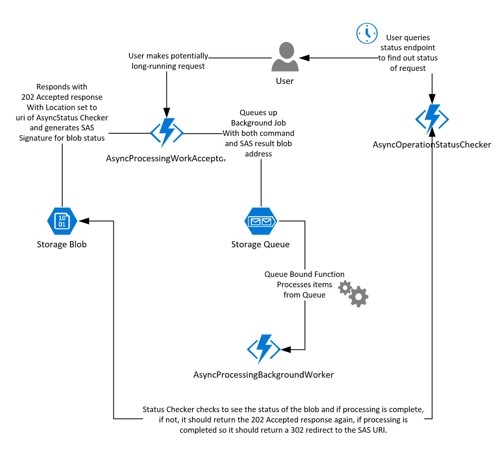
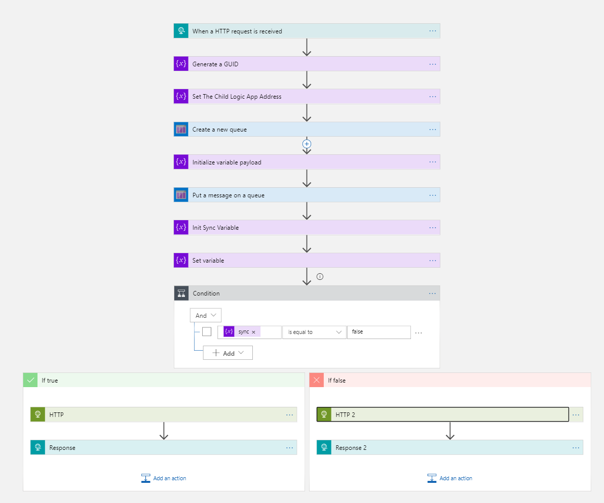
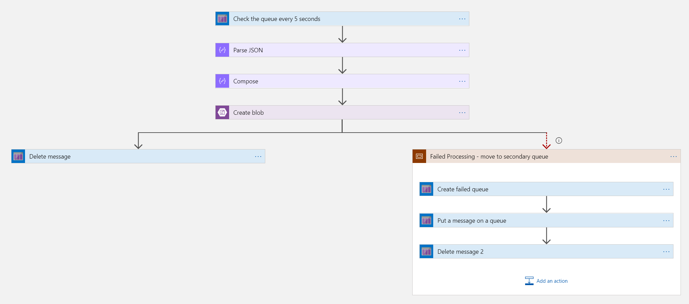
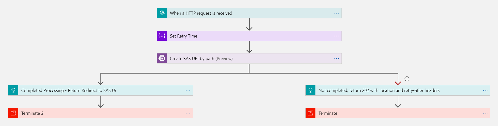

# Asynchronous Request-Reply Pattern

[!INCLUDE [header](../_includes/header.md)]

## Context and Problem

In modern application development, it's normal for client applications - often code running in a web-client (browser) - to depend on remote APIs to provide business logic and compose functionality. These APIs may be directly related to the application, or they may be shared services provided by a third party. It's common for client to backend API calls to take place over the HTTP(s) protocol and for these calls to follow REST and JSON semantics.  
  
In most cases, APIs for a client application will be designed and built to respond quickly or in < 100 ms, not in a time measured in seconds.  

There are many factors to the speed of response to a client request, including:-

> * An application's hosting stack
> * Security components
> * The relative geographic location of caller and API
> * Network infrastructure
> * Current Service Load 
> * Request Payload
> * Processing Queue Length
> * Expected Processing time 

All these things can add latency to the response, but mostly the backend API can respond quickly enough for responses to arrive back over the same connection.  

> [!NOTE] 
> App code can make a synchronous API call in a non-blocking way, giving the appearance of asynchronicity, which is recommended for I/O bound operations.

In some scenarios though, the work undertaken by the API may be "long running" and in the order of seconds to complete. The work could also be a "Background Process", taking in the order of minutes or hours to complete. This situation is usually a problem for all synchronous request-reply patterns.

Some architectures need the request and response stages to be separated through use of a queue or message broker. This separation is often achieved by use of the [Queue Based Load Leveling Pattern](./queue-based-load-leveling.md). This separation can allow the client process and backend api to scale independently. But this separation also brings additional complexity when the client requires success notification, as this step needs to become asynchronous.

Many of the same considerations discussed for Client (browser) applications also apply for server to server REST API calls in distributed systems. 

## Solution

There's no one size fits all solution or pattern for implementing asynchronous background processing and splitting request and response phases. We'll discuss one pattern (client pull) that uses HTTP polling. Polling is useful to client-side code, as it can be hard to provide call-back endpoints or use long running connections. Even when callbacks are possible, the extra libraries and services that are required can sometimes add too much extra complexity.   

- The client application will make a synchronous call to the API, triggering a long running operation for the API to begin work.  
- The API will respond synchronously as quickly as possible with an acknowledgment that the message has been received for processing. 
- The response will hold a location reference pointing at a URL that the client can poll to check for the result of the long running operation.  
- The API will offload processing to another component, our examples below show how to place the received instruction into an envelope and offload processing via a message queue.

> [!NOTE] 
> Best practice is for the API to validate both the request and the action to be performed before it starts the long running process.



## Issues and considerations

Consider the following points when deciding how to implement this pattern:
- A 202-Accepted http status is a great choice to show the request is processing, but processing isn't complete.  

- There a number of possible ways to implement this pattern over http and not all upstream services have the same semantics. Most services won't return a 202 Accepted response back from a GET method call when a remote process hasn't finished. You would expect them to follow pure REST semantics and return a 404 not found. This response makes sense when you consider the result of the call isn't present yet.

- Your response should indicate the location and frequency that the client should poll for the response. To this end, your 202-Accepted reply should have the following additional headers:-  

|Header|Contains|Notes
|---|---|---|
|Location|A url that the client should poll for a response status|This Url could be a SAS token with the [Valet Key Pattern](./valet-key.md) being appropriate if this location needs access control. The valet key pattern is also valid when response polling needs offloading to another backend|
|Retry-After|An estimate of when the request processing is going to complete|To prevent eager polling clients from overwhelming the back-end with retries. |

- You may need to use a processing proxy or facade to manipulate the response headers and / or payload depending on the underlying services used. We'll demonstrate this facade in two possible implementations later.  

- If an error occurs, you should write the error away to the resource described in the location header and ideally return an appropriate response code to the client from that resource (4xx code).  

- Upon successful processing, the resource specified by the location header should return an appropriate http response code (200 OK, 201 Created, or 204 No Content).  

- Not all solutions will implement this pattern in the same way and some services will include additional or alternate headers, for example Azure Resource Manager uses a modified variant of this pattern.  

[See Azure Resource Manager Async Operations](https://docs.microsoft.com/en-us/azure/azure-resource-manager/resource-manager-async-operations)  

## When to use this pattern

Use this pattern when:

- Client to Service Async Polling is useful in client-side code, where it's difficult to provide call-back endpoints. Equally, the use of long running connections and the libraries that are required to implement these connections can add complexity.
- Client calls that are made asynchronously to a REST API that need a method to determine the status of a long-running request.
- Service calls where only the https protocol is available and the return service can't fire callbacks because of firewall restrictions.  
- Service calls that need to be integrated with Legacy-type architectures that don't support modern callback technologies like WebSockets, SignalR, or Event Grid / WebHooks.  
- Legacy clients require obfuscation of the async nature of the request as they don't support this pattern natively. This use case is enabled by Logic Apps' native awareness of the above headers. Because of this feature, the Azure Logic Apps service is used alongside this pattern to mask an asynchronous call to hide the async processing from the original client. See the logic apps example below.

This pattern might not be suitable:

- If you can use a service built for asynchronous notifications instead, such as Azure Event Grid.
-	When responses must stream in real time to the client. 
- When your client needs to collect many results, and received latency of those results is important. Consider a service bus pattern instead.
- If you can use server-side persistent network connections like WebSockets or SignalR, these services can be used to notify the caller of the result.  
- Where the network design allows you to open up ports to receive asynchronous callbacks or webhooks.
-	This particular implementation of this pattern doesn't allow for cancellation of a long-running request. To to allow the processing of cancel messages the back-end service must support some form of cancellation instruction, which is out of the scope of this document.  

## Examples

# [In Azure Functions](#tab/azfunc)

> Let's suppose we have a Function App with two http bound endpoints exposed and an Azure Storage Queue bound function to do the work:-

### Work Acceptor
This function needs to accept the work, put it into an envelope with extra info (SAS signature), then place the envelope onto the queue for processing. Next it should return the 202 response, with the location header pointing at the Operation Status Checker Endpoint.

````csharp
#r "Newtonsoft.json" 
#r "Microsoft.WindowsAzure.Storage"
 
using System;
using System.Net;
using Microsoft.WindowsAzure.Storage; 
using Microsoft.WindowsAzure.Storage.Blob;
using System.Collections.Generic;
using Microsoft.AspNetCore.Mvc;
using Microsoft.Extensions.Primitives;
using Newtonsoft.Json; 
using Newtonsoft.Json.Linq; 

// Accept the Request and pop the message onto the queue
public static async Task<IActionResult> Run(HttpRequest req, ILogger log, CloudBlobContainer inputBlob, IAsyncCollector<string> OutMessage)
{
    
    string reqid = Guid.NewGuid().ToString();
    
    string rqs = $"https://{Environment.GetEnvironmentVariable("WEBSITE_HOSTNAME")}/api/RequestStatus/{reqid}";

    string q = EnvelopeJSONBody(
        await new StreamReader(req.Body).ReadToEndAsync(), 
        new Dictionary<string, JToken>() {
                { "RequestGUID", reqid },
                { "RequestSubmittedAt", DateTime.Now },
                { "RequestStatusURL", rqs}
            }
    );
    
    await OutMessage.AddAsync(q);  

    CloudBlockBlob cbb = inputBlob.GetBlockBlobReference($"{reqid}.blobdata");

    return (ActionResult) new AcceptedResult(rqs, $"Request Accepted for Processing{Environment.NewLine}ValetKey: {GenerateSASURIForBlob(cbb)}{Environment.NewLine}ProxyStatus: {rqs}");  
    
}

public static string GenerateSASURIForBlob(CloudBlockBlob blob)
{

    SharedAccessBlobPolicy sasConstraints = new SharedAccessBlobPolicy();
    sasConstraints.SharedAccessStartTime = DateTimeOffset.UtcNow.AddMinutes(-5);
    sasConstraints.SharedAccessExpiryTime = DateTimeOffset.UtcNow.AddMinutes(10);
    sasConstraints.Permissions = SharedAccessBlobPermissions.Read;

    //Generate the shared access signature on the blob, setting the constraints directly on the signature.
    string sasBlobToken = blob.GetSharedAccessSignature(sasConstraints);

    //Return the URI string for the container, including the SAS token.
    return blob.Uri + sasBlobToken;

}

// takes the input and adds an additional property to the JSON body and returns a serialized string
public static string AppendGUIDToJSONBody(string inputjson, JToken propValue, string propID)
{
   
    JObject job = JObject.Parse(inputjson); 
    job.Add(propID, propValue);
    return job.ToString();

}

// https://en.wikipedia.org/wiki/Decorator_pattern#Overview
// takes the input and augments the object with an additional set of properties to the JSON body as am additional header level property (EnvelopeProperties)
// and returns a serialized string with the original object as the root
public static string DecorateJSONBody(string inputjson, Dictionary<string, JToken> HeaderProperties)
{

    JObject job = JObject.Parse(inputjson); 
    job.Add("EnvelopeProperties",JObject.FromObject(HeaderProperties)); 
    return job.ToString();

}

// https://www.enterpriseintegrationpatterns.com/patterns/messaging/EnvelopeWrapper.html
// Classic 'Envelope' , takes the input and augments the object with an additional set of properties to the JSON body as am additional header level property (EnvelopeProperties) 
// whilst appending the original object as a new property called 'requestobject' and returns a serialized string
public static string EnvelopeJSONBody(string inputjson, Dictionary<string, JToken> HeaderProperties)
{
    
    JObject job = new JObject();
    job.Add("RequestObject", JObject.Parse(inputjson));
    job.Add("EnvelopeProperties",JObject.FromObject(HeaderProperties)); 
    return job.ToString();

}

// To get to the original object, deserialize it with the correct class
public class CustomerPOCO
{
    public string id;
    public string customername;

}

// Or make it inherit and bring in the headers into the object
public class CustomerPOCOwithMessageHeaders : CustomerPOCO {

    public string RequestGUID {get;set;}
    public string RequestSubmittedAt {get;set;}
    public string RequestStatusURL {get;set;}

    // + Your other class POCO fields
    // public string id;
    // public string customername;
    
}

public class EnvelopedMessage {

    public EnvelopeProperties envelopeProperties {get;set;}
    public string RequestObject {get;set;}

}

// To get the headers deserialize it with decoratedmessage.
public class DecoratedMessage {

    public EnvelopeProperties envelopeProperties {get;set;}
    
}

// To get to the original object, deserialize it with the correct class, to get both, inherit your POCO base class from DecoratedMessage
public class CustomerPOCODecoratedMessage : DecoratedMessage {

    public string id;
    public string customername;

}

public class EnvelopeProperties {

    public string RequestGUID {get;set;}
    public string RequestSubmittedAt {get;set;}
    public string RequestStatusURL {get;set;}
}
````

````json
{
  "bindings": [
    {
      "authLevel": "anonymous",
      "name": "req",
      "type": "httpTrigger",
      "direction": "in",
      "methods": [
        "post"
      ]
    },
    {
      "name": "$return",
      "type": "http",
      "direction": "out"
    },
    {
      "type": "queue",
      "name": "OutMessage",
      "queueName": "outqueue",
      "connection": "AzureWebJobsStorage",
      "direction": "out"
    },
    {
      "type": "blob",
      "name": "inputBlob",
      "path": "data/blob.blob",
      "connection": "AzureWebJobsStorage",
      "direction": "in"
    }
  ]
}
````

### Async Background Worker

This function should pick up the operation from the queue, extract the payload from the envelope, do something meaningful with it, then write the result to the SAS signature location

````csharp
#r "Newtonsoft.json"
#r "Microsoft.WindowsAzure.Storage"
 
using System;
using Microsoft.WindowsAzure.Storage; 
using Microsoft.WindowsAzure.Storage.Blob;
using Newtonsoft.Json;
using Newtonsoft.Json.Linq;

// Perform some kind of background processing here and write the result to a blob created in the data folder with a guid as the blob name

public static void Run(EnvelopedMessage<ThisPayload> myQueueItem, ILogger log, CloudBlobContainer inputBlob)
{

    // Perform an actual action against the blob data source for the async readers to be able to check against.
    // This is where your actual service worker processing will be performed

    CloudBlockBlob cbb = inputBlob.GetBlockBlobReference($"{myQueueItem.envelopeProperties.RequestGUID}.blobdata");

    // Now write away the process 
    cbb.UploadTextAsync(JsonConvert.SerializeObject(myQueueItem.RequestObject));
          
}

public class EnvelopedMessage<T> {

    public EnvelopeProperties envelopeProperties {get;set;}
    public T RequestObject {get;set;}

}

public class EnvelopeProperties {  

    public string RequestGUID {get;set;}
    public string RequestSubmittedAt {get;set;}
    public string RequestStatusURL {get;set;}

}

public class ThisPayload {

    public string Id {get;set;}
    public string name {get;set;} 

}
````

````json
{
  "bindings": [
    {
      "name": "myQueueItem",
      "type": "queueTrigger",
      "direction": "in",
      "queueName": "outqueue",
      "connection": "AzureWebJobsStorage"
    },
    {
      "type": "blob",
      "name": "inputBlob",
      "path": "data",
      "connection": "AzureWebJobsStorage",
      "direction": "in"
    }
  ]
}
````

### Operation Status Checker
This function firstly needs to check for the completion of the response. When it's complete, then either return a valet-key to the response or redirect the user immediately to the response valet URL. If the response isn't complete, then we should return a 202 accepted with a self-referencing Location header, putting an ETA for a completed response in the http Retry-After header.

````csharp
#r "Newtonsoft.json"
#r "Microsoft.WindowsAzure.Storage"
 
using System;
using System.Net;
using Microsoft.WindowsAzure.Storage; 
using Microsoft.WindowsAzure.Storage.Blob;
using Newtonsoft.Json;
using Newtonsoft.Json.Linq; 
using Microsoft.AspNetCore.Mvc; 
using Microsoft.Extensions.Primitives;

public static async Task<IActionResult> Run(HttpRequest req, CloudBlockBlob inputBlob, string thisGUID, ILogger log)
{ 

    OnCompleteEnum OnComplete = Enum.Parse<OnCompleteEnum>(req.Query["OnComplete"].FirstOrDefault() ?? "Redirect");
    OnPendingEnum OnPending = Enum.Parse<OnPendingEnum>(req.Query["OnPending"].FirstOrDefault() ?? "Accepted");

    log.LogInformation($"C# HTTP trigger function processed a request for status on {thisGUID} - OnComplete {OnComplete} - OnPending {OnPending}");

    // ** Check to see if the blob is present **
    if (await inputBlob.ExistsAsync())
    {
        // ** If it's present, depending on the value of the optional "OnComplete" parameter choose what to do. **
        // Default (OnComplete not present or set to "Redirect") is to return a 302 redirect with the location of a SAS for the document in the location field.   
        // If OnComplete is present and set to "Stream", the function should return the response inline.

        log.LogInformation($"Blob {thisGUID}.blobdata exists, hooray!");

        switch(OnComplete)
        {
            case OnCompleteEnum.Redirect:
            {
                // Awesome, let's use the valet key pattern to offload the download via a SAS URI to blob storage
                return (ActionResult) new RedirectResult(GenerateSASURIForBlob(inputBlob));
            }

            case OnCompleteEnum.Stream:
            {
               // If the action is set to return the file then lets download it and return it back
               // In the real world, we should use a stream here to minimize RAM usage for larger files.
               return (ActionResult) new OkObjectResult(await inputBlob.DownloadTextAsync());
            }
            
            default:
            {
                throw new InvalidOperationException("How did we get here??");
            }
        }
    }
    else   
    {
        // ** If it's NOT present, then we need to back off, so depending on the value of the optional "OnPending" parameter choose what to do. **
        // Default (OnPending not present or set to "Accepted") is to return a 202 accepted with the location and Retry-After Header set to 5 seconds from now.
        // If OnPending is present and set to "Synchronous" then loop and keep retrying via an exponential backoff in the function until we time out.

        string rqs = $"https://{Environment.GetEnvironmentVariable("WEBSITE_HOSTNAME")}/api/RequestStatus/{thisGUID}";

        log.LogInformation($"Blob {thisGUID}.blob does not exist, still working ! result will be at {rqs}");
        

        switch(OnPending)
        {
            case OnPendingEnum.Accepted:
            {
                // This SHOULD RETURN A 202 accepted 
                return (ActionResult) new AcceptedResult(){ Location = rqs};
            }

            case OnPendingEnum.Synchronous:
            {
                // This should back off and retry returning the data after a period of time timing out when the backoff period hits one minute
                
                int backoff = 250; 

                while (! await inputBlob.ExistsAsync() && backoff < 64000)
                {
                    log.LogInformation($"Synchronous mode {thisGUID}.blob - retrying in {backoff} ms");
                    backoff = backoff * 2; 
                    await Task.Delay(backoff);
                    
                }

                if (await inputBlob.ExistsAsync())
                {
                    switch(OnComplete)
                    {
                        case OnCompleteEnum.Redirect:
                        {
                            log.LogInformation($"Synchronous Redirect mode {thisGUID}.blob - completed after {backoff} ms");
                            // Awesome, let's use the valet key pattern to offload the download via a SAS URI to blob storage
                            return (ActionResult) new RedirectResult(GenerateSASURIForBlob(inputBlob));
                        }

                        case OnCompleteEnum.Stream:
                        {
                            log.LogInformation($"Synchronous Stream mode {thisGUID}.blob - completed after {backoff} ms");
                            // If the action is set to return the file then lets download it and return it back
                            // This operation is horrible for larger files, we should use a stream to minimize RAM usage.
                            return (ActionResult) new OkObjectResult(await inputBlob.DownloadTextAsync());
                        }
                        
                        default:
                        {
                            throw new InvalidOperationException("How did we get here??");
                        }
                    }
                }
                else
                {  
                    log.LogInformation($"Synchronous mode {thisGUID}.blob - NOT FOUND after timeout {backoff} ms");
                    return (ActionResult) new NotFoundResult();

                }              
                         
            }

            default:
            {
                throw new InvalidOperationException("How did we get here??");
            }
        }
    }
}

public static string GenerateSASURIForBlob(CloudBlockBlob blob)
{

    SharedAccessBlobPolicy sasConstraints = new SharedAccessBlobPolicy();
    sasConstraints.SharedAccessStartTime = DateTimeOffset.UtcNow.AddMinutes(-5);
    sasConstraints.SharedAccessExpiryTime = DateTimeOffset.UtcNow.AddMinutes(10);
    sasConstraints.Permissions = SharedAccessBlobPermissions.Read;

    //Generate the shared access signature on the blob, setting the constraints directly on the signature.
    string sasBlobToken = blob.GetSharedAccessSignature(sasConstraints);

    //Return the URI string for the container, including the SAS token.
    return blob.Uri + sasBlobToken;

}

public enum OnCompleteEnum {

    Redirect,
    Stream

}

public enum OnPendingEnum {

    Accepted,
    Synchronous

}
````

````json
{
  "bindings": [
    {
      "authLevel": "anonymous",
      "name": "req",
      "type": "httpTrigger",
      "direction": "in",
      "methods": [
        "get"
      ],
      "route": "RequestStatus/{thisGUID}"
    },
    {
      "name": "$return",
      "type": "http",
      "direction": "out"
    },
    {
      "type": "blob",
      "name": "inputBlob",
      "path": "data/{thisGUID}.blobdata",
      "connection": "AzureWebJobsStorage",
      "direction": "in"
    }
  ]
}
````

# [In Logic Apps](#tab/logicapps)

### Work Acceptor

This logic app needs to accept the work, put it into an envelope with extra info (SAS signature), then place the envelope onto the queue for processing. Next it should return the 202 response, with the location header pointing at the Operation Status Checker Endpoint.


````json
{
    "$connections": {
        "value": {
            "azurequeues": {
                "connectionId": "/subscriptions/XXXXXXXX-2ab5-4460-ba7d-d34b5135c24a/resourceGroups/Async_Demos/providers/Microsoft.Web/connections/azurequeues",
                "connectionName": "azurequeues",
                "id": "/subscriptions/XXXXXXXX-2ab5-4460-ba7d-d34b5135c24a/providers/Microsoft.Web/locations/ukwest/managedApis/azurequeues"
            }
        }
    },
    "definition": {
        "$schema": "https://schema.management.azure.com/providers/Microsoft.Logic/schemas/2016-06-01/workflowdefinition.json#",
        "actions": {
            "Condition": {
                "actions": {
                    "HTTP": {
                        "inputs": {
                            "method": "GET",
                            "uri": "@variables('ASyncLogicAppAddress')"
                        },
                        "operationOptions": "DisableAsyncPattern",
                        "runAfter": {},
                        "type": "Http"
                    },
                    "Response": {
                        "inputs": {
                            "body": "@body('HTTP')",
                            "headers": {
                                "location": "@{outputs('HTTP')['headers']['location']}",
                                "retry-after": "@{outputs('HTTP')['headers']['retry-after']}"
                            },
                            "statusCode": "@outputs('HTTP')['statusCode']"
                        },
                        "kind": "Http",
                        "runAfter": {
                            "HTTP": [
                                "Succeeded"
                            ]
                        },
                        "type": "Response"
                    }
                },
                "else": {
                    "actions": {
                        "HTTP_2": {
                            "inputs": {
                                "method": "GET",
                                "uri": "@variables('ASyncLogicAppAddress')"
                            },
                            "limit": {
                                "timeout": "PT120S"
                            },
                            "runAfter": {},
                            "type": "Http"
                        },
                        "Response_2": {
                            "inputs": {
                                "body": "@body('HTTP_2')",
                                "headers": {
                                    "location": "@{outputs('HTTP_2')['headers']['location']}"
                                },
                                "statusCode": "@outputs('HTTP_2')['statusCode']"
                            },
                            "kind": "Http",
                            "runAfter": {
                                "HTTP_2": [
                                    "Succeeded"
                                ]
                            },
                            "type": "Response"
                        }
                    }
                },
                "expression": {
                    "and": [
                        {
                            "equals": [
                                "@variables('sync')",
                                "false"
                            ]
                        }
                    ]
                },
                "runAfter": {
                    "Set_variable": [
                        "Succeeded",
                        "Failed",
                        "Skipped"
                    ]
                },
                "type": "If"
            },
            "Create_a_new_queue": {
                "inputs": {
                    "host": {
                        "connection": {
                            "name": "@parameters('$connections')['azurequeues']['connectionId']"
                        }
                    },
                    "method": "put",
                    "path": "/putQueue",
                    "queries": {
                        "queueName": "@{toLower(concat(triggerOutputs()['relativePathParameters']['RequestQueue'],triggerOutputs()['relativePathParameters']['ObjectType']))}"
                    }
                },
                "runAfter": {
                    "Set_The_Child_Logic_App_Address": [
                        "Succeeded"
                    ]
                },
                "type": "ApiConnection"
            },
            "Gimme_a_GUID": {
                "inputs": {
                    "variables": [
                        {
                            "name": "GUID",
                            "type": "String",
                            "value": "@{guid()}"
                        }
                    ]
                },
                "runAfter": {},
                "type": "InitializeVariable"
            },
            "Init_Sync_Variable": {
                "inputs": {
                    "variables": [
                        {
                            "name": "sync",
                            "type": "String",
                            "value": "false"
                        }
                    ]
                },
                "runAfter": {
                    "Put_a_message_on_a_queue": [
                        "Succeeded"
                    ]
                },
                "type": "InitializeVariable"
            },
            "Initialize_variable": {
                "inputs": {
                    "variables": [
                        {
                            "name": "payload",
                            "type": "String",
                            "value": "@{addProperty(json(triggerBody()),'RequestGUID',variables('GUID'))}"
                        }
                    ]
                },
                "runAfter": {
                    "Create_a_new_queue": [
                        "Succeeded"
                    ]
                },
                "type": "InitializeVariable"
            },
            "Put_a_message_on_a_queue": {
                "inputs": {
                    "body": "@{json(variables('payload'))}",
                    "host": {
                        "connection": {
                            "name": "@parameters('$connections')['azurequeues']['connectionId']"
                        }
                    },
                    "method": "post",
                    "path": "/@{encodeURIComponent(toLower(concat(triggerOutputs()['relativePathParameters']['RequestQueue'],triggerOutputs()['relativePathParameters']['ObjectType'])))}/messages"
                },
                "runAfter": {
                    "Initialize_variable": [
                        "Succeeded"
                    ]
                },
                "type": "ApiConnection"
            },
            "Set_The_Child_Logic_App_Address": {
                "inputs": {
                    "variables": [
                        {
                            "name": "ASyncLogicAppAddress",
                            "type": "String",
                            "value": "https://prod-19.ukwest.logic.azure.com/workflows/XXXXXXXXXXXX/triggers/manual/paths/invoke/@{variables('GUID')}?api-version=2016-10-01&sp=%2Ftriggers%2Fmanual%2Frun&sv=1.0&sig=XXXXXXXXXXXBq-j6yNch6j5A0ukc8FQSmSW2rok"
                        }
                    ]
                },
                "runAfter": {
                    "Gimme_a_GUID": [
                        "Succeeded"
                    ]
                },
                "type": "InitializeVariable"
            },
            "Set_variable": {
                "inputs": {
                    "name": "sync",
                    "value": "@{coalesce(triggerOutputs()?['Headers']?['Synchronous'],'false')}"
                },
                "runAfter": {
                    "Init_Sync_Variable": [
                        "Succeeded"
                    ]
                },
                "type": "SetVariable"
            }
        },
        "contentVersion": "1.0.0.0",
        "outputs": {},
        "parameters": {
            "$connections": {
                "defaultValue": {},
                "type": "Object"
            }
        },
        "triggers": {
            "manual": {
                "inputs": {
                    "method": "POST",
                    "relativePath": "/{RequestQueue}/{ObjectType}",
                    "schema": {}
                },
                "kind": "Http",
                "type": "Request"
            }
        }
    }
}
````

### Async Background Worker

This logic app should pick up the operation from the queue, extract the payload from the envelope, do something meaningful with it, then write the result to the SAS signature location.



````json
{
    "$connections": {
        "value": {
            "azureblob": {
                "connectionId": "/subscriptions/XXXXXXX-2ab5-4460-ba7d-d34b5135c24a/resourceGroups/Async_Demos/providers/Microsoft.Web/connections/azureblob",
                "connectionName": "azureblob",
                "id": "/subscriptions/XXXXXXX-2ab5-4460-ba7d-d34b5135c24a/providers/Microsoft.Web/locations/ukwest/managedApis/azureblob"
            },
            "azurequeues": {
                "connectionId": "/subscriptions/XXXXXXX-2ab5-4460-ba7d-d34b5135c24a/resourceGroups/Async_Demos/providers/Microsoft.Web/connections/azurequeues",
                "connectionName": "azurequeues",
                "id": "/subscriptions/XXXXXXX-2ab5-4460-ba7d-d34b5135c24a/providers/Microsoft.Web/locations/ukwest/managedApis/azurequeues"
            }
        }
    },
    "definition": {
        "$schema": "https://schema.management.azure.com/providers/Microsoft.Logic/schemas/2016-06-01/workflowdefinition.json#",
        "actions": {
            "Compose": {
                "inputs": {
                    "InsertedID": "no-op",
                    "etag": "@{guid()}"
                },
                "runAfter": {
                    "Parse_JSON": [
                        "Succeeded"
                    ]
                },
                "type": "Compose"
            },
            "Create_blob": {
                "inputs": {
                    "body": "@outputs('Compose')",
                    "headers": {
                        "Content-Type": "application/json"
                    },
                    "host": {
                        "connection": {
                            "name": "@parameters('$connections')['azureblob']['connectionId']"
                        }
                    },
                    "method": "post",
                    "path": "/datasets/default/files",
                    "queries": {
                        "folderPath": "/data",
                        "name": "@body('Parse_JSON')?['RequestGUID']",
                        "queryParametersSingleEncoded": true
                    }
                },
                "runAfter": {
                    "Compose": [
                        "Succeeded"
                    ]
                },
                "runtimeConfiguration": {
                    "contentTransfer": {
                        "transferMode": "Chunked"
                    }
                },
                "type": "ApiConnection"
            },
            "Delete_message": {
                "inputs": {
                    "host": {
                        "connection": {
                            "name": "@parameters('$connections')['azurequeues']['connectionId']"
                        }
                    },
                    "method": "delete",
                    "path": "/@{encodeURIComponent('requestqueueobjecttype')}/messages/@{encodeURIComponent(triggerBody()?['MessageId'])}",
                    "queries": {
                        "popreceipt": "@triggerBody()?['PopReceipt']"
                    }
                },
                "runAfter": {
                    "Create_blob": [
                        "Succeeded"
                    ]
                },
                "type": "ApiConnection"
            },
            "Failed_Processing_-_move_to_secondary_queue": {
                "actions": {
                    "Create_failed_queue": {
                        "inputs": {
                            "host": {
                                "connection": {
                                    "name": "@parameters('$connections')['azurequeues']['connectionId']"
                                }
                            },
                            "method": "put",
                            "path": "/putQueue",
                            "queries": {
                                "queueName": "requestqueueobjecttypefailed"
                            }
                        },
                        "runAfter": {},
                        "type": "ApiConnection"
                    },
                    "Delete_message_2": {
                        "inputs": {
                            "host": {
                                "connection": {
                                    "name": "@parameters('$connections')['azurequeues']['connectionId']"
                                }
                            },
                            "method": "delete",
                            "path": "/@{encodeURIComponent('requestqueueobjecttype')}/messages/@{encodeURIComponent(triggerBody()?['MessageId'])}",
                            "queries": {
                                "popreceipt": "@triggerBody()?['PopReceipt']"
                            }
                        },
                        "runAfter": {
                            "Put_a_message_on_a_queue": [
                                "Succeeded"
                            ]
                        },
                        "type": "ApiConnection"
                    },
                    "Put_a_message_on_a_queue": {
                        "inputs": {
                            "body": "@triggerBody()?['MessageText']",
                            "host": {
                                "connection": {
                                    "name": "@parameters('$connections')['azurequeues']['connectionId']"
                                }
                            },
                            "method": "post",
                            "path": "/@{encodeURIComponent('requestqueueobjecttypefailed')}/messages"
                        },
                        "runAfter": {
                            "Create_failed_queue": [
                                "Succeeded"
                            ]
                        },
                        "type": "ApiConnection"
                    }
                },
                "runAfter": {
                    "Create_blob": [
                        "Failed",
                        "Skipped",
                        "TimedOut"
                    ]
                },
                "type": "Scope"
            },
            "Parse_JSON": {
                "inputs": {
                    "content": "@triggerBody()?['MessageText']",
                    "schema": {
                        "properties": {
                            "OwnerRegion": {
                                "type": "string"
                            },
                            "PayloadContent": {
                                "type": "string"
                            },
                            "PayloadType": {
                                "type": "string"
                            },
                            "ProcessedAt": {
                                "type": "string"
                            },
                            "ProcessedUserEmail": {
                                "type": "string"
                            },
                            "RequestGUID": {
                                "type": "string"
                            },
                            "Source": {
                                "type": "string"
                            }
                        },
                        "type": "object"
                    }
                },
                "runAfter": {},
                "type": "ParseJson"
            }
        },
        "contentVersion": "1.0.0.0",
        "outputs": {},
        "parameters": {
            "$connections": {
                "defaultValue": {},
                "type": "Object"
            }
        },
        "triggers": {
            "Check_the_queue_every_5_seconds": {
                "inputs": {
                    "host": {
                        "connection": {
                            "name": "@parameters('$connections')['azurequeues']['connectionId']"
                        }
                    },
                    "method": "get",
                    "path": "/@{encodeURIComponent('requestqueueobjecttype')}/message_trigger",
                    "queries": {
                        "visibilitytimeout": "15"
                    }
                },
                "recurrence": {
                    "frequency": "Second",
                    "interval": 5
                },
                "splitOn": "@triggerBody()?['QueueMessagesList']?['QueueMessage']",
                "type": "ApiConnection"
            }
        }
    }
}
````
### Operation Status Checker
This logic app firstly needs to check for the completion of the response. When it's complete, then either return a valet-key to the response or redirect the user immediately to the response valet URL. If the response isn't complete, then we should return a 202 accepted with a self-referencing Location header, putting an ETA for a completed response in the http Retry-After header.



````json
{
    "$connections": {
        "value": {
            "azureblob": {
                "connectionId": "/subscriptions/XXXXXXX-2ab5-4460-ba7d-d34b5135c24a/resourceGroups/Async_Demos/providers/Microsoft.Web/connections/azureblob",
                "connectionName": "azureblob",
                "id": "/subscriptions/XXXXXXX-2ab5-4460-ba7d-d34b5135c24a/providers/Microsoft.Web/locations/ukwest/managedApis/azureblob"
            }
        }
    },
    "definition": {
        "$schema": "https://schema.management.azure.com/providers/Microsoft.Logic/schemas/2016-06-01/workflowdefinition.json#",
        "actions": {
            "Completed_Processing_-_Return_Redirect_to_SAS_Url": {
                "inputs": {
                    "body": {
                        "ProcessingStatus": "CompleteShouldRedirect",
                        "Status": "Processing Complete, follow the location header to download the resource",
                        "location": "@{body('Create_SAS_URI_by_path')?['WebUrl']}"
                    },
                    "headers": {
                        "ProcessingStatus": "ShouldRedirect",
                        "location": "@body('Create_SAS_URI_by_path')?['WebUrl']"
                    },
                    "statusCode": 201
                },
                "kind": "Http",
                "runAfter": {
                    "Create_SAS_URI_by_path": [
                        "Succeeded"
                    ]
                },
                "type": "Response"
            },
            "Create_SAS_URI_by_path": {
                "inputs": {
                    "body": {
                        "AccessProtocol": "HttpsOnly",
                        "ExpiryTime": "@{addMinutes(utcNow(),10)}",
                        "Permissions": "Read"
                    },
                    "host": {
                        "connection": {
                            "name": "@parameters('$connections')['azureblob']['connectionId']"
                        }
                    },
                    "method": "post",
                    "path": "/datasets/default/CreateSharedLinkByPath",
                    "queries": {
                        "path": "/data/@{triggerOutputs()['relativePathParameters']['filename']}"
                    }
                },
                "runAfter": {
                    "Set_Retry_Time": [
                        "Succeeded"
                    ]
                },
                "type": "ApiConnection"
            },
            "Not_completed,_return_202_with_location_and_retry-after_headers": {
                "inputs": {
                    "body": {
                        "ProcessingStatus": "ProcessingInProgress",
                        "Status": "Processing In Progress, please come back to this URL after the retry-after time has expired (in @{variables('retry')} seconds).",
                        "location": "@{body('Create_SAS_URI_by_path')?['WebUrl']}",
                        "retry-after": "@{variables('retry')}"
                    },
                    "headers": {
                        "ProcessingStatus": "ProcessingInProgressRetryAfter",
                        "location": "https://prod-19.ukwest.logic.azure.com/workflows/XXXXXXXXXXXXXXXXXXXXX/triggers/manual/paths/invoke/@{triggerOutputs()['relativePathParameters']['filename']}?api-version=2016-10-01&sp=%2Ftriggers%2Fmanual%2Frun&sv=1.0&sig=XXXXXXXXXXXXXXq-j6yNch6j5A0ukc8FQSmSW2rok",
                        "retry-after": "@{variables('retry')}"
                    },
                    "statusCode": 202
                },
                "kind": "Http",
                "runAfter": {
                    "Create_SAS_URI_by_path": [
                        "Failed"
                    ]
                },
                "type": "Response"
            },
            "Set_Retry_Time": {
                "inputs": {
                    "variables": [
                        {
                            "name": "retry",
                            "type": "String",
                            "value": "@addSeconds(utcNow(),5)"
                        }
                    ]
                },
                "runAfter": {},
                "type": "InitializeVariable"
            },
            "Terminate": {
                "inputs": {
                    "runStatus": "Cancelled"
                },
                "runAfter": {
                    "Not_completed,_return_202_with_location_and_retry-after_headers": [
                        "Succeeded"
                    ]
                },
                "type": "Terminate"
            },
            "Terminate_2": {
                "inputs": {
                    "runStatus": "Succeeded"
                },
                "runAfter": {
                    "Completed_Processing_-_Return_Redirect_to_SAS_Url": [
                        "Succeeded"
                    ]
                },
                "type": "Terminate"
            }
        },
        "contentVersion": "1.0.0.0",
        "outputs": {},
        "parameters": {
            "$connections": {
                "defaultValue": {},
                "type": "Object"
            }
        },
        "triggers": {
            "manual": {
                "inputs": {
                    "method": "GET",
                    "relativePath": "/{filename}",
                    "schema": {}
                },
                "kind": "Http",
                "type": "Request"
            }
        }
    }
}
````
---

## Related Guidance and Next Steps

The following information may be relevant when implementing this pattern:

- [Azure Logic Apps - How to Perform Long Running Tasks](https://docs.microsoft.com/en-us/azure/logic-apps/logic-apps-create-api-app#perform-long-running-tasks-with-the-polling-action-pattern)
- [Sample Code - ASP.NET Implementation Sample by Jeff Hollan](https://github.com/jeffhollan/LogicAppsAsyncResponseSample)
