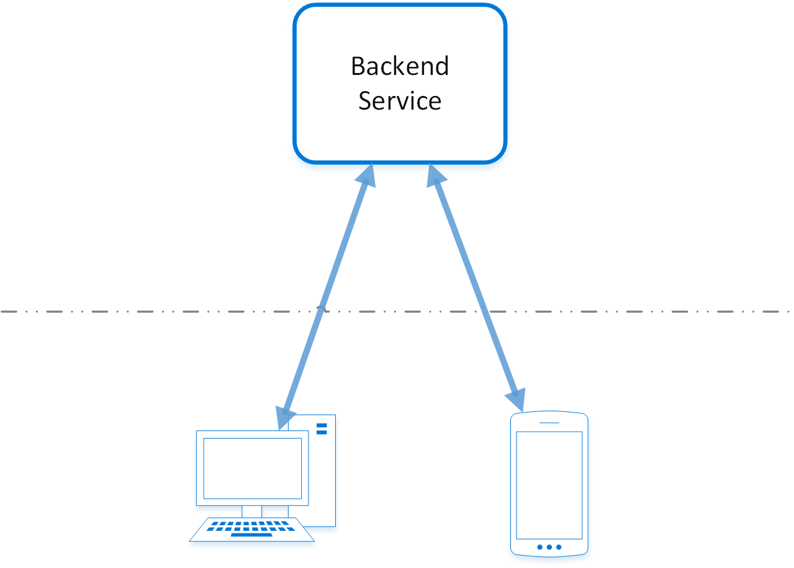
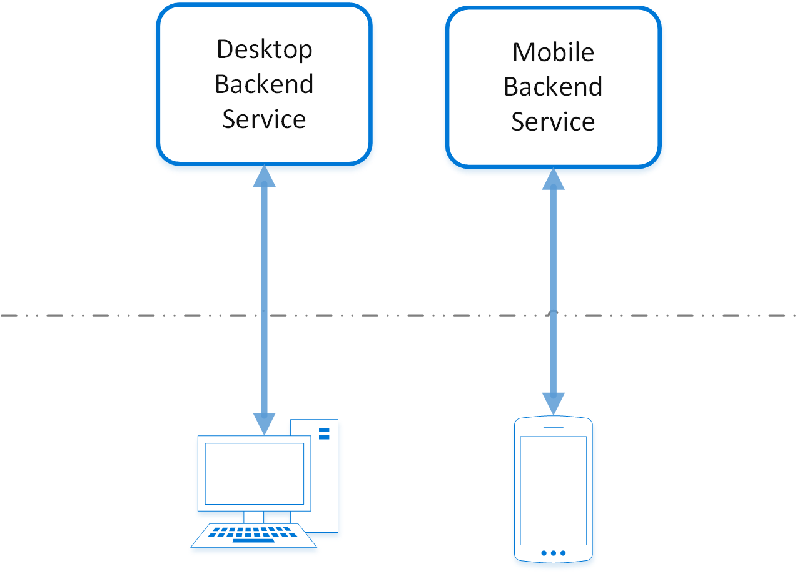

# Backends for Frontends pattern

Create separate backend services to be consumed by specific frontend applications or interfaces. This pattern is useful when you want to avoid customizing a single backend for multiple interfaces. This pattern was first described by Sam Newman.

## Context and problem

An application may initially be targeted at a desktop web UI. Typically, a backend service is developed in parallel that provides the features needed for that UI. As the application's user base grows, a mobile application is developed that must interact with the same backend. The backend service becomes a general-purpose backend, serving the requirements of both the desktop and mobile interfaces.

But the capabilities of a mobile device differ significantly from a desktop browser, in terms of screen size, performance, and display limitations. As a result, the requirements for a mobile application backend differ from the desktop web UI.

These differences result in competing requirements for the backend. The backend requires regular and significant changes to serve both the desktop web UI and the mobile application. Often, separate interface teams work on each frontend, causing the backend to become a bottleneck in the development process. Conflicting update requirements, and the need to keep the service working for both frontends, can result in spending a lot of effort on a single deployable resource.

As the development activity focuses on the backend service, a separate team may be created to manage and maintain the backend. Ultimately, this results in a disconnect between the interface and backend development teams, placing a burden on the backend team to balance the competing requirements of the different UI teams. When one interface team requires changes to the backend, those changes must be validated with other interface teams before they can be integrated into the backend.

## Solution

Create one backend per user interface. Fine-tune the behavior and performance of each backend to best match the needs of the frontend environment, without worrying about affecting other frontend experiences.

Because each backend is specific to one interface, it can be optimized for that interface. As a result, it will be smaller, less complex, and likely faster than a generic backend that tries to satisfy the requirements for all interfaces. Each interface team has autonomy to control their own backend and doesn't rely on a centralized backend development team. This gives the interface team flexibility in language selection, release cadence, prioritization of workload, and feature integration in their backend.

For more information, see [Pattern: Backends For Frontends](https://samnewman.io/patterns/architectural/bff/).

## Issues and considerations

- Consider how many backends to deploy.
- If different interfaces (such as mobile clients) will make the same requests, consider whether it is necessary to implement a backend for each interface, or if a single backend will suffice.
- Code duplication across services is highly likely when implementing this pattern.
- Frontend-focused backend services should only contain client-specific logic and behavior. General business logic and other global features should be managed elsewhere in your application.
- Think about how this pattern might be reflected in the responsibilities of a development team.
- Consider how long it will take to implement this pattern. Will the effort of building the new backends incur technical debt, while you continue to support the existing generic backend?

## When to use this pattern

Use this pattern when:

- A shared or general purpose backend service must be maintained with significant development overhead.
- You want to optimize the backend for the requirements of specific client interfaces.
- Customizations are made to a general-purpose backend to accommodate multiple interfaces.
- An alternative language is better suited for the backend of a different user interface.

This pattern may not be suitable:

- When interfaces make the same or similar requests to the backend.
- When only one interface is used to interact with the backend.

## Related guidance

- [Pattern: Backends For Frontends](https://samnewman.io/patterns/architectural/bff/)
- [Gateway Aggregation pattern](./gateway-aggregation.md)
- [Gateway Offloading pattern](./gateway-offloading.md)
- [Gateway Routing pattern](./gateway-routing.md)
