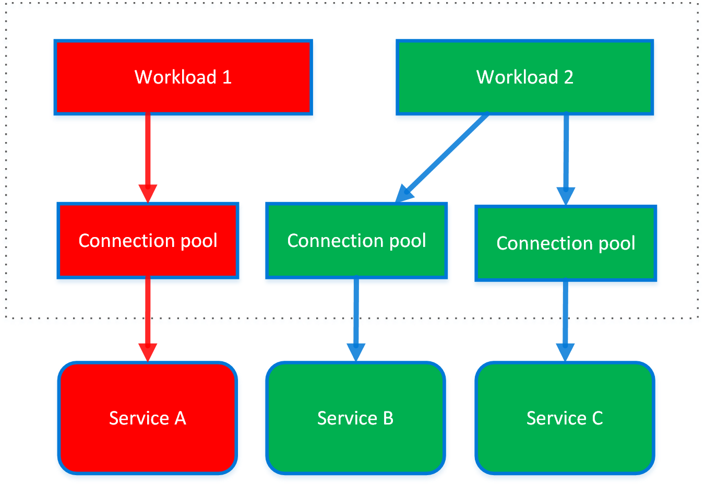
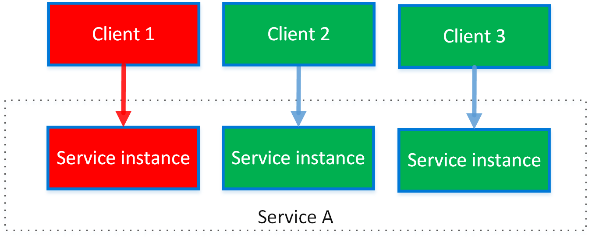

# Bulkhead pattern

The Bulkhead pattern is a type of application design that is tolerant of failure. In a bulkhead architecture, elements of an application are isolated into pools so that if one fails, the others will continue to function. It's named after the sectioned partitions (bulkheads) of a ship's hull. If the hull of a ship is compromised, only the damaged section fills with water, which prevents the ship from sinking.

## Context and problem

A cloud-based application may include multiple services, with each service having one or more consumers. Excessive load or failure in a service will impact all consumers of the service.

Moreover, a consumer may send requests to multiple services simultaneously, using resources for each request. When the consumer sends a request to a service that is misconfigured or not responding, the resources used by the client's request may not be freed in a timely manner. As requests to the service continue, those resources may be exhausted. For example, the client's connection pool may be exhausted. At that point, requests by the consumer to other services are affected. Eventually the consumer can no longer send requests to other services, not just the original unresponsive service.

The same issue of resource exhaustion affects services with multiple consumers. A large number of requests originating from one client may exhaust available resources in the service. Other consumers are no longer able to consume the service, causing a cascading failure effect.

## Solution

Partition service instances into different groups, based on consumer load and availability requirements. This design helps to isolate failures, and allows you to sustain service functionality for some consumers, even during a failure.

A consumer can also partition resources, to ensure that resources used to call one service don't affect the resources used to call another service. For example, a consumer that calls multiple services may be assigned a connection pool for each service. If a service begins to fail, it only affects the connection pool assigned for that service, allowing the consumer to continue using the other services.

The benefits of this pattern include:

- Isolates consumers and services from cascading failures. An issue affecting a consumer or service can be isolated within its own bulkhead, preventing the entire solution from failing.
- Allows you to preserve some functionality in the event of a service failure. Other services and features of the application will continue to work.
- Allows you to deploy services that offer a different quality of service for consuming applications. A high-priority consumer pool can be configured to use high-priority services.

The following diagram shows bulkheads structured around connection pools that call individual services. If Service A fails or causes some other issue, the connection pool is isolated, so only workloads using the thread pool assigned to Service A are affected. Workloads that use Service B and C are not affected and can continue working without interruption.



The next diagram shows multiple clients calling a single service. Each client is assigned a separate service instance. Client 1 has made too many requests and overwhelmed its instance. Because each service instance is isolated from the others, the other clients can continue making calls.



## Issues and considerations

- Define partitions around the business and technical requirements of the application.
- When partitioning services or consumers into bulkheads, consider the level of isolation offered by the technology as well as the overhead in terms of cost, performance and manageability.
- Consider combining bulkheads with retry, circuit breaker, and throttling patterns to provide more sophisticated fault handling.
- When partitioning consumers into bulkheads, consider using processes, thread pools, and semaphores. Projects like [Netflix Hystrix][hystrix] and [Polly][polly] offer a framework for creating consumer bulkheads.
- When partitioning services into bulkheads, consider deploying them into separate virtual machines, containers, or processes. Containers offer a good balance of resource isolation with fairly low overhead.
- Services that communicate using asynchronous messages can be isolated through different sets of queues. Each queue can have a dedicated set of instances processing messages on the queue, or a single group of instances using an algorithm to dequeue and dispatch processing.
- Determine the level of granularity for the bulkheads. For example, if you want to distribute tenants across partitions, you could place each tenant into a separate partition, or put several tenants into one partition.
- Monitor each partition’s performance and SLA.

## When to use this pattern

Use this pattern to:

- Isolate resources used to consume a set of backend services, especially if the application can provide some level of functionality even when one of the services is not responding.
- Isolate critical consumers from standard consumers.
- Protect the application from cascading failures.

This pattern may not be suitable when:

- Less efficient use of resources may not be acceptable in the project.
- The added complexity is not necessary

## Example

The following Kubernetes configuration file creates an isolated container to run a single service, with its own CPU and memory resources and limits.

```yml
apiVersion: v1
kind: Pod
metadata:
  name: drone-management
spec:
  containers:
  - name: drone-management-container
    image: drone-service
    resources:
      requests:
        memory: "64Mi"
        cpu: "250m"
      limits:
        memory: "128Mi"
        cpu: "1"
```

## Related guidance

- [Designing reliable Azure applications](../framework/resiliency/app-design.md)
- [Circuit Breaker pattern](./circuit-breaker.md)
- [Retry pattern](./retry.md)
- [Throttling pattern](./throttling.md)

<!-- links -->

[hystrix]: https://github.com/Netflix/Hystrix
[polly]: https://github.com/App-vNext/Polly
