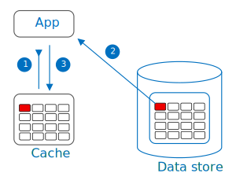

Load data on demand into a cache from a data store. This can improve performance and also helps to maintain consistency between data held in the cache and data in the underlying data store.

## Context and problem

Applications use a cache to improve repeated access to information held in a data store. However, it's unrealistic to expect cached data to always be consistent with the data store. Applications should implement a strategy that helps ensure that the data in the cache is as up-to-date as possible. The strategy should also be able to detect when cached data becomes stale and handle it appropriately.

## Solution

Many commercial caching systems provide read-through and write-through/write-behind operations. In these systems, an application retrieves data by referencing the cache. If the data isn't in the cache, the application retrieves it from the data store and adds it to the cache. Any modifications to data held in the cache are automatically written back to the data store as well.

For caches that don't provide this functionality, it's the responsibility of the applications that use the cache to maintain the data.

An application can emulate the functionality of read-through caching by implementing the cache-aside strategy. This strategy loads data into the cache on demand. The figure illustrates using the Cache-Aside pattern to store data in the cache.



1. The application determines whether the item is currently held in the cache by attempting to read from the cache.
2. If the item isn't current in the cache (a cache miss), the application retrieves the item from the data store.
3. The application adds the item to the cache, and then returns it to the caller.

If an application updates information, it can follow the write-through strategy by making the modification to the data store, and by invalidating the corresponding item in the cache.

When the item is needed again, the cache-aside strategy retrieves the updated data from the data store and adds it to the cache.

## Issues and considerations

Consider the following points when deciding how to implement this pattern:

**Lifetime of cached data**. Many caches use an expiration policy to invalidate data and remove it from the cache if it isn't accessed for a set period. For cache-aside to be effective, ensure that the expiration policy matches the pattern of access for applications that use the data. Don't make the expiration period too short because premature expiration can cause applications to continually retrieve data from the data store and add it to the cache. Similarly, don't make the expiration period so long that the cached data is likely to become stale. Remember that caching is most effective for relatively static data, or data that is read frequently.

**Evicting data**. Most caches have a limited size compared to the data store where the data originates. If the cache exceeds its size limit, it evicts data. Most caches adopt a least-recently-used policy for selecting items to evict, but it might be customizable.

**Configuration**. Cache configuration can be set both globally and per cached item. A single global eviction policy might not suit all items. A configuration on a cache item might be appropriate if an item is expensive to retrieve. In this situation, it makes sense to keep the item in the cache, even if it's accessed less often than cheaper items.

**Priming the cache**. Many solutions prepopulate the cache with the data that an application is likely to need as part of the startup processing. The Cache-Aside pattern can still be useful if some of this data expires or is evicted.

**Consistency**. Implementing the Cache-Aside pattern doesn't guarantee consistency between the data store and the cache. For example, an external process can change an item in the data store at any time. This change won't appear in the cache until the item is loaded again. In a system that replicates data across data stores, consistency can be challenging if synchronization occurs frequently.

**Local (in-memory) caching**. A cache could be local to an application instance and stored in-memory. Cache-aside can be useful in this environment if an application repeatedly accesses the same data. However, a local cache is private and so different application instances could each have a copy of the same cached data. This data could quickly become inconsistent between caches, so it might be necessary to expire data held in a private cache and refresh it more frequently. In these scenarios, consider investigating the use of a shared or a distributed caching mechanism.

**Semantic caching**. Semantic caching can be useful for caching the results of queries against a data store. However, two queries that are semantically equivalent might not return the same results. For example, "What is my yearly take home salary?" is semantically similar to "What is my yearly take home pay?" but if asked by two different users, you would never want to return the same answer. To ensure correctness, the cache must include metadata that captures not both the query and the context in which it was made.

## When to use this pattern

Use this pattern when:

- A cache doesn't provide native read-through and write-through operations.
- Resource demand is unpredictable. This pattern enables applications to load data on demand. It makes no assumptions about which data an application requires in advance.

This pattern might not be suitable:

- If the data is sensitive or security related. It might be inappropriate to store it in a cache, particularly if the cache is shared between multiple applications or users. Always go to the primary source of the data.
- When the cached data set is static. If the data fits into the available cache space, prime the cache with the data on startup and apply a policy that prevents the data from expiring.
- When most requests wouldn't experience a cache hit. In this situation, the overhead of checking the cache and loading data into it might outweigh the benefits of caching.
- When caching session state information in a web application hosted in a web farm. In this environment, you should avoid introducing dependencies based on client-server affinity.

## Workload design

An architect should evaluate how the Cache-Aside pattern can be used in a design to address the goals and principles covered in the [Azure Well-Architected Framework pillars](/azure/well-architected/pillars). For example:

| Pillar | How this pattern supports pillar goals |
| :----- | :------------------------------------- |
| [Reliability](/azure/well-architected/reliability/checklist) design decisions help your workload become **resilient** to malfunction and to ensure that it **recovers** to a fully functioning state after a failure occurs. | Caching creates data replication and, in limited ways, can be used to preserve the availability of frequently accessed data if the origin data store is temporarily unavailable. Additionally, if there's a malfunction in the cache, the workload can fall back to the origin data store.<br/><br/> - [RE:05 Redundancy](/azure/well-architected/reliability/redundancy) |
| [Performance Efficiency](/azure/well-architected/performance-efficiency/checklist) helps your workload **efficiently meet demands** through optimizations in scaling, data, code. | Using a cache cab improve performance for for read-heavy data that changes infrequently and can tolerate some staleness.<br/><br/> - [PE:08 Data performance](/azure/well-architected/performance-efficiency/optimize-data-performance)<br/> - [PE:12 Continuous performance optimization](/azure/well-architected/performance-efficiency/continuous-performance-optimize) |

As with any design decision, consider any tradeoffs against the goals of the other pillars that might be introduced with this pattern.

## Example

Consider using [Azure Managed Redis](/azure/redis/overview) to create a distributed cache that multiple application instances can share.

This following code example uses the [StackExchange.Redis](https://github.com/StackExchange/StackExchange.Redis) client, which is a Redis client library written for .NET. To connect to an Azure Managed Redis instance, call the static `ConnectionMultiplexer.Connect` method and pass in the connection string. The method returns a `ConnectionMultiplexer` that represents the connection. One approach to sharing a `ConnectionMultiplexer` instance in your application is to have a static property that returns a connected instance, similar to the following example. This approach provides a thread-safe way to initialize only a single connected instance.

```csharp
private static ConnectionMultiplexer Connection;

// Redis connection string information
private static Lazy<ConnectionMultiplexer> lazyConnection = new Lazy<ConnectionMultiplexer>(() =>
{
    string cacheConnection = ConfigurationManager.AppSettings["CacheConnection"].ToString();
    return ConnectionMultiplexer.Connect(cacheConnection);
});

public static ConnectionMultiplexer Connection => lazyConnection.Value;
```

The `GetMyEntityAsync` method in the following code example shows an implementation of the Cache-Aside pattern. This method retrieves an object from the cache using the read-through approach.

An object is identified by using an integer ID as the key. The `GetMyEntityAsync` method tries to retrieve an item with this key from the cache. If a matching item is found, the cache returns it. If there's no match in the cache, the `GetMyEntityAsync` method retrieves the object from a data store, adds it to the cache, and then returns it. The code that reads the data from the data store isn't shown here, because it depends on the data store. The cached item is configured to expire to prevent it from becoming stale if another service or process updates it.

```csharp
// Set five minute expiration as a default
private const double DefaultExpirationTimeInMinutes = 5.0;

public async Task<MyEntity> GetMyEntityAsync(int id)
{
  // Define a unique key for this method and its parameters.
  var key = $"MyEntity:{id}";
  var cache = Connection.GetDatabase();

  // Try to get the entity from the cache.
  var json = await cache.StringGetAsync(key).ConfigureAwait(false);
  var value = string.IsNullOrWhiteSpace(json)
                ? default(MyEntity)
                : JsonConvert.DeserializeObject<MyEntity>(json);

  if (value == null) // Cache miss
  {
    // If there's a cache miss, get the entity from the original store and cache it.
    // Code has been omitted because it is data store dependent.
    value = ...;

    // Avoid caching a null value.
    if (value != null)
    {
      // Put the item in the cache with a custom expiration time that
      // depends on how critical it is to have stale data.
      await cache.StringSetAsync(key, JsonConvert.SerializeObject(value)).ConfigureAwait(false);
      await cache.KeyExpireAsync(key, TimeSpan.FromMinutes(DefaultExpirationTimeInMinutes)).ConfigureAwait(false);
    }
  }

  return value;
}
```

> The examples use Azure Managed Redis to access the store and retrieve information from the cache. For more information, see [Create an Azure Managed Redis](/azure/redis/quickstart-create-managed-redis) and [Use Azure Redis in .NET Core](/azure/redis/dotnet-core-quickstart).

The `UpdateEntityAsync` method shown below demonstrates how to invalidate an object in the cache when the application changes the value. The code updates the original data store and then removes the cached item from the cache.

```csharp
public async Task UpdateEntityAsync(MyEntity entity)
{
    // Update the object in the original data store.
    await this.store.UpdateEntityAsync(entity).ConfigureAwait(false);

    // Invalidate the current cache object.
    var cache = Connection.GetDatabase();
    var id = entity.Id;
    var key = $"MyEntity:{id}"; // The key for the cached object.
    await cache.KeyDeleteAsync(key).ConfigureAwait(false); // Delete this key from the cache.
}
```

> [!NOTE]
> The order of the steps is important. Update the data store *before* removing the item from the cache. If you remove the cached item first, there's a small window of time when a client might fetch the item before the data store is updated. In this situation, the fetch results in a cache miss (because the item was removed from the cache). The cache miss causes the earlier version of the item to be fetched from the data store and added back into the cache. The result is stale cache data.

## Related resources

The following information might be relevant when implementing this pattern:

- [Reliable web app pattern](../web-apps/guides/enterprise-app-patterns/overview.md#reliable-web-app-pattern) shows you how to apply the cache-aside pattern to web applications converging on the cloud.

- [Caching Guidance](../best-practices/caching.yml). Provides additional information on how you can cache data in a cloud solution, and the issues that you should consider when you implement a cache.

- [Data Consistency Primer](/previous-versions/msp-n-p/dn589800(v=pandp.10)). Cloud applications typically store data across multiple data stores and locations. Managing and maintaining data consistency in this environment is a critical aspect of the system, particularly the concurrency, and availability issues that can arise. This primer describes issues about consistency across distributed data, and summarizes how an application can implement eventual consistency to maintain the availability of data.

- [Use Azure Managed Redis as a semantic cache](/azure/redis/tutorial-semantic-cache). This tutorial shows you how to implement semantic caching using Azure Managed Redis.
