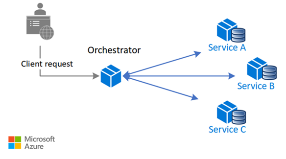
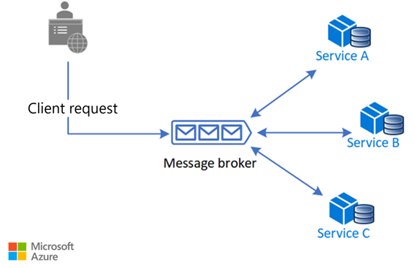
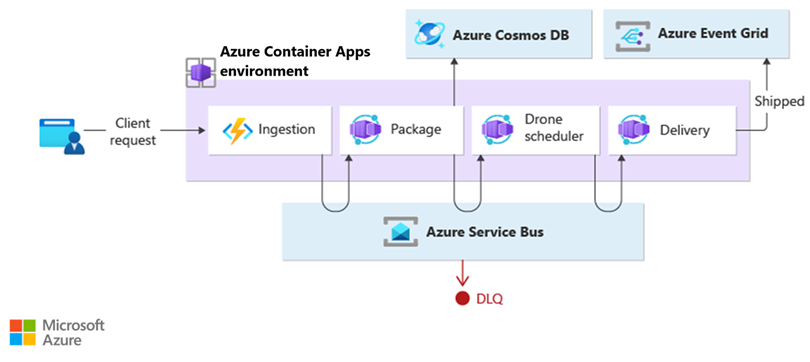

Have each component of the system participate in the decision-making process about the workflow of a business transaction, instead of relying on a central point of control.

## Context and problem

In microservices architecture, it's often the case that a cloud-based application is divided into several small services that work together to process a business transaction end-to-end. To lower coupling between services, each service is responsible for a single business operation. Some benefits include faster development, smaller code base, and scalability. However, designing an efficient and scalable workflow is a challenge and often requires complex interservice communication.

The services communicate with each other by using well-defined APIs. Even a single business operation can result in multiple point-to-point calls among all services. A common pattern for communication is to use a centralized service that acts as the orchestrator. It acknowledges all incoming requests and delegates operations to the respective services. In doing so, it also manages the workflow of the entire business transaction. Each service just completes an operation and is not aware of the overall workflow.

The orchestrator pattern reduces point-to-point communication between services but has some drawbacks because of the tight coupling between the orchestrator and other services that participate in processing of the business transaction. To execute tasks in a sequence, the orchestrator needs to have some domain knowledge about the responsibilities of those services. If you want to add or remove services, existing logic will break, and you'll need to rewire portions of the communication path. While you can configure the workflow, add or remove services easily with a well-designed orchestrator, such an implementation is complex and hard to maintain.



## Solution

Let each service decide when and how a business operation is processed, instead of depending on a central orchestrator.

One way to implement choreography is to use the [asynchronous messaging pattern](./publisher-subscriber.yml) to coordinate the business operations.



A client request publishes messages to a message queue. As messages arrive, they are pushed to subscribers, or services, interested in that message. Each subscribed service does their operation as indicated by the message and responds to the message queue with success or failure of the operation. In case of success, the service can push a message back to the same queue or a different message queue so that another service can continue the workflow if needed. If an operation fails, the message bus can retry that operation.

This way, the services choreograph the workflow among themselves without depending on an orchestrator or having direct communication between them.

Because there isn't point-to-point communication, this pattern helps reduce coupling between services. Also, it can remove the performance bottleneck caused by the orchestrator when it has to deal with all transactions.

## When to use this pattern

Use the choreography pattern if you expect to update or replace services frequently, and add or remove some services eventually. The entire app can be modified with less effort and minimal disruption to existing services.

Consider this pattern if you experience performance bottlenecks in the central orchestrator.

This pattern is a natural model for the serverless architecture where all services can be short lived, or event driven. Services can spin up because of an event, do their task, and are removed when the task is finished.

## Issues and considerations

Decentralizing the orchestrator can cause issues while managing the workflow.

If a service fails to complete a business operation, it can be difficult to recover from that failure. One way is to have the service indicate failure by firing an event. Another service subscribes to those failed events takes necessary actions such as applying [compensating transactions](./compensating-transaction.yml) to undo successful operations in a request. The failed service might also fail to fire an event for the failure. In that case, consider using a retry and, or time out mechanism to recognize that operation as a failure. For an example, see the Example section.

It's simple to implement a workflow when you want to process independent business operations in parallel. You can use a single message bus. However, the workflow can become complicated when choreography needs to occur in a sequence. For instance, Service C can start its operation only after Service A and Service B have completed their operations with success. One approach is to have multiple message buses that get messages in the required order. For more information, see the [Example](#example) section.

The choreography pattern becomes a challenge if the number of services grow rapidly. Given the high number of independent moving parts, the workflow between services tends to get complex. Also, distributed tracing becomes difficult.

The orchestrator centrally manages the resiliency of the workflow and it can become a single point of failure. On the other hand, for choreography, the role is distributed between all services and resiliency becomes less robust.

Each service isn't only responsible for the resiliency of its operation but also the workflow. This responsibility can be burdensome for the service and hard to implement. Each service must retry transient, nontransient, and time-out failures, so that the request terminates gracefully, if needed. Also, the service must be diligent about communicating the success or failure of the operation so that other services can act accordingly.

## Example

This example shows the choreography pattern with the [Drone Delivery app](https://github.com/mspnp/microservices-reference-implementation). When a client requests a pickup, the app assigns a drone and notifies the client.

 An example of this pattern is available on [GitHub](https://github.com/mspnp/cloud-design-patterns/tree/master/choreography).



A single client business transaction requires three distinct business operations: creating or updating a package, assigning a drone to deliver the package, and checking the delivery status. Those operations are performed by three microservices: Package, Drone Scheduler, and Delivery services. Instead of a central orchestrator, the services use messaging to collaborate and coordinate the request among themselves.

### Design

The business transaction is processed in a sequence through multiple hops. Each hop has a message bus and the respective business service.

When a client sends a delivery request through an HTTP endpoint, the Ingestion service receives it, raises an operation event, and sends it to a message bus. The bus invokes the subscribed business service and sends the event in a POST request. On receiving the event, the business service can complete the operation with success, failure, or the request can time out. If successful, the service responds to the bus with the Ok status code, raises a new operation event, and sends it to the message bus of the next hop. In case of a failure or time-out, the service reports failure by sending the BadRequest code to the message bus that sent the original POST request. The message bus retries the operation based on a retry policy. After that period expires, message bus flags the failed operation and further processing of the entire request stops.

This workflow continues until the entire request has been processed.

The design uses multiple message buses to process the entire business transaction. [Microsoft Azure Event Grid](/azure/event-grid/) provides the messaging service. The app is deployed in an [Azure Kubernetes Service (AKS)](/azure/aks/) cluster with [two containers in the same pod](https://kubernetes.io/docs/tasks/access-application-cluster/communicate-containers-same-pod-shared-volume/#creating-a-pod-that-runs-two-containers). One container runs the [ambassador](./ambassador.yml) that interacts with Event Grid while the other runs a business service. The approach with two containers in the same pod improves performance and scalability. The ambassador and the business service share the same network allowing for low latency and high throughput.

To avoid cascading retry operations that might lead to multiple efforts, only Event Grid retries an operation instead of the business service. It flags a failed request by sending a messaging to a [dead letter queue (DLQ)](/azure/service-bus-messaging/service-bus-dead-letter-queues).

The business services are idempotent to make sure retry operations don't result in duplicate resources. For example, the Package service uses upsert operations to add data to the data store.

The example implements a custom solution to correlate calls across all services and Event Grid hops.

Here's a code example that shows the choreography pattern between all business services. It shows the workflow of the Drone Delivery app transactions. Code for exception handling and logging have been removed for brevity.

```csharp
[HttpPost]
[Route("/api/[controller]/operation")]
[ProducesResponseType(typeof(void), 200)]
[ProducesResponseType(typeof(void), 400)]
[ProducesResponseType(typeof(void), 500)]

public async Task<IActionResult> Post([FromBody] EventGridEvent[] events)
{

   if (events == null)
   {
       return BadRequest("No Event for Choreography");
   }

   foreach(var e in events)
   {

        List<EventGridEvent> listEvents = new List<EventGridEvent>();
        e.Topic = eventRepository.GetTopic();
        e.EventTime = DateTime.Now;
        switch (e.EventType)
        {
            case Operations.ChoreographyOperation.ScheduleDelivery:
            {
                var packageGen = await packageServiceCaller.UpsertPackageAsync(delivery.PackageInfo).ConfigureAwait(false);
                if (packageGen is null)
                {
                    //BadRequest allows the event to be reprocessed by Event Grid
                    return BadRequest("Package creation failed.");
                }

                //we set the event type to the next choreography step
                e.EventType = Operations.ChoreographyOperation.CreatePackage;
                listEvents.Add(e);
                await eventRepository.SendEventAsync(listEvents);
                return Ok("Created Package Completed");
            }
            case Operations.ChoreographyOperation.CreatePackage:
            {
                var droneId = await droneSchedulerServiceCaller.GetDroneIdAsync(delivery).ConfigureAwait(false);
                if (droneId is null)
                {
                    //BadRequest allows the event to be reprocessed by Event Grid
                    return BadRequest("could not get a drone id");
                }
                e.Subject = droneId;
                e.EventType = Operations.ChoreographyOperation.GetDrone;
                listEvents.Add(e);
                await eventRepository.SendEventAsync(listEvents);
                return Ok("Drone Completed");
            }
            case Operations.ChoreographyOperation.GetDrone:
            {
                var deliverySchedule = await deliveryServiceCaller.ScheduleDeliveryAsync(delivery, e.Subject);
                return Ok("Delivery Completed");
            }
            return BadRequest();
    }
}
```

## Related resources

Consider these patterns in your design for choreography.

- Modularize the business service by using the [ambassador design pattern](./ambassador.yml).

- Implement [queue-based load leveling pattern](./queue-based-load-leveling.yml) to handle spikes of the workload.

- Use asynchronous distributed messaging through the [publisher-subscriber pattern](./publisher-subscriber.yml).

- Use [compensating transactions](./compensating-transaction.yml) to undo a series of successful operations in case one or more related operation fails.

- For information about using a message broker in a messaging infrastructure, see [Asynchronous messaging options in Azure](../guide/technology-choices/messaging.yml).
