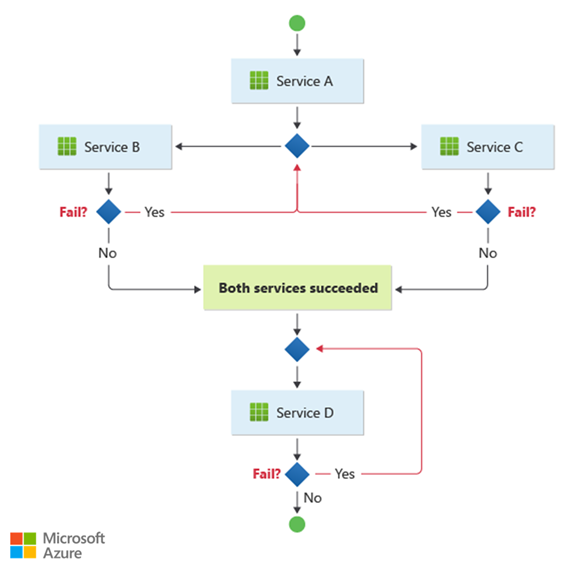
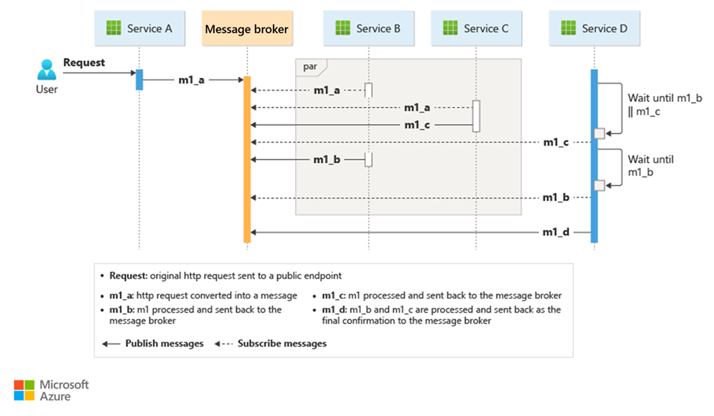

Decentralize workflow logic and distribute the responsibilities to other components within a system.

## Context and problem

A cloud-based application is often divided into several small services that work together to process a business transaction end-to-end. Even a single operation (within a transaction) can result in multiple point-to-point calls among all services. Ideally, those services should be loosely coupled. It's challenging to design a workflow that's distributed, efficient, and scalable because it often involves complex interservice communication.

A common pattern for communication is to use a centralized service or an *orchestrator*. Incoming requests flow through the orchestrator as it delegates operations to the respective services. Each service just completes their responsibility and isn't aware of the overall workflow.

The orchestrator pattern is typically implemented as custom software and has domain knowledge about the responsibilities of those services. A benefit is that the orchestrator can consolidate the status of a transaction based on the results of individual operations conducted by the downstream services. 

However, there are some drawbacks. Adding or removing services might break existing logic because you need to rewire portions of the communication path. This dependency makes orchestrator implementation complex and hard to maintain. The orchestrator might have a negative impact on the reliability of the workload. Under load, it can introduce performance bottleneck and be the single point of failure. It can also cause cascading failures in the downstream services.

## Solution

Delegate the transaction handling logic among the services. Let each service decide and participate in the communication workflow for a business operation.

> The pattern is a way to minimize dependency on custom software that centralizes the communication workflow. The components implement common logic as they choreograph the workflow among themselves without having direct communication with each other.

A common way to implement choreography is to use a message broker that buffers requests until downstream components claim and process them. The image shows request handling through a [publisher-subscriber model](./publisher-subscriber.yml).

1. A client requests are queued as messages in a message broker. 

1. The services or the subscriber poll the broker to determine if they can process that message based on their implemented business logic. The broker can also push messages to subscribers who are interested in that message. 

1. Each subscribed service does their operation as indicated by the message and responds to the broker with success or failure of the operation. 

1. If successful, the service can push a message back to the same queue or a different message queue so that another service can continue the workflow if needed. If the operation fails, the message broker works with other services to compensate that operation or the entire transaction.

## Issues and considerations

Decentralizing the orchestrator can cause issues while managing the workflow.

- Handling failures can be challenging. Components in an application might conduct atomic tasks but they might still have a level of dependency. Failure in one component can affect others, which might cause delays in completing the overall request. 

   To handle failures gracefully, implementing [compensating transactions](./compensating-transaction.yml) might introduce complexity. Failure handling logic, such as compensating transactions, is also prone to failures.

    

- The pattern is suitable for a workflow where independent business operations are processed in parallel. The workflow can become complicated when choreography needs to occur in a sequence. For instance, Service D can start its operation only after Service B and Service C have completed their operations with success.

    

- The pattern becomes a challenge if the number of services grow rapidly. Given the high number of independent moving parts, the workflow between services tends to get complex. Also, [distributed tracing](/dotnet/core/diagnostics/distributed-tracing) becomes difficult, although tools like [ServiceInsight together with NServiceBus](https://docs.particular.net/serviceinsight/#sequence-diagram) can help reduce these challenges.

- In an orchestrator-led design, the central component can partially participate and delegate resiliency logic to another component that retries transient, nontransient, and time-out failures, consistently. With the dissolution of the orchestrator in the choreography pattern, the downstream components shouldn't pick up those resiliency tasks. Those must still be handled by the resiliency handler. But now, the downstream components must directly communicate with the resiliency handler, increasing point-to-point communication. 

## When to use this pattern

Use this pattern when:

- The downstream components handle atomic operations independently. Think of it as a  'fire and forget' mechanism. A component is responsible for a task that doesn't need to be managed actively. When the task is complete, it sends notification to the other components.

- You expect the components to get updated and replaced frequently. The pattern enables the application to be modified with less effort and minimal disruption to existing services.

- The pattern is a natural fit for serverless architectures that are appropriate for simple workflows. The components can be short-lived and event-driven. When an event occurs, components are spun up, perform their tasks, and removed once the task is completed.

- This pattern can be a good choice for communications between bounded contexts. For communications inside an individual bounded context, an orchestrator pattern might be considered.

- There's performance bottleneck introduced by the central orchestrator.

This pattern might not be useful when:

- The application is complex and requires a central component to handle shared logic to keep the downstream components lightweight.

- There are situations where point-to-point communication between the components is inevitable.

- You need to consolidate all operations handled by downstream components, by using business logic. 

## Workload design

An architect should evaluate how the Choreography pattern can be used in their workload's design to address the goals and principles covered in the [Azure Well-Architected Framework pillars](/azure/well-architected/pillars). For example:

| Pillar | How this pattern supports pillar goals |
| :----- | :------------------------------------- |
| [Operational Excellence](/azure/well-architected/operational-excellence/checklist) helps deliver **workload quality** through **standardized processes** and team cohesion. | Because the distributed components in this pattern are autonomous and designed to be replaceable, you can modify the workload with less overall change to the system.   - [OE:04 Tools and processes](/azure/well-architected/operational-excellence/tools-processes) |
| [Performance Efficiency](/azure/well-architected/performance-efficiency/checklist) helps your workload **efficiently meet demands** through optimizations in scaling, data, code. | This pattern provides an alternative when performance bottlenecks occur in a centralized orchestration topology.   - [PE:02 Capacity planning](/azure/well-architected/performance-efficiency/capacity-planning)  - [PE:05 Scaling and partitioning](/azure/well-architected/performance-efficiency/scale-partition) |

As with any design decision, consider any tradeoffs against the goals of the other pillars that might be introduced with this pattern.

## Example

This example shows the choreography pattern by creating an event driven, cloud native workload running functions along with microservices. When a client requests a package to be shipped, the workload assigns a drone. Once the package is ready to pick up by the scheduled drone, the delivery process gets started. While in-transit the workload handles the delivery until it gains the shipped status.

The Ingestion service handles client requests and converts them into messages including the delivery details. Business transactions are initiated after consuming those new messages.

A single client business transaction requires three distinct business operations:

1. Create or update a package
2. Assign a drone to deliver the package
3. Handle the delivery that consists of checking and eventually raising awareness when shipped.

Three microservices perform the business processing: Package, Drone Scheduler, and Delivery services. Instead of a central orchestrator, the services use messaging to communicate among themselves. Each service would be responsible to implement a protocol in advance that coordinates in a decentralized way the business workflow.

### Design

The business transaction is processed in a sequence through multiple hops. Each hop is sharing a single message bus among all the business services.

When a client sends a delivery request through an HTTP endpoint, the Ingestion service receives it, converts such request into a message, and then publishes the message to the shared message bus. The subscribed business services are going to be consuming new messages added to the bus. On receiving the message, the business services can complete the operation with success, failure, or the request can time out. If successful, the services respond to the bus with the Ok status code, raises a new operation message, and sends it to the message bus. If there's a failure or time-out, the service reports failure by sending the reason code to the message bus. Additionally, the message is added to a dead-letter queue. Messages that couldn't be received or processed within a reasonable and appropriate amount of time are moved the DLQ as well.

The design uses multiple message buses to process the entire business transaction. [Microsoft Azure Service Bus](/azure/service-bus-messaging) and [Microsoft Azure Event Grid](/azure/event-grid/) are composed to provide with the messaging service platform for this design. The workload is deployed on [Azure Container Apps](/azure/container-apps/) hosting [Azure Functions](/azure/azure-functions/functions-container-apps-hosting/) for ingestion, and apps handling [event-driven processing](/azure/container-apps/scale-app?pivots=azure-cli#custom) that executes the business logic.

The design ensures the choreography to occur in a sequence. A single Azure Service Bus namespace contains a topic with two subscriptions and a session-aware queue. The Ingestion service publishes messages to the topic. The Package service and Drone Scheduler service subscribe to the topic and publish messages communicating the success to the queue. Including a common session identifier with a GUID associated to the delivery identifier, enables the ordered handling of unbounded sequences of related messages. The Delivery service awaits two related messages per transaction. The first message indicates the package is ready to be shipped, and the second signals that a drone is scheduled.

This design uses Azure Service Bus to handle high-value messages that can't be lost or duplicated during the entire delivery process. When the package is shipped, it's also published a change of state to Azure Event Grid. In this design, the event sender has no expectation about how the change of state is handled. Downstream organization services that aren't included as part of this design could be listening to this event type, and react executing specific business purpose logic (that is, email the shipped order status to the user).

> If you are planning to deploy this into another compute service such as [AKS](/azure/aks/) pub-sub pattern application boilerplate could be implemented with [two containers in the same pod](https://kubernetes.io/docs/tasks/access-application-cluster/communicate-containers-same-pod-shared-volume/#creating-a-pod-that-runs-two-containers). One container runs the [ambassador](./ambassador.yml) that interacts with your message bus of preference while the another executes the business logic. The approach with two containers in the same pod improves performance and scalability. The ambassador and the business service share the same network allowing for low latency and high throughput.

To avoid cascading retry operations that might lead to multiple efforts, business services should immediately flag unacceptable messages. It's possible to enrich such messages using well-known reason codes or a defined application code, so it can be moved to a [dead letter queue (DLQ)](/azure/service-bus-messaging/service-bus-dead-letter-queues). Consider managing consistency issues implementing [Saga](/azure/architecture/reference-architectures/saga/saga) from downstream services. For example, another service could handle dead lettered messages for remediation purposes only by executing a compensation, retry, or pivot transaction.

The business services are idempotent to make sure retry operations don't result in duplicate resources. For example, the Package service uses upsert operations to add data to the data store.

## Related resources

Consider these patterns in your design for choreography.

- Modularize the business service by using the [ambassador design pattern](./ambassador.yml).

- Implement [queue-based load leveling pattern](./queue-based-load-leveling.yml) to handle spikes of the workload.

- Use asynchronous distributed messaging through the [publisher-subscriber pattern](./publisher-subscriber.yml).

- Use [compensating transactions](./compensating-transaction.yml) to undo a series of successful operations in case one or more related operations fail.

- For information about using a message broker in a messaging infrastructure, see [Asynchronous messaging options in Azure](../guide/technology-choices/messaging.yml).

- [Choose between Azure messaging services](/azure/service-bus-messaging/compare-messaging-services)
