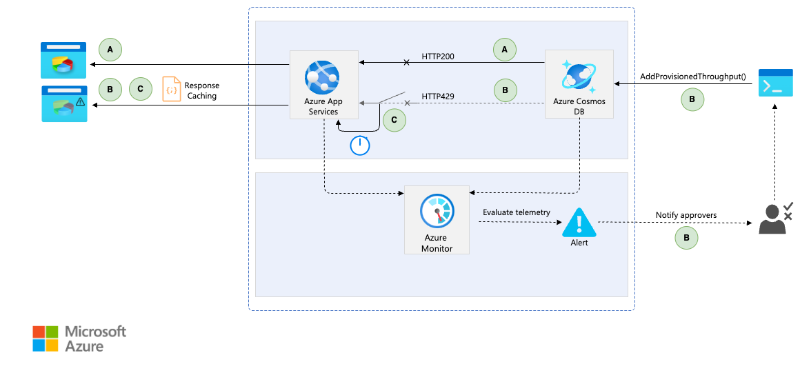

Handle faults that might take a variable amount of time to recover from, when connecting to a remote service or resource. This pattern can improve the stability and resiliency of an application.

## Context and problem

In a distributed environment, calls to remote resources and services can fail due to transient faults, such as slow network connections, time-outs, or the resources being overcommitted or temporarily unavailable. These faults typically correct themselves after a short period of time, and a robust cloud application should be prepared to handle them by using a strategy such as the [Retry pattern](./retry.yml).

However, there can also be situations where faults are due to unanticipated events, and that might take much longer to fix. These faults can range in severity from a partial loss of connectivity to the complete failure of a service. In these situations, it might be pointless for an application to continually retry an operation that is unlikely to succeed, and instead the application should quickly accept that the operation has failed and handle this failure accordingly.

Additionally, if a service is very busy, failure in one part of the system might lead to cascading failures. For example, an operation that invokes a service could be configured to implement a time-out, and reply with a failure message if the service fails to respond within this period. However, this strategy could cause many concurrent requests to the same operation to be blocked until the time-out period expires. These blocked requests might hold critical system resources such as memory, threads, database connections, and so on. So, these resources could become exhausted, causing failure of other possibly unrelated parts of the system that need to use the same resources. In these situations, it would be preferable for the operation to fail immediately, and only attempt to invoke the service if it's likely to succeed. Setting a shorter time-out might help to resolve this problem, but the time-out shouldn't be so short that the operation fails most of the time, even if the request to the service would eventually succeed.

## Solution

The Circuit Breaker pattern can prevent an application from repeatedly trying to execute an operation that's likely to fail. Allowing it to continue without waiting for the fault to be fixed or wasting CPU cycles while it determines that the fault is long lasting. The Circuit Breaker pattern also enables an application to detect whether the fault has been resolved. If the problem appears to have been fixed, the application can try to invoke the operation.

> The purpose of the Circuit Breaker pattern is different than the Retry pattern. The Retry pattern enables an application to retry an operation in the expectation that it'll succeed. The Circuit Breaker pattern prevents an application from performing an operation that is likely to fail. An application can combine these two patterns by using the Retry pattern to invoke an operation through a circuit breaker. However, the retry logic should be sensitive to any exceptions returned by the circuit breaker and abandon retry attempts if the circuit breaker indicates that a fault is not transient.

A circuit breaker acts as a proxy for operations that might fail. The proxy should monitor the number of recent failures that have occurred, and use this information to decide whether to allow the operation to proceed, or return an exception immediately.

The proxy can be implemented as a state machine with the following states that mimic the functionality of an electrical circuit breaker:

- **Closed**: The request from the application is routed to the operation. The proxy maintains a count of the number of recent failures, and if the call to the operation is unsuccessful the proxy increments this count. If the number of recent failures exceeds a specified threshold within a given time period, the proxy is placed into the **Open** state. At this point the proxy starts a time-out timer, and when this timer expires the proxy is placed into the **Half-Open** state.

    > The purpose of the time-out timer is to give the system time to fix the problem that caused the failure before allowing the application to try to perform the operation again.

- **Open**: The request from the application fails immediately and an exception is returned to the application.

- **Half-Open**: A limited number of requests from the application are allowed to pass through and invoke the operation. If these requests are successful, it's assumed that the fault that was previously causing the failure has been fixed and the circuit breaker switches to the **Closed** state (the failure counter is reset). If any request fails, the circuit breaker assumes that the fault is still present so it reverts to the **Open** state and restarts the time-out timer to give the system a further period of time to recover from the failure.

    > The **Half-Open** state is useful to prevent a recovering service from suddenly being flooded with requests. As a service recovers, it might be able to support a limited volume of requests until the recovery is complete, but while recovery is in progress a flood of work can cause the service to time out or fail again.

In the figure, the failure counter used by the **Closed** state is time based. It's automatically reset at periodic intervals. This design helps to prevent the circuit breaker from entering the **Open** state if it experiences occasional failures. The failure threshold that trips the circuit breaker into the **Open** state is only reached when a specified number of failures have occurred during a specified interval. The counter used by the **Half-Open** state records the number of successful attempts to invoke the operation. The circuit breaker reverts to the **Closed** state after a specified number of consecutive operation invocations have been successful. If any invocation fails, the circuit breaker enters the **Open** state immediately and the success counter will be reset the next time it enters the **Half-Open** state.

> How the system recovers is handled externally, possibly by restoring or restarting a failed component or repairing a network connection.

The Circuit Breaker pattern provides stability while the system recovers from a failure and minimizes the impact on performance. It can help to maintain the response time of the system by quickly rejecting a request for an operation that's likely to fail, rather than waiting for the operation to time out, or never return. If the circuit breaker raises an event each time it changes state, this information can be used to monitor the health of the part of the system protected by the circuit breaker, or to alert an administrator when a circuit breaker trips to the **Open** state.

The pattern is customizable and can be adapted according to the type of the possible failure. For example, you can apply an increasing time-out timer to a circuit breaker. You could place the circuit breaker in the **Open** state for a few seconds initially, and then if the failure hasn't been resolved, increase the time-out to a few minutes, and so on. In some cases, rather than the **Open** state returning failure and raising an exception, it could be useful to return a default value that is meaningful to the application.

> [!NOTE]
> Traditionally, circuit breakers relied on preconfigured thresholds such as failure count and time-out duration, resulting in a deterministic but sometimes suboptimal behavior. However, adaptive techniques using AI and ML can dynamically adjust thresholds based on real-time traffic patterns, anomalies, and historical failure rates, making the circuit breaker more resilient and efficient.

## Issues and considerations

You should consider the following points when deciding how to implement this pattern:

**Exception handling**: An application invoking an operation through a circuit breaker must be prepared to handle the exceptions raised if the operation is unavailable. The way exceptions are handled will be application specific. For example, an application could temporarily degrade its functionality, invoke an alternative operation to try to perform the same task or obtain the same data, or report the exception to the user and ask them to try again later.

**Types of exceptions**: A request might fail for many reasons, some of which might indicate a more severe type of failure than others. For example, a request might fail because a remote service has crashed and will take several minutes to recover, or because of a time-out due to the service being temporarily overloaded. A circuit breaker might be able to examine the types of exceptions that occur and adjust its strategy depending on the nature of these exceptions. For example, it might require a larger number of time-out exceptions to trip the circuit breaker to the **Open** state compared to the number of failures due to the service being completely unavailable.

**Monitoring**: A circuit breaker should provide clear observability into both failed and successful requests, enabling operations teams to assess system health. Use distributed tracing for end-to-end visibility across services.

**Recoverability**: You should configure the circuit breaker to match the likely recovery pattern of the operation it's protecting. For example, if the circuit breaker remains in the **Open** state for a long period, it could raise exceptions even if the reason for the failure has been resolved. Similarly, a circuit breaker could fluctuate and reduce the response times of applications if it switches from the **Open** state to the **Half-Open** state too quickly.

**Testing failed operations**: In the **Open** state, rather than using a timer to determine when to switch to the **Half-Open** state, a circuit breaker can instead periodically ping the remote service or resource to determine whether it's become available again. This ping could take the form of an attempt to invoke an operation that had previously failed, or it could use a special operation provided by the remote service specifically for testing the health of the service, as described by the [Health Endpoint Monitoring pattern](./health-endpoint-monitoring.yml).

**Manual override**: In a system where the recovery time for a failing operation is extremely variable, it's beneficial to provide a manual reset option that enables an administrator to close a circuit breaker (and reset the failure counter). Similarly, an administrator could force a circuit breaker into the **Open** state (and restart the time-out timer) if the operation protected by the circuit breaker is temporarily unavailable.

**Concurrency**: The same circuit breaker could be accessed by a large number of concurrent instances of an application. The implementation shouldn't block concurrent requests or add excessive overhead to each call to an operation.

**Resource differentiation**: Be careful when using a single circuit breaker for one type of resource if there might be multiple underlying independent providers. For example, in a data store that contains multiple shards, one shard might be fully accessible while another is experiencing a temporary issue. If the error responses in these scenarios are merged, an application might try to access some shards even when failure is highly likely, while access to other shards might be blocked even though it's likely to succeed.

**Accelerated circuit breaking**: Sometimes a failure response can contain enough information for the circuit breaker to trip immediately and stay tripped for a minimum amount of time. For example, the error response from a shared resource that's overloaded could indicate that an immediate retry isn't recommended and that the application should instead try again in a few minutes.

**Multi-region deployments**: A circuit breaker could be designed for single or multi-region deployments. The latter can be implemented using global load balancers or custom region-aware circuit breaking strategies that ensure controlled failover, latency optimization, and regulatory compliance.

**Service mesh circuit breakers**: Circuit breakers can be implemented at the application layer or as a cross-cutting, abstracted feature. For example, service meshes often support circuit breaking as a [sidecar](./sidecar.yml) or as a standalone capability without modifying application code.

> [!NOTE]
> A service can return HTTP 429 (Too Many Requests) if it's throttling the client, or HTTP 503 (Service Unavailable) if the service isn't currently available. The response can include additional information, such as the anticipated duration of the delay.

**Replaying failed requests**: In the **Open** state, rather than simply failing quickly, a circuit breaker could also record the details of each request to a journal and arrange for these requests to be replayed when the remote resource or service becomes available.

**Inappropriate time-outs on external services**: A circuit breaker might not be able to fully protect applications from operations that fail in external services that are configured with a lengthy time-out period. If the time-out is too long, a thread running a circuit breaker might be blocked for an extended period before the circuit breaker indicates that the operation has failed. In this time, many other application instances might also try to invoke the service through the circuit breaker and tie up a significant number of threads before they all fail.

**Adaptability to compute diversification**: Circuit breakers should account for different compute environments, from serverless to containerized workloads, where factors like cold starts and scalability impact failure handling. Adaptive approaches can dynamically adjust strategies based on the compute type, ensuring resilience across heterogeneous architectures.

## When to use this pattern

Use this pattern:

- To prevent cascading failures by stopping excessive invokes by a remote service or access requests to a shared resource if these operations are highly likely to fail.
- To enhance multi-region resilience by routing traffic intelligently based on real-time failure signals.
- To protect against slow dependencies, helping you to keep up with your service level objectives (SLOs), and to avoid performance degradation due to high-latency services.
- To handle intermittent connectivity issues and reduce request failures in distributed environments.

This pattern isn't recommended:

- For handling access to local private resources in an application, such as in-memory data structure. In this environment, using a circuit breaker would add overhead to your system.
- As a substitute for handling exceptions in the business logic of your applications.
- When well-known retry algorithms are sufficient and your dependencies are designed to deal with retry mechanisms. Implementing a circuit breaker in your application in this case, could add unnecessary complexity to your system.
- When waiting for a circuit breaker to reset might introduce unacceptable delays.
- If you have a message-driven or event-driven architecture, as they often route failed messages to a Dead Letter Queue (DLQ) for manual or deferred processing. The built-in failure isolation and retry mechanisms typically implemented in these designs are often sufficient.
- If failure recovery is managed at the infrastructure or platform level, such as with health checks in global load balancers or service meshes, circuit breakers might not be necessary.

## Workload design

An architect should evaluate how the Circuit Breaker pattern can be used in their workload's design to address the goals and principles covered in the [Azure Well-Architected Framework pillars](/azure/well-architected/pillars). For example:

| Pillar | How this pattern supports pillar goals |
| :----- | :------------------------------------- |
| [Reliability](/azure/well-architected/reliability/checklist) design decisions help your workload become **resilient** to malfunction and to ensure that it **recovers** to a fully functioning state after a failure occurs. | This pattern prevents overloading a faulting dependency. You can also use this pattern to trigger graceful degradation in the workload. Circuit breakers are often coupled with automatic recovery to provide both self-preservation and self-healing.   - [RE:03 Failure mode analysis](/azure/well-architected/reliability/failure-mode-analysis)  - [RE:07 Transient faults](/azure/well-architected/reliability/handle-transient-faults)  - [RE:07 Self-preservation](/azure/well-architected/reliability/self-preservation) |
| [Performance Efficiency](/azure/well-architected/performance-efficiency/checklist) helps your workload **efficiently meet demands** through optimizations in scaling, data, code. | This pattern avoids the retry-on-error approach which can lead to excessive resource utilization during dependency recovery and can also overload performance on a dependency that's attempting recovery.   - [PE:07 Code and infrastructure](/azure/well-architected/performance-efficiency/optimize-code-infrastructure)  - [PE:11 Live-issues responses](/azure/well-architected/performance-efficiency/respond-live-performance-issues) |

As with any design decision, consider any tradeoffs against the goals of the other pillars that might be introduced with this pattern.

## Example

This example shows the Circuit Breaker pattern implemented in a cloud-native application using the [Azure Cosmos DB lifetime free tier](/azure/cosmos-db/free-tier). The database’s throughput is governed by a capacity plan that provisions a designated quota of resource units per second, considering it primarily serves non-critical data. During seasonal events, demand can exceed the provided capacity of 1000 RU/s, resulting in `429` (Too Many Requests) responses. Although the database supports both pay-as-you-go pricing and autoscaling, management vigilantly monitors monthly budgets and must explicitly authorize any increases in costs.

When these demand spikes occur, [Azure Monitor alerts with dynamic thresholds](/azure/azure-monitor/alerts/alerts-dynamic-thresholds) detects and proactively notify the operations and management teams indicating that scaling-up the database capacity could be required. Simultaneously, a circuit breaker—tuned using historical error patterns—trips to prevent cascading failures. In this state, the application gracefully degrades by returning default or cached responses, thereby informing users of the temporary unavailability of certain data while preserving overall system stability.

This strategy not only enhances resilience but also provides strong business justification: by controlling capacity surges and managing cost increases deliberately, we maintain service quality without unexpectedly inflating our operating expenses. Once demand subsides and increased capacity is confirmed, the circuit breaker resets automatically, allowing the system to resume full functionality in alignment with both technical and budgetary objectives.

#### Flow A - Closed State

1. The system operates normally, and all requests reach the database without returning any `HTTP429` (Too Many Requests).
1. The circuit breaker remains closed, and no default or cached responses are necessary.

#### Flow B - Open State

1. Upon receiving the first `HTTP429` response, the circuit breaker trips to an open state.
1. Subsequent requests are immediately short-circuited, returning default or cached responses while informing users of temporary degradation, thereby protecting the application from further overload and potential cascading failtures.
1. Logs and telemetry data are captured and sent to Azure Monitor so it can be evaluated against dynamic thresholds. An alert is triggered if the conditions of the alert rule are met.
1. An action group proactively notifies the management team of the overload situation.
1. Upon management approval, the operations team can increase the provisioned throughput to mitigate the overload.

#### Flow C - Half-Open State

1. After a predefined timeout, the circuit breaker enters a half-open state, permitting a limited number of trial requests.
1. If these trial requests succeed without returning `HTTP429` responses, the breaker resets to a closed state, restoring normal operations back to Flow A. If failures persist, it reverts to the open state which is Flow B.

### Design

- [Azure App Services](/azure/app-service/overview) is hosting the web application acting as the primary entry point for client requests. The cloud-native application implements the logic that enforces circuit breaker policies, and delivers default or cached responses when the circuit is open. This architecture prevents overload on downstream systems and ensures that the user experience is maintained even during peak demand or failures.
- [Azure Cosmos DB](/azure/cosmos-db/introduction) is one of the data store for the application serving non-critical data using the free tier that is meant for running small production workloads. The circuit breaker mechanism helps limiting traffic to the database during periods of high demand.
- [Azure Monitor](/azure/azure-monitor/overview) functions as the centralized monitoring solution, aggregating all activity logs to ensure comprehensive, end-to-end observability. Continuously collects logs and telemetry data from Azure App Services and tracks key metrics from Azure Cosmos DB (such as the number of 429 responses).
- [Azure Monitor alerts](/azure/azure-monitor/alerts/alerts-overview) help to evaluate alert rules against [dynamic thresholds](/azure/azure-monitor/alerts/alerts-dynamic-thresholds) helping to recognize what is considered an outage based on historical data. Notifies the management team when thresholds are breached. If the management approves the increase in provisioned throughput but the operations team opts to wait, anticipating recovery as the load isn't too high, the circuit breaker timeout elapses naturally. During this time, if the `HTTP429` responses cease, the threshold calculation detects the prolonged outages and excludes them from the learning algorithm. As a result, next time the threshold waits for higher error rate in Azure Cosmos DB, so the notification is delayed, allowing the circuit breaker to handle the issue without an immediate alert reducing costs.

## Related resources

The following patterns might also be useful when implementing this pattern:

- [Reliable web app pattern](../web-apps/guides/enterprise-app-patterns/overview.md#reliable-web-app-pattern) shows you how to apply the circuit-breaker pattern to web applications converging on the cloud.

- [Retry pattern](./retry.yml). Describes how an application can handle anticipated temporary failures when it tries to connect to a service or network resource by transparently retrying an operation that has previously failed.

- [Health Endpoint Monitoring pattern](./health-endpoint-monitoring.yml). A circuit breaker might be able to test the health of a service by sending a request to an endpoint exposed by the service. The service should return information indicating its status.
