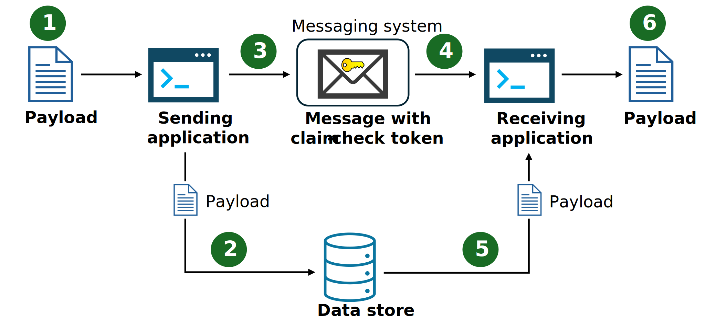

The Claim-Check pattern allows workloads to transfer payloads without storing the payload in a messaging system. The pattern stores the payload in an external data store and uses a "claim check" to retrieve the payload. The claim check is a unique, obscure token or key. To retrieve the payload, applications need to present the claim-check token to the external data store.

## Context and problem

Traditional messaging systems are optimized to manage a high volume of small messages and often have restrictions on the message size they can handle. Large messages not only risk exceeding these limits but can also degrade the performance of the entire system when the messaging system stores them.

## Solution

Use the Claim-Check pattern, and don't send large messages to the messaging system. Instead, send the payload to an external data store and generate a claim-check token for that payload. The messaging system sends a message with the claim-check token to receiving applications so these applications can retrieve the payload from the data store. The messaging system never sees or stores the payload.

1. Payload
1. Save payload in data store.
1. Generate claim-check token and send message with claim-check token.
1. Receive message and read claim-check token.
1. Retrieve the payload.
1. Process the payload.

## Issues and considerations with the Claim-Check pattern

Consider the following recommendations when implementing the Claim-Check pattern:

- *Delete consumed messages.* If you don't need to archive the message, delete the message and payload after the receiving applications consume it. Use either a synchronous or asynchronous deletion strategy:

  - *Synchronous deletion*: The consuming application deletes the message and payload immediately after consumption. It ties deletion to the message handling workflow and uses messaging-workflow compute capacity.
  
  - *Asynchronous deletion*: A process outside the message processing workflow deletes the message and payload. It decouples the deletion process from the message handling workflow and minimizes use of messaging-workflow compute.
  
- *Implement the pattern conditionally.* Incorporate logic in the sending application that applies the Claim-Check pattern if the message size surpasses the messaging system's limit. For smaller messages, bypass the pattern and send the smaller message to the messaging system. This conditional approach reduces latency, optimizes resources utilization, and improves throughput.

## When to use the Claim-Check pattern

The following scenarios are the primary use cases for the Claim-Check pattern:

- *Messaging system limitations*: Use the Claim-Check pattern when message sizes surpass the limits of your messaging system. Offload the payload to external storage. Send only the message with its claim-check token to the messaging system.

- *Messaging system performance*: Use the Claim-Check pattern when large messages are straining the messaging system and degrading system performance.

The following scenarios are secondary use cases for the Claim-Check pattern:

- *Sensitive data protection*: Use the Claim-Check pattern when payloads contain sensitive data that you don't want visible to the messaging system. Apply the pattern to all or portions of sensitive information in the payload. Secure the sensitive data without transmitting it directly through the messaging system.

- *Complex routing scenarios*: Messages traversing multiple components can cause performance bottlenecks due to serialization, deserialization, encryption, and decryption tasks. Use the Claim-Check pattern to prevent direct message processing by intermediary components.

## Workload design with the Claim-Check pattern

An architect should evaluate how the Claim-Check pattern can be used in their workload's design to address the goals and principles covered in the [Azure Well-Architected Framework pillars](/azure/well-architected/pillars). For example:

| Pillar | How this pattern supports pillar goals |
| :----- | :------------------------------------- |
| [Reliability](/azure/well-architected/reliability/checklist) design decisions help your workload become **resilient** to malfunction and ensure it fully **recovers** after failure. | Messaging systems don't provide the same reliability and disaster recovery that are often present in dedicated data stores. Separating the data from the message can provide increased reliability for the payload. This separation facilitates data redundancy that allows you to recover payloads after a disaster.   - [RE:03 Failure mode analysis](/azure/well-architected/reliability/failure-mode-analysis)  - [RE:09 Disaster recovery](/azure/well-architected/reliability/disaster-recovery) |
| [Security](/azure/well-architected/security/checklist) design decisions help ensure the **confidentiality**, **integrity**, and **availability** of workload data and systems. | The Claim-Check pattern can extract sensitive data from messages and store it in a secure data store. This setup allows you to implement tighter access controls, ensuring that only the services intended to use the sensitive data can access it. At the same time, it hides this data from unrelated services, such as those used for queue monitoring.   - [SE:03 Data classification](/azure/well-architected/security/data-classification)  - [SE:04 Segmentation](/azure/well-architected/security/segmentation) |
| [Cost Optimization](/azure/well-architected/cost-optimization/checklist) is focused on **sustaining and improving** your workload's **return on investment**. | Messaging systems often impose limits on message size, and increased size limits is often a premium feature. Reducing the size of message bodies might enable you to use a cheaper messaging solution.   - [CO:07 Component costs](/azure/well-architected/cost-optimization/optimize-component-costs)  - [CO:09 Flow costs](/azure/well-architected/cost-optimization/optimize-flow-costs) |
| [Performance Efficiency](/azure/well-architected/performance-efficiency/checklist) helps your workload **efficiently meet demands** by optimizing scaling, data transfer, and code execution. | The Claim-Check pattern improves the efficiency of sending and receiving applications and the messaging system by managing large messages more effectively. It reduces the size of messages sent to the messaging system and ensures receiving applications access large messages only when needed.   - [PE:05 Scaling and partitioning](/azure/well-architected/performance-efficiency/scale-partition)  - [PE:12 Continuous performance optimization](/azure/well-architected/performance-efficiency/continuous-performance-optimize) |

As with any design decision, consider any tradeoffs against the goals of the other pillars that might be introduced with this pattern.

## Claim-check pattern examples

The following examples demonstrate how Azure facilitates the implementation of the Claim-Check Pattern:

- *Azure messaging systems*: The examples cover four different Azure messaging system scenarios: Azure Queue Storage, Azure Event Hubs (Standard API), Azure Service Bus, and Azure Event Hubs (Kafka API).

- *Automatic vs. manual claim-check token generation*: These examples also show two methods to generate the claim-check token. In code examples 1-3, Azure Event Grid automatically generates the token when the sending application transfers the payload to Azure Blob Storage. Code example 4 shows a manual token generation process using an executable command-line client.

Choose the example that suits your needs and follow the provided link to view the code on GitHub:

| Sample code                   | Messaging system scenarios      | Token generator               | Receiving application                           | Data store         |
|-------------------------------|---------------------------------|-------------------------------|-------------------------------------------------|--------------------|
| [Code example 1][example-1]   | Azure Queue Storage             | Azure Event Grid              | Function                                        | Azure Blob Storage |
| [Code example 2][example-2]   | Azure Event Hubs (Standard API) | Azure Event Grid              | Executable command-line client                  | Azure Blob Storage |
| [Code example 3][example-3]   | Azure Service Bus               | Azure Event Grid              | Function                                        | Azure Blob Storage |
| [Code example 4][example-4]   | Azure Event Hubs (Kafka API)    | Executable command-line client| Function                                        | Azure Blob Storage |

## Next steps

- The Enterprise Integration Patterns site has a [description][enterprise-integration-patterns] of this pattern.
- For another example, see [Dealing with large Service Bus messages using Claim-Check pattern](https://www.serverless360.com/blog/deal-with-large-service-bus-messages-using-claim-check-pattern) (blog post).
- An alternative pattern for handling large messages is [Split][splitter] and [Aggregate][aggregator].
- Libraries like NServiceBus provide support for this pattern out-of-the-box with their [DataBus feature](https://docs.particular.net/nservicebus/messaging/claimcheck/).

## Related resources

- [Asynchronous Request-Reply Pattern](./async-request-reply.yml)
- [Competing Consumers pattern](./competing-consumers.yml)
- [Sequential Convoy pattern](./sequential-convoy.yml)

<!-- links -->
[aggregator]: https://www.enterpriseintegrationpatterns.com/patterns/messaging/Aggregator.html
[enterprise-integration-patterns]: https://www.enterpriseintegrationpatterns.com/patterns/messaging/StoreInLibrary.html
[example-1]: https://github.com/mspnp/cloud-design-patterns/tree/main/claim-check/code-samples/sample-1
[example-2]: https://github.com/mspnp/cloud-design-patterns/tree/main/claim-check/code-samples/sample-2
[example-3]: https://github.com/mspnp/cloud-design-patterns/tree/main/claim-check/code-samples/sample-3
[example-4]: https://github.com/mspnp/cloud-design-patterns/tree/main/claim-check/code-samples/sample-4
[splitter]: https://www.enterpriseintegrationpatterns.com/patterns/messaging/Sequencer.html