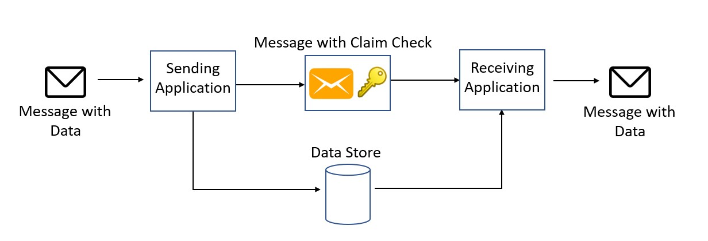

Split a large message into a claim check and a payload. Send the claim check to the messaging platform and store the payload to an external service. This pattern allows large messages to be processed, while protecting the message bus and the client from being overwhelmed or slowed down. This pattern also helps to reduce costs, as storage is usually cheaper than resource units used by the messaging platform.

This pattern is also known as Reference-Based Messaging, and was originally [described][enterprise-integration-patterns] in the book *Enterprise Integration Patterns*, by Gregor Hohpe and Bobby Woolf.

## Context and problem

A messaging-based architecture at some point must be able to send, receive, and manipulate large messages. Such messages may contain anything, including images (for example, MRI scans), sound files (for example, call-center calls), text documents, or any kind of binary data of arbitrary size.

Sending such large messages to the message bus directly is not recommended, because they require more resources and bandwidth to be consumed. Large messages can also slow down the entire solution, because messaging platforms are usually fine-tuned to handle huge quantities of small messages. Also, most messaging platforms have limits on message size, so you may need to work around these limits for large messages.

## Solution

Store the entire message payload into an external service, such as a database. Get the reference to the stored payload, and send just that reference to the message bus. The reference acts like a claim check used to retrieve a piece of luggage, hence the name of the pattern. Clients interested in processing that specific message can use the obtained reference to retrieve the payload, if needed.



1. Send message
1. Store message on the data store
1. Enqueue the message's reference
1. Read the message's reference
1. Retrieve the message
1. Process the message

## Issues and considerations

Consider the following points when deciding how to implement this pattern:

- Consider deleting the message data after consuming it, if you don't need to archive the messages. Although blob storage is relatively cheap, it costs some money in the long run, especially if there is a lot of data. Deleting the message can be done synchronously by the application that receives and processes the message, or asynchronously by a separate dedicated process. The asynchronous approach removes old data with no impact on the throughput and message processing performance of the receiving application.

- Storing and retrieving the message causes some additional overhead and latency. You may want to implement logic in the sending application to use this pattern only when the message size exceeds the data limit of the message bus. The pattern would be skipped for smaller messages. This approach would result in a conditional claim-check pattern.

## When to use this pattern

This pattern could be used whenever a message cannot fit the supported message limit of the chosen message bus technology. For example, Service Bus currently has a limit of 100 MB (premium tier), while Event Grid supports up to 1 MB messages.

The pattern can also be used if the payload should be accessed only by services that are authorized to see it. By offloading the payload to an external resource, stricter authentication and authorization rules can be put in place, to ensure that security is enforced when sensitive data is stored in the payload.

## Examples

On Azure, this pattern can be implemented in several ways and with different technologies, but there are two main categories. In both cases, the receiver has the responsibility to read the claim check and use it to retrieve the payload.

- **Automatic claim-check generation**. This approach uses [Azure Event Grid](/azure/event-grid) to automatically generate the claim check and push it into the message bus.

- **Manual claim-check generation**. In this approach, the sender is responsible for managing the payload. The sender stores the payload using the appropriate service, gets or generates the claim check, and sends the claim check to the message bus.

Event Grid is an event routing service and tries to deliver events within a configurable amount of time up to 24 hours. After that, events are either discarded or dead lettered. If you need to archive the event payloads or replay the event stream, you can add an Event Grid subscription to Event Hubs or Queue Storage, where messages can be retained for longer periods and archiving messages is supported. For information about fine tuning Event Grid message delivery and retry, and dead letter configuration, see  [Dead letter and retry policies](/azure/event-grid/manage-event-delivery).

### Automatic claim-check generation with Blob Storage and Event Grid

In this approach, the sender drops the message payload into a designated Azure Blob Storage container. Event Grid automatically generates a tag/reference and sends it to a supported message bus, such as Azure Storage Queues. The receiver can poll the queue, get the message, and then use the stored reference data to download the payload directly from Blob Storage.

The same Event Grid message can be directly consumed by [Azure Functions](/azure/azure-functions), without needing to go through a message bus. This approach takes full advantage of the serverless nature of both Event Grid and Functions.

You can find example code for this approach [here][example-1].

### Event Grid with Event Hubs

Similar to the previous example, Event Grid automatically generates a message when a payload is written to an Azure Blob container. But in this example,  the message bus is implemented using Event Hubs. A client can register itself to receive the stream of messages as they are written to the event hub. The event hub can also be configured to archive messages, making them available as an Avro file that can be queried using tools like Apache Spark, Apache Drill, or any of the available Avro libraries.

You can find example code for this approach [here][example-2].

### Claim check generation with Service Bus

This solution takes advantage of a specific Service Bus plugin, [ServiceBus.AttachmentPlugin](https://www.nuget.org/packages/ServiceBus.AttachmentPlugin), which makes the claim-check workflow easy to implement. The plugin converts any message body into an attachment that gets stored in Azure Blob Storage when the message is sent.

```csharp
using ServiceBus.AttachmentPlugin;
...

// Getting connection information
var serviceBusConnectionString = Environment.GetEnvironmentVariable("SERVICE_BUS_CONNECTION_STRING");
var queueName = Environment.GetEnvironmentVariable("QUEUE_NAME");
var storageConnectionString = Environment.GetEnvironmentVariable("STORAGE_CONNECTION_STRING");

// Creating config for sending message
var config = new AzureStorageAttachmentConfiguration(storageConnectionString);

// Creating and registering the sender using Service Bus Connection String and Queue Name
var sender = new MessageSender(serviceBusConnectionString, queueName);
sender.RegisterAzureStorageAttachmentPlugin(config);

// Create payload
var payload = new { data = "random data string for testing" };
var serialized = JsonConvert.SerializeObject(payload);
var payloadAsBytes = Encoding.UTF8.GetBytes(serialized);
var message = new Message(payloadAsBytes);

// Send the message
await sender.SendAsync(message);
```

The Service Bus message acts as a notification queue, which a client can subscribe to. When the consumer receives the message, the plugin makes it possible to directly read the message data from Blob Storage. You can then choose how to process the message further. An advantage of this approach is that it abstracts the claim-check workflow from the sender and receiver.

You can find example code for this approach [here][example-3].

### Manual claim-check generation with Kafka

In this example, a Kafka client writes the payload to Azure Blob Storage. Then it sends a notification message using [Kafka-enabled Event Hubs](/azure/event-hubs/event-hubs-quickstart-kafka-enabled-event-hubs). The consumer receives the message and can access the payload from Blob Storage. This example shows how a different messaging protocol can be used to implement the claim-check pattern in Azure. For example, you might need to support existing Kafka clients.

You can find example code for this approach [here][example-4].

## Next steps

- The examples described above are available on [GitHub][sample-code].
- The Enterprise Integration Patterns site has a [description][enterprise-integration-patterns] of this pattern.
- For another example, see [Dealing with large Service Bus messages using claim check pattern](https://www.serverless360.com/blog/deal-with-large-service-bus-messages-using-claim-check-pattern) (blog post).
- An alternative pattern for handling large messages is [Split][splitter] and [Aggregate][aggregator].
- Libraries like NServiceBus provide support for this pattern out-of-the-box with their ["data bus" functionality](https://docs.particular.net/samples/azure/blob-storage-databus/).

## Related resources

- [Asynchronous Request-Reply Pattern](./async-request-reply.yml)
- [Competing Consumers pattern](./competing-consumers.yml)
- [Sequential Convoy pattern](./sequential-convoy.yml)

<!-- links -->
[aggregator]: https://www.enterpriseintegrationpatterns.com/patterns/messaging/Aggregator.html
[enterprise-integration-patterns]: https://www.enterpriseintegrationpatterns.com/patterns/messaging/StoreInLibrary.html
[example-1]: https://github.com/mspnp/cloud-design-patterns/tree/master/claim-check/code-samples/sample-1
[example-2]: https://github.com/mspnp/cloud-design-patterns/tree/master/claim-check/code-samples/sample-2
[example-3]: https://github.com/mspnp/cloud-design-patterns/tree/master/claim-check/code-samples/sample-3
[example-4]: https://github.com/mspnp/cloud-design-patterns/tree/master/claim-check/code-samples/sample-4
[sample-code]: https://github.com/mspnp/cloud-design-patterns/tree/master/claim-check
[splitter]: https://www.enterpriseintegrationpatterns.com/patterns/messaging/Sequencer.html
