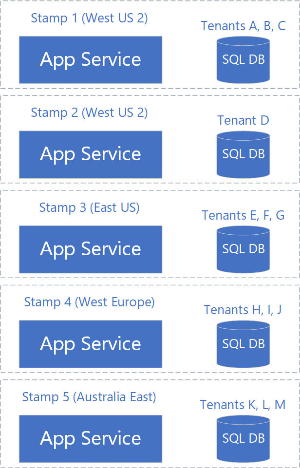
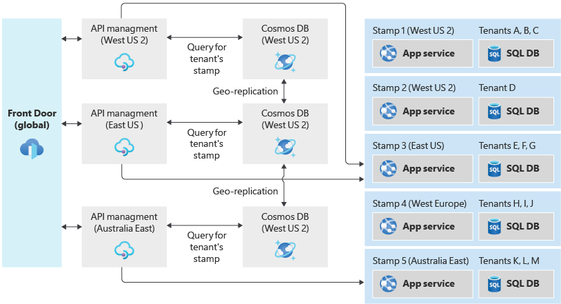

<!-- cSpell:ignore johndowns myapi backplane -->
The deployment stamp pattern involves provisioning, managing, and monitoring a heterogeneous group of resources to host and operate multiple workloads or tenants. Each individual copy is called a *stamp*, or sometimes a *service unit*, *scale unit*, or *cell*. In a multi-tenant environment, every stamp or scale unit can serve a predefined number of tenants. Multiple stamps can be deployed to scale the solution almost linearly and serve an increasing number of tenants. This approach can improve the scalability of your solution, allow you to deploy instances across multiple regions, and separate your customer data.

## Context and problem

When hosting an application in the cloud, there are certain considerations to be made. One key thing to keep in mind is the performance and reliability of your application. If you host a single instance of your solution, you might be subject to the following limitations:

- **Scale limits.** Deploying a single instance of your application might result in natural scaling limits. For example, you might use services that have limits on the number of inbound connections, host names, TCP sockets, or other resources.
- **Non-linear scaling or cost.** Some of your solution's components might not scale linearly with the number of requests or the amount of data. Instead, there can be a sudden decrease in performance or increase in cost once a threshold has been met. For example, you might use a database and discover that the marginal cost of adding more capacity (scaling up) becomes prohibitive, and that scaling out is a more cost-effective strategy. Similarly, [Azure Front Door](https://azure.microsoft.com/pricing/details/frontdoor/) has higher per-domain pricing when a high number of custom domains are deployed, and it might be better to spread the custom domains across multiple Front Door instances.
- **Separation of customers.** You might need to keep certain customers' data isolated from other customers' data. Similarly, you might have some customers that require more system resources to service than others, and consider grouping them on different sets of infrastructure.
- **Handling single- and multi-tenant instances.** You might have some large customers who need their own independent instances of your solution. You might also have a pool of smaller customers who can share a multi-tenant deployment.
- **Complex deployment requirements.** You might need to deploy updates to your service in a controlled manner, and to deploy to different subsets of your customer base at different times.
- **Update frequency.** You might have some customers who are tolerant of having frequent updates to your system, while others might be risk-averse and want infrequent updates to the system that services their requests. It might make sense to have these customers deployed to isolated environments.
- **Geographical or geopolitical restrictions.** To architect for low latency, or to comply with data sovereignty requirements, you might deploy some of your customers into specific regions.

## Solution

To avoid these issues, consider grouping resources in *scale units* and provisioning multiple copies of your *stamps*. Each *scale unit* will host and serve a subset of your tenants. Stamps operate independently of each other and can be deployed and updated independently. A single geographical region might contain a single stamp, or might contain multiple stamps to allow for horizontal scale-out within the region. Stamps contain a subset of your customers.

Deployment stamps can apply whether your solution uses infrastructure as a service (IaaS) or platform as a service (PaaS) components, or a mixture of both. Typically IaaS workloads require more intervention to scale, so the pattern might be useful for IaaS-heavy workloads to allow for scaling out.

Stamps can be used to implement [deployment rings](/azure/devops/migrate/phase-rollout-with-rings). If different customers want to receive service updates at different frequencies, they can be grouped onto different stamps, and each stamp could have updates deployed at different cadences.

Because stamps run independently from each other, data is implicitly *sharded*. Furthermore, a single stamp can make use of further sharding to internally allow for scalability and elasticity within the stamp.

The deployment stamp pattern is used internally by many Azure services, including [App Service](/archive/msdn-magazine/2017/february/azure-inside-the-azure-app-service-architecture), [Azure Stack](/azure-stack/operator/azure-stack-capacity-planning-overview), and [Azure Storage](/azure/storage/common/storage-redundancy-zrs).

Deployment stamps are related to, but distinct from, [geodes](geodes.yml). In a deployment stamp architecture, multiple independent instances of your system are deployed and contain a subset of your customers and users. In geodes, all instances can serve requests from any users, but this architecture is often more complex to design and build. You might also consider mixing the two patterns within one solution; the [traffic routing approach](#traffic-routing) described below is an example of such a hybrid scenario.

### Deployment

Because of the complexity that is involved in deploying identical copies of the same components, good DevOps practices are critical to ensure success when implementing this pattern. Consider describing your infrastructure as code, such as by using [Bicep](/azure/azure-resource-manager/bicep/overview), [JSON Azure Resource Manager templates (ARM templates)](/azure/azure-resource-manager/template-deployment-overview), [Terraform](/azure/developer/terraform/overview), and scripts. With this approach, you can ensure that the deployment of each stamp is predictable and repeatable. It also reduces the likelihood of human errors such as accidental mismatches in configuration between stamps.

You can deploy updates automatically to all stamps in parallel, in which case you might consider technologies like [Bicep](/azure/azure-resource-manager/bicep/overview) or Resource Manager templates to coordinate the deployment of your infrastructure and applications. Alternatively, you might decide to gradually roll out updates to some stamps first, and then progressively to others. Consider using a release management tool like [Azure Pipelines](https://azure.microsoft.com/services/devops/pipelines/) or [GitHub Actions](https://docs.github.com/actions) to orchestrate deployments to each stamp. For more information, see:

- [Integrate Bicep with Azure Pipelines](/azure/azure-resource-manager/bicep/add-template-to-azure-pipelines)
- [Integrate JSON ARM templates with Azure Pipelines](/azure/azure-resource-manager/templates/add-template-to-azure-pipelines)

Carefully consider the topology of the Azure subscriptions and resource groups for your deployments:

- Typically a subscription will contain all resources for a single solution, so in general consider using a single subscription for all stamps. However, [some Azure services impose subscription-wide quotas](/azure/azure-subscription-service-limits), so if you are using this pattern to allow for a high degree of scale-out, you might need to consider deploying stamps across different subscriptions.
- Resource groups are generally used to deploy components with the same lifecycle. If you plan to deploy updates to all of your stamps at once, consider using a single resource group to contain all of the components for all of your stamps, and use resource naming conventions and tags to identify the components that belong to each stamp. Alternatively, if you plan to deploy updates to each stamp independently, consider deploying each stamp into its own resource group.

### Capacity planning

Use load and performance testing to determine the approximate load that a given stamp can accommodate. Load metrics might be based on the number of customers/tenants that a single stamp can accommodate, or metrics from the services that the components within the stamp emit. Ensure that you have sufficient instrumentation to measure when a given stamp is approaching its capacity, and the ability to deploy new stamps quickly to respond to demand.

### Traffic routing

The Deployment Stamp pattern works well if each stamp is addressed independently. For example, if Contoso deploys the same API application across multiple stamps, they might consider using DNS to route traffic to the relevant stamp:

- `unit1.aus.myapi.contoso.com` routes traffic to stamp `unit1` within an Australian region.
- `unit2.aus.myapi.contoso.com` routes traffic to stamp `unit2` within an Australian region.
- `unit1.eu.myapi.contoso.com` routes traffic to stamp `unit1` within a European region.

Clients are then responsible for connecting to the correct stamp.

If a single ingress point for all traffic is required, a traffic routing service can be used to resolve the stamp for a given request, customer, or tenant. The traffic routing service either directs the client to the relevant URL for the stamp (for example, using an HTTP 302 response status code), or it might act as a reverse proxy and forward the traffic to the relevant stamp, without the client being aware.

A centralized traffic routing service can be a complex component to design, especially when a solution runs across multiple regions. Consider deploying the traffic routing service into multiple regions (potentially including every region that stamps are deployed into), and then ensuring the data store (mapping tenants to stamps) is synchronized. The traffic routing component might itself by an instance of the [geode pattern](geodes.yml).

For example, [Azure API Management](/azure/api-management/) could be deployed to act in the traffic routing service role. It can determine the appropriate stamp for a request by looking up data in an [Azure Cosmos DB](/azure/cosmos-db) collection storing the mapping between tenants and stamps. API Management can then [dynamically set the back-end URL](/azure/api-management/api-management-transformation-policies#SetBackendService) to the relevant stamp's API service.

To enable geo-distribution of requests and geo-redundancy of the traffic routing service, [API Management can be deployed across multiple regions](/azure/api-management/api-management-howto-deploy-multi-region), or [Azure Front Door](/azure/frontdoor/) can be used to direct traffic to the closest instance. Front Door can be configured with a [backend pool](/azure/frontdoor/front-door-backend-pool#backend-pools), enabling requests to be directed to the closest available API Management instance. If you application is not exposed via HTTP/S, you can use a [cross-region Azure Load Balancer](/azure/load-balancer/cross-region-overview) to distribute incoming calls to regional Azure Load Balancers. The [global distribution feature of Azure Cosmos DB](/azure/cosmos-db/distribute-data-globally) can be used to keep the mapping information updated across each region.

If a traffic-routing service is included in your solution, consider whether it acts as a [gateway](gateway-routing.yml) and could therefore perform [gateway offloading](gateway-offloading.yml) for the other services, such as token validation, throttling, and authorization.

#### Example traffic routing architecture

Consider the following example traffic routing architecture, which uses Azure Front Door, Azure API Management, and Azure Cosmos DB for global traffic routing, and then a series of region-specific stamps:

Suppose a user normally resides in New York. Their data is stored in the stamp 3, in the East US region.

If the user travels to California and then accesses the system, their connection will likely be routed through the West US 2 region because that's closest to where they are geographically when they make the request. However, the request has to ultimately be served by stamp 3, because that's where their data is stored. The traffic routing system ensures that the request is routed to the correct stamp.

## Issues and considerations

You should consider the following points when deciding how to implement this pattern:

- **Deployment process.** When deploying multiple stamps, it is highly advisable to have automated and fully repeatable deployment processes. Consider using [Bicep](/azure/azure-resource-manager/bicep/overview), [JSON ARM templates](/azure/azure-resource-manager/templates/overview), or [Terraform](/azure/developer/terraform/overview) modules to declaratively define the stamp.
- **Cross-stamp operations.** When your solution is deployed independently across multiple stamps, questions like "how many customers do we have across all of our stamps?" can become more complex to answer. Queries might need to be executed against each stamp and the results aggregated. Alternatively, consider having all of the stamps publish data into a centralized data warehouse for consolidated reporting.
- **Determining scale-out policies.** Stamps have a finite capacity, which might be defined using a proxy metric such as the number of tenants that can be deployed to the stamp. It is important to monitor the available capacity and used capacity for each stamp, and to proactively deploy additional stamps to allow for new tenants to be directed to them.
- **Minimum number of stamps.** When you use the Deployment Stamp pattern, it's advisable to deploy at least two stamps of your solution. If you only deploy a single stamp, it's easy to accidentally hard-code assumptions into your code or configuration that won't apply when you scale out.
- **Cost.** The Deployment Stamp pattern involves deploying multiple copies of your infrastructure component, which will likely involve a substantial increase in the cost of operating your solution.
- **Moving between stamps.** As each stamp is deployed and operated independently, moving tenants between stamps can be difficult. Your application would need custom logic to transmit the information about a given customer to a different stamp, and then to remove the tenant's information from the original stamp. This process might require a backplane for communication between stamps, further increasing the complexity of the overall solution.
- **Traffic routing.** As described above, routing traffic to the correct stamp for a given request can require an additional component to resolve tenants to stamps. This component, in turn, might need to be made highly available.
- **Shared components.** You might have some components that can be shared across stamps. For example, if you have a shared single-page app for all tenants, consider deploying that into one region and using [Azure CDN](/azure/storage/blobs/storage-blob-static-website) to replicate it globally.

## When to use this pattern

This pattern is useful when you have:

- Natural limits on scalability. For example, if some components cannot or should not scale beyond a certain number of customers or requests, consider scaling out using stamps.
- A requirement to separate certain tenants from others. If you have customers that cannot be deployed into a multi-tenant stamp with other customers due to security concerns, they can be deployed onto their own isolated stamp.
- A need to have some tenants on different versions of your solution at the same time.
- Multi-region applications where each tenant's data and traffic should be directed to a specific region.
- A desire to achieve resiliency during outages. As stamps are independent of one another, if an outage affects a single stamp then the tenants deployed to other stamps should not be affected. This isolation helps to contain the 'blast radius' of an incident or outage.

This pattern is not suitable for:

- Simple solutions that do not need to scale to a high degree.
- Systems that can be easily scaled out or up within a single instance, such as by increasing the size of the application layer or by increasing the reserved capacity for databases and the storage tier.
- Solutions in which data should be replicated across all deployed instances. Consider the [geode pattern](geodes.yml) for this scenario.
- Solutions in which only some components need to be scaled, but not others. For example, consider whether your solution could be scaled by [sharding the data store](sharding.yml) rather than deploying a new copy of all of the solution components.
- Solutions comprised solely of static content, such as a front-end JavaScript application. Consider storing such content in a [storage account](/azure/storage/blobs/storage-blob-static-website) and using [Azure CDN](/azure/storage/blobs/storage-blob-static-website).

## Supporting technologies

- Infrastructure as code. For example, Bicep, Resource Manager templates, Azure CLI, Terraform, PowerShell, Bash.
- [Azure Front Door](/azure/frontdoor/), which can route traffic to a specific stamp or to a traffic routing service.

## Example

The following example deploys multiple stamps of a simple PaaS solution, with an app service and a SQL Database in each stamp. While stamps can be configured in any region that support the services deployed in the template, for illustration purposes this template deploys two stamps within the West US 2 region and a further stamp in the West Europe region. Within a stamp, the app service receives its own public DNS hostname and it can receive connections independently of all other stamps.

> [!WARNING]
> The example below uses a SQL Server administrator account. It's generally not a good practice to use an administrative account from your application. For a real application, consider [using a managed identity to connect from your application to a SQL database](/azure/app-service/app-service-web-tutorial-connect-msi), or use a least-privilege account.

Click the link below to deploy the solution.

> [!NOTE]
> There are alternative approaches to deploying stamps with a Resource Manager template, including using [nested templates](/azure/azure-resource-manager/resource-group-linked-templates#nested-template) or [linked templates](/azure/azure-resource-manager/resource-group-linked-templates#linked-template) to decouple the definition of each stamp from the iteration required to deploy multiple copies.

### Example traffic routing approach

The following example deploys an implementation of a traffic routing solution that could be used with a set of deployment stamps for a hypothetical API application. To allow for geographical distribution of incoming requests, Front Door is deployed alongside multiple instances of API Management on the consumption tier. Each API Management instance reads the tenant ID from the request URL and then looks up the relevant stamp for the request from a geo-distributed Azure Cosmos DB data store. The request is then forwarded to the relevant back-end stamp.

Click the link below to deploy the solution.

## Contributors

*This article is maintained by Microsoft. It was originally written by the following contributors.*

Principal author:

- [John Downs](http://linkedin.com/in/john-downs) | Principal Customer Engineer, FastTrack for Azure

Other contributors:

- [Daniel Larsen](http://linkedin.com/in/daniellarsennz) | Principal Customer Engineer, FastTrack for Azure
- [Angel Lopez](http://linkedin.com/in/iangellopez) | Senior Software Engineer, Azure Patterns and Practices
- [Paolo Salvatori](http://linkedin.com/in/paolo-salvatori) | Principal Customer Engineer, FastTrack for Azure
- [Arsen Vladimirskiy](http://linkedin.com/in/arsenv) | Principal Customer Engineer, FastTrack for Azure

*To see non-public LinkedIn profiles, sign in to LinkedIn.*

## Related resources

- Sharding can be used as another, simpler, approach to scale out your data tier. Stamps implicitly shard their data, but sharding does not require a Deployment Stamp. For more information, see the [Sharding pattern](sharding.yml).
- If a traffic routing service is deployed, the [Gateway Routing](gateway-routing.yml) and [Gateway Offloading](gateway-offloading.yml) patterns can be used together to make the best use of this component.
