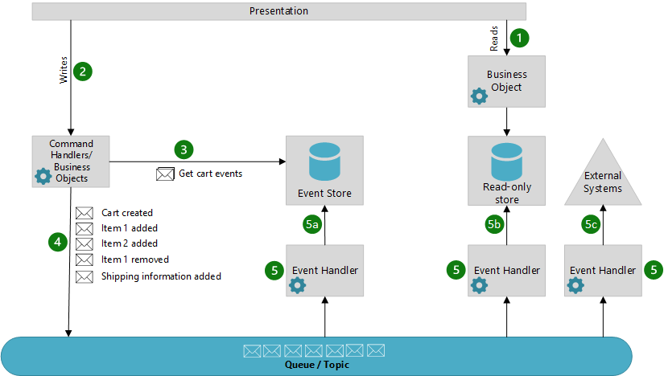
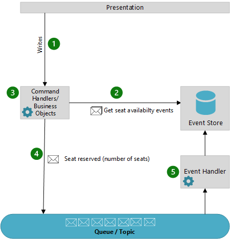

Instead of storing just the current state of the data in a relational database, store the full series of actions taken on an object in an append-only store. The store acts as the system of record and can be used to materialize the domain objects. This approach can improve auditability and write performance in complex systems.

> [!IMPORTANT]
> Event sourcing is a complex pattern that introduces significant trade-offs. It changes how you store data, handle concurrency, evolve schemas, and query state. There is a high cost to migrate to or from event sourcing, and once adopted, it constrains future design decisions in the parts of the system where it's used. Adopt event sourcing where its benefits like auditability and historical reconstruction justify the pattern's complexity. For most systems and most parts of a system, traditional data management is sufficient.

## Context and problem

Most applications work with data, and the typical approach is for the application to store the latest state of the data in a relational database, inserting or updating data as required. For example, in the traditional create, read, update, and delete (CRUD) model, a typical data process is to read data from the store, make some modifications to it, and update the current state of the data with the new values&mdash;often by using transactions that lock the data.

The CRUD approach is straightforward and fast for most scenarios. However, in high-load systems, this approach has some challenges:

- **Write contention**: Because updates require read-modify-write cycles with row-level locking, concurrent writes to the same entity degrade performance and become a bottleneck under load.

- **Auditability**: CRUD systems only store the latest state of the data. Unless there's an auditing mechanism that records the details of each operation in a separate log, history is lost.

## Solution

The Event Sourcing pattern defines an approach to handling operations on data that's driven by a sequence of events, each of which is recorded in an append-only store. Application code raises events that imperatively describe the action taken on the object. The events are generally sent to a queue where a separate process, an event handler, listens to the queue and persists the events in an event store. Each event represents a logical change to the object, such as `AddedItemToOrder` or `OrderCanceled`.

The events are persisted in an event store that acts as the system of record (the authoritative data source) about the current state of the data. Additional event handlers can listen for events they are interested in and take an appropriate action. Consumers could, for example, initiate tasks that apply the operations in the events to other systems, or perform any other associated action that's required to complete the operation. Notice that the application code that generates the events is decoupled from the systems that subscribe to the events.

Each entity in an event-sourced system has its own event stream, which is the ordered sequence of events that records every change to that entity. At any point, it's possible for applications to read the history of events. The current state of an entity is derived by replaying all the events in its stream, a process known as rehydration. This process can occur on demand when handling a request.

Because it's relatively expensive to read and replay events, applications typically implement [materialized views](./materialized-view.yml), read-only projections of the event store that are optimized for querying. For example, a system can maintain a materialized view of all customer orders that's used to populate the UI. As the application adds new orders, adds or removes items on the order, or adds shipping information, events are raised and a handler updates the materialized view.

The following figure shows an overview of the pattern combined with [CQRS](./cqrs.md). The presentation layer reads from a separate read-only store and writes commands to command handlers. The command handlers retrieve the entity's event stream from the event store, run business logic, and push new events to a queue. Event handlers consume from the queue and write events to the event store, update the read-only store, or integrate with external systems.

### Workflow

The following describes a typical workflow for this pattern:

1. The presentation layer calls an object responsible for reading from a read-only store. The data returned is used to populate the UI.
1. The presentation layer calls command handlers to perform actions like create a cart, or add an item to the cart.
1. The command handler loads the entity by retrieving its event stream from the event store. For example, it might retrieve all cart events. Those events are replayed against the entity to reconstruct its current state before any new action occurs.
1. The business logic is run and events are raised. In most implementations, the events are pushed to a queue or topic to decouple the event producers and event consumers.
1. Event handlers listen for events they are interested in and perform the appropriate action for that handler. Some typical event handler actions are:
    1. Writing the events to the event store
    1. Updating a read-only store optimized for queries
    1. Integrating with external systems

### Pattern advantages

The Event Sourcing pattern provides the following advantages:

- Events are immutable and can be stored using an append-only operation. The user interface, workflow, or process that initiated an event can continue, and tasks that handle the events can run in the background. Because append-only writes avoid the row-level lock contention of update-in-place systems, write throughput improves, especially for the presentation layer.

- Events are simple objects that describe some action that occurred, together with any associated data that's required to describe the action represented by the event. Events don't directly update a data store. They're recorded for handling at the appropriate time. Using events can simplify implementation and management.

- Events typically have meaning for a domain expert, whereas object-relational impedance mismatch can make complex database tables hard to understand. Tables are artificial constructs that represent the current state of the system, not the events that occurred.

- Event sourcing can help prevent concurrent updates from causing conflicts because it avoids the requirement to directly update objects in the data store. Command handlers rehydrate an entity from its event stream to enforce business rules before appending new events, so two handlers that load the same entity simultaneously can both act on the same state; for example, each seeing five remaining seats and both accepting a reservation. Event stores address this with optimistic concurrency control, rejecting an append if the stream changed since it was read. On rejection, the handler reloads the entity, re-evaluates, and retries.

- The append-only storage of events provides an audit trail that can be used to monitor actions taken against a data store. It can regenerate the current state as materialized views or projections by replaying the events at any time, and it can assist in testing and debugging the system. In addition, the requirement to use compensating events to cancel changes can provide a history of changes that were reversed. This capability wouldn't be the case if the model stored the current state. The list of events can also be used to analyze application performance and to detect user behavior trends. Or, it can be used to obtain other useful business information.

- The command handlers raise events, and tasks perform operations in response to those events. This decoupling of the tasks from the events provides flexibility and extensibility. Tasks know about the type of event and the event data, but not about the operation that triggered the event. In addition, multiple tasks can handle each event. This enables easy integration with other services and systems that only listen for new events raised by the event store. However, the event sourcing events tend to be very low level, and it might be necessary to generate specific integration events instead.

> [!TIP]
> Event sourcing is commonly combined with the [CQRS pattern](./cqrs.md) by performing the data management tasks in response to the events, and by materializing views from the stored events. This combination enables independent scaling of reads and writes because append-only event ingestion and query-optimized projections operate separately.

## Issues and considerations

Consider the following points when deciding how to implement this pattern:

- **Event design** - Design events to capture the business intent behind each change, not just the resulting state. For example, in the seat-reservation system, an event that records "two seats were reserved" is more valuable than one that records "remaining seats changed to 42." The first tells you *what happened*. The second only tells you *what the state became*. State-focused events reduce the event store to a change log with no business meaning. Intent-focused events enable richer projections, meaningful audit trails, and the flexibility to build new read models from historical events without having to change the write side.

- **Eventual consistency** - The system will only be eventually consistent when creating materialized views or generating projections of data by replaying events. There's some delay between an application adding events to the event store as the result of handling a request, the events being published, and the consumers of the events handling them. During this period, new events that describe further changes to entities might have arrived at the event store. Your customers must be okay with the fact that data is eventually consistent and the system should be designed to account for eventual consistency in these scenarios.

- **Versioning events** - The event store is the permanent source of information, and so the event data should never be updated. The only way to update an entity or undo a change is to add a compensating event to the event store; new event that reverses or corrects the effect of a previous event. For example, a `ReservationCancelled` event compensates for a prior `SeatsReserved` event. The original event remains in the stream; the compensating event records that it was undone. This immutability also means that if a bug produces incorrect events, those events persist in the store. Fixing the bug in application code doesn't fix the historical events, so you might also need compensating events or upcasters to handle the bad data during replay. If the schema (rather than the data) of the persisted events needs to change, perhaps during a migration, it can be difficult to combine existing events in the store with the new version.

  The following strategies can be used individually or in combination:

  - **Tolerant deserialization** - Design event consumers to ignore unknown fields and use default values for missing fields. This approach handles additive, non-breaking changes (such as adding an optional field) without requiring any transformation of stored events.
  - **Event versioning** - Include a version identifier in each event, either as metadata in the event envelope or as part of the event type name. Consumers use the version to select the appropriate handling logic.
  - **Upcasting** - Register transformation functions that convert older event schemas to the current schema during deserialization. Upcasters can be chained so that the application code only needs to handle the latest version. The stored events remain unchanged, preserving immutability.
  - **In-place migration** - Rewrite historical events to the new schema directly in the event store. This breaks immutability and should be a last resort because it undermines the audit trail.

- **Event ordering** - Multi-threaded applications and multiple instances of applications might be storing events in the event store. The consistency of events in the event store is vital, as is the order of events that affect a specific entity (the order that changes occur to an entity affects its current state). Adding a timestamp to every event can help to avoid issues. Another common practice is to annotate each event resulting from a request with an incremental identifier. If two actions attempt to add events for the same entity at the same time, the event store can reject an event that matches an existing entity identifier and event identifier.

- **Querying events** -  There's no standard approach, or existing mechanisms such as SQL queries, for reading the events to obtain information. The only data that can be extracted is a stream of events using an event identifier as the criteria. The event ID typically maps to individual entities. The current state of an entity can be determined only by replaying all of the events that relate to it against the original state of that entity.

- **Choosing an event store** - An event store can be a purpose-built database designed for append-only event streams or a general-purpose relational or document database with an append-only table.

  - Purpose-built event stores provide built-in support for operations like reading a stream by entity, optimistic concurrency, and snapshots.
  - Relational databases are familiar and widely available but require you to build those behaviors yourself.

  Because each entity has its own independent event stream, event stores partition naturally by entity ID, which simplifies horizontal scaling or sharding when needed.

  > [!IMPORTANT]
  > Don't confuse an event store with an event stream message broker. Message brokers such as Apache Kafka typically lack per-entity stream queries and optimistic concurrency. They work well as a distribution layer to fan out events to projections and external consumers, but they aren't a substitute for an event store.

- **Cost of recreating state for entities** - The length of each event stream affects managing and updating the system. If the streams are large, replaying every event to rehydrate an entity becomes expensive in both time and compute. To mitigate this cost, create snapshots at specific intervals, such as every *N* events. A snapshot is a serialized representation of the entity's state at a specific point in its event stream. To rehydrate the entity, load the most recent snapshot and replay only the events that occurred after it, rather than replaying the entire stream from the beginning. Balance the storage cost of snapshots against the time saved during rehydration when choosing a snapshot frequency.

  > [!NOTE]
  > Snapshots are an optimization, not a replacement for the event stream. The event stream remains the source of truth, and snapshots can be regenerated from it at any time.

- **Conflicts** - Optimistic concurrency control prevents conflicting writes to the same event stream, but the application must still handle conflicts that span multiple entities. For example, an event that indicates a reduction in stock inventory might arrive in the data store while an order for that item is being placed. Design the system to reconcile these situations, such as by advising the customer or by creating a back order.

- **Need for idempotency** - Event delivery to consumers is typically *at least once*, so consumers can receive the same event more than once. Event handlers must be idempotent so processing a duplicate event does not change the outcome. For example, if multiple instances of a consumer process seat-reservation events to maintain an available-seat count, a duplicated reservation event must result in only one decrement. Without idempotency, projections drift from the event stream and side effects such as payments or notifications fire more than once. Track the last processed event sequence number per consumer and skip duplicates, or design state mutations that are inherently safe to repeat.

- **Circular logic** - Be mindful of scenarios where the processing of one event involves the creation of one or more new events since this can cause an infinite loop.

- **Personal data and regulatory compliance** - The append-only, immutable nature of an event store conflicts with data protection regulations that require deletion of personal data, such as the *right to be forgotten* laws. Deleting events outright breaks stream integrity, so design for this tension from the start.

  - A common approach is to store personal data outside the event store and reference it by identifier in events, so deletion can occur independently without affecting the event stream.
  - When personal data can't be separated from events, use crypto-shredding. Encrypt personal data in events with a per-subject key and destroy the key when deletion is required, rendering the data unrecoverable while leaving the event structure intact. This approach adds encryption overhead on every read and write and requires robust key management.

## When to use this pattern

Use this pattern in the following scenarios:

- When you want to capture intent, purpose, or reason in the data. For example, changes to a customer entity can be captured as a series of specific event types, such as *Moved home*, *Closed account*, or *Deceased*.

- When it's vital to minimize or completely avoid the occurrence of conflicting updates to data.

- When you want to record events that occur, to replay them to restore the state of a system, to roll back changes, or to keep a history and audit log. For example, when a task involves multiple steps, you might need to execute actions to revert updates and then replay some steps to bring the data back into a consistent state.

- When you use events. It's a natural feature of the operation of the application, and it requires little extra development or implementation effort.

- When you need to decouple the process of inputting, or updating data from the tasks required to apply these actions. This change might be to improve UI performance, or to distribute events to other listeners that take action when the events occur. For example, you can integrate a payroll system with an expense submission website. The events that are raised by the event store in response to data updates made in the website would be consumed by both the website and the payroll system.

- When you want flexibility to be able to change the format of materialized models and entity data if requirements change, or&mdash;when used with CQRS&mdash;you need to adapt a read model or the views that expose the data.

- When used with CQRS, and eventual consistency is acceptable while a read model is updated, or the performance impact of rehydrating entities and data from an event stream is acceptable.

This pattern might not be useful in the following situations:

- Systems with straightforward create, read, update, and delete operations where no one needs auditability, replay, or historical reconstruction of state. The operational overhead of an event store isn't justified if the only requirement is current-state reads and writes.

- Prototypes, MVPs, or systems with a short expected lifespan. The upfront investment in event design, schema evolution strategy, and projection infrastructure rarely pays off in these settings.

- Systems where consistency and real-time updates to the views of the data are required. Eventual consistency between the event store and projections is inherent to event sourcing.

- Domains where data is predominantly static or reference data, such as lookup tables or catalogs, that change infrequently and don't benefit from change history.

- Teams without experience in [event-driven architectures](../guide/architecture-styles/event-driven.md). Event sourcing changes how you test, debug, and operate a system. Adopting it without that foundation increases the risk of anti-patterns that are costly to reverse.

> [!NOTE]
> Event sourcing doesn't have to be an all-or-nothing decision for your entire system. Apply it selectively to the parts of your system where its benefits are strongest, such as a payment ledger or order-processing pipeline, and use traditional CRUD for parts where the complexity isn't justified, such as user profile management or application configuration.

## Workload design

An architect should evaluate how the Event Sourcing pattern can be used in their workload's design to address the goals and principles covered in the [Azure Well-Architected Framework pillars](/azure/well-architected/pillars). For example:

| Pillar | How this pattern supports pillar goals |
| :----- | :------------------------------------- |
| [Reliability](/azure/well-architected/reliability/checklist) design decisions help your workload become **resilient** to malfunction and to ensure that it **recovers** to a fully functioning state after a failure occurs. | Due to capturing a history of changes in complex business process, it can facilitate state reconstruction if you need to recover state stores.   - [RE:06 Data partitioning](/azure/well-architected/reliability/partition-data)  - [RE:09 Disaster recovery](/azure/well-architected/reliability/disaster-recovery) |
| [Performance Efficiency](/azure/well-architected/performance-efficiency/checklist) helps your workload **efficiently meet demands** through optimizations in scaling, data, code. | This pattern, usually combined with CQRS, an appropriate domain design, and strategic snapshotting, can improve workload performance due to the atomic append-only operations and the avoidance of database locking for writes and reads.   - [PE:08 Data performance](/azure/well-architected/performance-efficiency/optimize-data-performance) |

As with any design decision, consider any tradeoffs against the goals of the other pillars that might be introduced with this pattern.

## Example

A conference management system needs to track the number of completed bookings for a conference. This way it can check whether there are seats still available, when a potential attendee tries to make a booking. The system could store the total number of bookings for a conference in at least two ways:

- The system could store the information about the total number of bookings as a separate entity in a database that holds booking information. As bookings are made or canceled, the system could increment or decrement this number as appropriate. This approach is simple in theory, but it can cause scalability problems if a large number of attendees attempt to book seats during a short period of time. For example, this surge often occurs in the final day before the booking period closes.

- The system could store information about bookings and cancellations as events held in an event store. It could then calculate the number of seats available by replaying these events. This approach can be more scalable due to the immutability of events. The system only needs to be able to read data from the event store, or append data to the event store. Event information about bookings and cancellations is never modified.

The following diagram illustrates how the seat reservation subsystem of the conference management system might be implemented using event sourcing.

The sequence of actions for reserving two seats is as follows:

1. The user interface issues a command to reserve seats for two attendees. The command is handled by a separate command handler. A piece of logic that is decoupled from the user interface and is responsible for handling requests posted as commands.

2. An entity containing information about all reservations for the conference is constructed by replaying the events that describe bookings and cancellations. This entity is called `SeatAvailability`, and is contained within a domain model that exposes methods for querying and modifying the data in the entity.

    > Some optimizations to consider are using snapshots (so that you don't need to replay the full list of events to obtain the current state of the entity), and maintaining a cached copy of the entity in memory.

3. The command handler invokes a method exposed by the domain model to make the reservations.

4. The `SeatAvailability` entity raises an event containing the number of seats that were reserved. The next time the entity applies events, all the reservations will be used to compute how many seats remain.

5. The system appends the new event to the list of events in the event store.

If a user cancels a seat, the system follows a similar process except the command handler issues a command that generates a seat cancellation event and appends it to the event store.

Using an event store provides a complete history, or audit trail, of the bookings and cancellations for a conference. The events in the event store are the accurate record. There's no need to persist entities in any other way because the system can easily replay the events and restore the state to any point in time.

## Next step

> [!div class="nextstepaction"]
> [Command and Query Responsibility Segregation (CQRS) pattern](./cqrs.md)

The write store that provides the permanent source of information for a CQRS implementation is often based on an implementation of the Event Sourcing pattern. The pattern segregates the operations that read data in an application from the operations that update data by using separate interfaces.

## Community resources

- [Object-relational impedance mismatch](https://en.wikipedia.org/wiki/Object-relational_impedance_mismatch)

- [Event Sourcing](https://martinfowler.com/eaaDev/EventSourcing.html) by Martin Fowler. The original 2005 description of the pattern that established the foundational vocabulary.

- [CQRS Documents](https://cqrs.files.wordpress.com/2010/11/cqrs_documents.pdf) (PDF) by Greg Young. The definitive resource on event sourcing and CQRS from the practitioner who formalized both patterns.

## Related resources

The following patterns and guidance might also be relevant when implementing this pattern:

- [Materialized View pattern](./materialized-view.yml). The data store used in a system that's based on event sourcing is typically not well suited to efficient querying. Instead, a common approach is to generate prepopulated views of the data at regular intervals, or when the data changes.

- [Compensating Transaction pattern](./compensating-transaction.yml). The existing data in an event sourcing store isn't updated. Instead, new entries are added that transition the state of entities to the new values. To reverse a change, compensating entries are used because it isn't possible to reverse the previous change. Describes how to undo the work that was performed by a previous operation.

- [Domain analysis for microservices](../microservices/model/tactical-domain-driven-design.md). In systems that use domain-driven design, the entity that owns an event stream is typically an [aggregate](../microservices/model/tactical-domain-driven-design.md#define-aggregates), a consistency boundary that receives commands, enforces business rules, and emits events.
