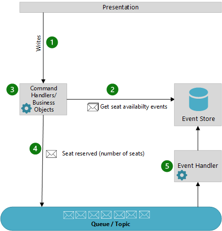

Instead of storing just the current state of the data in a relational database, store the full series of actions taken on an object in an append-only store. The store acts as the system of record and can be used to materialize the domain objects. This approach can improve performance, scalability, and auditability in complex systems.

> [!IMPORTANT]
> Event sourcing is a complex pattern that permeates through the entire architecture and introduces trade-offs to achieve increased performance, scalability, and auditability. Once your system becomes an event sourcing system, all future design decisions are constrained by the fact that this is an event sourcing system. There is a high cost to migrate to or from an event sourcing system. This pattern is best suited for systems where performance and scalability are top requirements. The complexity that event sourcing adds to a system isn't justified for most systems.

## Context and problem

Most applications work with data, and the typical approach is for the application to store the latest state of the data in a relational database, inserting or updating data as required. For example, in the traditional create, read, update, and delete (CRUD) model, a typical data process is to read data from the store, make some modifications to it, and update the current state of the data with the new values&mdash;often by using transactions that lock the data.

The CRUD approach is straightforward and fast for most scenarios. However, in high-load systems, this approach has some challenges:

- **Performance**: As the system scales, the performance will degrade due to contention for resources and locking issues.

- **Scalability**: CRUD systems are synchronous and data operations block on updates. This can lead to bottlenecks and higher latency when the system is under load.

- **Auditability**: CRUD systems only store the latest state of the data. Unless there's an auditing mechanism that records the details of each operation in a separate log, history is lost.

## Solution

The Event Sourcing pattern defines an approach to handling operations on data that's driven by a sequence of events, each of which is recorded in an append-only store. Application code raises events that imperatively describe the action taken on the object. The events are generally sent to a queue where a separate process, an event handler, listens to the queue and persists the events in an event store. Each event represents a logical change to the object, such as `AddedItemToOrder` or `OrderCanceled`.

The events are persisted in an event store that acts as the system of record (the authoritative data source) about the current state of the data. Additional event handlers can listen for events they are interested in and take an appropriate action. Consumers could, for example, initiate tasks that apply the operations in the events to other systems, or perform any other associated action that's required to complete the operation. Notice that the application code that generates the events is decoupled from the systems that subscribe to the events.

At any point, it's possible for applications to read the history of events. You can then use the events to materialize the current state of an entity by playing back and consuming all the events that are related to that entity. This process can occur on demand to materialize a domain object when handling a request.

Because it's relatively expensive to read and replay events, applications typically implement [materialized views](./materialized-view.yml), read-only projections of the event store that are optimized for querying. For example, a system can maintain a materialized view of all customer orders that's used to populate the UI. As the application adds new orders, adds or removes items on the order, or adds shipping information, events are raised and a handler updates the materialized view.

The figure shows an overview of the pattern, including some typical implementations with the pattern, including the use of a queue, a read-only store, integrating events with external applications and systems, and replaying events to create projections of the current state of specific entities.

### Workflow

The following describes a typical workflow for this pattern:

1. The presentation layer calls an object responsible for reading from a read-only store. The data returned is used to populate the UI.
1. The presentation layer calls command handlers to perform actions like create a cart, or add an item to the cart.
1. The command handler calls the event store to get the historical events for the entity. For example, it might retrieve all cart events. Those events are played back in the object to materialize the current state of the entity, prior to any action taking place.
1. The business logic is run and events are raised. In most implementations, the events are pushed to a queue or topic to decouple the event producers and event consumers.
1. Event handlers listen for events they are interested in and perform the appropriate action for that handler. Some typical event handler actions are:
    1. Writing the events to the event store
    1. Updating a read-only store optimized for queries
    1. Integrating with external systems

### Pattern advantages

The Event Sourcing pattern provides the following advantages:

- Events are immutable and can be stored using an append-only operation. The user interface, workflow, or process that initiated an event can continue, and tasks that handle the events can run in the background. This process, combined with the fact that there's no contention during the processing of transactions, can vastly improve performance and scalability for applications, especially for the presentation layer.

- Events are simple objects that describe some action that occurred, together with any associated data that's required to describe the action represented by the event. Events don't directly update a data store. They're simply recorded for handling at the appropriate time. Using events can simplify implementation and management.

- Events typically have meaning for a domain expert, whereas object-relational impedance mismatch can make complex database tables hard to understand. Tables are artificial constructs that represent the current state of the system, not the events that occurred.

- Event sourcing can help prevent concurrent updates from causing conflicts because it avoids the requirement to directly update objects in the data store. However, the domain model must still be designed to protect itself from requests that might result in an inconsistent state.

- The append-only storage of events provides an audit trail that can be used to monitor actions taken against a data store. It can regenerate the current state as materialized views or projections by replaying the events at any time, and it can assist in testing and debugging the system. In addition, the requirement to use compensating events to cancel changes can provide a history of changes that were reversed. This capability wouldn't be the case if the model stored the current state. The list of events can also be used to analyze application performance and to detect user behavior trends. Or, it can be used to obtain other useful business information.

- The command handlers raise events, and tasks perform operations in response to those events. This decoupling of the tasks from the events provides flexibility and extensibility. Tasks know about the type of event and the event data, but not about the operation that triggered the event. In addition, multiple tasks can handle each event. This enables easy integration with other services and systems that only listen for new events raised by the event store. However, the event sourcing events tend to be very low level, and it might be necessary to generate specific integration events instead.

> Event sourcing is commonly combined with the [CQRS pattern](./cqrs.md) by performing the data management tasks in response to the events, and by materializing views from the stored events.

## Issues and considerations

Consider the following points when deciding how to implement this pattern:

- **Eventual consistency** - The system will only be eventually consistent when creating materialized views or generating projections of data by replaying events. There's some delay between an application adding events to the event store as the result of handling a request, the events being published, and the consumers of the events handling them. During this period, new events that describe further changes to entities might have arrived at the event store. Your customers must be okay with the fact that data is eventually consistent and the system should be designed to account for eventual consistency in these scenarios.

  > [!NOTE]
  > For more information about eventual consistency, see the [Data Consistency Primer](/previous-versions/msp-n-p/dn589800(v=pandp.10)).

- **Versioning events** - The event store is the permanent source of information, and so the event data should never be updated. The only way to update an entity or undo a change is to add a compensating event to the event store. If the schema (rather than the data) of the persisted events needs to change, perhaps during a migration, it can be difficult to combine existing events in the store with the new version. Your application will need to support changes to events structures. This can be done in several ways.

  - Ensure your event handlers support all versions of events. This can be a challenge to maintain and test. This requires implementing a version stamp on each version of the event schema to maintain both the old and the new event formats.
  - Implement an event handler to handle specific event versions. This can be a maintenance challenge in that bug fix changes might have to be made across multiple handlers. This requires implementing a version stamp on each version of the event schema to maintain both the old and the new event formats.
  - Update historical events to the new schema when a new schema is implemented. This breaks the immutability of events.

- **Event ordering** - Multi-threaded applications and multiple instances of applications might be storing events in the event store. The consistency of events in the event store is vital, as is the order of events that affect a specific entity (the order that changes occur to an entity affects its current state). Adding a timestamp to every event can help to avoid issues. Another common practice is to annotate each event resulting from a request with an incremental identifier. If two actions attempt to add events for the same entity at the same time, the event store can reject an event that matches an existing entity identifier and event identifier.

- **Querying events** -  There's no standard approach, or existing mechanisms such as SQL queries, for reading the events to obtain information. The only data that can be extracted is a stream of events using an event identifier as the criteria. The event ID typically maps to individual entities. The current state of an entity can be determined only by replaying all of the events that relate to it against the original state of that entity.

- **Cost of recreating state for entities** - The length of each event stream affects managing and updating the system. If the streams are large, consider creating snapshots at specific intervals such as a specified number of events. The current state of the entity can be obtained from the snapshot and by replaying any events that occurred after that point in time. For more information about creating snapshots of data, see [Primary-Subordinate Snapshot Replication](/previous-versions/msp-n-p/ff650012(v=pandp.10)).

- **Conflicts** - Even though event sourcing minimizes the chance of conflicting updates to the data, the application must still be able to deal with inconsistencies that result from eventual consistency and the lack of transactions. For example, an event that indicates a reduction in stock inventory might arrive in the data store while an order for that item is being placed. This situation results in a requirement to reconcile the two operations, either by advising the customer or by creating a back order.

- **Need for idempotency** - Event publication might be *at least once*, and so consumers of the events must be idempotent. They must not reapply the update described in an event if the event is handled more than once. Multiple instances of a consumer can maintain and aggregate an entity's property, such as the total number of orders placed. Only one must succeed in incrementing the aggregate, when an order-placed event occurs. While this result isn't a key characteristic of event sourcing, it's the usual implementation decision.

- **Circular logic** - Be mindful of scenarios where the processing of one event involves the creation of one or more new events since this can cause an infinite loop.

## When to use this pattern

Use this pattern in the following scenarios:

- When you want to capture intent, purpose, or reason in the data. For example, changes to a customer entity can be captured as a series of specific event types, such as *Moved home*, *Closed account*, or *Deceased*.

- When it's vital to minimize or completely avoid the occurrence of conflicting updates to data.

- When you want to record events that occur, to replay them to restore the state of a system, to roll back changes, or to keep a history and audit log. For example, when a task involves multiple steps, you might need to execute actions to revert updates and then replay some steps to bring the data back into a consistent state.

- When you use events. It's a natural feature of the operation of the application, and it requires little extra development or implementation effort.

- When you need to decouple the process of inputting, or updating data from the tasks required to apply these actions. This change might be to improve UI performance, or to distribute events to other listeners that take action when the events occur. For example, you can integrate a payroll system with an expense submission website. The events that are raised by the event store in response to data updates made in the website would be consumed by both the website and the payroll system.

- When you want flexibility to be able to change the format of materialized models and entity data if requirements change, or&mdash;when used with CQRS&mdash;you need to adapt a read model or the views that expose the data.

- When used with CQRS, and eventual consistency is acceptable while a read model is updated, or the performance impact of rehydrating entities and data from an event stream is acceptable.

This pattern might not be useful in the following situations:

- Applications that do not require hyper-scale or performance.

- Small or simple domains, systems that have little or no business logic, or nondomain systems that naturally work well with traditional CRUD data management mechanisms.

- Systems where consistency and real-time updates to the views of the data are required.

- Systems where there's only a low occurrence of conflicting updates to the underlying data. For example, systems that predominantly add data rather than updating it.

## Workload design

An architect should evaluate how the Event Sourcing pattern can be used in their workload's design to address the goals and principles covered in the [Azure Well-Architected Framework pillars](/azure/well-architected/pillars). For example:

| Pillar | How this pattern supports pillar goals |
| :----- | :------------------------------------- |
| [Reliability](/azure/well-architected/reliability/checklist) design decisions help your workload become **resilient** to malfunction and to ensure that it **recovers** to a fully functioning state after a failure occurs. | Due to capturing a history of changes in complex business process, it can facilitate state reconstruction if you need to recover state stores.   - [RE:06 Data partitioning](/azure/well-architected/reliability/partition-data)  - [RE:09 Disaster recovery](/azure/well-architected/reliability/disaster-recovery) |
| [Performance Efficiency](/azure/well-architected/performance-efficiency/checklist) helps your workload **efficiently meet demands** through optimizations in scaling, data, code. | This pattern, usually combined with CQRS, an appropriate domain design, and strategic snapshotting, can improve workload performance due to the atomic append-only operations and the avoidance of database locking for writes and reads.   - [PE:08 Data performance](/azure/well-architected/performance-efficiency/optimize-data-performance) |

As with any design decision, consider any tradeoffs against the goals of the other pillars that might be introduced with this pattern.

## Example

A conference management system needs to track the number of completed bookings for a conference. This way it can check whether there are seats still available, when a potential attendee tries to make a booking. The system could store the total number of bookings for a conference in at least two ways:

- The system could store the information about the total number of bookings as a separate entity in a database that holds booking information. As bookings are made or canceled, the system could increment or decrement this number as appropriate. This approach is simple in theory, but can cause scalability issues if a large number of attendees are attempting to book seats during a short period of time. For example, in the last day or so prior to the booking period closing.

- The system could store information about bookings and cancellations as events held in an event store. It could then calculate the number of seats available by replaying these events. This approach can be more scalable due to the immutability of events. The system only needs to be able to read data from the event store, or append data to the event store. Event information about bookings and cancellations is never modified.

The following diagram illustrates how the seat reservation subsystem of the conference management system might be implemented using event sourcing.

The sequence of actions for reserving two seats is as follows:

1. The user interface issues a command to reserve seats for two attendees. The command is handled by a separate command handler. A piece of logic that is decoupled from the user interface and is responsible for handling requests posted as commands.

2. An entity containing information about all reservations for the conference is constructed by querying the events that describe bookings and cancellations. This entity is called `SeatAvailability`, and is contained within a domain model that exposes methods for querying and modifying the data in the entity.

    > Some optimizations to consider are using snapshots (so that you don't need to query and replay the full list of events to obtain the current state of the entity), and maintaining a cached copy of the entity in memory.

3. The command handler invokes a method exposed by the domain model to make the reservations.

4. The `SeatAvailability` entity raises an event containing the number of seats that were reserved. The next time the entity applies events, all the reservations will be used to compute how many seats remain.

5. The system appends the new event to the list of events in the event store.

If a user cancels a seat, the system follows a similar process except the command handler issues a command that generates a seat cancellation event and appends it to the event store.

In addition to providing more scope for scalability, using an event store also provides a complete history, or audit trail, of the bookings and cancellations for a conference. The events in the event store are the accurate record. There's no need to persist aggregates in any other way because the system can easily replay the events and restore the state to any point in time.

## Next steps

- [Object-relational impedance mismatch](https://en.wikipedia.org/wiki/Object-relational_impedance_mismatch)

- [Data Consistency Primer](/previous-versions/msp-n-p/dn589800(v=pandp.10)). When you use event sourcing with a separate read store or materialized views, the read data won't be immediately consistent. Instead, the data will be only eventually consistent. This article summarizes the issues surrounding maintaining consistency over distributed data.

- [Data Partitioning Guidance](/previous-versions/msp-n-p/dn589795(v=pandp.10)). Data is often partitioned when you use event sourcing to improve scalability, reduce contention, and optimize performance. This article describes how to divide data into discrete partitions, and the issues that can arise.

- Martin Fowler's blog:

  - [Event Sourcing](https://martinfowler.com/eaaDev/EventSourcing.html)
  - [Snapshot on Martin Fowler's Enterprise Application Architecture website](https://martinfowler.com/eaaDev/Snapshot.html)

## Related resources

The following patterns and guidance might also be relevant when implementing this pattern:

- [Command and Query Responsibility Segregation (CQRS) pattern](./cqrs.md). The write store that provides the permanent source of information for a CQRS implementation is often based on an implementation of the Event Sourcing pattern. Describes how to segregate the operations that read data in an application from the operations that update data by using separate interfaces.

- [Materialized View pattern](./materialized-view.yml). The data store used in a system that's based on event sourcing is typically not well suited to efficient querying. Instead, a common approach is to generate prepopulated views of the data at regular intervals, or when the data changes.

- [Compensating Transaction pattern](./compensating-transaction.yml). The existing data in an event sourcing store isn't updated. Instead, new entries are added that transition the state of entities to the new values. To reverse a change, compensating entries are used because it isn't possible to reverse the previous change. Describes how to undo the work that was performed by a previous operation.
