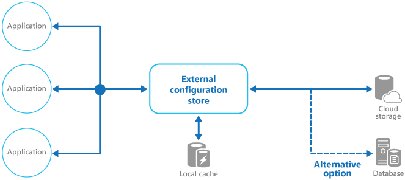
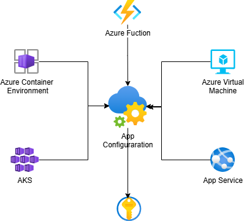

Move configuration information out of the application deployment package to a centralized location. This can provide opportunities for easier management and control of configuration data, and for sharing configuration data across applications and application instances.

## Context and problem

The majority of application runtime environments include configuration information that's held in files deployed with the application. In some cases, it's possible to edit these files to change the application behavior after it's been deployed. However, changes to the configuration require the application be redeployed, often resulting in unacceptable downtime and other administrative overhead.

Local configuration files also limit the configuration to a single application, but sometimes it would be useful to share configuration settings across multiple applications. Examples include database connection strings, UI theme information, or the URLs of queues and storage used by a related set of applications.

It's challenging to manage changes to local configurations across multiple running instances of the application, especially in a cloud-hosted scenario. It can result in instances using different configuration settings while the update is being deployed.

In addition, updates to applications and components might require changes to configuration schemas. Many configuration systems don't support different versions of configuration information.

## Solution

Store the configuration information in external storage, and provide an interface that can be used to quickly and efficiently read and update configuration settings. The type of external store depends on the hosting and runtime environment of the application. In a cloud-hosted scenario it's typically a cloud-based storage service or dedicated configuration service, but could be a hosted database or other custom system.

The backing store you choose for configuration information should have an interface that provides consistent and easy-to-use access. It should expose the information in a correctly typed and structured format. The implementation might also need to authorize users' access in order to protect configuration data, and be flexible enough to allow storage of multiple versions of the configuration (such as development, staging, or production, including multiple release versions of each one).

> Many built-in configuration systems read the data when the application starts up, and cache the data in memory to provide fast access and minimize the impact on application performance. Depending on the type of backing store used, and the latency of this store, it might be helpful to implement a caching mechanism within the external configuration store. For more information, see the [Caching guidance](/azure/architecture/best-practices/caching). The figure illustrates an overview of the External Configuration Store pattern with optional local cache.



## Problems and considerations

Consider the following points as you decide how to implement this pattern:

- Choose a backing store that offers acceptable performance, high availability, robustness, and can be backed up as part of the application maintenance and administration process. In a cloud-hosted application, using a cloud storage mechanism or dedicated configuration platform service is usually a good choice to meet these requirements.

- Design the schema of the backing store to allow flexibility in the types of information it can hold. Ensure that it provides for all configuration requirements such as typed data, collections of settings, multiple versions of settings, and any other features that the applications using it require. The schema should be easy to extend to support additional settings as requirements change.

- Consider the physical capabilities of the backing store, how it relates to the way configuration information is stored, and the effects on performance. For example, storing an XML document containing configuration information will require either the configuration interface or the application to parse the document in order to read individual settings. It'll make updating a setting more complicated, though caching the settings can help to offset slower read performance.

- Consider how the configuration interface will permit control of the scope and inheritance of configuration settings. For example, it might be a requirement to scope configuration settings at the organization, application, and the machine level. It might need to support delegation of control over access to different scopes, and to prevent or allow individual applications to override settings.

- Ensure that the configuration interface can expose the configuration data in the required formats such as typed values, collections, key/value pairs, or property bags.

- Consider how the configuration store interface will behave when settings contain errors, or don't exist in the backing store. It might be appropriate to return default settings and log errors. Also consider aspects such as the case sensitivity of configuration setting keys or names, the storage and handling of binary data, and the ways that null or empty values are handled.

- Consider how to protect the configuration data to allow access to only the appropriate users and applications. This is likely a feature of the configuration store interface, but it's also necessary to ensure that the data in the backing store can't be accessed directly without the appropriate permission. Ensure strict separation between the permissions required to read and to write configuration data. Also consider whether you need to encrypt some or all of the configuration settings, and how this'll be implemented in the configuration store interface. Beyond access control, enable audit logging to record who reads or modifies configuration values and when. Apply the same audit requirements to any local fallback copies of configuration data.

- Separate non-sensitive configuration values from secrets: keep routine settings (such as feature flags and endpoints) in configuration, but store secrets (such as connection strings, API keys, certificates, and passwords) in a dedicated secret-management system that provides encryption and controlled access.

- Centrally stored configurations, which change application behavior during runtime, are critically important and should be deployed, updated, and managed using the same mechanisms as deploying application code. For example, changes that can affect more than one application must be carried out using a full test and staged deployment approach to ensure that the change is appropriate for all applications that use this configuration. If an administrator edits a setting to update one application, it could adversely affect other applications that use the same setting. Many products, including Azure App Configuration, help mitigate this risk through built-in capabilities such as revision history, point-in-time restore, immutable snapshots, and progressive rollout patterns.

- If an application caches configuration information, the application needs to be alerted if the configuration changes. It might be possible to implement an expiration policy over cached configuration data so that this information is automatically refreshed periodically and any changes picked up (and acted on).

- While caching configuration data can help address transient connectivity issues with the external configuration store at application runtime, this typically doesn't solve the problem if the external store is down when the application is first starting. Ensure your application deployment pipeline can provide the last known set of configuration values in a configuration file as a fallback if your application cannot retrieve live values when it starts.

## When to use this pattern

Use this pattern when:

- You need to share configuration settings across multiple applications or instances, or enforce a standard configuration across them.

- Your standard configuration system doesn't support all required setting types, such as images or complex data structures.

- You need a complementary store for some settings, while allowing applications to override some or all centrally stored values.

- You need to simplify administration across multiple applications and optionally monitor configuration usage by logging access to the configuration store.

This pattern might not be suitable when:

- Your configuration is simple, local to one application, and changes only during normal release cycles. In this case, an external configuration store can add unnecessary operational complexity.

## Workload design

An architect should evaluate how the External Configuration Store pattern can be used in their workload's design to address the goals and principles covered in the [Azure Well-Architected Framework pillars](/azure/well-architected/pillars). For example:

| Pillar | How this pattern supports pillar goals |
| :----- | :------------------------------------- |
| [Operational Excellence](/azure/well-architected/operational-excellence/checklist) helps deliver **workload quality** through **standardized processes** and team cohesion. | This separation of application configuration from application code supports environment-specific configuration and applies versioning to configuration values. External configuration stores are also a common place to manage feature flags to enable safe deployment practices.<br/><br/> - [OE:10 Automation design](/azure/well-architected/operational-excellence/enable-automation)<br/> - [OE:11 Safe deployment practices](/azure/well-architected/operational-excellence/safe-deployments) |

As with any design decision, consider any tradeoffs against the goals of the other pillars that might be introduced with this pattern.

## Example

### Using Azure App Configuration

While building a custom configuration store might be necessary in some situations, many applications can instead use [Azure App Configuration](/azure/azure-app-configuration/overview). Azure App Configuration supports [key-value pairs](/azure/azure-app-configuration/concept-key-value) that can be namespaced. Azure App Configuration also supports [immutable snapshots](/azure/azure-app-configuration/concept-snapshots) of configuration so that you can inspect, roll back, or progressively deploy configuration changes without risk to running instances. Use [snapshot references](/azure/azure-app-configuration/concept-snapshot-references) to let applications switch between snapshots at runtime without code changes or redeployment. Configuration values can be exported so that a copy ships with your application as a startup fallback if the service is unreachable when the application starts.

In Azure App Configuration, [keys](/azure/azure-app-configuration/concept-key-value#keys) and [values](/azure/azure-app-configuration/concept-key-value#values) are Unicode strings, and each key-value has optional metadata such as [label-based variants](/azure/azure-app-configuration/concept-key-value#version-key-values) and [content type](/azure/azure-app-configuration/concept-key-value#use-content-type). Use content type to describe how your application should interpret a value, for example as JSON or as a built-in App Configuration type. App Configuration also keeps a [revision history with point-in-time restore](/azure/azure-app-configuration/concept-point-time-snapshot), which helps you review and recover previous key-values.

For resiliency, provision your store in a region that supports [availability zones](/azure/azure-app-configuration/howto-best-practices?tabs=dotnet#building-applications-with-high-resiliency) and enable [geo-replication](/azure/azure-app-configuration/concept-geo-replication) so that you can configure your applications to read from the nearest replica and switch between replica endpoints during regional outages. Use [Key Vault references](/azure/azure-app-configuration/use-key-vault-references-dotnet-core) to keep secrets in Azure Key Vault and reference them from App Configuration, rather than storing credentials directly in the configuration store. Authenticate applications to App Configuration using [managed identity and Azure RBAC](/azure/azure-app-configuration/concept-enable-rbac) instead of connection strings. For workloads running in Azure Kubernetes Service, the [Azure App Configuration Kubernetes Provider](/azure/azure-app-configuration/quickstart-azure-kubernetes-service) can generate ConfigMaps and Secrets directly from your store without requiring code changes in your workload containers. You can also use App Configuration to manage [feature flags](/azure/azure-app-configuration/concept-feature-management), including targeted rollout and variant-based experimentation, as part of your [safe deployment practices](/azure/well-architected/operational-excellence/safe-deployments).

For network isolation, use [private endpoints for Azure App Configuration](/azure/azure-app-configuration/concept-private-endpoint) so client traffic stays on private IP connectivity through Azure Private Link. After private access is configured, you can [disable public access](/azure/azure-app-configuration/howto-disable-public-access) to reduce exposure of the public endpoint. In geo-replicated deployments, a single private endpoint can reach all replicas, but for higher regional resilience you can provision private endpoints per replica region and configure DNS accordingly.



#### Client libraries

Many of these features are exposed through client libraries which integrate with the application runtime to facilitate fetching and caching values, refreshing values on change, and even handling transient outages of App Configuration Service.

| Runtime                 | Client Library                                                                                                                                                            | Notes                                                                        | Quickstart                                                                                     |
| ----------------------- | ------------------------------------------------------------------------------------------------------------------------------------------------------------------------- | ---------------------------------------------------------------------------- | ---------------------------------------------------------------------------------------------- |
| .NET                    | [Microsoft.Extensions.Configuration.AzureAppConfiguration](https://www.nuget.org/packages/Microsoft.Extensions.Configuration.AzureAppConfiguration/)                      | Provider for `Microsoft.Extensions.Configuration`                            | [Quickstart](/azure/azure-app-configuration/quickstart-dotnet-core-app)                        |
| ASP.NET Core            | [Microsoft.Azure.AppConfiguration.AspNetCore](https://www.nuget.org/packages/Microsoft.Azure.AppConfiguration.AspNetCore)                                                 | Adds request-driven refresh middleware for ASP.NET Core                      | [Quickstart](/azure/azure-app-configuration/quickstart-aspnet-core-app)                        |
| Azure Functions in .NET | [Microsoft.Azure.AppConfiguration.Functions.Worker](https://www.nuget.org/packages/Microsoft.Azure.AppConfiguration.Functions.Worker/)                                    | Provider for the isolated worker model using `Program.cs`                    | [Quickstart](/azure/azure-app-configuration/quickstart-azure-functions-csharp)                 |
| .NET Framework          | [Microsoft.Configuration.ConfigurationBuilders.AzureAppConfiguration](https://www.nuget.org/packages/Microsoft.Configuration.ConfigurationBuilders.AzureAppConfiguration) | Configuration builder for `System.Configuration`                             | [Quickstart](/azure/azure-app-configuration/quickstart-dotnet-app)                             |
| Java Spring             | [com.azure.spring > azure-spring-cloud-appconfiguration-config](https://mvnrepository.com/artifact/com.azure.spring/azure-spring-cloud-appconfiguration-config)           | Supports Spring Framework access via `ConfigurationProperties`               | [Quickstart](/azure/azure-app-configuration/quickstart-java-spring-app)                        |
| Python                  | [azure-appconfiguration-provider](https://pypi.org/project/azure-appconfiguration-provider/)                                                                              | Provider library with dynamic refresh and Key Vault reference support        | [Quickstart](/azure/azure-app-configuration/quickstart-python-provider)                        |
| JavaScript/Node.js      | [@azure/app-configuration-provider](https://www.npmjs.com/package/@azure/app-configuration-provider)                                                                      | Provider library with dynamic refresh and Key Vault reference support        | [Quickstart](/azure/azure-app-configuration/quickstart-javascript-provider)                    |

In addition to client libraries, there are also an [Azure App Configuration Sync](https://github.com/marketplace/actions/get-azure-app-configuration) GitHub Action and built-in Azure Pipelines tasks: [Azure App Configuration Export](/azure/azure-app-configuration/azure-pipeline-export-task) and [Azure App Configuration Import](/azure/azure-app-configuration/azure-pipeline-import-task). 

### Custom backing store example

In a Microsoft Azure hosted application, a possible choice for storing configuration information externally is to use Azure Storage. This is resilient and offers high performance. By default, it replicates data three times within a single data center; for geo-redundancy across regions, you can configure geo-replication with manual failover capabilities. Azure Table storage provides a key/value store with the ability to use a flexible schema for the values. Azure Blob storage provides a hierarchical, container-based store that can hold any type of data in individually named blobs.

When implementing this pattern you'd be responsible for abstracting away Azure Blob storage and exposing your settings within your applications, including checking for updates at runtime and addressing how to respond to those.

The following example shows how a simplistic configuration store could be envisioned over Blob storage to store and expose configuration information. A `BlobSettingsStore` class could abstract Blob storage for holding configuration information, and implements a simple `ISettingsStore` interface.

```csharp
public interface ISettingsStore
{
    Task<ETag> GetVersionAsync();
    Task<Dictionary<string, string>> FindAllAsync();
}
```

This interface defines methods for retrieving configuration settings held in the configuration store and includes a version number that can be used to detect whether any configuration settings have been modified recently. A `BlobSettingsStore` class could use the `ETag` property of the blob to implement versioning. The `ETag` property is updated automatically each time a blob is written.

> By design, this simple illustration exposes all configuration settings as string values rather than typed values.

An `ExternalConfigurationManager` class could then provide a wrapper around a `BlobSettingsStore` instance. An application can use this class to retrieve configuration information. This class might use a change notification mechanism, such as [Microsoft Reactive Extensions](https://github.com/dotnet/reactive), to publish updates made to configuration while the system is running. It would also be responsible for implementing the [Cache-Aside pattern](./cache-aside.yml) for settings to provide added resiliency and performance.

Usage might look something like the following.

```csharp
static void Main(string[] args)
{
    // Start monitoring configuration changes.
    ExternalConfiguration.Instance.StartMonitor();

    // Get a setting.
    var setting = ExternalConfiguration.Instance.GetAppSetting("someSettingKey");
    …
}
```

## Next steps

- See additional [App Configuration Samples](https://github.com/Azure/AppConfiguration/tree/main/examples)
- Learn how to [integrate Azure App Configuration with Kubernetes deployments](/azure/azure-app-configuration/integrate-kubernetes-deployment-helm)
- Learn how Azure App Configuration also can help [manage feature flags](/azure/azure-app-configuration/manage-feature-flags)
- [Caching guidance](/azure/architecture/best-practices/caching): This guidance provides more information about how to cache data in a cloud solution, and problems to consider when you implement a cache.
- Review [Azure App Configuration best practices](/azure/azure-app-configuration/howto-best-practices)

## Related resources

- [Cache-aside pattern](./cache-aside.yml): This pattern describes how to load data on demand into a cache from a data store. This pattern also helps to maintain consistency between data that's held in the cache and the data in the original data store.
