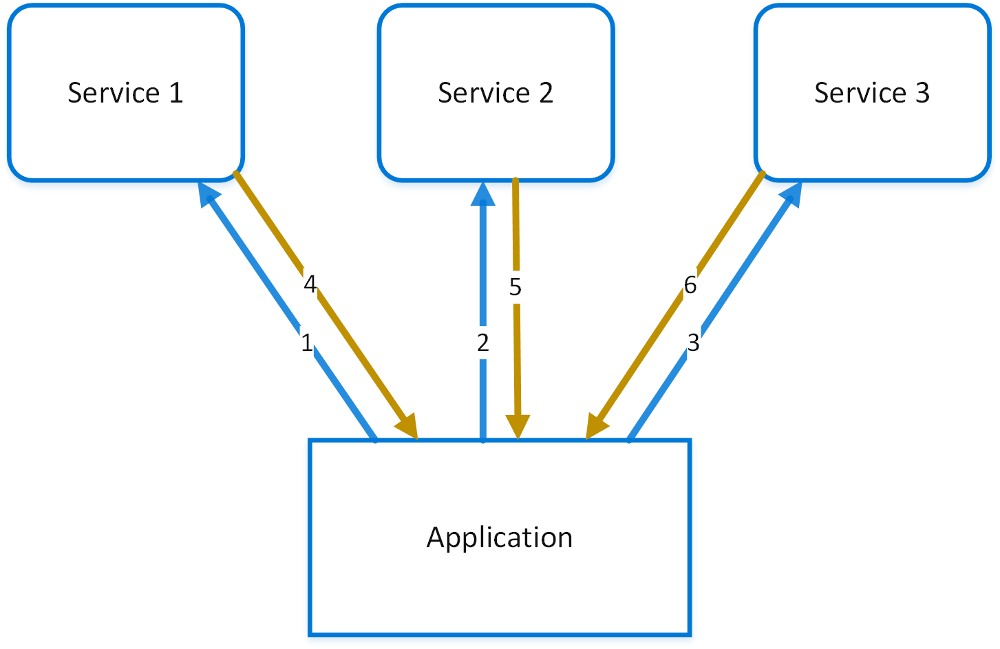
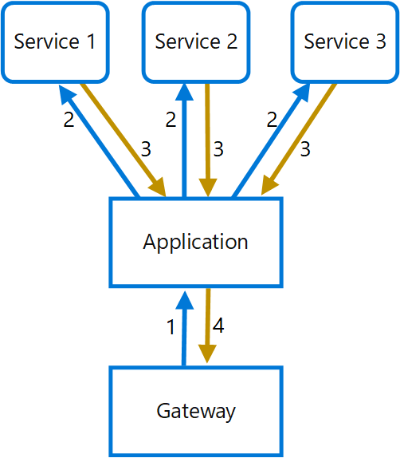

Use a gateway to aggregate multiple individual requests into a single request. This pattern is useful when a client must make multiple calls to different backend systems to perform an operation.

## Context and problem

To perform a single task, a client might have to make multiple calls to various backend services. An application that relies on many services to perform a task must expend resources on each request. When any new feature or service is added to the application, additional requests are needed, further increasing resource requirements and network calls. This chattiness between a client and a backend can adversely affect the performance and scale of the application. Microservice architectures have made this problem more common, as applications built around many smaller services naturally have a higher amount of cross-service calls.

In the following diagram, the client sends requests to each service (1,2,3). Each service processes the request and sends the response back to the application (4,5,6). Over a cellular network with typically high latency, using individual requests in this manner is inefficient and could result in broken connectivity or incomplete requests. While each request might be done in parallel, the application must send, wait, and process data for each request, all on separate connections, increasing the chance of failure.

## Solution

Use a gateway to reduce chattiness between the client and the services. The gateway receives client requests, dispatches requests to the various backend systems, and then aggregates the results and sends them back to the requesting client.

This pattern can reduce the number of requests that the application makes to backend services, and improve application performance over high-latency networks.

In the following diagram, the application sends a request to the gateway (1). The request contains a package of additional requests. The gateway decomposes these and processes each request by sending it to the relevant service (2). Each service returns a response to the gateway (3). The gateway combines the responses from each service and sends the response to the application (4). The application makes a single request and receives only a single response from the gateway.

## Problems and considerations

Consider the following points as you decide how to implement this pattern:

- The gateway should not introduce service coupling across the backend services.
- The gateway should be located near the backend services to reduce latency as much as possible.
- The gateway service might introduce a single point of failure. Ensure the gateway is properly designed to meet your application's availability requirements.
- The gateway might introduce a bottleneck. Ensure the gateway has adequate performance to handle load and can be scaled to meet your anticipated growth.
- Perform load testing against the gateway to ensure you don't introduce cascading failures for services.
- Implement a resilient design, using techniques such as [bulkheads](./bulkhead.md), [circuit breaking](./circuit-breaker.md), [retry](./retry.yml), and timeouts.
- If one or more service calls takes too long, it might be acceptable to time out and return a partial set of data. Consider how your application will handle this scenario.
- Use asynchronous I/O to ensure that a delay at the backend doesn't cause performance issues in the application.
- Implement distributed tracing using correlation IDs to track each individual call.
- Monitor request metrics and response sizes.
- Consider returning cached data as a failover strategy to handle failures.
- Instead of building aggregation into the gateway, consider placing an aggregation service behind the gateway. Request aggregation will likely have different resource requirements than other services in the gateway and might affect the gateway's routing and offloading functionality.

## When to use this pattern

Use this pattern when:

- A client needs to communicate with multiple backend services to perform an operation.
- The client might use networks with significant latency, such as cellular networks.

This pattern might not be suitable when:

- You want to reduce the number of calls between a client and a single service across multiple operations. In that scenario, it might be better to add a batch operation to the service.
- The client or application is located near the backend services and latency isn't a significant factor.

## Workload design

An architect should evaluate how the Gateway Aggregation pattern can be used in their workload's design to address the goals and principles covered in the [Azure Well-Architected Framework pillars](/azure/well-architected/pillars). For example:

| Pillar | How this pattern supports pillar goals |
| :----- | :------------------------------------- |
| [Reliability](/azure/well-architected/reliability/checklist) design decisions help your workload become **resilient** to malfunction and ensure that it **recovers** to a fully functioning state after a failure occurs. | This topology enables you to, among other things, shift transient fault handling from a distributed implementation across clients to a centralized implementation.   - [RE:07 Transient faults](/azure/well-architected/reliability/handle-transient-faults) |
| [Security](/azure/well-architected/security/checklist) design decisions help ensure the **confidentiality**, **integrity**, and **availability** of your workload's data and systems. | This topology often reduces the number of touch points a client has with a system, which reduces the public surface area and authentication points. The aggregated backends can stay fully network-isolated from clients.   - [SE:04 Segmentation](/azure/well-architected/security/segmentation)  - [SE:08 Hardening](/azure/well-architected/security/harden-resources) |
| [Operational Excellence](/azure/well-architected/operational-excellence/checklist) helps deliver **workload quality** through **standardized processes** and team cohesion. | This pattern enables backend logic to evolve independently from clients, allowing you to change the chained service implementations, or even data sources, without needing to change client touchpoints.   - [OE:04 Tools and processes](/azure/well-architected/operational-excellence/tools-processes) |
| [Performance Efficiency](/azure/well-architected/performance-efficiency/checklist) helps your workload **efficiently meet demands** through optimizations in scaling, data, and code. | This design can incur less latency than a design in which the client establishes multiple connections. Caching in aggregation implementations minimizes calls to backend systems.   - [PE:03 Selecting services](/azure/well-architected/performance-efficiency/select-services)  - [PE:08 Data performance](/azure/well-architected/performance-efficiency/optimize-data-performance) |

As with any design decision, consider any tradeoffs against the goals of the other pillars that might be introduced with this pattern.

## Example

Consider a microservices-based application that provides an order summary experience for a customer. When a user opens an order page, the application must retrieve data from multiple backend services, such as an order service, a shipment service, and a customer profile service.  
In a microservices architecture, these services are implemented and deployed independently. Without aggregation, the client must call each service directly, increasing latency and complexity.  
To address this problem, the application introduces a gateway aggregation layer within the workload. The client sends a single request, and the system retrieves and combines data from multiple backend services before returning a unified response.  
In this example, the application is deployed using [Azure Container Apps](/azure/container-apps/overview). External traffic is routed through [Azure Application Gateway](/azure/application-gateway/overview), which provides a secure entry point with capabilities such as TLS termination and [Web Application Firewall (WAF)](/azure/web-application-firewall/ag/ag-overview) protection.  
The request is then forwarded to a [Container Apps environment](/azure/container-apps/environment), which provides a managed ingress layer responsible for routing HTTP traffic to the appropriate services. 
The aggregation logic is implemented as a dedicated aggregation service, deployed as a container app. Backend services are also deployed as container apps and are exposed using internal ingress, making them accessible only within the environment.  

The request flow is as follows:

1. The client sends a request to the public endpoint exposed by Application Gateway.
1. Application Gateway forwards the request to the Container Apps environment.
1. The ingress layer routes the request to the aggregation service.
1. The aggregation service calls the required backend services.
1. The aggregation service combines the responses into a single payload.
1. The aggregated response is returned to the client.

By introducing this aggregation layer, the solution reduces client-to-service round trips and simplifies client interactions.  

In this architecture, the gateway is responsible for edge concerns such as security and routing, while aggregation logic is implemented within the application layer. This separation improves maintainability and supports more complex orchestration scenarios.

For monitoring, collect telemetry across the full request path so you can correlate gateway behavior with aggregation and backend latency. Use [Azure Monitor](/azure/azure-monitor/overview) as the central observability platform, review [Application Gateway diagnostics and access logs](/azure/application-gateway/monitor-application-gateway), and enable [monitoring for Azure Container Apps](/azure/container-apps/log-monitoring) to capture application logs and metrics from the aggregation and backend services. Route logs to a [Log Analytics workspace](/azure/azure-monitor/logs/log-analytics-overview) for unified querying, alerting, and troubleshooting.

## Next steps

- [Azure Container Apps documentation](/azure/container-apps/)
- [Scale applications in Azure Container Apps](/azure/container-apps/scale-app)
- [Application Gateway configuration overview](/azure/application-gateway/configuration-overview)

## Related resources

- [Backends for Frontends pattern](./backends-for-frontends.md)
- [Gateway Offloading pattern](./gateway-offloading.yml)
- [Gateway Routing pattern](./gateway-routing.yml)