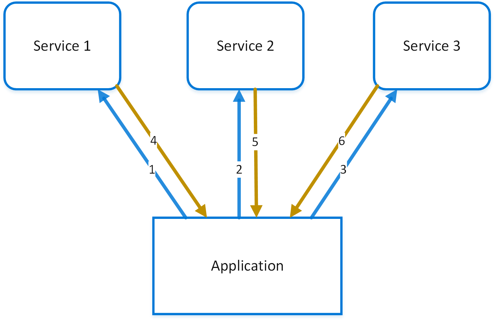
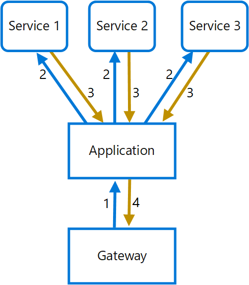

# Gateway Aggregation pattern

Use a gateway to aggregate multiple individual requests into a single request. This pattern is useful when a client must make multiple calls to different backend systems to perform an operation.

## Context and problem

To perform a single task, a client may have to make multiple calls to various backend services. An application that relies on many services to perform a task must expend resources on each request. When any new feature or service is added to the application, additional requests are needed, further increasing resource requirements and network calls. This chattiness between a client and a backend can adversely impact the performance and scale of the application.  Microservice architectures have made this problem more common, as applications built around many smaller services naturally have a higher amount of cross-service calls.

In the following diagram, the client sends requests to each service (1,2,3). Each service processes the request and sends the response back to the application (4,5,6). Over a cellular network with typically high latency, using individual requests in this manner is inefficient and could result in broken connectivity or incomplete requests. While each request may be done in parallel, the application must send, wait, and process data for each request, all on separate connections, increasing the chance of failure.



## Solution

Use a gateway to reduce chattiness between the client and the services. The gateway receives client requests, dispatches requests to the various backend systems, and then aggregates the results and sends them back to the requesting client.

This pattern can reduce the number of requests that the application makes to backend services, and improve application performance over high-latency networks.

In the following diagram, the application sends a request to the gateway (1). The request contains a package of additional requests. The gateway decomposes these and processes each request by sending it to the relevant service (2). Each service returns a response to the gateway (3). The gateway combines the responses from each service and sends the response to the application (4). The application makes a single request and receives only a single response from the gateway.



## Issues and considerations

- The gateway should not introduce service coupling across the backend services.
- The gateway should be located near the backend services to reduce latency as much as possible.
- The gateway service may introduce a single point of failure. Ensure the gateway is properly designed to meet your application's availability requirements.
- The gateway may introduce a bottleneck. Ensure the gateway has adequate performance to handle load and can be scaled to meet your anticipated growth.
- Perform load testing against the gateway to ensure you don't introduce cascading failures for services.
- Implement a resilient design, using techniques such as [bulkheads][bulkhead], [circuit breaking][circuit-breaker], [retry][retry], and timeouts.
- If one or more service calls takes too long, it may be acceptable to timeout and return a partial set of data. Consider how your application will handle this scenario.
- Use asynchronous I/O to ensure that a delay at the backend doesn't cause performance issues in the application.
- Implement distributed tracing using correlation IDs to track each individual call.
- Monitor request metrics and response sizes.
- Consider returning cached data as a failover strategy to handle failures.
- Instead of building aggregation into the gateway, consider placing an aggregation service behind the gateway. Request aggregation will likely have different resource requirements than other services in the gateway and may impact the gateway's routing and offloading functionality.

## When to use this pattern

Use this pattern when:

- A client needs to communicate with multiple backend services to perform an operation.
- The client may use networks with significant latency, such as cellular networks.

This pattern may not be suitable when:

- You want to reduce the number of calls between a client and a single service across multiple operations. In that scenario, it may be better to add a batch operation to the service.
- The client or application is located near the backend services and latency is not a significant factor.

## Example

The following example illustrates how to create a simple a gateway aggregation NGINX service using Lua.

```lua
worker_processes  4;

events {
  worker_connections 1024;
}

http {
  server {
    listen 80;

    location = /batch {
      content_by_lua '
        ngx.req.read_body()

        -- read json body content
        local cjson = require "cjson"
        local batch = cjson.decode(ngx.req.get_body_data())["batch"]

        -- create capture_multi table
        local requests = {}
        for i, item in ipairs(batch) do
          table.insert(requests, {item.relative_url, { method = ngx.HTTP_GET}})
        end

        -- execute batch requests in parallel
        local results = {}
        local resps = { ngx.location.capture_multi(requests) }
        for i, res in ipairs(resps) do
          table.insert(results, {status = res.status, body = cjson.decode(res.body), header = res.header})
        end

        ngx.say(cjson.encode({results = results}))
      ';
    }

    location = /service1 {
      default_type application/json;
      echo '{"attr1":"val1"}';
    }

    location = /service2 {
      default_type application/json;
      echo '{"attr2":"val2"}';
    }
  }
}
```

## Related guidance

- [Backends for Frontends pattern](./backends-for-frontends.md)
- [Gateway Offloading pattern](./gateway-offloading.md)
- [Gateway Routing pattern](./gateway-routing.md)

[bulkhead]: ./bulkhead.md
[circuit-breaker]: ./circuit-breaker.md
[retry]: ./retry.md