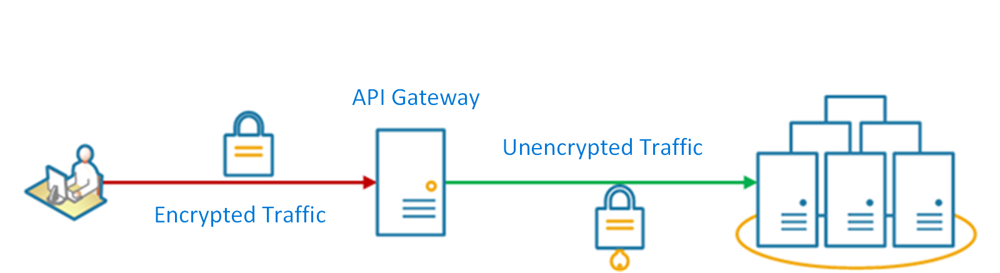

# Gateway Offloading pattern

Offload shared or specialized service functionality to a gateway proxy. This pattern can simplify application development by moving shared service functionality, such as the use of SSL certificates, from other parts of the application into the gateway.

## Context and problem

Some features are commonly used across multiple services, and these features require configuration, management, and maintenance. A shared or specialized service that is distributed with every application deployment increases the administrative overhead and increases the likelihood of deployment error. Any updates to a shared feature must be deployed across all services that share that feature.

Properly handling security issues (token validation, encryption, SSL certificate management) and other complex tasks can require team members to have highly specialized skills. For example, a certificate needed by an application must be configured and deployed on all application instances. With each new deployment, the certificate must be managed to ensure that it does not expire. Any common certificate that is due to expire must be updated, tested, and verified on every application deployment.

Other common services such as authentication, authorization, logging, monitoring, or [throttling](./throttling.md) can be difficult to implement and manage across a large number of deployments. It may be better to consolidate this type of functionality, in order to reduce overhead and the chance of errors.

## Solution

Offload some features into an API gateway, particularly cross-cutting concerns such as certificate management, authentication, SSL termination, monitoring, protocol translation, or throttling.

The following diagram shows an API gateway that terminates inbound SSL connections. It requests data on behalf of the original requestor from any HTTP server upstream of the API gateway.

 

Benefits of this pattern include:

- Simplify the development of services by removing the need to distribute and maintain supporting resources, such as web server certificates and configuration for secure websites. Simpler configuration results in easier management and scalability and makes service upgrades simpler.

- Allow dedicated teams to implement features that require specialized expertise, such as security. This allows your core team to focus on the application functionality, leaving these specialized but cross-cutting concerns to the relevant experts.

- Provide some consistency for request and response logging and monitoring. Even if a service is not correctly instrumented, the gateway can be configured to ensure a minimum level of monitoring and logging.

## Issues and considerations

- Ensure the API gateway is highly available and resilient to failure. Avoid single points of failure by running multiple instances of your API gateway.
- Ensure the gateway is designed for the capacity and scaling requirements of your application and endpoints. Make sure the gateway does not become a bottleneck for the application and is sufficiently scalable.
- Only offload features that are used by the entire application, such as security or data transfer.
- Business logic should never be offloaded to the API gateway.
- If you need to track transactions, consider generating correlation IDs for logging purposes.

## When to use this pattern

Use this pattern when:

- An application deployment has a shared concern such as SSL certificates or encryption.
- A feature that is common across application deployments that may have different resource requirements, such as memory resources, storage capacity or network connections.
- You wish to move the responsibility for issues such as network security, throttling, or other network boundary concerns to a more specialized team.

This pattern may not be suitable if it introduces coupling across services.

## Example

Using Nginx as the SSL offload appliance, the following configuration terminates an inbound SSL connection and distributes the connection to one of three upstream HTTP servers.

```console
upstream iis {
        server  10.3.0.10    max_fails=3    fail_timeout=15s;
        server  10.3.0.20    max_fails=3    fail_timeout=15s;
        server  10.3.0.30    max_fails=3    fail_timeout=15s;
}

server {
        listen 443;
        ssl on;
        ssl_certificate /etc/nginx/ssl/domain.cer;
        ssl_certificate_key /etc/nginx/ssl/domain.key;

        location / {
                set $targ iis;
                proxy_pass http://$targ;
                proxy_set_header X-Forwarded-For $proxy_add_x_forwarded_for;
                proxy_set_header X-Forwarded-Proto https;
proxy_set_header X-Real-IP $remote_addr;
                proxy_set_header Host $host;
        }
}
```

On Azure, this can be achieved by [setting up SSL termination on Application Gateway](/azure/application-gateway/tutorial-ssl-cli).

## Related guidance

- [Backends for Frontends pattern](./backends-for-frontends.md)
- [Gateway Aggregation pattern](./gateway-aggregation.md)
- [Gateway Routing pattern](./gateway-routing.md)
