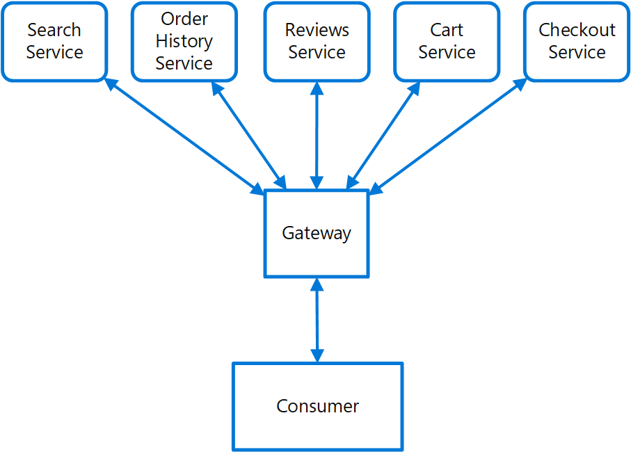

# Gateway Routing pattern

Route requests to multiple services using a single endpoint. This pattern is useful when you wish to expose multiple services on a single endpoint and route to the appropriate service based on the request.

## Context and problem

When a client needs to consume multiple services, setting up a separate endpoint for each service and having the client manage each endpoint can be challenging. For example, an e-commerce application might provide services such as search, reviews, cart, checkout, and order history. Each service has a different API that the client must interact with, and the client must know about each endpoint in order to connect to the services. If an API changes, the client must be updated as well. If you refactor a service into two or more separate services, the code must change in both the service and the client.

## Solution

Place a gateway in front of a set of applications, services, or deployments. Use application Layer 7 routing to route the request to the appropriate instances.

With this pattern, the client application only needs to know about and communicate with a single endpoint. If a service is consolidated or decomposed, the client does not necessarily require updating. It can continue making requests to the gateway, and only the routing changes.

A gateway also lets you abstract backend services from the clients, allowing you to keep client calls simple while enabling changes in the backend services behind the gateway. Client calls can be routed to whatever service or services need to handle the expected client behavior, allowing you to add, split, and reorganize services behind the gateway without changing the client.



This pattern can also help with deployment, by allowing you to manage how updates are rolled out to users. When a new version of your service is deployed, it can be deployed in parallel with the existing version. Routing lets you control what version of the service is presented to the clients, giving you the flexibility to use various release strategies, whether incremental, parallel, or complete rollouts of updates. Any issues discovered after the new service is deployed can be quickly reverted by making a configuration change at the gateway, without affecting clients.

## Issues and considerations

- The gateway service may introduce a single point of failure. Ensure it is properly designed to meet your availability requirements. Consider resiliency and fault tolerance capabilities when implementing.
- The gateway service may introduce a bottleneck. Ensure the gateway has adequate performance to handle load and can easily scale in line with your growth expectations.
- Perform load testing against the gateway to ensure you don't introduce cascading failures for services.
- Gateway routing is level 7. It can be based on IP, port, header, or URL.

## When to use this pattern

Use this pattern when:

- A client needs to consume multiple services that can be accessed behind a gateway.
- You wish to simplify client applications by using a single endpoint.
- You need to route requests from externally addressable endpoints to internal virtual endpoints, such as exposing ports on a VM to cluster virtual IP addresses.

This pattern may not be suitable when you have a simple application that uses only one or two services.

## Example

Using Nginx as the router, the following is a simple example configuration file for a server that routes requests for applications residing on different virtual directories to different machines at the back end.

```console
server {
    listen 80;
    server_name domain.com;

    location /app1 {
        proxy_pass http://10.0.3.10:80;
    }

    location /app2 {
        proxy_pass http://10.0.3.20:80;
    }

    location /app3 {
        proxy_pass http://10.0.3.30:80;
    }
}
```

On Azure, multiple services can be set up behind an [Application Gateway instance](/azure/application-gateway/tutorial-multiple-sites-cli), which provides layer-7 routing.

## Related guidance

- [Backends for Frontends pattern](./backends-for-frontends.md)
- [Gateway Aggregation pattern](./gateway-aggregation.md)
- [Gateway Offloading pattern](./gateway-offloading.md)
