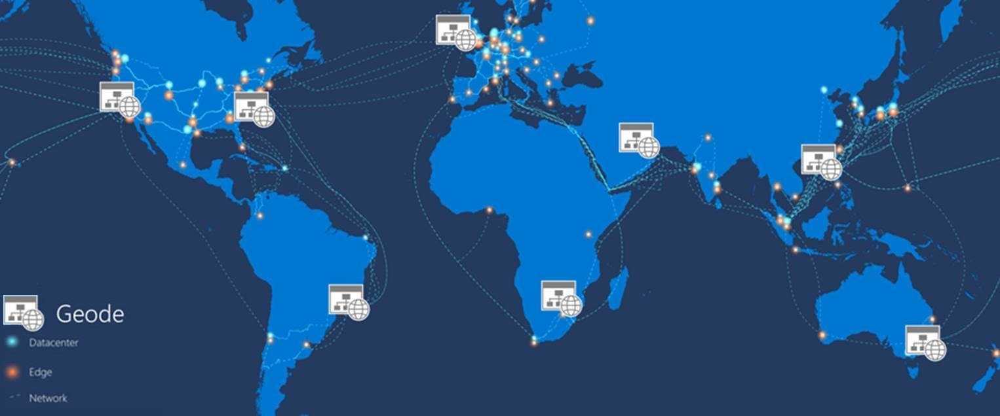
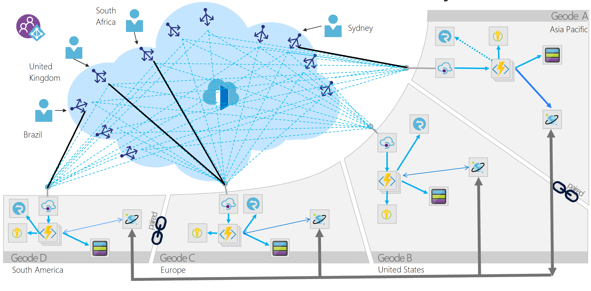

The Geode pattern involves deploying a collection of backend services into a set of **ge**ographical n**ode**s, each of which can service any request for any client in any region. This pattern allows serving requests in an _active-active_ style, improving latency and increasing availability by distributing request processing around the globe.

## Context and problem

Many large-scale services have specific challenges around geo-availability and scale. Classic designs often _bring the data to the compute_ by storing data in a remote SQL server that serves as the compute tier for that data, relying on scale-up for growth.

The classic approach may present a number of challenges:

- Network latency issues for users coming from the other side of the globe to connect to the hosting endpoint
- Traffic management for demand bursts that can overwhelm the services in a single region
- Cost-prohibitive complexity of deploying copies of app infrastructure into multiple regions for a 24x7 service

Modern cloud infrastructure has evolved to enable geographic load balancing of front-end services, while allowing for geographic replication of backend services. For availability and performance, getting data closer to the user is good. When data is geo-distributed across a far-flung user base, the geo-distributed datastores should also be colocated with the compute resources that process the data. The geode pattern _brings the compute to the data_.

## Solution

Deploy the service into a number of satellite deployments spread around the globe, each of which is called a _geode_. The geode pattern harnesses key features of Azure to route traffic via the shortest path to a nearby geode, which improves latency and performance. Each geode is behind a global load balancer, and uses a geo-replicated read-write service like [Azure Cosmos DB](/azure/cosmos-db/introduction) to host the data plane, ensuring cross-geode data consistency. Data replication services ensure that data stores are identical across geodes, so _all_ requests can be served from _all_ geodes.

The key difference between a [deployment stamp](./deployment-stamp.yml) and a geode is that geodes never exist in isolation. There should always be more than one geode in a production platform.

Geodes have the following characteristics:

- Consist of a collection of disparate types of resources, often defined in a template.
- Have no dependencies outside of the geode footprint and are self-contained. No geode is dependent on another to operate, and if one dies, the others continue to operate.
- Are loosely coupled via an edge network and replication backplane. For example, you can use [Azure Traffic Manager](/azure/traffic-manager/traffic-manager-overview) or [Azure Front Door](/azure/frontdoor/front-door-overview) for fronting the geodes, while Azure Cosmos DB can act as the replication backplane. Geodes are not the same as clusters because they share a replication backplane, so the platform takes care of quorum issues.

The geode pattern occurs in big data architectures that use commodity hardware to process data colocated on the same machine, and MapReduce to consolidate results across machines. Another usage is near-edge compute, which brings compute closer to the intelligent edge of the network to reduce response time.

Services can use this pattern over dozens or hundreds of geodes. Furthermore, the resiliency of the whole solution increases with each added geode, since any geodes can take over if a regional outage takes one or more geodes offline.

It's also possible to augment local availability techniques, such as availability zones or paired regions, with the geode pattern for global availability. This increases complexity, but is useful if your architecture is underpinned by a storage engine such as blob storage that can only replicate to a paired region. You can deploy geodes into an intra-zone, zonal, or regional footprint, with a mind to regulatory or latency constraints on location.

## Issues and considerations

Use the following techniques and technologies to implement this pattern:

- Modern DevOps practices and tools to produce and rapidly deploy identical geodes across a large number of regions or instances.
- Autoscaling to scale out compute and database throughput instances within a geode. Each geode individually scales out, within the common backplane constraints.
- A front-end service like Azure Front Door that does dynamic content acceleration, split TCP, and Anycast routing.
- A replicating data store like Azure Cosmos DB to control data consistency.
- Serverless technologies where possible, to reduce always-on deployment cost, especially when load is frequently rebalanced around the globe. This strategy allows for many geodes to be deployed with minimal additional investment. Serverless and consumption-based billing technologies reduce waste and cost from duplicate geo-distributed deployments.
- API Management is not required to implement the design pattern, but can be added to each geode that fronts the region's Azure Function App to provide a more robust API layer, enabling the implementation of additional functionality like rate limiting, for instance.

Consider the following points when deciding how to implement this pattern:

- Choose whether to process data locally in each region, or to distribute aggregations in a single geode and replicate the result across the globe. The [Azure Cosmos DB change feed processor](/azure/cosmos-db/change-feed-processor) offers this granular control using its _lease container_ concept, and the _leasecollectionprefix_ in the corresponding [Azure Functions binding](/azure/cosmos-db/change-feed-functions). Each approach has distinct advantages and drawbacks.
- Geodes can work in tandem, using the Azure Cosmos DB change feed and a real-time communication platform like SignalR. Geodes can communicate with remote users via other geodes in a mesh pattern, without knowing or caring where the remote user is located.
- This design pattern implicitly decouples everything, resulting in an ultra-highly distributed and decoupled architecture. Consider how to track different components of the same request as they might execute asynchronously on different instances. A proper monitoring strategy is crucial. Both Azure Front Door and Azure Cosmos DB can be easily integrated with Log Analytics and Azure Functions should be deployed alongside Application Insights to provide a robust monitoring system at each component in the architecture.
- Distributed deployments have a greater number of secrets and ingress points that require property security measures. Key Vault provides a secure layer for secret management and each layer within the API architecture should be properly secured so that the only ingress point for the API is the front-end service like Azure Front Door. The Azure Cosmos DB should restrict traffic to the Azure Function Apps, and the Function apps to Azure Front Door using Azure Active Directory or practices like IP restriction.
- Performance is drastically affected by the number of geodes that are deployed and the specific App Service Plans applied to the API technology in each geode. Deployment of additional geodes or movement towards premium tiers come with increased costs for the additional memory and compute, but do not do so on a per transaction basis. Consider load testing the API architecture once deployed and contrast increasing the numbers of geodes with increasing the pricing tier so that the most cost-efficient model is used for your needs.
- Determine the availability requirements for your data. Azure Cosmos DB has optional flags for enabling multi-region write, availability zones, and more. These increase the availability for the Azure Cosmos DB instance and creates a more resilient data layer, but come with additional costs.
- Azure offers a variety of load balancers that provide different functionalities for distribution of traffic. Use the [decision tree](../guide/technology-choices/load-balancing-overview.yml#decision-tree-for-load-balancing-in-azure) to help select the right option for your API's front end.

## When to use this pattern

Use this pattern:

- To implement a high-scale platform that has users distributed over a wide area.
- For any service that requires extreme availability and resilience characteristics, because services based on the geode pattern can survive the loss of multiple service regions at the same time.

This pattern might not be suitable for

- Architectures that have constraints so that all geodes can't be equal for data storage. For example, there may be data residency requirements, an application that needs to maintain temporary state for a particular session, or a heavy weighting of requests towards a single region. In this case, consider using [deployment stamps](./deployment-stamp.yml) in combination with a global routing plane that is aware of where a user's data sits, such as the traffic routing component described within the [deployment stamps pattern](./deployment-stamp.yml).
- Situations where there's no geographical distribution required. Instead, consider availability zones and paired regions for clustering.
- Situations where a legacy platform needs to be retrofitted. This pattern works for cloud-native development only, and can be difficult to retrofit.
- Simple architectures and requirements, where geo-redundancy and geo-distribution aren't required or advantageous.

## Examples

- Windows Active Directory implements an early variant of this pattern. Multi-primary replication means all updates and requests can in theory be served from all serviceable nodes, but Flexible Single Master Operation (FSMO) roles mean that all geodes aren't equal.
- The [geode pattern accelerator](https://github.com/mspnp/geode-pattern-accelerator) on GitHub showcases this design pattern in practice and is designed to help developers implement it with real-world APIs.
- The [globally distributed applications using Azure Cosmos DB](../solution-ideas/articles/globally-distributed-mission-critical-applications-using-cosmos-db.yml) article examines a geographical based deployment that utilizes Traffic Manager for load balancing and Azure App Service to host the API code.
- A [QnA sample application](https://github.com/xstof/qnademo) on GitHub showcases this design pattern in practice.
- Geode [Cache over SAP OData APIs](https://github.com/MartinPankraz/AzCosmosDB-OData-Shim): A sample OData API Geode set backed by Azure Cosmos DB as a globally accelerated data cache for SAP Retail applications.
