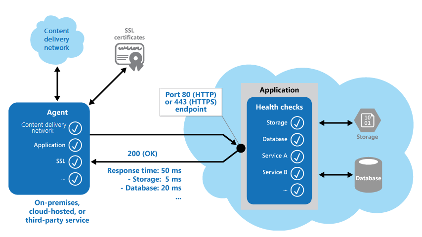

When you need to verify that applications and services are performing correctly, the Health Endpoint Monitoring pattern can be useful. This pattern implements functional checks in an application. External tools can access these checks through exposed endpoints at regular intervals.

## Context and problem

It's a good practice to monitor web applications and back-end services. Monitoring helps ensure that applications and services are available and performing correctly. Business requirements often include monitoring.

It's sometimes more difficult to monitor cloud services than on-premises services. One reason is that you don't have full control of the hosting environment. Another is that the services typically depend on other services that platform vendors and others provide.

Many factors affect cloud-hosted applications. Examples include network latency, the performance and availability of the underlying compute and storage systems, and the network bandwidth between them. A service can fail entirely or partially due to any of these factors. To ensure a required level of availability, you must verify at regular intervals that your service is performing correctly. Your service level agreement (SLA) might specify the level that you need to meet.

## Solution

Implement health monitoring by sending requests to an endpoint on the application. The application should perform the necessary checks and then return an indication of its status.

A health monitoring check typically combines two factors:

- The checks (if any) that the application or service performs in response to the request to the health verification endpoint
- The analysis of the results by the tool or framework that performs the health verification check

The response code indicates the status of the application and, optionally, any components or services it uses. The latency or response time check is performed by the monitoring tool or framework. The following figure provides an overview of the pattern.

The health monitoring code in the application might also run other checks:

- Checking cloud storage or a database for availability and response time
- Checking other resources or services that are located in the application
- Checking other resources or services that are located outside the application but are used by the application

Services and tools are available that monitor web applications by submitting a request to a configurable set of endpoints. These services and tools then evaluate the results against a set of configurable rules. It's relatively easy to create a service endpoint whose sole purpose is to perform some functional tests on the system.

Typical checks that the monitoring tools perform include:

- Validating the response code. For example, an HTTP response of 200 (OK) indicates that the application responded without error. The monitoring system might also check for other response codes to give more comprehensive results.
- Checking the content of the response to detect errors, even when a 200 (OK) status code is returned. By checking the content, you can detect errors that affect only a section of the returned web page or service response. For example, you might check the title of a page or look for a specific phrase that indicates that the correct page was returned.
- Measuring the response time. Its value includes the network latency and the time that the application took to execute the request. An increasing value can indicate an emerging problem with the application or network.
- Checking resources or services that are located outside the application. An example is a content delivery network that the application uses to deliver content from global caches.
- Checking for expiration of SSL certificates.
- Measuring the response time of a DNS lookup for the URL of the application. This check measures DNS latency and DNS failures.
- Validating the URL that's returned by the DNS lookup. Validating ensures that entries are correct. This check can also help to avoid malicious request redirection through a successful attack on the DNS server.

It's also useful, where possible, to run these checks from different on-premises or hosted locations to measure and compare response times. Ideally you should monitor applications from locations that are close to customers to get an accurate view of the performance from each location. In addition to providing a more robust checking mechanism, the results can help you decide on the deployment location for the application&mdash;and whether to deploy it in more than one datacenter.

Tests should also be run against all the service instances that customers use to ensure the application is working correctly for all customers. For example, if customer storage is spread across more than one storage account, the monitoring process should check all of these.

## Issues and considerations

Consider the following points when deciding how to implement this pattern:

**How to validate the response.** For example, is just a single 200 (OK) status code sufficient to verify the application is working correctly? While this provides the most basic measure of application availability, and is the minimum implementation of this pattern, it provides little information about the operations, trends, and possible upcoming issues in the application.

**The number of endpoints to expose for an application.** One approach is to expose at least one endpoint for the core services that the application uses and another for lower priority services, allowing different levels of importance to be assigned to each monitoring result. Also consider exposing more endpoints, such as one for each core service, for additional monitoring granularity. For example, a health verification check might check the database, storage, and an external geocoding service that an application uses, with each requiring a different level of uptime and response time. The application could still be healthy if the geocoding service, or some other background task, is unavailable for a few minutes.

**Whether to use the same endpoint for monitoring as is used for general access**, but to a specific path designed for health verification checks, for example, /health on the general access endpoint. This allows some functional tests in the application to be run by the monitoring tools, such as adding a new user registration, signing in, and placing a test order, while also verifying that the general access endpoint is available.

**The type of information to collect** in the service in response to monitoring requests, and how to return this information. Most existing tools and frameworks look only at the HTTP status code that the endpoint returns. To return and validate additional information, you might have to create a custom monitoring utility or service.

**How much information to collect.** Performing excessive processing during the check can overload the application and impact other users. The time it takes might exceed the timeout of the monitoring system so it marks the application as unavailable. Most applications include instrumentation such as error handlers and performance counters that log performance and detailed error information, this might be sufficient instead of returning additional information from a health verification check.

**Caching the endpoint status.** It could be expensive to run the health check too frequently. If the health status is reported through a dashboard, for example, you don't want every request to the dashboard to trigger a health check. Instead, periodically check the system health and cache the status. Expose an endpoint that returns the cached status.

**How to configure security for the monitoring endpoints** to protect them from public access, which might expose the application to malicious attacks, risk the exposure of sensitive information, or attract denial of service (DoS) attacks. Typically this should be done in the application configuration so that it can be updated easily without restarting the application. Consider using one or more of the following techniques:

- Secure the endpoint by requiring authentication. You can do this by using an authentication security key in the request header or by passing credentials with the request, provided that the monitoring service or tool supports authentication.

  - Use an obscure or hidden endpoint. For example, expose the endpoint on a different IP address to that used by the default application URL, configure the endpoint on a nonstandard HTTP port, and/or use a complex path to the test page. You can usually specify additional endpoint addresses and ports in the application configuration, and add entries for these endpoints to the DNS server if required to avoid having to specify the IP address directly.

  - Expose a method on an endpoint that accepts a parameter such as a key value or an operation mode value. Depending on the value supplied for this parameter, when a request is received the code can perform a specific test or set of tests, or return a 404 (Not Found) error if the parameter value isn't recognized. The recognized parameter values could be set in the application configuration.

     >  DoS attacks are likely to have less impact on a separate endpoint that performs basic functional tests without compromising the operation of the application. Ideally, avoid using a test that might expose sensitive information. If you must return information that might be useful to an attacker, consider how you'll protect the endpoint and the data from unauthorized access. In this case just relying on obscurity isn't enough. You should also consider using an HTTPS connection and encrypting any sensitive data, although this will increase the load on the server.

- How to access an endpoint that's secured using authentication is a point that needs to be considered when evaluating health check endpoints and those that consume it. As an example, [App Service's built-in health check](/azure/app-service/monitor-instances-health-check#authentication-and-security) integrates with App Service's authentication and authorization features.

**How to ensure that the monitoring agent is performing correctly.** One approach is to expose an endpoint that simply returns a value from the application configuration or a random value that can be used to test the agent.

   >  Also ensure that the monitoring system performs checks on itself, such as a self-test and built-in test, to avoid it issuing false positive results.

## When to use this pattern

This pattern is useful for:

- Monitoring websites and web applications to verify availability.
- Monitoring websites and web applications to check for correct operation.
- Monitoring middle-tier or shared services to detect and isolate a failure that could disrupt other applications.
- Complementing existing instrumentation in the application, such as performance counters and error handlers. Health verification checking doesn't replace the requirement for logging and auditing in the application. Instrumentation can provide valuable information for an existing framework that monitors counters and error logs to detect failures or other issues. However, it can't provide information if the application is unavailable.

## Example

[Health Checks for ASP.NET](/aspnet/core/host-and-deploy/health-checks) is middleware and a set of libraries for reporting the health of app infrastructure components. It provides a framework for reporting health checks in a consistent method, implementing many of the practices addressed above. This includes external checks like database connectivity and specific concepts like liveness and readiness probes.

 A number of example implementations using ASP.NET Health Checks can be found on [GitHub](https://github.com/dotnet/AspNetCore.Docs/tree/main/aspnetcore/host-and-deploy/health-checks/samples/5.x/HealthChecksSample).

## Monitoring endpoints in Azure hosted applications

Some options for monitoring endpoints in Azure applications are:

- Use the built-in monitoring features of Azure.

- Use a third-party service or a framework such as Microsoft System Center Operations Manager.

- Create a custom utility or a service that runs on your own or on a hosted server.

   >  Even though Azure provides a reasonably comprehensive set of monitoring options, you can use additional services and tools to provide extra information. Application Insights, a feature of Azure Monitor, is aimed at the development team, to help you understand how your app is performing and how it's being used. It monitors request rates, response times, failure rates, dependency rates and failure rates and it can help you to find out whether external services are slowing you down.

The conditions you can monitor vary depending on the hosting mechanism you choose for your application, but all of these include the ability to create an alert rule that uses a web endpoint you specify in the settings for your service. This endpoint should respond in a timely way so that the alert system can detect that the application is operating correctly.

> Read more information about [creating alert notifications][portal-alerts].

In the event of a major outage, client traffic should be routable to an application deployment which remain available across other regions or zones. This is ultimately where cross-premises connectivity and global load balancing should be used, depending on whether the application is internal and/or external facing. Services such as Azure Front Door, Azure Traffic Manager, or CDNs can route traffic across regions based on application health provided via health probes.

[Azure Traffic Manager](/azure/traffic-manager/traffic-manager-overview) is a routing and load-balancing service that can distribute requests to specific instances of your application based on a range of rules and settings. In addition to routing requests, Traffic Manager pings a URL, port, and relative path that you specify on a regular basis to determine which instances of the application defined in its rules are active and are responding to requests. If it detects a status code 200 (OK), it marks the application as available. Any other status code causes Traffic Manager to mark the application as offline. You can view the status in the Traffic Manager console, and configure the rule to reroute requests to other instances of the application that are responding.

However, Traffic Manager will only wait for a [certain amount of time](/azure/traffic-manager/traffic-manager-monitoring#configure-endpoint-monitoring) to receive a response from the monitoring URL. Therefore, you should ensure that your health verification code executes in this time, allowing for network latency for the round trip from Traffic Manager to your application and back again.

## Next steps

The following guidance can be useful when implementing this pattern:

- [Health monitoring Guidance in microservices-based applications](/dotnet/architecture/microservices/implement-resilient-applications/monitor-app-health)
- Well-Architected Framework's [Monitoring application health for reliability](/azure/architecture/framework/resiliency/monitoring)
- [Receiving alert notifications][portal-alerts]

## 

See the following additional cloud design patterns:

- [External Configuration Store pattern](/azure/architecture/patterns/external-configuration-store)
- [Circuit Breaker pattern](/azure/architecture/patterns/circuit-breaker)
- [Gateway Routing pattern](/azure/architecture/patterns/gateway-routing)
- [Gatekeeper pattern](/azure/architecture/patterns/gatekeeper)

[portal-alerts]: /azure/azure-monitor/alerts/alerts-metric
