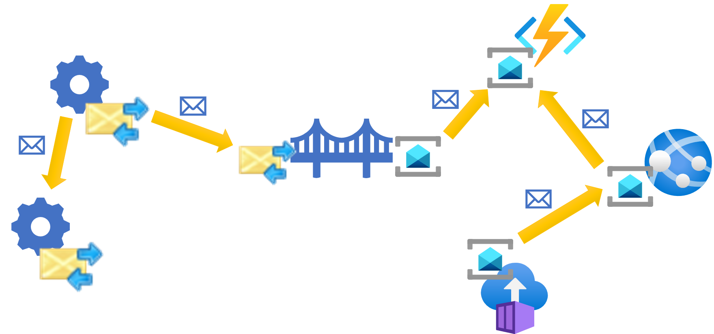

The Messaging Bridge design pattern is a way to integrate disparate systems built on top of different messaging infrastructures.

## Context and problem

Many organizations end up in a situation in which their portfolio of IT systems uses multiple messaging infrastructures like MSMQ, RabbitMQ, Azure Service Bus, and Amazon SQS. This could be due to mergers and acquisitions, or even by extending their current on-premises systems with cloud-hosted components for ease of maintenance, cost-effectiveness or other reasons.

One common way developers try to tackle these challenges is by modifying the systems being integrated to communicate using HTTP-based web services.

This approach has a number of drawbacks:
- the systems must be modified (by adding an HTTP client on one side and an HTTP request handler on the other), retested, and redeployed.
- HTTP endpoints must be hosted, adding to the complexity for making these services secure and highly-available
- it is prone to network connectivity problems, requiring custom-build retry mechanisms

## Solution

If the systems being integrated are message-based (i.e. they consist of components that communicate by exchanging messages), a solution that solves the integration problem while mitigating the drawbacks listed above is the Messaging Bridge pattern.

In this scenario, each system already connects to one messaging infrastructure. In order to integrate them, a bridge component is introduced that is able to connect to two (or more) messaging infrastructures at the same time, pulling messages from one and pushing them to the other without changing the payload.

Neither of the systems being integrated needs to know about the other, nor the bridge. The sender system is configured to send specific messages to a designated queue. The messages are picked up by the bridge and fowarded to another queue in a different messaging infrastructure where they are finally picked up by the receiver system.

### Benefits

- The systems being integrated via the Messaging Bridge do not have to be modified; ideally, the endpoints would not be aware that the messages are bridged.
- The integration is generally more reliable, compared to the HTTP alternative due to the at-least-once message delivery mechanism guarantee.
- Migration scenarios can be more flexible. For example, endpoints can be migrated from one messaging infrastructure to another as the schedule permits instead of all-at-once.

### Drawbacks

- Advanced features of one or both messaging technologies might not be available on the bridged route.
- The bridged route needs to consider both technologies' limitations (e.g., maximum message size may not be a problem on MSMQ but can be an issue when the bridged route leads via Azure Storage Queues).

## Issues and considerations

Consider the following points when implementing the Messaging Bridge pattern:

- If one of the integrated systems relies on the distributed transactions (e.g. via Microsoft Distributed Transaction Coordinator, DTC) for correctness, a deduplication mechanism must be put in place in the bridge.

- If one of the systems being integrated does not currently use any messaging infrastructure and cannot be modified, the Messaging Bridge might be built between the infrastructure used by the other system and a SQL Server-emulated queue. The legacy system can be made to send its messages by inserting to a dedicated queue-table, and the bridge can take these messages and forward them to the actual messaging infrastructure.

- Using a single queue in each messaging infrastructure (designated as _bridging queue_) is a natural choice. In this topology the sending system must be configured to use that specific queue as destination for message types that are sent to the other system. Alternatively, using multiple pairs of queues in each messaging infrastructure allows the sender to be completely unaware of the bridge. A _shadow queue_ is created for each destination queue in the destination system's messaging infrastructure and the bridge is responsible for forwarding messages between the shadow queues and their counterparts.

- In order to meet desired availability SLAs, the messaging bridge might need to be scaled-out using the [Competing Consumers](../../patterns/ccompeting-consumers.yml) approach.

- Regular message-processing components use a [Retry](../../patterns/retry.yml) pattern to cope with transient failures while the retry counter limit allows them to detect _poison_ messages and remove them from the queue to unblock processing. The bridge might require a different retry policy to prevent falsely indentifying messages as poison in case of the infrastructure failure, possibly involving a [Circuir Breaker](../../patterns/circuit-breaker.yml) to pause forwarding.

## When to use this pattern

Use the Messaging Bridge pattern when you need to:

- Integrate existing systems with minimal need for modification
- Integrate legacy applications that cannot be changed to use any messaging technology
- Extend existing on-premises applications with cloud-hosted components
- Connect geo-distributed systems when Internet connection is not stable
- Migrate a single distributed system from one messaging infrastructure to another without the need to stop and re-deploy the whole system

This pattern might not be suitable if:

- At least one of the systems involved relies on specific feature of one messaging infrastructure not present in the other
- Integration is synchronous in nature (the initiating system requires immediate response)
- Integration has specific functional or non-functional requirements (e.g. security or privacy concerns)
- The volume of data for the integration exceeds the capacity of the messaging system or makes messaging not a cost-effective solution to the problem

## Example

There is an application written in .NET Framework for managing employee scheduling hosted on-premises. The application is well-structured with separate components communicating via Microsoft Message Queueing (MSMQ). The application works fine, and the company has no intention of re-writing it. A new consumer of the scheduling data needs to be built to meet a business need, and the IT strategy calls for building new software as cloud-native applications in order to optimize the costs and delivery time.

Since the asynchronous queue-based architecture worked well for the company in the past, the new components are going to use the same architectural approach but with modern technology -- Azure Service Bus. The company does not want to introduce new concepts, such as REST/HTTP communication, just to integrate the two sides and would rather take advantage of the existing infrastructure.

A decision is made to use the Messaging Bridge pattern to connect the two systems. It consists of two parts. One part receives messages from the existing MSMQ queue and forwards them to Azure Service Bus and the other does the opposite -- takes messages from the Azure Service Bus and forwards to the existing MSMQ queue.

By taking this approach the implementation team can utilize existing infrastructure in the existing application to integrate with the new components. The existing application is not even aware of the fact that the new components are hosted in Azure. Similarly, the new components can communicate with the legacy application in the same way as they communicate between themselves -- by sending Azure Service Bus messages. The bridge takes care of forwarding messages between the two systems.

## Next steps

The following information may be relevant when implementing this pattern:

- [Competing Consumers](../../patterns/ccompeting-consumers.yml) should be used to ensure the implementation of the Messaging Bridge can cope with the load.
- [Retry](../../patterns/retry.yml) lets the Messaging Bridge handle transient failures.
- [Circuit breaker](../../patterns/circuit-breaker.yml) can be used to conserve resources when either side of the bridge is experiencing downtime.

## Related resources

- [Messaging Bridge pattern description](https://www.enterpriseintegrationpatterns.com/patterns/messaging/MessagingBridge.html) from the Enterprise Integration Patterns community.
- Learn how to implement a [Messaging Bridge](https://docs.spring.io/spring-integration/docs/current/reference/html/bridge.html) in the Spring Java framework.
- [QPid bridge](https://openmama.finos.org/openmama_qpid_bridge.html) can be used to bridge AMQP-enabled messaging technologies.
- [Messaging Bridge](https://docs.particular.net/nservicebus/bridge/) is an example of a queue-to-queue bridge that supports a range of messaging infrastructures, including MSMQ, Azure Service Bus and Azure Storage Queues.
- [Router](https://github.com/SzymonPobiega/NServiceBus.Router) is an open source project that implements the Messaging Bridge pattern, allows bridging more than two technologies in a single instance, and has advanced message routing capabilities.
