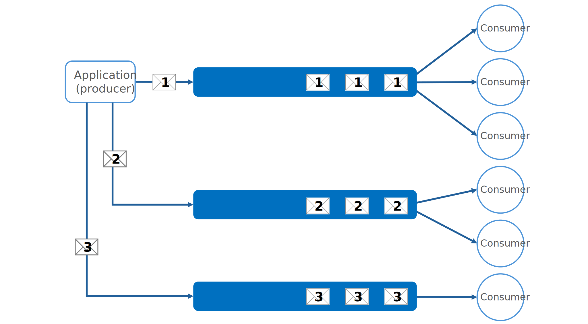
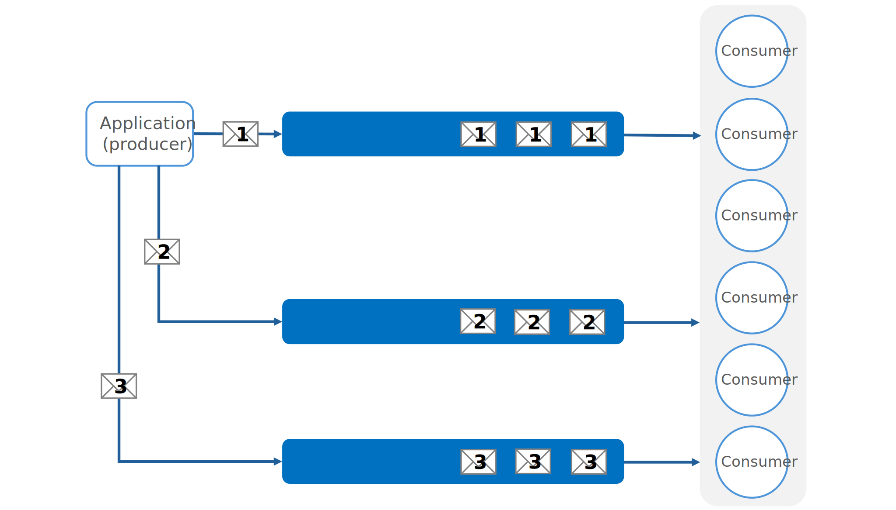
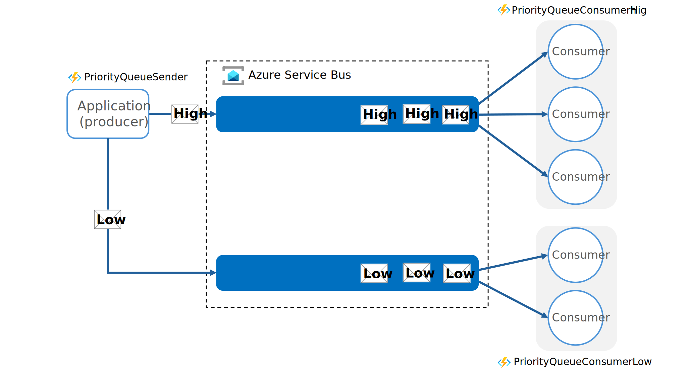

The priority queue pattern enables a workload to process high-priority tasks more quickly than lower-priority tasks. This pattern uses messages sent to one or more queues and is useful in applications that offer different service level guarantees to individual clients.

## Context and problem

Workloads often need to manage and process tasks with varying levels of importance and urgency. Some tasks require immediate attention while others can wait. Failure to address high-priority tasks can affect user experience and breach service-level agreements (SLAs).

To handle tasks efficiently based on their priority, workloads need a mechanism to prioritize and execute tasks accordingly. Typically, workloads process tasks in the order they arrive, using a first-in, first-out (FIFO) queue structure. This approach doesn't account for the varying importance of tasks.

## Solution

Priority queues allow workloads to process tasks based on their priority rather than their arrival order. The application sending a message to the queue assigns a priority to the message, and consumers process the messages by priority. Use the priority queue pattern when you have the following requirements:

- *Handle tasks of varying urgency and importance.* You have tasks with different levels of urgency and importance and need to ensure you process more critical tasks before less critical ones.

- *Handle different service level agreements.* You offer different service level guarantees to clients requires and need to ensure high-priority clients receive better performance and availability.

- *Accommodate different workload management needs.* You have a workload that needs to address certain tasks immediately and less urgent tasks can wait.

There are two main approaches to implementing the Priority Queue pattern:

- *Single queue*: All messages are sent to one queue and each message assigned a priority.

- *Multiple queues*: Separate queues are used for each message priority.

### Single queue

With a single queue, the application (producer) assigns a priority to each message and sends the message to the queue. The queue orders messages by priority, ensuring that consumers process higher-priority messages before lower-priority ones.

 
*Figure 1. Architecture of a single queue and single consumer pool*

### Multiple queues

Multiple queues allow you to separate message by priority. The application assigns a priority to each message and directs the message to the queue corresponding to its priority. The consumers process the messages. A multiple queue solution uses either a single consumer pool or multiple consumer pools.

#### Multiple consumer pools

With multiple consumer pools, each queue has consumer resources dedicated to it. Higher priority queues should use more consumers or higher performance tiers to process messages more quickly than lower priority queues.

Use multiple consumer pools when you have:

- *Strict performance requirements*: Multiple consumer pools are necessary when different task priorities have strict performance requirements that must be independently met.
- *High-reliability needs*: Multiple consumer pools are required for applications where reliability and fault isolation are critical. Issues in one queue must not affect other queues.
- *Complex applications*: Beneficial for complex applications with tasks that require different processing characteristics and performance guarantees for different tasks.

 
*Figure 2. Architecture of multiple queues and multiple consumer pools.*

#### Single consumer pool

With a single consumer pool, all queues share a single pool of consumers. Consumers process messages from the highest priority queue first and only process messages from lower priority queues when there are no high-priority messages. As a result, the single consumer pool always processes higher priority messages before lower priority ones. This setup could lead to lower priority messages being continually delayed and potentially never processed.

Use a single consumer pool for:

- *Simple management*: A single consumer pool is suitable for application where ease of setup and maintenance is a priority. It reduces the complexity of configuration and monitoring.
- *Unified processing needs*: A single consumer pool is useful when the exact nature of the incoming tasks is similar.

 
*Figure 3. Architecture of multiple queues and a single consumer pool.*

## Recommendations for the Priority Queue pattern

Consider the following recommendations when you decide how to implement the priority queue pattern:

### General recommendations

- *Define priorities clearly.* Establish distinct and clear priority levels relevant to your solution. For example, a high-priority message might require processing within 10 seconds. Identify the requirements for handling high-priority items and allocate the necessary resources accordingly.

- *Adjust consumer pools dynamically.* Scale the size of consumer pools based on the queue length they're servicing.

- *Prioritize service levels.* Implement priority queues to meet business needs that require prioritized availability or performance. For example, different customer groups can receive varying levels of service so that high-priority customers experience better performance and availability.

- *Ensure low-priority processing.* In queues that support message prioritization, dynamically increase the priority of aged messages if the system allows it to ensure low-priority messages eventually get processed.

- *Consider queue costs.* Be aware of the financial and processing costs associated with checking queues. Some queue services charge fees for posting, retrieving, and querying messages, which can increase with the number of queues.

### Multiple queues recommendations

- *Monitor processing speeds.* To ensure that messages are processed at the expected rates, continuously monitor the processing speed of high and low-priority queues.

- *Minimize costs.* Process critical tasks immediately with available consumers. Schedule less critical background tasks during less busy times.

### Single consumer pool recommendations

- *Implement preemption and suspension.* Decide if all high-priority items must be processed before any lower-priority items. Use an algorithm that ensures high-priority queues are always serviced before lower-priority queues when you use a single pool of consumers for multiple queues.

- *Optimize costs.* Optimize operational costs by scaling back the number of consumers when you use the single-queue approach. High-priority messages process first, though possibly more slowly, while lower-priority messages might face longer delays.

## Workload design

An architect should evaluate how the Priority Queue pattern can address the goals and principles covered in the [Azure Well-Architected Framework pillars](/azure/well-architected/pillars). For example:

| Pillar | How this pattern supports pillar goals |
| :----- | :------------------------------------- |
| [Reliability](/azure/well-architected/reliability/checklist) design decisions help your workload become **resilient** to malfunction and to ensure that it **recovers** to a fully functioning state after a failure occurs. | Separating items based on business priority enables you to focus reliability efforts on the most critical work.   - [RE:02 Critical flows](/azure/well-architected/reliability/identify-flows)  - [RE:07 Background jobs](/azure/well-architected/reliability/background-jobs) |
| [Performance Efficiency](/azure/well-architected/performance-efficiency/checklist) helps your workload **efficiently meet demands** through optimizations in scaling, data, code. | Separating items based on business priority enables you to focus performance efforts on the most time-sensitive work.   - [PE:09 Critical flows](/azure/well-architected/performance-efficiency/prioritize-critical-flows) |

As with any design decision, consider any tradeoffs against the goals of the other pillars that might be introduced with this pattern.

## Example of the Priority Queue pattern

The following example in [GitHub][priority-queues] demonstrates an implementation of the Priority Queues pattern using Azure Service Bus.

 
*Figure 4. Architecture of the PriorityQueue example in GitHub*

Here's an overview of the architecture:

- *Application (producer)*: The example has an application (`PriorityQueueSender`) that creates messages and assigns a custom property called `Priority` in each message. `Priority` has a value of `High` or `Low`.

- *Message broker and queues*: The example uses Azure Service Bus as the message broker. It uses two Azure Service Bus queues, one for each message priority (`High` and `Low`). The application (producer) sends messages to the correct queue based on the message `Priority`.

- *Multiple consumer pools*: The example uses multiple consumer pools (`PriorityQueueConsumerHigh` and `PriorityQueueConsumerLow`) dedicated to read messages from each of the queues.

| Role in example architecture | Azure service in example | Name in example |
| --- | --- | --- |
| Application | Azure Functions app | [PriorityQueueSender][app] |
| Message queue broker | Azure Service Bus | <*your service bus namespace*> |
| Message queues | Azure Service Bus queues | <*your queue names*> |
| Consumers | Azure Functions app | [PriorityQueueConsumerHigh][high] [PriorityQueueConsumerLow][low] |

## Related resources

The following patterns might be helpful to you when you implement this pattern:

- [Competing Consumers pattern](./competing-consumers.yml): This pattern involves implementing multiple consumers that listen to the same queue and process tasks in parallel to increase throughput. Only one consumer processes each message. The article provides detailed information on the advantages and disadvantages of this approach.

- [Throttling pattern](./throttling.yml): This pattern can be implemented using queues to manage request rates. By utilizing priority messaging, requests from critical applications or high-value customers can be prioritized over less important ones.

<!-- links -->
[priority-queues]: https://github.com/mspnp/cloud-design-patterns/tree/master/priority-queue
[app]: https://github.com/mspnp/cloud-design-patterns/tree/main/priority-queue/PriorityQueueSender
[high]: https://github.com/mspnp/cloud-design-patterns/tree/main/priority-queue/PriorityQueueConsumerHigh
[low]: https://github.com/mspnp/cloud-design-patterns/tree/main/priority-queue/PriorityQueueConsumerLow