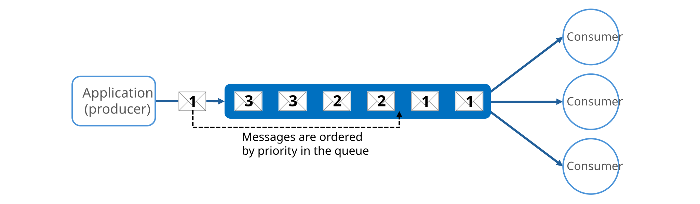
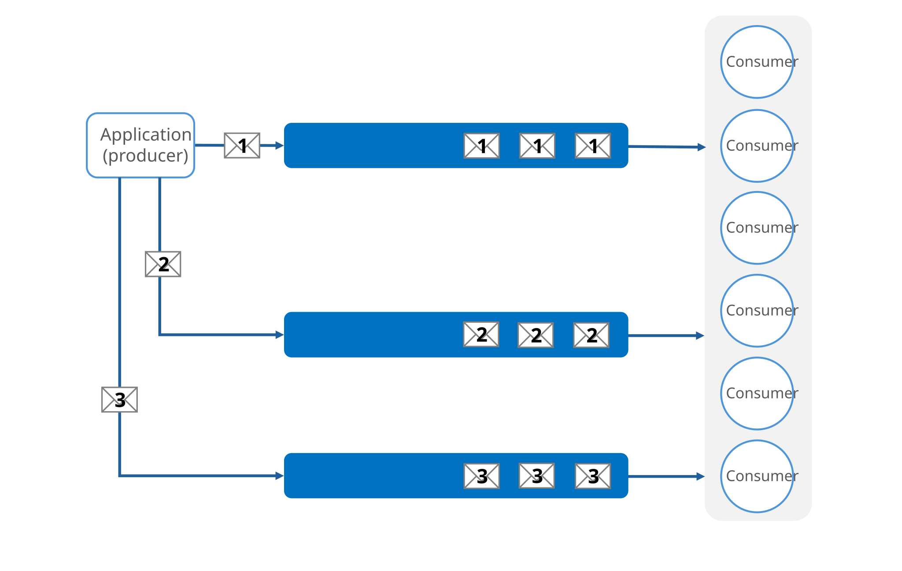
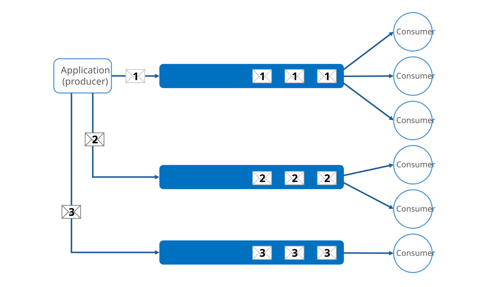
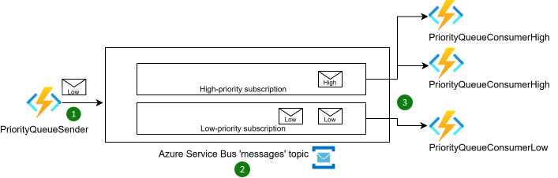

# Priority Queue pattern

Prioritize requests sent to services so that a workload processes high-priority requests more quickly than lower-priority ones. This approach uses messages sent to one or more queues and is useful for applications that provide different service levels or service-level agreements (SLAs) to different request types or customers.

## Context and problem

Workloads might need to manage and process tasks with varying levels of importance and urgency. Some tasks require immediate attention while others can wait. Failure to address high-priority tasks can affect the user experience and breach SLAs.

To handle tasks efficiently based on their priority, workloads need a mechanism to process and run tasks accordingly. By default, most workloads process tasks in the order they arrive, using a first-in, first-out (FIFO) queue structure. This approach doesn't account for varying task importance.

## Solution

Priority queues allow workloads to process tasks based on their priority rather than strictly by their arrival order. The application or *producer* that sends a request assigns a priority value to the message, and *consumers* process the messages by priority. The Priority Queue pattern addresses the following requirements:

- **Handles tasks of varying urgency and importance:** You have tasks with different levels of urgency and importance and need to ensure you process more critical tasks before less critical ones.

- **Handles different SLAs:** You offer different SLAs to different customers and need to ensure high-priority customers receive better performance and availability.

- **Accommodates different workload management needs:** You have a workload that needs to address certain tasks immediately while less urgent tasks can wait.

There are two main approaches to implementing the Priority Queue pattern:

- **Single queue:** Each message is assigned a priority value, and all messages use the same queue.

- **Multiple queues:** Each message is assigned a priority value, and different-priority messages use separate queues.

### Single queue

In a single queue approach, the application assigns a priority to each message and sends all messages to a single queue. The queue orders messages by priority, ensuring that consumers process higher-priority messages before lower-priority ones.

### Multiple queues

Multiple queues separate messages by priority. The application assigns a priority to each message and directs the message to the queue that corresponds to its priority, where consumers process the messages. A multiple-queue solution can use either a single pool of consumers or multiple consumer pools.

#### Single consumer pool

In a single pool setup, all queues share the same consumer pool. Consumers process messages from the highest priority queue first and process messages from lower-priority queues only when there are no more high-priority messages. As a result, single consumer pools always process higher-priority messages before lower-priority ones. This setup can lead to lower-priority messages being continually delayed and potentially never processed.

Use a single consumer pool for the following reasons:

- **Simple management.** Use a single consumer pool when easy setup and maintenance is a priority. A single pool reduces configuration and monitoring complexity.

- **Unified processing needs.** Use a single consumer pool when the incoming tasks are similar in type.

#### Multiple consumer pools

In a multiple consumer pool, each queue has a dedicated consumer pool. Higher-priority queues use more consumers or higher performance tiers to process messages more quickly than lower-priority queues.

Use multiple consumer pools for the following reasons:

- **Strict performance requirements.** Use multiple consumer pools when different task priorities have strict performance requirements that must be met independently.

- **High-reliability needs.** Use multiple consumer pools for applications when reliability and fault isolation are critical, and issues in one queue must not affect other queues.

- **Complex applications.** Use multiple consumer pools for complex applications where different tasks require different processing characteristics and performance guarantees.

## Problems and considerations

Consider the following points when you decide how to implement this pattern:

### General recommendations

- **Define priorities clearly.** Establish distinct and clear priority levels that are relevant to your solution. For example, you might define high-priority messages as those that require processing within 10 seconds. Identify the consumer requirements for handling high-priority items and allocate the necessary resources accordingly.

- **Adjust consumer pools dynamically.** Scale the size of consumer pools based on the length of the queue they're servicing.

- **Monitor queue health.** Track queue depth, processing latency, delivery count, and throughput so you can detect backlogs and slowdowns before they affect work.

- **Use dead-letter queues.** Move [poison messages](https://en.wikipedia.org/wiki/Poison_message) to a dead-letter queue after a configurable number of delivery attempts so one bad message doesn't block the priority path.

- **Prioritize service levels.** Implement priority queues to meet business needs that require prioritized availability or performance. For example, high-priority customers can receive a higher service level so they experience better performance and availability.

- **Consider low-priority processing.** Decide whether all high-priority items must be processed before any lower-priority items. If possible, dynamically increase the priority of old messages to ensure that low-priority messages eventually get processed.

- **Optimize and minimize costs.** Process critical tasks immediately with available consumers. Schedule less critical background tasks during less busy times. 

  If you use a single queue, optimize costs by scaling back the number of consumers. High-priority messages process first but possibly more slowly, while lower-priority messages might face longer delays.

- **Protect processors from demand peaks.** If the producer arrival rate can exceed consumer processing capacity, combine this pattern with the [Queue-Based Load Leveling pattern](./queue-based-load-leveling.md). This approach buffers traffic bursts and helps prevent downstream processing resources from overloading.

### Multiple queue recommendations

- **Monitor processing speeds.** To ensure that messages are processed at the expected rates, continuously monitor the processing speed of high- and low-priority queues.

- **Implement preemption and suspension.** If you use multiple queues with a single consumer pool, implement an algorithm that ensures high-priority queues are always serviced before lower-priority queues.

- **Consider queue costs.** Be aware of the financial costs associated with checking and processing queues. Some queue services charge fees for posting, retrieving, and querying messages. These fees can increase with the number of queues.

## When to use this pattern

Use this pattern when:

- You must meet different latency or service-level objectives for different classes of work, such as premium versus standard customer requests.

- Work arrives in bursts, and you must protect critical operations by processing high-priority messages first while deferring lower-priority work.

This pattern might not be suitable when:

- All work items have similar business importance, and strict FIFO processing is more important than priority-based scheduling.

- Tasks have strong ordering dependencies across priority levels, and reordering work by priority can cause inconsistent outcomes or require complex coordination logic.

## Workload design

Evaluate how to use the Priority Queue pattern in a workload's design to address the goals and principles covered in the [Azure Well-Architected Framework pillars](/azure/well-architected/pillars). The following table provides guidance about how this pattern supports the goals of each pillar.

| Pillar | How this pattern supports pillar goals |
| :----- | :------------------------------------- |
| [Reliability](/azure/well-architected/reliability/checklist) design decisions help your workload become **resilient** to malfunction and to ensure that it **recovers** to a fully functioning state after a failure occurs. | Separating items based on business priority enables you to focus reliability efforts on the most critical work.   - [RE:02 Critical flows](/azure/well-architected/reliability/identify-flows) |
| [Performance Efficiency](/azure/well-architected/performance-efficiency/checklist) helps your workload **efficiently meet demands** through optimizations in scaling, data, and code. | Separating items based on business priority enables you to focus performance efforts on the most time-sensitive work.   - [PE:09 Critical flows](/azure/well-architected/performance-efficiency/prioritize-critical-flows) |

If this pattern introduces trade-offs within a pillar, consider them against the goals of the other pillars.

## Example

The [Priority Queue pattern example][priority-queues] on GitHub demonstrates an implementation of the Priority Queue pattern that uses Azure Service Bus topics and subscriptions. The example deploys a secure storage account, an Application Insights resource for monitoring, and a Service Bus namespace to enable communication between the sender and consumer functions.

The deployment includes three function apps: one sender and two consumers. The consumer apps use different maximum instance counts to simulate message prioritization. The `funcPriorityQueueConsumerHigh` function can scale out to 200 instances, while the `funcPriorityQueueConsumerLow` function is limited to 40 instances. All function apps use the Flex consumption plan and are connected to Application Insights for diagnostics and monitoring.

Role assignments grant secure access to Service Bus and storage by using managed identities. All function apps share the same storage account and Application Insights resource. This configuration centralizes observability and logging.

The following diagram shows the priority queue architecture:

In the preceding diagram:

1. **Application (producer).** The `PriorityQueueSender` application creates messages, assigns a custom application property called `Priority` to each message, and sets the `Priority` value to `High` or `Low`.

1. **Message broker and topic.** The Service Bus message broker sends messages to a single Service Bus topic named `messages`. Service Bus uses [SQL filters](/azure/service-bus-messaging/topic-filters#sql-filters) to route each message to the high-priority or low-priority subscription, based on its `Priority` value.

1. **Multiple consumer pools.** The `PriorityQueueConsumerHigh` and `PriorityQueueConsumerLow` consumer pools respond to messages from the high-priority or low-priority subscriptions by using [Azure Functions Service Bus triggers](/azure/azure-functions/functions-bindings-service-bus-trigger).

| Role in example | Azure service in example | Name in example |
| --- | --- | --- |
| Application (producer) | Azure Functions app | [PriorityQueueSender][app] |
| Message broker | Azure Service Bus | \<your service bus namespace> |
| Message topic | Azure Service Bus topic | `messages` |
| Message subscriptions | Azure Service Bus subscriptions | `highPriority`  `lowPriority` |
| Consumers | Azure Functions app | [PriorityQueueConsumerHigh][high] [PriorityQueueConsumerLow][low] |

## Next steps

- [Service Bus queues, topics, and subscriptions](/azure/service-bus-messaging/service-bus-queues-topics-subscriptions): Review the Service Bus entities and the differences between queues and topics.
- [Duplicate detection](/azure/service-bus-messaging/duplicate-detection): Learn how Service Bus can reject duplicate messages when a sender retries after an uncertain send.
- [Dead-letter queues](/azure/service-bus-messaging/service-bus-dead-letter-queues): Learn how Service Bus moves messages that can't be processed to a dead-letter queue for investigation or reprocessing.
- [What is Azure Queue Storage?](/azure/storage/queues/storage-queues-introduction): Review the core concepts of Azure Queue Storage to compare it with Service Bus queues.

## Related resources

The following patterns might be helpful when you implement this pattern:

- [Queue-Based Load Leveling pattern](./queue-based-load-leveling.md): Use a queue as a buffer between request intake and processing. Use it with the Priority Queue pattern when you need both burst protection and differentiated handling.

- [Competing Consumers pattern](./competing-consumers.md): Implement multiple consumers that listen to the same queue and process tasks in parallel to increase throughput. Only one consumer processes each message.

- [Throttling pattern](./throttling.md): Implement throttling by using queues to manage request rates. Use priority messaging to prioritize requests from critical applications or high-value customers over less important ones.

<!-- links -->
[priority-queues]: https://github.com/Azure-Samples/cloud-design-patterns/tree/main/priority-queue
[app]: https://github.com/Azure-Samples/cloud-design-patterns/tree/main/priority-queue/PriorityQueueSender
[high]: https://github.com/Azure-Samples/cloud-design-patterns/tree/main/priority-queue/PriorityQueueConsumerHigh
[low]: https://github.com/Azure-Samples/cloud-design-patterns/tree/main/priority-queue/PriorityQueueConsumerLow