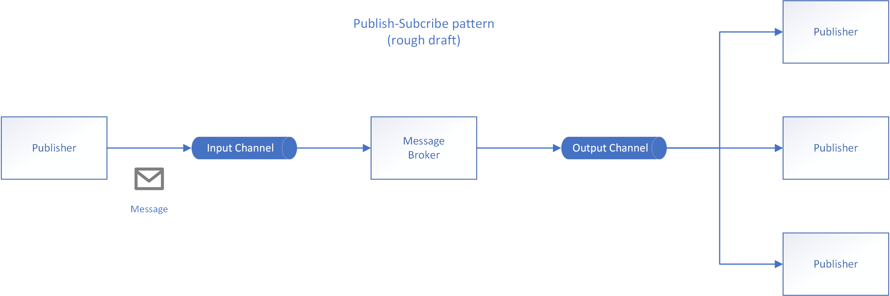
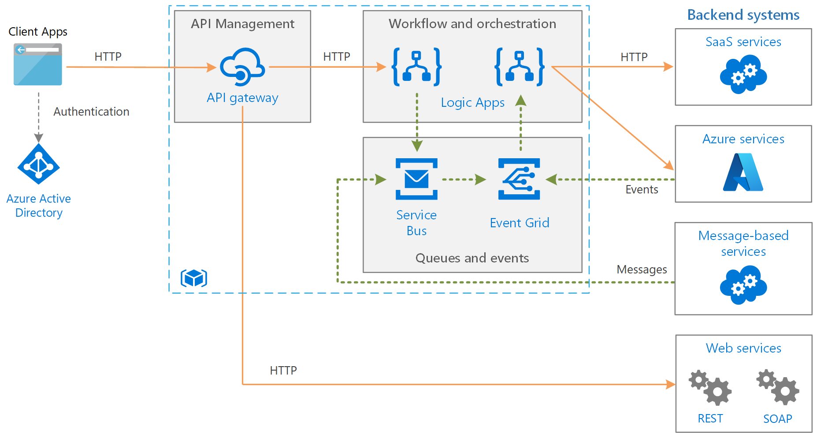

Enable an application to announce events to multiple interested consumers asynchronously, without coupling the senders to the receivers.

**Also called**: Pub/sub messaging

## Context and problem

In cloud-based and distributed applications, components of the system often need to provide information to other components as events happen.

Asynchronous messaging is an effective way to decouple senders from consumers, and avoid blocking the sender to wait for a response. However, using a dedicated message queue for each consumer does not effectively scale to many consumers. Also, some of the consumers might be interested in only a subset of the information. How can the sender announce events to all interested consumers without knowing their identities?

## Solution

Introduce an asynchronous messaging subsystem that includes the following:

- An input messaging channel used by the sender. The sender packages events into messages, using a known message format, and sends these messages via the input channel. The sender in this pattern is also called the *publisher*.

  > [!NOTE]
  > A *message* is a packet of data. An *event* is a message that notifies other components about a change or an action that has taken place.

- One output messaging channel per consumer. The consumers are known as *subscribers*.

- A mechanism for copying each message from the input channel to the output channels for all subscribers interested in that message. This operation is typically handled by an intermediary such as a message broker or event bus.

The following diagram shows the logical components of this pattern:

Pub/sub messaging has the following benefits:

- It decouples subsystems that still need to communicate. Subsystems can be managed independently, and messages can be properly managed even if one or more receivers are offline.

- It increases scalability and improves responsiveness of the sender. The sender can quickly send a single message to the input channel, then return to its core processing responsibilities. The messaging infrastructure is responsible for ensuring messages are delivered to interested subscribers.

- It improves reliability. Asynchronous messaging helps applications continue to run smoothly under increased loads and handle intermittent failures more effectively.

- It allows for deferred or scheduled processing. Subscribers can wait to pick up messages until off-peak hours, or messages can be routed or processed according to a specific schedule.

- It enables simpler integration between systems using different platforms, programming languages, or communication protocols, as well as between on-premises systems and applications running in the cloud.

- It facilitates asynchronous workflows across an enterprise.

- It improves testability. Channels can be monitored and messages can be inspected or logged as part of an overall integration test strategy.

- It provides separation of concerns for your applications. Each application can focus on its core capabilities, while the messaging infrastructure handles everything required to reliably route messages to multiple consumers.

## Issues and considerations

Consider the following points when deciding how to implement this pattern:

- **Existing technologies.** It is strongly recommended to use available messaging products and services that support a publish-subscribe model, rather than building your own. In Azure, consider using [Service Bus](/azure/service-bus-messaging/), [Event Hubs](/azure/event-hubs/) or [Event Grid](/azure/event-grid/). Other technologies that can be used for pub/sub messaging include Redis, RabbitMQ, and Apache Kafka.

- **Subscription handling.** The messaging infrastructure must provide mechanisms that consumers can use to subscribe to or unsubscribe from available channels.

- **Security.** Connecting to any message channel must be restricted by security policy to prevent eavesdropping by unauthorized users or applications.

- **Subsets of messages.** Subscribers are usually only interested in subset of the messages distributed by a publisher. Messaging services often allow subscribers to narrow the set of messages received by:

  - **Topics.** Each topic has a dedicated output channel, and each consumer can subscribe to all relevant topics.
  - **Content filtering.** Messages are inspected and distributed based on the content of each message. Each subscriber can specify the content it is interested in.

- **Wildcard subscribers.** Consider allowing subscribers to subscribe to multiple topics via wildcards.

- **Bi-directional communication.** The channels in a publish-subscribe system are treated as unidirectional. If a specific subscriber needs to send acknowledgment or communicate status back to the publisher, consider using the [Request/Reply Pattern](http://www.enterpriseintegrationpatterns.com/patterns/messaging/RequestReply.html). This pattern uses one channel to send a message to the subscriber, and a separate reply channel for communicating back to the publisher.

- **Message ordering.** The order in which consumer instances receive messages isn't guaranteed, and doesn't necessarily reflect the order in which the messages were created. Design the system to ensure that message processing is idempotent to help eliminate any dependency on the order of message handling.

- **Message priority.** Some solutions may require that messages are processed in a specific order. The [Priority Queue pattern](priority-queue.yml) provides a mechanism for ensuring specific messages are delivered before others.

- **Poison messages.** A malformed message, or a task that requires access to resources that aren't available, can cause a service instance to fail. The system should prevent such messages being returned to the queue. Instead, capture and store the details of these messages elsewhere so that they can be analyzed if necessary. Some message brokers, like Azure Service Bus, support this via their [dead-letter queue functionality](/azure/service-bus-messaging/service-bus-dead-letter-queues).

- **Repeated messages.** The same message might be sent more than once. For example, the sender might fail after posting a message. Then a new instance of the sender might start up and repeat the message. The messaging infrastructure should implement duplicate message detection and removal (also known as de-duping) based on message IDs in order to provide at-most-once delivery of messages. Alternatively, if using messaging infrastructure which doesn't de-duplicate messages, make sure the [message processing logic is idempotent](/azure/architecture/reference-architectures/containers/aks-mission-critical/mission-critical-data-platform#idempotent-message-processing).

- **Message expiration.** A message might have a limited lifetime. If it isn't processed within this period, it might no longer be relevant and should be discarded. A sender can specify an expiration time as part of the data in the message. A receiver can examine this information before deciding whether to perform the business logic associated with the message.

- **Message scheduling.** A message might be temporarily embargoed and should not be processed until a specific date and time. The message should not be available to a receiver until this time.

## When to use this pattern

Use this pattern when:

- An application needs to broadcast information to a significant number of consumers.

- An application needs to communicate with one or more independently-developed applications or services, which may use different platforms, programming languages, and communication protocols.

- An application can send information to consumers without requiring real-time responses from the consumers.

- The systems being integrated are designed to support an eventual consistency model for their data.

- An application needs to communicate information to multiple consumers, which may have different availability requirements or uptime schedules than the sender.

This pattern might not be useful when:

- An application has only a few consumers who need significantly different information from the producing application.

- An application requires near real-time interaction with consumers.

## Example

The following diagram shows an enterprise integration architecture that uses Service Bus to coordinate workflows, and Event Grid to notify subsystems of events that occur. For more information, see [Enterprise integration on Azure using message queues and events](../example-scenario/integration/queues-events.yml).

## Next steps

The following guidance might be relevant when implementing this pattern:

- [Choose between Azure services that deliver messages](/azure/event-grid/compare-messaging-services).

- [Asynchronous Messaging Primer](/previous-versions/msp-n-p/dn589781(v=pandp.10)). Message queues are an asynchronous communications mechanism. If a consumer service needs to send a reply to an application, it might be necessary to implement some form of response messaging. The Asynchronous Messaging Primer provides information on how to implement request/reply messaging using message queues.

The following patterns might be relevant when implementing this pattern:

- [Observer pattern](https://en.wikipedia.org/wiki/Observer_pattern). The Publish-Subscribe pattern builds on the Observer pattern by decoupling subjects from observers via asynchronous messaging.

- [Message Broker pattern](https://en.wikipedia.org/wiki/Message_broker). Many messaging subsystems that support a publish-subscribe model are implemented via a message broker.

[This blog post](https://particular.net/blog/you-dont-need-ordered-delivery) describes different ways of handling messages that arrive out of order.

## Related resources

- The [Event-driven architecture style](../guide/architecture-styles/event-driven.yml) is an architecture style that uses pub/sub messaging.
- [Idempotent message processing](/azure/architecture/reference-architectures/containers/aks-mission-critical/mission-critical-data-platform#idempotent-message-processing)
- [Enterprise integration on Azure using message queues and events](../example-scenario/integration/queues-events.yml)
