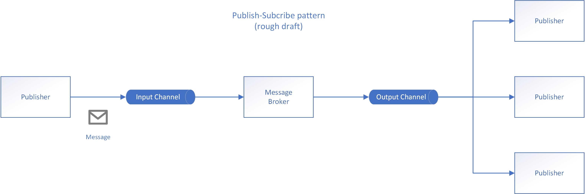
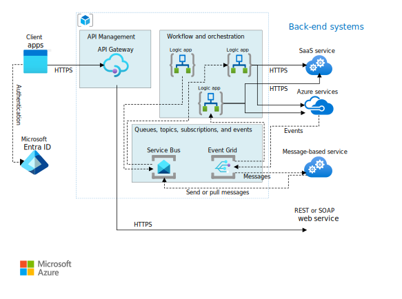

Enable an application to announce events to multiple interested consumers asynchronously, without coupling the senders to the receivers.

**Also called**: Pub/sub messaging

## Context and problem

In cloud-based and distributed applications, components of the system often need to provide information to other components as events happen. When a sender communicates directly with its consumers, it must know the identity and endpoint of every consumer, handle delivery to each one, and manage failures individually. Adding or removing a consumer requires changes to the sender, which limits the ability of teams to develop and deploy components independently.

Message queues can decouple senders from consumers and avoid blocking the sender while it waits for a response. However, a standard queue creates a relationship between a sender and a single consumer. Supporting multiple consumers requires a dedicated queue for each one, which doesn't scale well and complicates the sender with routing logic. Some consumers might be interested in only a subset of the information the sender produces, but queues alone offer no built-in mechanism for filtering messages by content or category.

How can a sender announce events to many interested consumers without knowing their identities, while allowing each consumer to independently decide which events to receive?

## Solution

Introduce an asynchronous messaging subsystem that includes the following components:

- An input messaging channel used by the sender. The sender packages events into messages, using a known message format, and sends these messages via the input channel. The sender in this pattern is also called the *publisher*.

  > [!NOTE]
  > A *message* is a packet of data. An *event* is a message that notifies other components about a change or an action that has taken place. Although this pattern is often used with events, it can carry any type of message, including commands and state notifications.

- One output messaging channel per consumer. The consumers are known as *subscribers*.

- A mechanism for copying each message from the input channel to the output channels for all subscribers interested in that message. This operation is typically handled by an intermediary such as a message broker or event bus.

The following diagram shows the logical components of this pattern:

Pub/sub messaging has the following benefits:

- It decouples subsystems that still need to communicate. Subsystems can be managed independently, and messages are retained even if one or more receivers are offline.

- It increases scalability and improves responsiveness of the sender. The sender sends a single message to the input channel and then returns to its core processing responsibilities. The messaging infrastructure routes messages to interested subscribers.

- It isolates faults. A subscriber failure doesn't affect the publisher or other subscribers, and the broker can retain messages until a recovered subscriber is ready to process them.

- It allows for deferred or scheduled processing. Subscribers can wait to pick up messages until off-peak hours, or messages can be routed or processed according to a specific schedule.

- It enables integration between systems that use different platforms, programming languages, or communication protocols, as well as between on-premises systems and applications running in the cloud.

- It improves testability. Channels can be monitored and messages can be inspected or logged as part of an integration test strategy.

- It provides separation of concerns for your applications. Each application can focus on its core capabilities, while the messaging infrastructure handles everything required to reliably route messages to multiple consumers.

## Problems and considerations

Consider the following points as you decide how to implement this pattern:

- **Existing technologies.** Use messaging products and services that support a publish-subscribe model rather than building your own. In Azure, consider the following services:

  - [Azure Service Bus](/azure/service-bus-messaging/) for messaging that requires transactions, ordering, sessions, or dead-letter queues.
  - [Azure Event Grid](/azure/event-grid/) for reactive, event-based notifications with push delivery, especially when reacting to state changes in Azure resources.
  - [Azure Event Hubs](/azure/event-hubs/) for high-throughput event streaming scenarios such as telemetry ingestion and log aggregation. Event Hubs uses a log-based streaming model rather than traditional pub/sub, but it supports multiple consumer groups reading the same stream independently.

  For help choosing between these services, see [Choose between Azure services that deliver messages](/azure/service-bus-messaging/compare-messaging-services). Other technologies that support pub/sub messaging include [Redis](https://redis.io/docs/latest/develop/interact/pubsub/), RabbitMQ, and Apache Kafka.

  Libraries like [MassTransit](https://masstransit.io) and [NServiceBus](https://docs.particular.net/nservicebus/) provide built-in support for the publish-subscribe model on Azure Service Bus and other messaging technologies.

- **Subscription handling.** The messaging infrastructure must provide mechanisms that consumers can use to subscribe to or unsubscribe from available channels.

- **Security.** Authenticate and authorize both publishers and subscribers on a per-topic basis. An unauthorized publisher injecting messages can be as damaging as an unauthorized subscriber reading them. Encrypt messages in transit and, if content is sensitive, at rest in the broker to prevent eavesdropping.

- **Subsets of messages.** Subscribers are usually interested in only a subset of messages from a publisher. Messaging services often allow subscribers to narrow what they receive by:

  - **Topics.** Each topic has a dedicated output channel, and each consumer can subscribe to all relevant topics.
  - **Content filtering.** Messages are inspected and distributed based on the content of each message. Each subscriber can specify the content it is interested in.

  Choose topic granularity carefully. Broad topics are simpler to manage but force subscribers to filter out messages they don't need. Narrow topics reduce filtering but increase the number of topics to manage. Some brokers support wildcard subscriptions (for example, `orders.*`), which let subscribers match multiple topics without enumerating each one.

- **Bi-directional communication.** The channels in a publish-subscribe system are unidirectional. If a subscriber needs to send acknowledgment or communicate status back to the publisher, use the [Request/Reply Pattern](https://www.enterpriseintegrationpatterns.com/patterns/messaging/RequestReply.html). This pattern uses one channel to send a message to the subscriber and a separate reply channel for communicating back to the publisher.

- **Message ordering.** The order in which subscribers receive messages isn't guaranteed and doesn't necessarily reflect the order in which messages were created. If ordering matters, the broker might support ordered delivery within a partition or session, but that constrains scalability. Design subscribers to handle messages independently of arrival order.

- **Message priority.** Some workloads require that certain messages are processed before others. The [Priority Queue pattern](priority-queue.yml) provides a mechanism for routing higher-priority messages ahead of lower-priority ones.

- **Poison messages.** A malformed message, or a task that requires access to unavailable resources, can cause a service instance to fail. Prevent such messages from being returned to the queue. Capture and store the details of these messages elsewhere for analysis. Some message brokers, like Azure Service Bus, support this through [dead-letter queues](/azure/service-bus-messaging/service-bus-dead-letter-queues).

- **Message size.** Brokers enforce message size limits. When payloads are large, such as files or images, store the content in an external data store and include a reference in the message. The [Claim-Check pattern](claim-check.yml) describes this approach.

- **Delivery guarantees and duplicate messages.** Messaging systems offer different delivery guarantees, each with trade-offs.

  - *At-most-once* delivery minimizes overhead but can lose messages if the broker or subscriber fails.
  - *At-least-once* delivery ensures messages aren't lost but can deliver duplicates, for example when a sender fails after posting a message and a new instance repeats it.
  - *Exactly-once* delivery eliminates duplicates but adds coordination overhead and latency, and its availability depends on the messaging infrastructure.

  If your broker doesn't provide deduplication, design subscribers to [handle messages idempotently](../reference-architectures/containers/aks-mission-critical/mission-critical-data-platform.md#idempotent-message-processing). Different subscribers in the same workload might need different guarantees.

- **Message expiration.** A message might have a limited lifetime. If it isn't processed within that period, it's no longer relevant and should be discarded. Set an expiration time as part of the message data so that receivers can check relevance before processing.

- **Message scheduling.** A message might be embargoed and should not be processed until a specific date and time. The message must not be available to a receiver until then.

- **Message schema evolution.** Because publishers and subscribers are deployed independently, message schemas change over time. Prefer backward compatible changes, such as adding optional fields, so existing subscribers continue working. For breaking changes, version through topic names (for example, `orders.v1` and `orders.v2`) or through a version field in message metadata. Subscribers should ignore fields they don't recognize.

- **Correlation.** The broker decouples publishers from subscribers, which makes it harder to trace the end-to-end flow of a message. Include a correlation ID in every message so that subscribers and logging systems can connect related operations into a single trace.

- **Backpressure and scaling.** When subscribers can't keep up, unprocessed messages accumulate in the broker and can exhaust its resources. Use broker flow control settings to limit unacknowledged messages per subscriber. Scale out subscribers using the [Competing Consumers pattern](competing-consumers.yml) when flow control alone isn't sufficient.

## When to use this pattern

Use this pattern when:

- An application needs to broadcast information to a significant number of consumers.

- An application needs to communicate with one or more independently developed applications or services, which might use different platforms, programming languages, and communication protocols.

- An application can send information to consumers without requiring real-time responses from the consumers.

- The systems being integrated are designed to support an eventual consistency model for their data.

- An application needs to communicate information to multiple consumers, which might have different availability requirements or uptime schedules than the sender.

This pattern might not be suitable when:

- An application has only a few consumers who need significantly different information from the producing application. The overhead of a broker adds complexity without the scaling benefit. Direct communication or separate queues might be more appropriate.

- An application requires near real-time interaction with consumers. Pub/sub introduces latency through the broker. If the publisher needs a synchronous response, a request-reply pattern is a better fit.

- The consumers must process messages in a strict, guaranteed order. Pub/sub systems generally don't guarantee ordering across subscribers, and maintaining order adds significant constraints to the broker and consumer design.

- The operation requires a single atomic transaction across the publisher and its consumers. Pub/sub is inherently asynchronous and eventually consistent. If you need transactional guarantees, consider a direct database transaction or the [Saga pattern](saga.yml) for coordinating distributed transactions.

## Workload design

Evaluate how to use the Publisher-Subscriber pattern in a workload's design to address the goals and principles covered in the [Azure Well-Architected Framework pillars](/azure/well-architected/pillars). The following table provides guidance about how this pattern supports the goals of each pillar.

| Pillar | How this pattern supports pillar goals |
| :----- | :------------------------------------- |
| [Reliability](/azure/well-architected/reliability/checklist) design decisions help your workload become **resilient** to malfunction and to ensure that it **recovers** to a fully functioning state after a failure occurs. | The decoupling introduced in this pattern enables independent reliability targets on components and removes direct dependencies.   - [RE:03 Failure mode analysis](/azure/well-architected/reliability/failure-mode-analysis)  - [RE:07 Background jobs](/azure/well-architected/design-guides/background-jobs) |
| [Security](/azure/well-architected/security/checklist) design decisions help ensure the **confidentiality**, **integrity**, and **availability** of your workload's data and systems. | This pattern introduces an important security segmentation boundary that enables queue subscribers to be network-isolated from the publisher.   - [SE:04 Segmentation](/azure/well-architected/security/segmentation) |
| [Cost Optimization](/azure/well-architected/cost-optimization/checklist) focuses on **sustaining and improving** your workload's **return on investment**. | This decoupled design can enable an event-driven approach in your architecture, which couples well with consumption-based billing to avoid overprovisioning.   - [CO:05 Rate optimization](/azure/well-architected/cost-optimization/get-best-rates)  - [CO:12 Scaling costs](/azure/well-architected/cost-optimization/optimize-scaling-costs) |
| [Operational Excellence](/azure/well-architected/operational-excellence/checklist) helps deliver **workload quality** through **standardized processes** and team cohesion. | This layer of indirection can enable you to safely change the implementation on either the publisher or subscriber side without needing to coordinate changes to both components.   - [OE:06 Workload development](/azure/well-architected/operational-excellence/workload-supply-chain)  - [OE:11 Safe deployment practices](/azure/well-architected/operational-excellence/safe-deployments) |
| [Performance Efficiency](/azure/well-architected/performance-efficiency/checklist) helps your workload **efficiently meet demands** through optimizations in scaling, data, and code. | The decoupling of publishers from consumers enables you to optimize the compute and code specifically for the task that the consumer needs to perform for the specific message.   - [PE:02 Capacity planning](/azure/well-architected/performance-efficiency/capacity-planning)  - [PE:05 Scaling and partitioning](/azure/well-architected/performance-efficiency/scale-partition) |

If this pattern introduces trade-offs within a pillar, consider them against the goals of the other pillars.

## Example

The following diagram shows an enterprise integration architecture that uses Service Bus to coordinate workflows, and Event Grid to notify subsystems of events that occur. For more information, see [Enterprise integration on Azure using message queues and events](../example-scenario/integration/queues-events.yml).

## Next steps

- [Asynchronous messaging options](../guide/technology-choices/messaging.yml). Describes the messaging services available in Azure, including guidance on message broker technology choices, messaging patterns, and request/reply messaging.
- [You don't need ordered delivery](https://particular.net/blog/you-dont-need-ordered-delivery). This blog post describes different ways of handling messages that arrive out of order.

## Related resources

- The [Event-driven architecture style](../guide/architecture-styles/event-driven.md) is an architecture style that uses pub/sub messaging.
- [Idempotent message processing](../reference-architectures/containers/aks-mission-critical/mission-critical-data-platform.md#idempotent-message-processing)
- [Enterprise integration on Azure using message queues and events](../example-scenario/integration/queues-events.yml)
