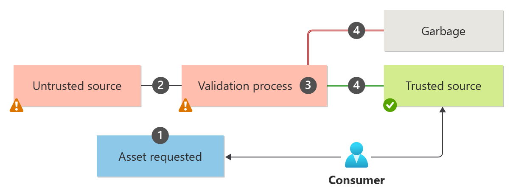

Consume third-party software artifacts in your supply chain only when it's verified and marked as safe-for-use, by well-defined processes. This pattern is an operational sidecar to the development process. The consumer of this pattern invokes this process to verify and block the use of software that could potentially introduce security vulnerabilities.

## Context and problem

Cloud solutions often rely on third-party software obtained from external sources. Open-source binaries, public container images, vendor OS images are some examples of these types of artifacts. All such external artifacts must be treated as *untrusted*.

In a typical workflow, the artifact is retrieved from a store outside the solution's scope and then integrated into the deployment pipeline. There are some potential issues in this approach. The source might not be trusted, the artifact might contain vulnerabilities, or it might not be suitable in some other way for the developer environment.

If these issues aren't addressed, data integrity and confidentiality guarantees of the solution might be compromised, or cause instability due to incompatibility with other components.

Some of those security issues can be avoided by adding checks to each artifact.

## Solution

Have a process that validates the software for security before introducing it in your workload. During the process, each artifact undergoes thorough operational rigor that verifies it against specific conditions. Only after the artifact satisfies those conditions, the process marks it as *trusted*.

> The process of quarantining is a security measure, which consists of a series of checkpoints that are employed before an artifact is consumed. Those security checkpoints make sure that an artifact transitions from an untrusted status to a trusted status.

The quarantine process doesn't change the artifact's composition. The process is independent of the software development cycle and is invoked by consumers, as needed. As a consumer of the artifact, block the use of artifacts until they've passed quarantine.

Here's a typical quarantine workflow:

1. The consumer signals their intent, specifies the input source of the artifact, and blocks its use.

2. The quarantine process validates the origin of the request and gets the artifacts from the specified store.

3. A custom verification process is performed as part of quarantine, which includes verifying the input constraints and checking the attributes, source, and type against established standards.

    Some of these security checks can be vulnerability scanning, malware detection, and so on, on each submitted artifact.

    The actual checks depend on the type of artifact. Evaluating an OS image is different from evaluating a NuGet package, for example.

4. If the verification process is successful, the artifact is published in a safe store with clear annotations. Otherwise, it remains unavailable to the consumer.

    The publishing process can include a cumulative report that shows proof of verification and the criticality of each check. Include expiration in the report beyond which the report should be invalid and the artifact is considered unsafe.

5. The process marks the end of the quarantine by signaling an event with state information accompanied by a report.

    Based on the information, the consumers can choose to take actions to use the trusted artifact. Those actions are outside the scope of the Quarantine pattern.

## Issues and considerations

- As a team that consumes third-party artifacts, ensure that it's obtained from a trusted source. Your choice must be aligned to organization-approved standards for artifacts that are procured from third-party vendors. The vendors must be able to meet the security requirements of your workload (and your organization). For example, make sure the vendor's responsible disclosure plan meets your organization's security requirements.

- Create segmentation between resources that stores trusted and untrusted artifacts. Use identity and network controls to restrict access to the authorized users.

- Have a reliable way to invoking the quarantine process. Make sure the artifact isn't consumed inadvertently until marked as trusted. The signaling should be automated. For example, tasks related to notifying the responsible parties when an artifact is ingested into the developer environment, committing changes to a GitHub repository, adding an image to a private registry, and so on.  

- An alternative to implementing a Quarantine pattern is to outsource it. There are quarantine practitioners who specialize in public asset validation as their business model. Evaluate both the financial and operational costs of implementing the pattern versus outsourcing the responsibility. If your security requirements need more control, implementing your own process is recommended.

- Automate the artifact ingestion process and also the process of publishing the artifact. Because validation tasks can take time, the automation process must be able to continue until all tasks are completed.

- The pattern serves as a first opportunity momentary validation. Successfully passing quarantine doesn't ensure that the artifact remains trustworthy indefinitely. The artifact must continue to undergo continuous scanning, pipeline validation, and other routine security checks that serve as last opportunity validations before promoting the release.

- The pattern can be implemented by central teams of an organization or an individual workload team. If there are many instances or variations of the quarantine process, these operations should be standardized and centralized by the organization. In this case, workload teams share the process and benefit from offloading process management.

## When to use this pattern

Use this pattern when:

- The workload integrates an artifact developed outside the scope of the workload team. Common examples include:

  - An Open Container Initiative (OCI) artifact from public registries such as, DockerHub, GitHub Container registry, Microsoft container registry

  - A software library or package from public sources such as, the NuGet Gallery, Python Package Index, Apache Maven repository

  - An external Infrastructure-as-Code (IaC) package such as Terraform modules, Community Chef Cookbooks, Azure Verified Modules

  - A vendor-supplied OS image or software installer

- The workload team considers the artifact as a risk that's worth mitigating. The team understands the negative consequences of integrating compromised artifacts and the value of quarantine in assuring a trusted environment.

- The team has a clear and shared understanding of the validation rules that should be applied to a type of artifact. Without consensus, the pattern might not be effective.

  For example, if a different set of validation checks are applied each time an OS image is ingested into quarantine, the overall verification process for OS images becomes inconsistent.

This pattern might not be useful when:

- The software artifact is created by the workload team or a trusted partner team.

- The risk of not verifying the artifact is less expensive than the cost of building and maintaining the quarantine process.

## Workload design

An architect and the workload team should evaluate how the Quarantine pattern can be used as part of the workload's DevSecOps practices. The underlying principles are covered in the [Azure Well-Architected Framework pillars](/azure/well-architected/pillars).

|Pillar|How this pattern supports pillar goals|
|---|---|
|[Security](/azure/well-architected/security/checklist) design decisions help ensure the **confidentiality**, **integrity**, and **availability** of your workload's data and systems.|The first responsibility of security validation is served by the Quarantine pattern. The validation on an external artifact is conducted in a segmented environment before it's consumed by the development process.   - [SE:02 Secured development lifecycle](/azure/well-architected/security/secure-development-lifecycle)  - [SE:11 Testing and validation](/azure/well-architected/security/test)|
|[Operational Excellence](/azure/well-architected/operational-excellence/checklist) helps deliver **workload quality** through **standardized processes** and team cohesion.|The Quarantine pattern supports safe deployment practices (SDP) by making sure that compromised artifacts aren't consumed by the workload, which could lead to security breaches during progressive exposure deployments.   - [OE:03 Software development practices](/azure/well-architected/operational-excellence/formalize-development-practices)  - [OE:11 Testing and validation](/azure/well-architected/operational-excellence/safe-deployments)|

As with any design decision, consider any tradeoffs against the goals of the other pillars that might be introduced with this pattern.

## Example

This example applies the [solution workflow](#solution) to a scenario where the workload team wants to integrate OCI artifacts from public registries to an Azure Container Registry (ACR) instance, which is owned by the workload team. The team treats that instance as a trusted artifact store.

The workload environment uses Azure Policy for Kubernetes to enforce governance. It restricts container pulls only from their trusted registry instance. Additionally, Azure Monitor alerts are set up to detect any imports into that registry from unexpected sources.

:::image type="content" source="./_images/quarantine-example.svg" alt-text="This diagram shows Azure Container Registry implementation of the Quarantine pattern." lightbox="./_images/quarantine-example.png":::

1. A request for an external image is made by the workload team through a custom application hosted on Azure Web Apps. The application collects the required information only from authorized users.

    *Security checkpoint: The identity of requestor, the destination container registry, and the requested image source, are verified.*

2. The request is stored in Azure Cosmos DB.

    *Security checkpoint: An audit trail is maintained in the database, keeping track of lineage and validations of the image. This trail is also used for historical reporting.*

3. The request is handled by a workflow orchestrator, which is a durable Azure Function. The orchestrator uses a scatter-gather approach for running all validations.

    *Security checkpoint: The orchestrator has a managed identity with just-enough access to perform the validation tasks.*

4. The orchestrator makes a request to import the image into the quarantine Azure Container Registry (ACR) that is deemed as an untrusted store.

5. The import process on the quarantine registry gets the image from the untrusted external repository. If the import is successful, the quarantine registry has local copy of the image to execute validations.

    *Security checkpoint: The quarantine registry protects against tampering and workload consumption during the validation process*.

6. The orchestrator runs all validation tasks on the local copy of the image. Tasks include checks such as, Common Vulnerabilities and Exposures (CVE) detection, software bill of material (SBOM) evaluation, malware detection, image signing, and others.

    The orchestrator decides the type of checks, the order of execution, and the time of execution. In this example, it uses Azure Container Instance as task runners and results are in the Cosmos DB audit database. All tasks can take significant time.

    *Security checkpoint: This step is the core of the quarantine process that performs all the validation checks. The type of checks could be custom, open-sourced, or vendor-purchased solutions.*

7. The orchestrator makes a decision. If the image passes all validations, the event is noted in the audit database, the image is pushed to the trusted registry, and the local copy is deleted from the quarantine registry. Otherwise, the image is deleted from the quarantine registry to prevent its inadvertent use.

    *Security checkpoint: The orchestrator maintains segmentation between trusted and untrusted resource locations.*

    > [!NOTE]
    > Instead of the orchestrator making the decision, the workload team can take on that responsibility. In this alternative, the orchestrator publishes the validation results through an API and keeps the image in the quarantine registry for a period of time.
    >
    > The workload team makes the decision after reviewing results. If the results meet their risk tolerance, they pull the image from the quarantine repository into their container instance. This pull model is more practical when this pattern is used to support multiple workload teams with different security risk tolerances.

All container registries are covered by Microsoft Defender for Containers, which continuously scans for newly found issues. These issues are shown in Microsoft Defender Vulnerability Management.

## Next steps

The following guidance might be relevant when implementing this pattern:

- [Recommendations for securing a development lifecycle](/azure/well-architected/security/secure-development-lifecycle) provides guidance about using trusted units of code through all stages of the development lifecycle.  

- [Best practices for a secure software supply chain](/nuget/concepts/security-best-practices) especially when you have NuGet dependencies in your application.  

- [Safeguard against malicious public packages](/azure/devops/artifacts/concepts/upstream-behavior) using Azure Artifacts.
