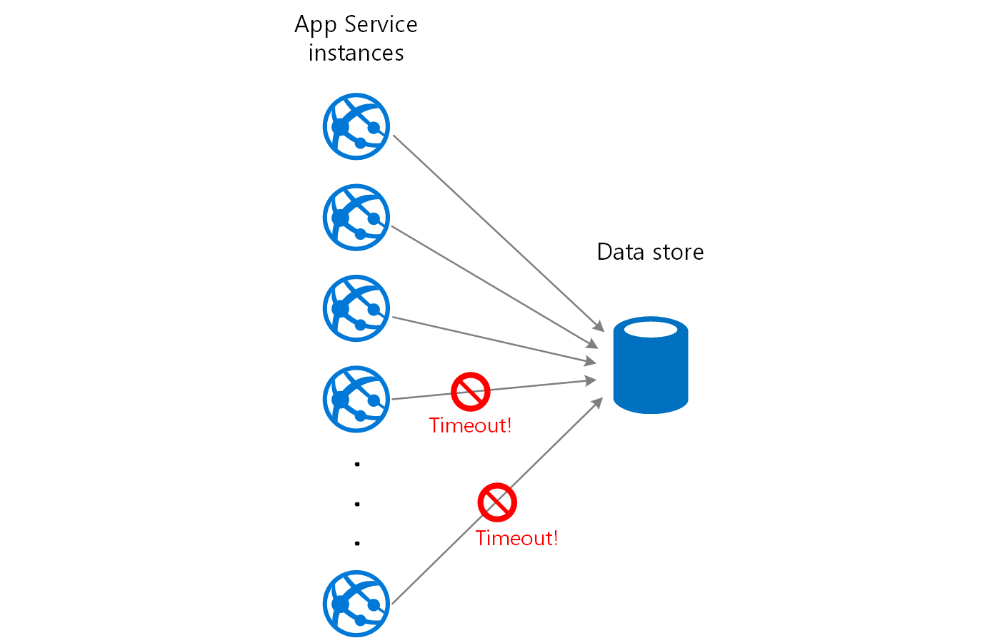
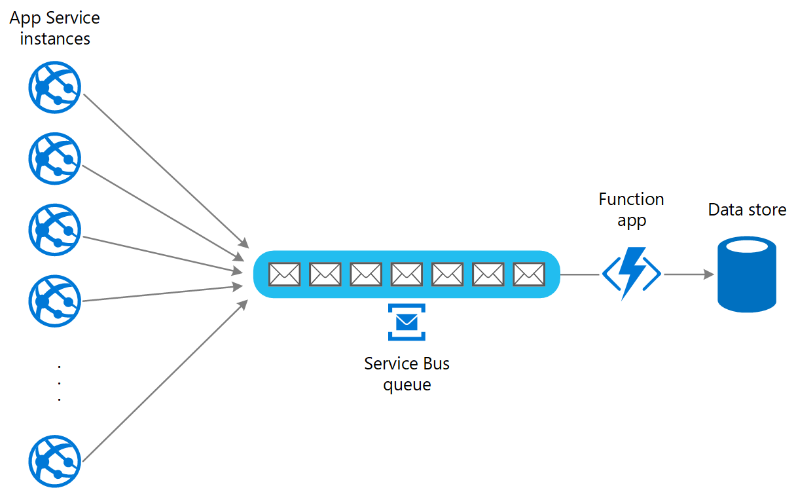

Use a queue that acts as a buffer between a task and a service it invokes in order to smooth intermittent heavy loads that can cause the service to fail or the task to time out. This can help to minimize the impact of peaks in demand on availability and responsiveness for both the task and the service.

## Context and problem

Many solutions in the cloud involve running tasks that invoke services. In this environment, if a service is subjected to intermittent heavy loads, it can cause performance or reliability issues.

A service could be part of the same solution as the tasks that use it, or it could be a third-party service providing access to frequently used resources such as a cache or a storage service. If the same service is used by a number of tasks running concurrently, it can be difficult to predict the volume of requests to the service at any time.

A service might experience peaks in demand that cause it to overload and be unable to respond to requests in a timely manner. Flooding a service with a large number of concurrent requests can also result in the service failing if it's unable to handle the contention these requests cause.

## Solution

Refactor the solution and introduce a queue between the task and the service. The task and the service run asynchronously. The task posts a message containing the data required by the service to a queue. The queue acts as a buffer, storing the message until it's retrieved by the service. The service retrieves the messages from the queue and processes them. Requests from a number of tasks, which can be generated at a highly variable rate, can be passed to the service through the same message queue. This figure shows using a queue to level the load on a service.

The queue decouples the tasks from the service, and the service can handle the messages at its own pace regardless of the volume of requests from concurrent tasks. Additionally, there's no delay to a task if the service isn't available at the time it posts a message to the queue.

This pattern provides the following benefits:

- It can help to maximize availability because delays arising in services won't have an immediate and direct impact on the application, which can continue to post messages to the queue even when the service isn't available or isn't currently processing messages.
- It can help to maximize scalability because both the number of queues and the number of services can be varied to meet demand.
- It can help to control costs because the number of service instances deployed only have to be adequate to meet average load rather than the peak load.

    >  Some services implement throttling when demand reaches a threshold beyond which the system could fail. Throttling can reduce the functionality available. You can implement load leveling with these services to ensure that this threshold isn't reached.

## Issues and considerations

Consider the following points when deciding how to implement this pattern:

- It's necessary to implement application logic that controls the rate at which services handle messages to avoid overwhelming the target resource. Avoid passing spikes in demand to the next stage of the system. Test the system under load to ensure that it provides the required leveling, and adjust the number of queues and the number of service instances that handle messages to achieve this.
- Message queues are a one-way communication mechanism. If a task expects a reply from a service, it might be necessary to implement a mechanism that the service can use to send a response. For more information, see the [Asynchronous Messaging Primer](/previous-versions/msp-n-p/dn589781(v=pandp.10)).
- Be careful if you apply [autoscaling](/azure/architecture/best-practices/auto-scaling) to services that are listening for requests on the queue. This can result in increased contention for any resources that these services share and diminish the effectiveness of using the queue to level the load.
- Depending on the load of the service, you can run into a situation where you're effectively always trailing behind, where the system is always queuing up more requests than you're processing. The variability of incoming traffic to your application needs to be taken into consideration
- The pattern can lose information depending on the persistence of the Queue. If your queue crashes or drops information (due to system limits) there's a possibility that you don't have a guaranteed delivery. The behavior of your queue and system limits needs to be taken into consideration based on the needs of your solution.

## When to use this pattern

This pattern is useful to any application that uses services that are subject to overloading.

This pattern isn't useful if the application expects a response from the service with minimal latency.

## Example

A web app writes data to an external data store. If a large number of instances of the web app run concurrently, the data store might be unable to respond to requests quickly enough, causing requests to time out, be throttled, or otherwise fail. The following diagram shows a data store being overwhelmed by a large number of concurrent requests from instances of an application.

To resolve this, you can use a queue to level the load between the application instances and the data store. An Azure Functions app reads the messages from the queue and performs the read/write requests to the data store. The application logic in the function app can control the rate at which it passes requests to the data store, to prevent the store from being overwhelmed. (Otherwise the function app will just re-introduce the same problem at the back end.)

## Next steps

The following guidance might also be relevant when implementing this pattern:

- [Asynchronous Messaging Primer](/previous-versions/msp-n-p/dn589781(v=pandp.10)). Message queues are inherently asynchronous. It might be necessary to redesign the application logic in a task if it's adapted from communicating directly with a service to using a message queue. Similarly, it might be necessary to refactor a service to accept requests from a message queue. Alternatively, it might be possible to implement a proxy service, as described in the example.

- [Choose between Azure messaging services](/azure/event-grid/compare-messaging-services). Information about choosing a messaging and queuing mechanism in Azure applications.

- [Asynchronous message-based communication](/dotnet/architecture/microservices/architect-microservice-container-applications/asynchronous-message-based-communication).

## Related resources
- [Improve scalability in an Azure web application](../reference-architectures/app-service-web-app/scalable-web-app.yml). This reference architecture includes queue-based load leveling as part of the architecture.
- [Web-Queue-Worker architecture style](/azure/architecture/guide/architecture-styles/web-queue-worker). The web and worker are both stateless. Session state can be stored in a distributed cache. Any long-running work is done asynchronously by the worker. The worker can be triggered by messages on the queue, or run on a schedule for batch processing. 

The following patterns might also be relevant when implementing this pattern:

- [Competing Consumers pattern](./competing-consumers.yml). It might be possible to run multiple instances of a service, each acting as a message consumer from the load-leveling queue. You can use this approach to adjust the rate at which messages are received and passed to a service.

- [Throttling pattern](./throttling.yml). A simple way to implement throttling with a service is to use queue-based load leveling and route all requests to a service through a message queue. The service can process requests at a rate that ensures that resources required by the service aren't exhausted, and to reduce the amount of contention that could occur.
