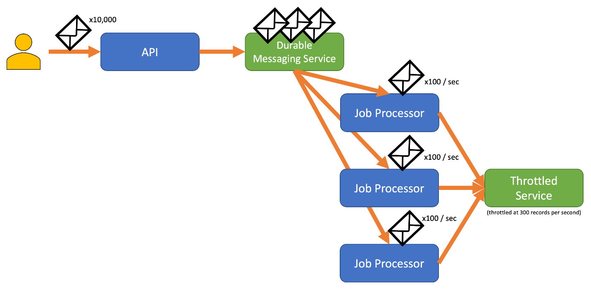
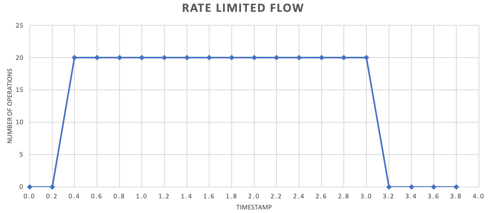
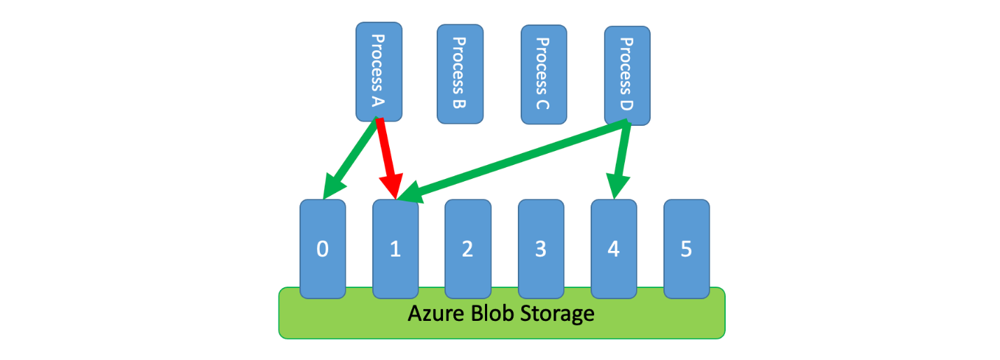
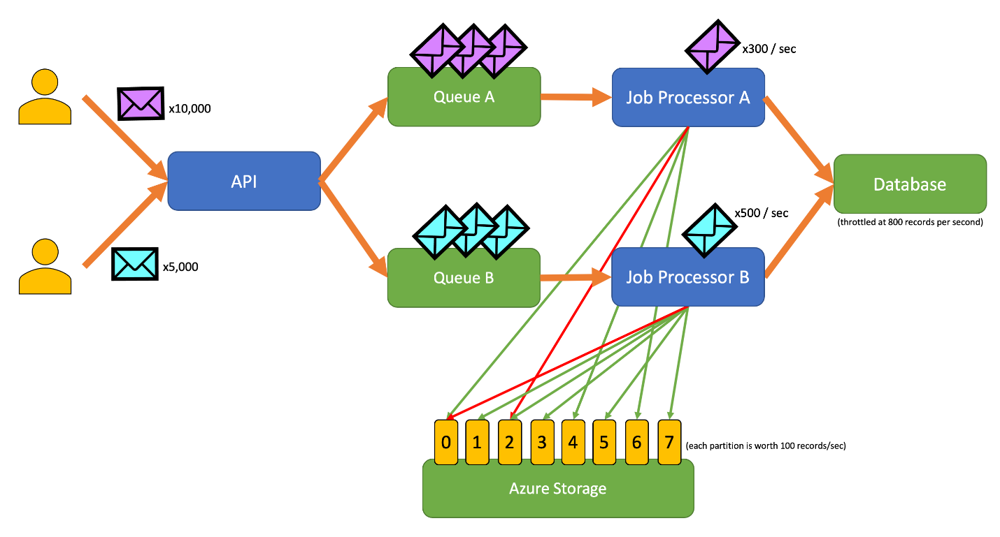

Many services use a [throttling pattern](./throttling.yml) to control the resources they consume, imposing limits on the rate at which other applications or services can access them. You can use a rate limiting pattern to help you avoid or minimize throttling errors related to these throttling limits and to help you more accurately predict throughput.

A rate limiting pattern is appropriate in many scenarios, but it is particularly helpful for large-scale repetitive automated tasks such as [batch processing](../data-guide/big-data/batch-processing.yml).

## Context and problem

Performing large numbers of operations using a throttled service can result in increased traffic and throughput, as you'll need to both track rejected requests and then retry those operations. As the number of operations increases, a throttling limit may require multiple passes of resending data, resulting in a larger performance impact.

As an example, consider the following naive retry on error process for ingesting data into Azure Cosmos DB:

1. Your application needs to ingest 10,000 records into Azure Cosmos DB. Each record costs 10 Request Units (RUs) to ingest, requiring a total of 100,000 RUs to complete the job.
1. Your Azure Cosmos DB instance has 20,000 RUs provisioned capacity.
1. You send all 10,000 records to Azure Cosmos DB. 2,000 records are written successfully and 8,000 records are rejected.
1. You send the remaining 8,000 records to Azure Cosmos DB. 2,000 records are written successfully and 6,000 records are rejected.
1. You send the remaining 6,000 records to Azure Cosmos DB. 2,000 records are written successfully and 4,000 records are rejected.
1. You send the remaining 4,000 records to Azure Cosmos DB. 2,000 records are written successfully and 2,000 records are rejected.
1. You send the remaining 2,000 records to Azure Cosmos DB. All are written successfully.

The ingestion job completed successfully, but only after sending 30,000 records to Azure Cosmos DB even though the entire data set only consisted of 10,000 records.

There are additional factors to consider in the above example:

- Large numbers of errors can also result in additional work to log these errors and process the resulting log data. This naive approach will have handled 20,000 errors, and logging these errors may impose a processing, memory, or storage resource cost.
- Not knowing the throttling limits of the ingestion service, the naive approach has no way to set expectations for how long data processing will take. Rate limiting can allow you to calculate the time required for ingestion.

## Solution

Rate limiting can reduce your traffic and potentially improve throughput by reducing the number of records sent to a service over a given period of time.

A service may throttle based on different metrics over time, such as:

- The number of operations (for example, 20 requests per second).
- The amount of data (for example, 2 GiB per minute).
- The relative cost of operations (for example, 20,000 RUs per second).

Regardless of the metric used for throttling, your rate limiting implementation will involve controlling the number and/or size of operations sent to the service over a specific time period, optimizing your use of the service while not exceeding its throttling capacity.

In scenarios where your APIs can handle requests faster than any throttled ingestion services allow, you'll need to manage how quickly you can use the service. However, only treating the throttling as a data rate mismatch problem, and simply buffering your ingestion requests until the throttled service can catch up, is risky. If your application crashes in this scenario, you risk losing any of this buffered data.

To avoid this risk, consider sending your records to a durable messaging system that _can_ handle your full ingestion rate. (Services such as Azure Event Hubs can handle millions of operations per second). You can then use one or more job processors to read the records from the messaging system at a controlled rate that is within the throttled service's limits. Submitting records to the messaging system can save internal memory by allowing you to dequeue only the records that can be processed during a given time interval.

Azure provides several durable messaging services that you can use with this pattern, including:

- [Azure Service Bus](https://azure.microsoft.com/services/service-bus/)
- [Azure Queue Storage](https://azure.microsoft.com/services/storage/queues/)
- [Azure Event Hubs](https://azure.microsoft.com/services/event-hubs/)

When you're sending records, the time period you use for releasing records may be more granular than the period the service throttles on. Systems often set throttles based on timespans you can easily comprehend and work with. However, for the computer running a service, these timeframes may be very long compared to how fast it can process information. For instance, a system might throttle per second or per minute, but commonly the code is processing on the order of nanoseconds or milliseconds.

While not required, it's often recommended to send smaller amounts of records more frequently to improve throughput. So rather than trying to batch things up for a release once a second or once a minute, you can be more granular than that to keep your resource consumption (memory, CPU, network, etc.) flowing at a more even rate, preventing potential bottlenecks due to sudden bursts of requests. For example, if a service allows 100 operations per second, the implementation of a rate limiter may even out requests by releasing 20 operations every 200 milliseconds, as shown in the following graph.

In addition, it's sometimes necessary for multiple uncoordinated processes to share a throttled service. To implement rate limiting in this scenario you can logically partition the service's capacity and then use a distributed mutual exclusion system to manage exclusive locks on those partitions. The uncoordinated processes can then compete for locks on those partitions whenever they need capacity. For each partition that a process holds a lock for, it's granted a certain amount of capacity.

For example, if the throttled system allows 500 requests per second, you might create 20 partitions worth 25 requests per second each. If a process needed to issue 100 requests, it might ask the distributed mutual exclusion system for four partitions. The system might grant two partitions for 10 seconds. The process would then rate limit to 50 requests per second, complete the task in two seconds, and then release the lock.

One way to implement this pattern would be to use Azure Storage. In this scenario, you create one 0-byte blob per logical partition in a container. Your applications can then obtain [exclusive leases](/rest/api/storageservices/lease-blob) directly against those blobs for a short period of time (for example, 15 seconds). For every lease an application is granted, it will be able to use that partition's worth of capacity. The application then needs to track the lease time so that, when it expires, it can stop using the capacity it was granted. When implementing this pattern, you'll often want each process to attempt to lease a random partition when it needs capacity.

To further reduce latency, you might allocate a small amount of exclusive capacity for each process. A process would then only seek to obtain a lease on shared capacity if it needed to exceed its reserved capacity.

As an alternative to Azure Storage, you could also implement this kind of lease management system using technologies such as [Zookeeper](https://zookeeper.apache.org), [Consul](https://www.consul.io), [etcd](https://etcd.io), [Redis/Redsync](https://github.com/go-redsync/redsync), and others.

## Issues and considerations

Consider the following when deciding how to implement this pattern:

- While the rate limiting pattern can reduce the number of throttling errors, your application will still need to properly handle any throttling errors that may occur.
- If your application has multiple workstreams that access the same throttled service, you'll need to integrate all of them into your rate limiting strategy. For instance, you might support bulk loading records into a database but also querying for records in that same database. You can manage capacity by ensuring all workstreams are gated through the same rate limiting mechanism. Alternatively, you might reserve separate pools of capacity for each workstream.
- The throttled service may be used in multiple applications. In some—but not all—cases it is possible to coordinate that usage (as shown above). If you start seeing a larger than expected number of throttling errors, this may be a sign of contention between applications accessing a service. If so, you may need to consider temporarily reducing the throughput imposed by your rate limiting mechanism until the usage from other applications lowers.

## When to use this pattern

Use this pattern to:

- Reduce throttling errors raised by a throttle-limited service.
- Reduce traffic compared to a naive retry on error approach.
- Reduce memory consumption by dequeuing records only when there is capacity to process them.

## Example

The following example application allows users to submit records of various types to an API. There is a unique job processor for each record type that performs the following steps:

1. Validation
1. Enrichment
1. Insertion of the record into the database

All components of the application (API, job processor A, and job processor B) are separate processes that may be scaled independently. The processes do not directly communicate with one another.

This diagram incorporates the following workflow:

1. A user submits 10,000 records of type A to the API.
1. The API enqueues those 10,000 records in Queue A.
1. A user submits 5,000 records of type B to the API.
1. The API enqueues those 5,000 records in Queue B.
1. Job Processor A sees Queue A has records and tries to gain an exclusive lease on blob 2.
1. Job Processor B sees Queue B has records and tries to gain an exclusive lease on blob 2.
1. Job Processor A fails to obtain the lease.
1. Job Processor B obtains the lease on blob 2 for 15 seconds. It can now rate limit requests to the database at a rate of 100 per second.
1. Job Processor B dequeues 100 records from Queue B and writes them.
1. One second passes.
1. Job Processor A sees Queue A has more records and tries to gain an exclusive lease on blob 6.
1. Job Processor B sees Queue B has more records and tries to gain an exclusive lease on blob 3.
1. Job Processor A obtains the lease on blob 6 for 15 seconds. It can now rate limit requests to the database at a rate of 100 per second.
1. Job Processor B obtains the lease on blob 3 for 15 seconds. It can now rate limit requests to the database at a rate of 200 per second. (It also holds the lease for blob 2.)
1. Job Processor A dequeues 100 records from Queue A and writes them.
1. Job Processor B dequeues 200 records from Queue B and writes them.
1. One second passes.
1. Job Processor A sees Queue A has more records and tries to gain an exclusive lease on blob 0.
1. Job Processor B sees Queue B has more records and tries to gain an exclusive lease on blob 1.
1. Job Processor A obtains the lease on blob 0 for 15 seconds. It can now rate limit requests to the database at a rate of 200 per second. (It also holds the lease for blob 6.)
1. Job Processor B obtains the lease on blob 1 for 15 seconds. It can now rate limit requests to the database at a rate of 300 per second. (It also holds the lease for blobs 2 and 3.)
1. Job Processor A dequeues 200 records from Queue A and writes them.
1. Job Processor B dequeues 300 records from Queue B and writes them.
1. And so on...

After 15 seconds, one or both jobs still will not be completed. As the leases expire, a processor should also reduce the number of requests it dequeues and writes.

 An implementation of this pattern, implemented in Go, is available on [GitHub](https://github.com/mspnp/go-batcher).

## Related resources

The following patterns and guidance might also be relevant when implementing this pattern:

- [Throttling](./throttling.yml). The rate limiting pattern discussed here is typically implemented in response to a service that is throttled.
- [Retry](./retry.yml). When requests to throttled service result in throttling errors, it's generally appropriate to retry those after an appropriate interval.

[Queue-Based Load Leveling](./queue-based-load-leveling.yml) is similar but differs from the Rate Limiting pattern in several key ways:

1. Rate limiting doesn't necessarily need to use queues to manage load, but it does need to make use of a durable messaging service. For example, a rate limiting pattern can make use of services like Apache Kafka or Azure Event Hubs.
1. The rate limiting pattern introduces the concept of a distributed mutual exclusion system on partitions, which allows you to manage capacity for multiple uncoordinated processes that communicate with the same throttled service.
1. A queue-based load leveling pattern is applicable anytime there is a performance mismatch between services or to improve resilience. This makes it a broader pattern than rate limiting, which is more specifically concerned with efficiently accessing a throttled service.
