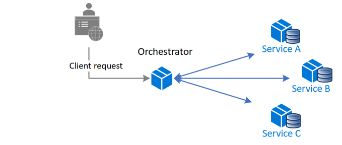

The Saga design pattern helps maintain data consistency in distributed systems by coordinating transactions across multiple services. A saga is a sequence of local transactions where each service performs its operation and initiates the next step through events or messages. If a step in the sequence fails, the saga performs compensating transactions to undo the completed steps. This approach helps maintain data consistency.

## Context and problem

A *transaction* represents a unit of work, which can include multiple operations. Within a transaction, an *event* refers to a state change that affects an entity. A *command* encapsulates all information needed to perform an action or trigger a subsequent event.

Transactions must adhere to the principles of atomicity, consistency, isolation, and durability (ACID).

- **Atomicity:** All operations succeed or no operations succeed.
- **Consistency:** Data transitions from one valid state to another valid state.
- **Isolation:** Concurrent transactions yield the same results as sequential transactions.
- **Durability:** Changes persist after they're committed, even when failures occur.

In a single service, transactions follow ACID principles because they operate within a single database. However, it can be more complex to achieve ACID compliance across multiple services.

### Challenges in microservices architectures

Microservices architectures typically assign a [dedicated database to each microservice](/dotnet/architecture/cloud-native/distributed-data#database-per-microservice-why). This approach provides several benefits:

- Each service encapsulates its own data.
- Each service can use the most suitable database technology and schema for its specific needs.
- Databases for each service can be scaled independently.
- Failures in one service are isolated from other services.

Despite these advantages, this architecture complicates cross-service data consistency. Traditional database guarantees like ACID aren't directly applicable to multiple independently managed data stores. Because of these limitations, architectures that rely on interprocess communication, or traditional transaction models like two-phase commit protocol, are often better suited for the Saga pattern.

## Solution

The Saga pattern manages transactions by breaking them into a sequence of *local transactions*.

Each local transaction:

1. Completes its work atomically within a single service.
1. Updates the service's database.
1. Initiates the next transaction via an event or message.

If a local transaction fails, the saga performs a series of *compensating transactions* to reverse the changes that the preceding local transactions made.

### Key concepts in the Saga pattern

- **Compensable transactions** can be undone or compensated for by other transactions with the opposite effect. If a step in the saga fails, compensating transactions undo the changes that the compensable transactions made.

- **Pivot transactions** serve as the point of no return in the saga. After a pivot transaction succeeds, compensable transactions are no longer relevant. All subsequent actions must be completed for the system to achieve a consistent final state. A pivot transaction can assume different roles, depending on the flow of the saga:

  - **Irreversible or noncompensable transactions** can't be undone or retried.
  
  - **The boundary between reversible and committed** means that the pivot transaction can be the last undoable, or compensable, transaction. Or it can be the first retryable operation in the saga.

- **Retryable transactions** follow the pivot transaction. Retryable transactions are idempotent and help ensure that the saga can reach its final state, even if temporary failures occur. They help the saga eventually achieve a consistent state.

### Saga implementation approaches

The two typical saga implementation approaches are *choreography* and *orchestration*. Each approach has its own set of challenges and technologies to coordinate the workflow.

#### Choreography

In the choreography approach, services exchange events without a centralized controller. With choreography, each local transaction publishes domain events that trigger local transactions in other services.

| Benefits of choreography | Drawbacks of choreography |
|--------------|---------------|
| Good for simple workflows that have few services and don't need a coordination logic. | Workflow can be confusing when you add new steps. It's difficult to track which commands each saga participant responds to. |
| No other service is required for coordination. | There's a risk of cyclic dependency between saga participants because they have to consume each other's commands. |
| Doesn't introduce a single point of failure because the responsibilities are distributed across the saga participants. | Integration testing is difficult because all services must run to simulate a transaction. |

#### Orchestration

In orchestration, a centralized controller, or *orchestrator*, handles all the transactions and tells the participants which operation to perform based on events. The orchestrator performs saga requests, stores and interprets the states of each task, and handles failure recovery by using compensating transactions.

| Benefits of orchestration | Drawbacks of orchestration |
|--------------|---------------|
| Better suited for complex workflows or when you add new services. | Other design complexity requires an implementation of a coordination logic. |
| Avoids cyclic dependencies because the orchestrator manages the flow. | Introduces a point of failure because the orchestrator manages the complete workflow. |
| Clear separation of responsibilities simplifies service logic. | |

## Problems and considerations

Consider the following points as you decide how to implement this pattern:

- **Shift in design thinking:** Adopting the Saga pattern requires a different mindset. It requires you to focus on transaction coordination and data consistency across multiple microservices.

- **Complexity of debugging sagas:** Debugging sagas can be complex, specifically as the number of participating services grows.

- **Irreversible local database changes:** Data can't be rolled back because saga participants commit changes to their respective databases.

- **Handling transient failures and idempotence:** The system must handle transient failures effectively and ensure idempotence, when repeating the same operation doesn't alter the outcome. For more information, see [Idempotent message processing](/azure/architecture/reference-architectures/containers/aks-mission-critical/mission-critical-data-platform#idempotent-message-processing).

- **Need for monitoring and tracking sagas:** Monitoring and tracking the workflow of a saga are essential tasks to maintain operational oversight.

- **Limitations of compensating transactions:** Compensating transactions might not always succeed, which can leave the system in an inconsistent state.

### Potential data anomalies in sagas

Data anomalies are inconsistencies that can occur when sagas operate across multiple services. Because each service manages its own data, called *participant data*, there's no built-in isolation across services. This setup can result in data inconsistencies or durability problems, such as partially applied updates or conflicts between services. Typical problems include:

- **Lost updates:** When one saga modifies data without considering changes made by another saga, it results in overwritten or missing updates.

- **Dirty reads:** When a saga or transaction reads data that another saga has modified, but the modification isn't complete.

- **Fuzzy, or nonrepeatable, reads:** When different steps in a saga read inconsistent data because updates occur between the reads.

### Strategies to address data anomalies

To reduce or prevent these anomalies, consider the following countermeasures:

- **Semantic lock:** Use application-level locks when a saga's compensable transaction uses a semaphore to indicate that an update is in progress.

- **Commutative updates:** Design updates so that they can be applied in any order while still producing the same result. This approach helps reduce conflicts between sagas.

- **Pessimistic view:** Reorder the sequence of the saga so that data updates occur in retryable transactions to eliminate dirty reads. Otherwise, one saga could read dirty data, or *uncommitted changes*, while another saga simultaneously performs a compensable transaction to roll back its updates.

- **Reread values:** Confirm that data remains unchanged before you make updates. If data changes, stop the current step and restart the saga as needed.

- **Version files:** Maintain a log of all operations performed on a record and ensure that they're performed in the correct sequence to prevent conflicts.

- **Risk-based concurrency based on value:** Dynamically choose the appropriate concurrency mechanism based on the potential business risk. For example, use sagas for low-risk updates and distributed transactions for high-risk updates.

## When to use this pattern

Use this pattern when:

- You need to ensure data consistency in a distributed system without tight coupling.
- You need to roll back or compensate if one of the operations in the sequence fails.

This pattern might not be suitable when:

- Transactions are tightly coupled.
- Compensating transactions occur in earlier participants.
- There are cyclic dependencies.

## Next step

- [Cloud-native data patterns](/dotnet/architecture/cloud-native/distributed-data)

## Related resources

The following patterns might be relevant when you implement this pattern:

- The [Choreography pattern](./choreography.yml) has each component of the system participate in the decision-making process about the workflow of a business transaction, instead of relying on a central point of control.

- The [Compensating Transaction pattern](./compensating-transaction.yml) undoes work performed by a series of steps, and eventually defines a consistent operation if one or more steps fail. Cloud-hosted applications that implement complex business processes and workflows often follow this *eventual consistency model*.

- The [Retry pattern](./retry.yml) lets an application handle transient failures when it tries to connect to a service or network resource by transparently retrying the failed operation. This pattern can improve the stability of the application.

- The [Circuit Breaker pattern](./circuit-breaker.md) handles faults that take a variable amount of time to recover from, when you connect to a remote service or resource. This pattern can improve the stability and resiliency of an application.

- The [Health Endpoint Monitoring pattern](./health-endpoint-monitoring.yml) implements functional checks in an application that external tools can access through exposed endpoints at regular intervals. This pattern can help you verify that applications and services are performing correctly.
