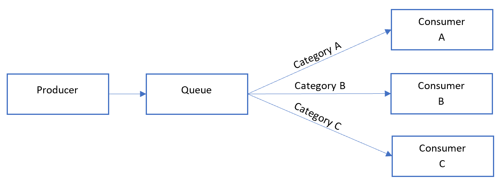
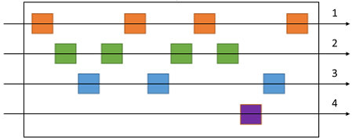
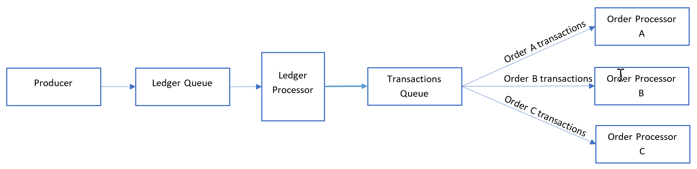

# Sequential Convoy pattern

Process a set of related messages in a defined order, without blocking processing of other groups of messages.

## Context and problem

Applications often need to process a sequence of messages in the order they arrive, while still being able to scale out to handle increased load. In a distributed architecture, processing these messages in order is not straightforward, because the workers can scale independently and often pull messages independently, using a [Competing Consumers pattern](./competing-consumers.md).

For example, an order tracking system receives a ledger containing orders and the relevant operations on those orders. These operations could be to create an order, add a transaction to the order, modify a past transaction, or delete an order. In this system, operations must be performed in a first-in-first-out (FIFO) manner, but only at the order level. However, the initial queue receives a ledger containing transactions for many orders, which may be interleaved.

## Solution

Push related messages into categories within the queuing system, and have the queue listeners lock and pull only from one category, one message at a time.

Here's what the general Sequential Convoy pattern looks like:

In the queue, messages for different categories may be interleaved, as shown in the following diagram:

## Issues and considerations

Consider the following points when deciding how to implement this pattern:

- Category/scale unit. What property of your incoming messages can you scale out on? In the order tracking scenario, this property is the order ID.
- Throughput. What is your target message throughput? If it is very high, you may need to reconsider your FIFO requirements. For example, can you enforce a start/end message, sort by time, then send a batch for processing?
- Service capabilities. Does your choice of message bus allow for one-at-a-time processing of messages within a queue or category of a queue?
- Evolvability. How will you add a new category of message to the system? For example, suppose the ledger system described above is specific one customer. If you needed to onboard a new customer, could you have a set of ledger processors that distribute work per customer ID?
- It's possible that consumers might receive a message out of order, due to variable network latency when sending messages. Consider using sequence numbers to verify ordering. You might also include a special "end of sequence" flag in the last message of a transaction. Stream processing technologies such as Spark or Azure Stream Analytics can process messages in order within a time window.

## When to use this pattern

Use this pattern when:

- You have messages that arrive in order and must be processed in the same order.
- Arriving messages are or can be "categorized" in such a way that the category becomes a unit of scale for the system.

This pattern might not be suitable for:

- Extremely high throughput scenarios (millions of messages/minute or second), as the FIFO requirement limits the scaling that can be done by the system.

## Example

On Azure, this pattern can be implemented using Azure Service Bus [message sessions](/azure/service-bus-messaging/message-sessions). For the consumers, you can use either Logic Apps with the [Service Bus peek-lock connector](/azure/connectors/connectors-create-api-servicebus) or Azure Functions with the [Service Bus trigger](/azure/azure-functions/functions-bindings-service-bus).

For the previous order-tracking example, process each ledger message in the order it's received, and send each transaction to another queue where the category is set to the order ID. A transaction will never span multiple orders in this scenario, so consumers process each category in parallel but FIFO within the category.

The ledge processor fan outs the messages by de-batching the content of each message in the first queue:

The ledger processor takes care of:

1. Walking the ledger one transaction at a time.
2. Setting the session ID of the message to match the order ID.
3. Sending each ledger transaction to a secondary queue with the session ID set to the order ID.

The consumers listen to the secondary queue where they process all messages with matching order IDs *in order* from the queue. Consumers use [peek-lock](/azure/service-bus-messaging/message-transfers-locks-settlement#peeklock) mode.

When considering scalability, the ledger queue is a primary bottleneck. Different transactions posted to the ledger could reference the same order ID. However, messages can fan out *after* the ledger to the number of orders in a serverless environment.

## Next steps

The following information may be relevant when implementing this pattern:

- [Message sessions: first in, first out (FIFO)](/azure/service-bus-messaging/message-sessions)
- [Peek-Lock Message (Non-Destructive Read)](/rest/api/servicebus/peek-lock-message-non-destructive-read)
- [In order delivery of correlated messages in Logic Apps by using Service Bus sessions](https://blogs.msdn.microsoft.com/logicapps/2017/05/02/in-order-delivery-of-correlated-messages-in-logic-apps-by-using-service-bus-sessions/) (MSDN blog)
