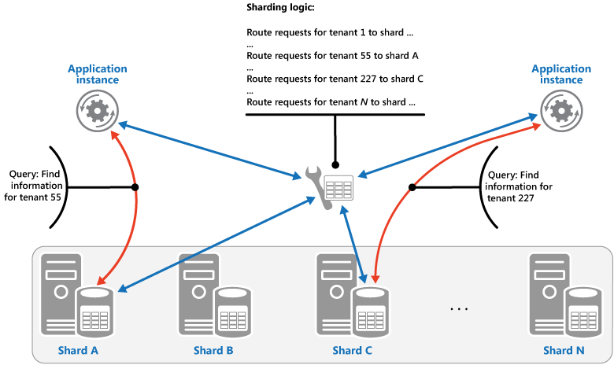
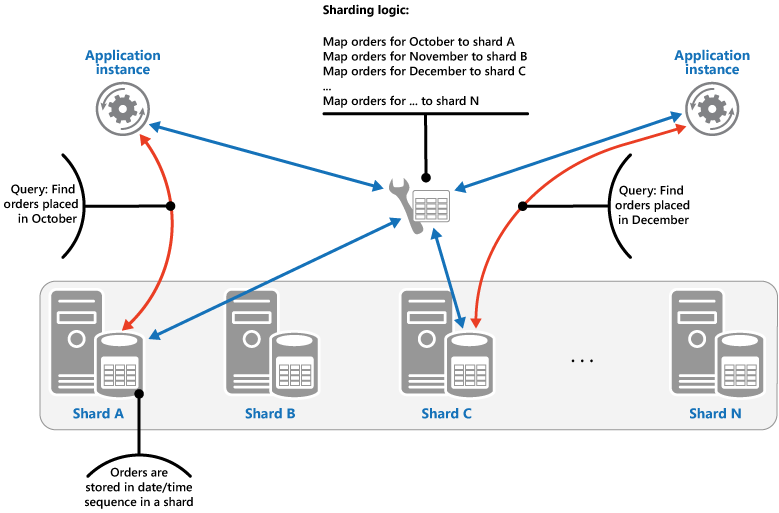
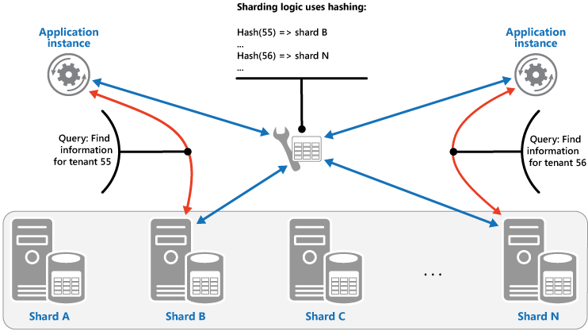
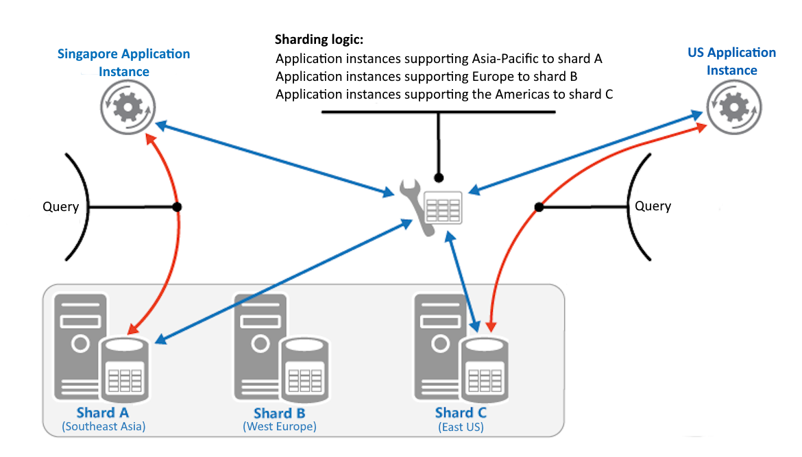

# Sharding pattern

Divide a data store into a set of horizontal partitions or shards. This can improve scalability when storing and accessing large volumes of data.

## Context and problem

A data store hosted by a single server is subject to the following limitations:

- **Storage space**. A data store for a large-scale cloud application can contain a large volume of data that grows over time. A server provides a finite amount of disk storage, and you can replace existing disks with larger ones or add more disks as data volumes grow. Eventually the system reaches a limit where you can't increase storage capacity on a single server.

- **Computing resources**. A cloud application must support a large number of concurrent users, each running queries against the data store. A single server might not provide enough computing power for this load, resulting in extended response times and timeouts. You can add memory or upgrade processors, but the system reaches a limit where you can't increase compute resources any further.

- **Network bandwidth**. The performance of a data store on a single server is bounded by the rate at which the server can receive requests and send replies. The volume of network traffic can exceed the capacity of the network connection, resulting in failed requests.

- **Geography**. You might need to store data generated by specific users in the same region as those users for legal, compliance, or performance reasons. If users are dispersed across countries or regions, you might not be able to store all of the application's data in a single data store.

Scaling vertically by adding disk capacity, processing power, memory, and network connections can postpone these limitations, but it's a temporary solution. A cloud application that must support a large number of users and high data volumes needs to scale horizontally.

## Solution

Divide the data store into horizontal partitions or shards. Each shard has the same schema, but holds its own distinct subset of the data. A shard is a data store in its own right (it can contain the data for many entities of different types), running on a server acting as a storage node.

This pattern has the following benefits:

- You can scale the system out by adding further shards running on additional storage nodes.

- A system can use off-the-shelf hardware rather than specialized and expensive computers for each storage node.

- You can reduce contention and improve performance by balancing the workload across shards.

- In the cloud, shards can be located physically close to the users that'll access the data.

When dividing a data store into shards, decide which data to place in each shard. A shard typically contains items that fall within a range determined by one or more attributes of the data. These attributes form the shard key (sometimes referred to as the partition key).

Sharding physically organizes the data. When an application stores and retrieves data, the sharding logic directs it to the appropriate shard. This logic can be implemented in the application's data access code, or it can be implemented by the data storage system if it transparently supports sharding.

Abstracting the physical location of the data in the sharding logic provides control over which shards contain which data. It also enables data to migrate between shards without reworking the business logic of an application when the data needs to be redistributed (for example, if the shards become unbalanced). The tradeoff is the additional data access overhead required to determine the location of each data item as it's retrieved.

### Shard key selection

The shard key is the most consequential design decision in a sharded system. Once you choose a shard key, changing it typically requires migrating all data to a new shard layout; an expensive and risky operation on a live system. Invest time in this decision before you write any code.

An effective shard key is **immutable**, has **high cardinality**, distributes data and load **evenly**, and **aligns with your dominant query patterns** so that most requests resolve against a single shard. Avoid monotonically increasing values (autoincrement integers, sequential timestamps), low-cardinality attributes (booleans, small enum sets), and volatile attributes that change frequently. All of which lead to hotspots or costly cross-shard data movement.

If no single attribute satisfies these criteria, define a composite shard key by combining two or more attributes. If queries need to retrieve data by attributes that aren't part of the shard key, use a pattern such as [Index Table](./index-table.yml) to provide secondary lookups.

For detailed guidance on choosing partition keys across Azure services, see [Data partitioning guidance](../best-practices/data-partitioning.yml) and [Data partitioning strategies](../best-practices/data-partitioning-strategies.yml).

## Sharding strategies

Four strategies are commonly used when selecting the shard key and deciding how to distribute data across shards. There doesn't have to be a one-to-one correspondence between shards and the servers that host them. A single server can host multiple shards.

### Lookup sharding strategy

In the lookup (also called directory-based) strategy, the sharding logic implements a map that routes a data request to the shard that contains that data using the shard key. In a multitenant application, all the data for a tenant might be stored together in a shard using the tenant ID as the shard key. Multiple tenants might share the same shard, but the data for a single tenant won't be spread across multiple shards. The following figure illustrates sharding tenant data based on tenant IDs.



The mapping between shard key values and physical storage can be direct, where each shard key value maps to a physical partition. A more flexible technique is virtual partitioning, where shard key values map to virtual shards, which in turn map to fewer physical partitions. An application locates data by using a shard key value that refers to a virtual shard, and the system transparently maps virtual shards to physical partitions. The mapping between a virtual shard and a physical partition can change without requiring application code modifications.

### Range-based sharding strategy

The range-based strategy groups related items together in the same shard and orders them by shard key&mdash;the shard keys are sequential. It's useful for applications that frequently retrieve sets of items using range queries (queries that return a set of data items for a shard key that falls within a given range). For example, if an application regularly needs to find all orders placed in a given month, that data can be retrieved faster if all orders for a month are stored in date and time order in the same shard. If each order was stored in a different shard, the application would have to fetch them individually by performing a large number of point queries. The following figure illustrates storing sequential sets (ranges) of data in shards.



In this example, the shard key is a composite key containing the order month as the most significant element, followed by the order day and the time. The data for orders is naturally sorted when new orders are created and added to a shard. Some data stores support two-part shard keys containing a partition key element that identifies the shard and a row key that uniquely identifies an item in the shard. Data is usually held in row key order in the shard. Items that are subject to range queries and need to be grouped together can use a shard key that has the same value for the partition key but a unique value for the row key.

### Hash-based sharding strategy

The purpose of the hash-based strategy is to reduce the chance of hotspots (shards that receive a disproportionate amount of load). It distributes data across shards to balance the size of each shard and the average load each shard encounters. The sharding logic computes the shard to store an item in based on a hash of one or more attributes of the data. The chosen hashing function should distribute data evenly across the shards. The following figure illustrates sharding tenant data based on a hash of tenant IDs.



To understand the advantage of the Hash strategy over other sharding strategies, consider how a multitenant application that enrolls new tenants sequentially might assign the tenants to shards in the data store. When you use the Range strategy, the data for tenants 1 to n will all be stored in shard A, the data for tenants n+1 to m will all be stored in shard B, and later tenant ranges map to successive shards. If the most recently registered tenants are also the most active, most data activity will occur in a small number of shards, which could cause hotspots. In contrast, the Hash strategy allocates tenants to shards based on a hash of their tenant ID. This means that sequential tenants are most likely to be allocated to different shards, which will distribute the load across them. The previous figure shows this for tenants 55 and 56.

### Geographic sharding strategy

The geographic strategy assigns data to shards based on the geographic origin or intended consumption region of that data. In many workloads, users and the data they generate are concentrated in specific regions. Regulatory requirements such as data residency laws might require that certain data remain within a specific jurisdiction. Even without regulatory drivers, placing data close to the users who access it most frequently reduces network latency for reads and writes.



In this strategy, the shard key is derived from a geographic attribute, such as the user's country/region, the originating datacenter region, or a regional tenant identifier. Each shard is hosted in (or pinned to) infrastructure within that geographic boundary. For example, an application that serves customers in North America, Europe, and Asia-Pacific might maintain three shard groups, each running in a corresponding Azure region. A request from a European application instance, serving only European users, is routed to the Europe shard, which satisfies both the latency optimization and data residency goals.

Geographic sharding introduces a distinct risk: uneven data distribution. If most of your users are in one region, that region's shard carries a disproportionate share of the load and storage. You can combine geographic sharding with another strategy (such as hash or lookup) within each region to distribute load evenly across multiple shards inside the same geographic boundary.

### Advantages and considerations per strategy

The four sharding strategies have the following advantages and considerations:

- **Lookup**. Offers more control over shard configuration. Using virtual shards reduces the impact of rebalancing because new physical partitions can be added to even out the workload. The mapping between a virtual shard and its physical partitions can be modified without affecting application code. Looking up shard locations adds overhead.

- **Range**. Easy to implement and works well with range queries because they can fetch multiple data items from a single shard in one operation. Data management is also simpler. For example, if users in the same region are in the same shard, updates can be scheduled per time zone based on local load patterns. However, this strategy doesn't provide optimal balancing between shards. Rebalancing is difficult and might not resolve uneven load if most activity targets adjacent shard keys.

- **Hash**. Offers a better chance of even data and load distribution. Request routing can be accomplished directly by using the hash function, with no need to maintain a map. Computing the hash adds some overhead. Rebalancing is difficult without consistent hashing.

- **Geographic**. This strategy satisfies data residency and sovereignty requirements that other strategies don't inherently address. It also reduces read and write latency for region-local access patterns. However, geographic sharding can produce significant data and load imbalance when user populations aren't evenly distributed across regions. Cross-region queries (for example, global reporting) require fan-out across all geographic shards and incur higher latency. Use geographic sharding in combination with another strategy within each region when you need both compliance and even load distribution.

Most sharding systems implement one of these approaches, but you should also consider the business requirements of your application and its data usage patterns. For example, in a multitenant application:

- You can shard data based on workload. Segregate data for highly volatile tenants in separate shards to improve data access speed for other tenants.

- You can shard data based on tenant location. Take data for tenants in a specific geographic region offline for backup and maintenance during off-peak hours in that region, while data for tenants in other regions remains online during their business hours.

- High-value tenants can be assigned their own lightly loaded shards, while lower-value tenants share more densely packed shards.

- Data for tenants that require a high degree of data isolation and privacy can be stored on a completely separate server.

### Scaling and data movement operations per strategy

Each of the sharding strategies implies different capabilities and levels of complexity for managing scale in, scale out, data movement, and maintaining state.

The **Lookup** strategy permits scaling and data movement operations at the user level, either online or offline. The technique is to suspend some or all user activity (perhaps during off-peak periods), move the data to the new virtual partition or physical shard, change the mappings, invalidate or refresh any caches that hold this data, and then allow user activity to resume. This type of operation can often be centrally managed. The Lookup strategy requires state to be highly cacheable and replica friendly.

The **Range** strategy imposes some limitations on scaling and data movement operations, which must typically be carried out when part or all of the data store is offline because data must be split and merged across shards. Moving data to rebalance shards might not resolve uneven load if most activity targets adjacent shard keys or data identifiers within the same range. The Range strategy might also require state to map ranges to physical partitions.

The **Hash** strategy makes scaling and data movement operations more complex because the partition keys are hashes of the shard keys or data identifiers. With a standard hash function (such as `hash(key) mod N`), adding or removing a shard reassigns most keys and triggers large-scale data migration. Consistent hashing reduces this impact by arranging the hash space so that only a small fraction of keys move when the shard count changes. The Hash strategy doesn't require maintenance of a separate mapping state.

The **Geographic** strategy ties scaling operations to regional infrastructure provisioning. Adding capacity in one region doesn't help another region that is under load. Data movement across geographic boundaries might be restricted by the same regulatory requirements that motivated the geographic sharding in the first place. Within a region, scaling follows whichever secondary strategy is used to distribute data across that region's shards.

## Issues and considerations

Consider the following points when deciding how to implement this pattern:

- Sharding is complementary to other forms of partitioning, such as vertical partitioning and functional partitioning. For example, a single shard can contain entities that have been partitioned vertically, and a functional partition can be implemented as multiple shards. For more information about partitioning, see [Horizontal, vertical, and functional data partitioning](../best-practices/data-partitioning.yml).

- Keep shards balanced so they all handle a similar volume of I/O. Data skew accumulates over time as records are inserted and deleted, which leads to hotspots. Plan to rebalance periodically.

  Rebalancing moves data between shards and often causes downtime or reduced throughput. To rebalance less frequently, use virtual partitions. Map many logical partitions to fewer physical shards. When a shard is overloaded, redistribute its virtual partitions to new physical shards without rehashing the entire dataset. Azure Cosmos DB uses this approach to decouple the partition scheme from the physical infrastructure.

  Prefer many small shards over few large ones. Smaller shards are faster to migrate, balance load more evenly, and give you more flexibility when redistributing data.

- Use stable data for the shard key. If the shard key changes, the corresponding data item might have to move between shards, increasing the amount of work performed by update operations. For this reason, avoid basing the shard key on potentially volatile information. Instead, look for attributes that are invariant or that naturally form a key.

- Ensure that shard keys are unique. For example, avoid using autoincrementing fields as the shard key. In some systems, autoincremented fields can't be coordinated across shards, which can result in items in different shards having the same shard key.

  > [!NOTE]
  > Autoincremented values in other fields that aren't shard keys can also cause problems. For example, if you use autoincremented fields to generate unique IDs, two different items in different shards might be assigned the same ID.

- You might not be able to design a shard key that matches the requirements of every query against the data. Shard the data to support the most frequently performed queries, and if necessary create secondary index tables to support queries that retrieve data by attributes that aren't part of the shard key. For more information, see the [Index Table pattern](./index-table.yml).

- Queries that access only a single shard are more efficient than those that retrieve data from multiple shards. Design your shard key and data model to keep the majority of operations scoped to a single shard. Denormalize your data to keep related entities that are commonly queried together (such as customers and their orders) in the same shard to reduce the number of separate reads.

  Cross-shard queries add latency, resource consumption, and complexity. When an application must retrieve data from multiple shards, use parallel fan-out queries that run against each shard concurrently and aggregate the results. Even with parallelism, latency is bounded by the slowest shard.

  > [!TIP]
  > If an entity in one shard references an entity stored in another shard, include the shard key for the second entity as part of the schema for the first entity. This can help to improve the performance of queries that reference related data across shards.

- Cross-shard transactions are difficult. Distributed coordination protocols (such as two-phase commit) add latency, introduce failure modes, and reduce throughput. Most sharded systems avoid distributed transactions and instead adopt eventual consistency; each shard is updated independently, and the application handles temporary inconsistencies. If your workload requires strong transactional integrity across shard boundaries, reconsider your shard key or whether sharding is the right approach.

- Make sure the resources available to each shard storage node are sufficient to handle the scalability requirements in terms of data size and throughput. For more information, see [Data partitioning strategies](../best-practices/data-partitioning-strategies.yml).

- Consider replicating reference data to all shards. If a query against a shard also references static or slow-moving data, add this data to the shard. The application can then fetch all data for the query without making a round trip to a separate data store.

  > [!NOTE]
  > If reference data held in multiple shards changes, the system must synchronize these changes across all shards. Some degree of inconsistency can occur while this synchronization runs. Design your applications to tolerate it.

- Sharded systems multiply operational burden. Plan for these concerns:

  - **Monitoring.** You must aggregate metrics and logs across all shards to get a complete view of system health.
  - **Backup and restore.** Each shard must be backed up independently, and restore procedures must account for cross-shard consistency. A point-in-time restore of one shard can put it out of sync with the rest.
  - **Schema changes.** DDL changes must be coordinated across every shard.

  These tasks are likely to be implemented using scripts or other automation solutions.

- Shards can be geolocated so that the data they contain is close to the application instances that use it. This approach can improve performance but requires additional consideration for tasks that must access multiple shards in different locations.

## When to use this pattern

> [!TIP]
> Before you design a custom sharding layer, understand how much of this work your chosen data platform already handles. Some services manage sharding transparently. For example, Azure Cosmos DB distributes data across physical partitions, handles splits, and routes queries without application involvement. Other services partially manage sharding. For example, Azure SQL Database offers [elastic database tools](/azure/azure-sql/database/elastic-scale-introduction) for shard map management and data-dependent routing, but you still own the shard key design and split decisions. This pattern applies when you must build and operate the sharding logic yourself.

Sharding is most appropriate when one or more of the following conditions are true:

- The total data volume exceeds the storage capacity of a single database instance, and there's no vertical scaling option that addresses the shortfall.

- The transaction throughput or query concurrency exceeds what a single instance can sustain, and read replicas alone don't resolve the bottleneck because write load is also high.

  > [!NOTE]
  > The primary focus of sharding is to improve the performance and scalability of a system, but it can also improve availability. A failure in one partition doesn't necessarily prevent an application from accessing data held in other partitions, and an operator can perform maintenance or recovery of one partition without making all data inaccessible. For more information, see [Data partitioning guidance](../best-practices/data-partitioning.yml).

- Regulatory or compliance requirements mandate that specific data subsets reside in specific geographic jurisdictions, and no single-region deployment can satisfy all requirements.

- Distinct tenants or customer segments require physical data isolation for security, performance, or contractual reasons.

Sharding introduces substantial and permanent complexity into your data architecture. That complexity affects development, operations, testing, query design, and failure recovery for the lifetime of the system. This pattern might not be suitable when:

- Your data volume and throughput fit within a single database instance, even with projected growth. Vertical scaling preserves query simplicity and transactional integrity.

- Your bottleneck is read volume, not write volume or storage capacity. Read replicas and caching layers can offload read traffic without the cross-shard query complexity that sharding introduces.

- Your database engine supports table-level partitioning that meets your performance needs. Partitioning within a single instance doesn't require multiple servers or routing logic.

- Your dominant query patterns require cross-entity joins, multi-entity transactions, or full-dataset aggregations. Sharding makes these operations expensive, and the overhead of fan-out queries and distributed coordination can outweigh the scaling benefits.

## Workload design

An architect should evaluate how the Sharding pattern can be used in their workload's design to address the goals and principles covered in the [Azure Well-Architected Framework pillars](/azure/well-architected/pillars). For example:

| Pillar | How this pattern supports pillar goals |
| :----- | :------------------------------------- |
| [Reliability](/azure/well-architected/reliability/checklist) design decisions help your workload become **resilient** to malfunction and to ensure that it **recovers** to a fully functioning state after a failure occurs. | Because the data or processing is isolated to the shard, a malfunction in one shard remains isolated to that shard.<br/><br/> - [RE:06 Data partitioning](/azure/well-architected/design-guides/partition-data)<br/> - [RE:07 Self-preservation](/azure/well-architected/reliability/self-preservation) |
| [Cost Optimization](/azure/well-architected/cost-optimization/checklist) is focused on **sustaining and improving** your workload's **return on investment**. | A system that implements shards often benefits from using multiple instances of less expensive compute or storage resources rather than a single more expensive resource. In many cases, this configuration can save you money.<br/><br/> - [CO:07 Component costs](/azure/well-architected/cost-optimization/optimize-component-costs) |
| [Performance Efficiency](/azure/well-architected/performance-efficiency/checklist) helps your workload **efficiently meet demands** through optimizations in scaling, data, code. | When you use sharding in your scaling strategy, the data or processing is isolated to a shard, so it competes for resources only with other requests that are directed to that shard. You can also use sharding to optimize based on geography.<br/><br/> - [PE:05 Scaling and partitioning](/azure/well-architected/performance-efficiency/scale-partition)<br/> - [PE:08 Data performance](/azure/well-architected/performance-efficiency/optimize-data-performance) |

As with any design decision, consider any tradeoffs against the goals of the other pillars that might be introduced with this pattern.

## Example

Consider a website that surfaces an expansive collection of information on published books worldwide. The number of possible books cataloged in this workload and the typical query and usage patterns exceed what a single relational database can handle. The workload architect decides to shard the data across multiple database instances, using the books' static International Standard Book Number (ISBN) as the shard key. Specifically, they use the [check digit](https://wikipedia.org/wiki/ISBN#Check_digits) (0 - 10) of the ISBN, which gives 11 possible logical shards with fairly balanced data distribution. To start, they colocate the 11 logical shards into three physical shard databases. This is the virtual partition approach described in [Issues and considerations](#issues-and-considerations) — many logical partitions mapped to fewer physical nodes. They use the *lookup* sharding approach and store the key-to-server mapping in a shard map database.

:::image type="complex" source="_images/sharding-example.png" alt-text="Diagram that shows an Azure App Service, four Azure SQL Databases, and one Azure AI Search.":::
   Diagram that shows an Azure App Service labeled as "Book catalog website" that is connected to multiple Azure SQL Database instances and an Azure AI Search instance. One of the databases is labeled as the ShardMap database, and it has an example table which mirrors a part of the mapping table that is also listed further in this document. There are three shard databases instances listed as well: bookdbshard0, bookdbshard1, and bookdbshard2. Each of the databases has an example listing of tables under them. All three examples are identical, listing the tables of "Books" and "LibraryOfCongressCatalog" and an indicator of more tables. The Azure AI Search icon indicates it's used for faceted navigation and site search. Managed identity is shown associated with the Azure App Service.
:::image-end:::

### Lookup shard map

The shard map database contains the following shard mapping table and data.

```sql
SELECT ShardKey, DatabaseServer
FROM BookDataShardMap
```

```output
| ShardKey | DatabaseServer |
|----------|----------------|
|        0 | bookdbshard0   |
|        1 | bookdbshard0   |
|        2 | bookdbshard0   |
|        3 | bookdbshard1   |
|        4 | bookdbshard1   |
|        5 | bookdbshard1   |
|        6 | bookdbshard2   |
|        7 | bookdbshard2   |
|        8 | bookdbshard2   |
|        9 | bookdbshard0   |
|       10 | bookdbshard1   |
```

### Example website code - single shard access

The website doesn't know how many physical shard databases exist (three in this case) or the logic that maps a shard key to a database instance. It only knows that the check digit of a book's ISBN is the shard key. The website has read-only access to the shard map database and read-write access to all shard databases. In this example, the website uses the system managed identity of its Azure App Service host for authorization, which keeps secrets out of connection strings.

The website is configured with the following connection strings, either in an `appsettings.json` file, such as in this example, or through App Service app settings.

```json
{
  ...
  "ConnectionStrings": {
    "ShardMapDb": "Data Source=tcp:<database-server-name>.database.windows.net,1433;Initial Catalog=ShardMap;Authentication=Active Directory Default;App=Book Site v1.5a",
    "BookDbFragment": "Data Source=tcp:SHARD.database.windows.net,1433;Initial Catalog=Books;Authentication=Active Directory Default;App=Book Site v1.5a"
  },
  ...
}
```

With connection information to the shard map database available, an example of an update query executed by the website to the workload's database shard pool would look similar to the following code.

```csharp
...

// All data for this book is stored in a shard based on the book's ISBN check digit,
// which is converted to an integer 0 - 10 (special value 'X' becomes 10).
int isbnCheckDigit = book.Isbn.CheckDigitAsInt;

// Establish a pooled connection to the database shard for this specific book.
using (SqlConnection sqlConn = await shardedDatabaseConnections.OpenShardConnectionForKeyAsync(key: isbnCheckDigit, cancellationToken))
{
  // Update the book's Library of Congress catalog information
  SqlCommand cmd = sqlConn.CreateCommand();
  cmd.CommandText = @"UPDATE LibraryOfCongressCatalog
                         SET ControlNumber = @lccn,
                             ...
                             Classification = @lcc
                       WHERE BookID = @bookId";

  cmd.Parameters.AddWithValue("@lccn", book.LibraryOfCongress.Lccn);
  ...
  cmd.Parameters.AddWithValue("@lcc", book.LibraryOfCongress.Lcc);
  cmd.Parameters.AddWithValue("@bookId", book.Id);

  await cmd.ExecuteNonQueryAsync(cancellationToken);
}

...
```

In the preceding example code, if `book.Isbn` was **978-8-1130-1024-6**, then `isbnCheckDigit` should be **6**. The call to `OpenShardConnectionForKeyAsync(6)` would typically be implemented with a cache-aside approach. It queries the shard map database identified with the connection string `ShardMapDb` if it doesn't have cached shard information for shard key **6**. Either from the application's cache or from the shard database, the value **bookdbshard2** takes the place of `SHARD` in the `BookDbFragment` connection string. A pooled connection is (re-) established to **bookdbshard2.database.windows.net**, opened, and returned to the calling code. The code then updates the existing record on that database instance.

### Example website code - multiple shard access

In the rare case a direct, cross-shard query is required by the website, the application performs a parallel fan-out query across all shards.

```csharp
...

// Retrieve all shard keys
var shardKeys = shardedDatabaseConnections.GetAllShardKeys();

// Execute the query, in a fan-out style, against each shard in the shard list.
Parallel.ForEachAsync(shardKeys, async (shardKey, cancellationToken) =>
{
  using (SqlConnection sqlConn = await shardedDatabaseConnections.OpenShardConnectionForKeyAsync(key: shardKey, cancellationToken))
  {
    SqlCommand cmd = sqlConn.CreateCommand();
    cmd.CommandText = @"SELECT ...
                          FROM ...
                         WHERE ...";

    SqlDataReader reader = await cmd.ExecuteReaderAsync(cancellationToken);

    while (await reader.ReadAsync(cancellationToken))
    {
      // Read the results in to a thread-safe data structure.
    }

    reader.Close();
  }
});

...
```

As an alternative to cross-shard queries, this workload could use an externally maintained index in Azure AI Search for site search or faceted navigation.

### Adding shard instances

The workload team is aware that if the data catalog or its concurrent usage grows significantly, more than three database instances might be required. The workload team doesn't expect to add database servers dynamically and will accept workload downtime when a new shard comes online. Bringing a new shard instance online requires moving data from existing shards into the new shard and updating the shard map table. This fairly static approach allows the workload to confidently cache the shard key database mapping in the website code.

The shard key logic in this example has a hard upper limit of 11 physical shards. If the workload team determines through load estimation that more than 11 database instances are eventually required, an invasive change to the shard key logic is needed. This change involves careful planning of code modifications and data migration to the new key logic.

### SDK functionality

Instead of writing custom code for shard management and query routing to Azure SQL Database instances, evaluate the [Elastic Database client library](/azure/azure-sql/database/elastic-database-client-library). This library supports shard map management, data-dependent query routing, and cross-shard queries in both C# and Java.

## Next steps

The following guidance might also be relevant when implementing this pattern:

- [Horizontal, vertical, and functional data partitioning](../best-practices/data-partitioning.yml). Sharding is one form of data partitioning. Describes strategies for partitioning data in the cloud to improve scalability, reduce contention, and optimize performance.
- [Consistency levels in Azure Cosmos DB](/azure/cosmos-db/consistency-levels). Distributing data across shards introduces consistency tradeoffs. Describes the spectrum of consistency models, from strong to eventual, and their effects on availability and latency.

## Related resources

The following patterns might also be relevant when implementing this pattern:

- [Index Table pattern](./index-table.yml). Sometimes you can't support all queries through the design of the shard key alone. The Index Table pattern enables an application to retrieve data from a large data store by specifying a key other than the shard key.
- [Materialized View pattern](./materialized-view.yml). To maintain the performance of some query operations, it's useful to create materialized views that aggregate and summarize data, especially if that data is distributed across shards.
