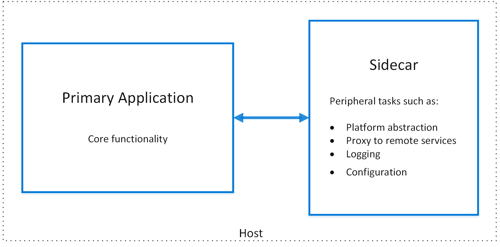

# Sidecar pattern

Deploy components of an application into a separate process or container to provide isolation and encapsulation. This pattern can also enable applications to be composed of heterogeneous components and technologies.

This pattern is named *Sidecar* because it resembles a sidecar attached to a motorcycle. In the pattern, the sidecar is attached to a parent application and provides supporting features for the application. The sidecar also shares the same lifecycle as the parent application, being created and retired alongside the parent. The sidecar pattern is sometimes referred to as the sidekick pattern and is a decomposition pattern.

## Context and Problem

Applications and services often require related functionality, such as monitoring, logging, configuration, and networking services. These peripheral tasks can be implemented as separate components or services.

If they are tightly integrated into the application, they can run in the same process as the application, making efficient use of shared resources. However, this also means they are not well isolated, and an outage in one of these components can affect other components or the entire application. Also, they usually need to be implemented using the same language as the parent application. As a result, the component and the application have close interdependence on each other.

If the application is decomposed into services, then each service can be built using different languages and technologies. While this gives more flexibility, it means that each component has its own dependencies and requires language-specific libraries to access the underlying platform and any resources shared with the parent application. In addition, deploying these features as separate services can add latency to the application. Managing the code and dependencies for these language-specific interfaces can also add considerable complexity, especially for hosting, deployment, and management.

## Solution

Co-locate a cohesive set of tasks with the primary application, but place them inside their own process or container, providing a homogeneous interface for platform services across languages.

A sidecar service is not necessarily part of the application, but is connected to it. It goes wherever the parent application goes. Sidecars are supporting processes or services that are deployed with the primary application. On a motorcycle, the sidecar is attached to one motorcycle, and each motorcycle can have its own sidecar. In the same way, a sidecar service shares the fate of its parent application. For each instance of the application, an instance of the sidecar is deployed and hosted alongside it.

Advantages of using a sidecar pattern include:

- A sidecar is independent from its primary application in terms of runtime environment and programming language, so you don't need to develop one sidecar per language.

- The sidecar can access the same resources as the primary application. For example, a sidecar can monitor system resources used by both the sidecar and the primary application.

- Because of its proximity to the primary application, there’s no significant latency when communicating between them.

- Even for applications that don’t provide an extensibility mechanism, you can use a sidecar to extend functionality by attaching it as its own process in the same host or sub-container as the primary application.

The sidecar pattern is often used with containers and referred to as a sidecar container or sidekick container.

## Issues and Considerations

- Consider the deployment and packaging format you will use to deploy services, processes, or containers. Containers are particularly well suited to the sidecar pattern.
- When designing a sidecar service, carefully decide on the interprocess communication mechanism. Try to use language- or framework-agnostic technologies unless performance requirements make that impractical.
- Before putting functionality into a sidecar, consider whether it would work better as a separate service or a more traditional daemon.
- Also consider whether the functionality could be implemented as a library or using a traditional extension mechanism. Language-specific libraries may have a deeper level of integration and less network overhead.

## When to Use this Pattern

Use this pattern when:

- Your primary application uses a heterogeneous set of languages and frameworks. A component located in a sidecar service can be consumed by applications written in different languages using different frameworks.
- A component is owned by a remote team or a different organization.
- A component or feature must be co-located on the same host as the application
- You need a service that shares the overall lifecycle of your main application, but can be independently updated.
- You need fine-grained control over resource limits for a particular resource or component. For example, you may want to restrict the amount of memory a specific component uses. You can deploy the component as a sidecar and manage memory usage independently of the main application.

This pattern may not be suitable:

- When interprocess communication needs to be optimized. Communication between a parent application and sidecar services includes some overhead, notably latency in the calls. This may not be an acceptable trade-off for chatty interfaces.
- For small applications where the resource cost of deploying a sidecar service for each instance is not worth the advantage of isolation.
- When the service needs to scale differently than or independently from the main applications. If so, it may be better to deploy the feature as a separate service.

## Example

The sidecar pattern is applicable to many scenarios. Some common examples:

- Infrastructure API. The infrastructure development team creates a service that's deployed alongside each application, instead of a language-specific client library to access the infrastructure. The service is loaded as a sidecar and provides a common layer for infrastructure services, including logging, environment data, configuration store, discovery, health checks, and watchdog services. The sidecar also monitors the parent application's host environment and process (or container) and logs the information to a centralized service.
- Manage NGINX/HAProxy. Deploy NGINX with a sidecar service that monitors environment state, then updates the NGINX configuration file and recycles the process when a change in state is needed.
- Ambassador sidecar. Deploy an [ambassador](./ambassador.md) service as a sidecar. The application calls through the ambassador, which handles request logging, routing, circuit breaking, and other connectivity related features.
- Offload proxy. Place an NGINX proxy in front of a node.js service instance, to handle serving static file content for the service.

## Related guidance

- [Ambassador pattern](./ambassador.md)
